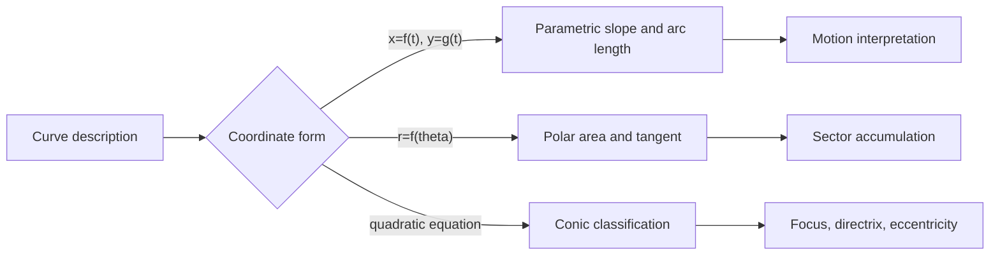

# Parametric Polar and Conic Curves

Parametric, polar, and conic descriptions give alternatives to writing a curve as $y=f(x)$. Parametric equations use a third variable, often time, to describe motion along a curve. Polar coordinates describe points by distance and angle. Conics describe curves such as parabolas, ellipses, and hyperbolas through geometric focus-directrix or algebraic relationships.

These descriptions are useful because many curves fail the vertical line test, loop back on themselves, or are naturally described by rotation. Calculus still applies, but derivatives, area, and arc length must be translated into the coordinate system being used.

## Definitions

A parametrized plane curve is given by

$$
x=f(t),\qquad y=g(t),
$$

where $t$ lies in an interval. The point on the curve is

$$
\mathbf{r}(t)=\langle f(t),g(t)\rangle.
$$

If $dx/dt\ne 0$, then the slope of the tangent line is

$$
\frac{dy}{dx}=\frac{dy/dt}{dx/dt}.
$$

The second derivative is

$$
\frac{d^2y}{dx^2}
=\frac{d}{dt}\left(\frac{dy}{dx}\right)\bigg/\frac{dx}{dt}.
$$

Polar coordinates represent a point by

$$
x=r\cos\theta,\qquad y=r\sin\theta.
$$

A polar curve has form $r=f(\theta)$. Its area over $\alpha\le\theta\le\beta$ is

$$
A=\frac12\int_{\alpha}^{\beta} r^2\,d\theta.
$$

Conic sections can be defined as sets of points whose distances from a focus and a directrix have constant ratio $e$, the eccentricity. If $e=1$, the conic is a parabola. If $0\lt e\lt 1$, it is an ellipse. If $e\gt 1$, it is a hyperbola.

## Key results

For parametric curves, the tangent line at $t=t_0$ uses the point

$$
(x_0,y_0)=(f(t_0),g(t_0))
$$

and slope

$$
m=\frac{g'(t_0)}{f'(t_0)}
$$

when $f'(t_0)\ne 0$. If $f'(t_0)=0$ and $g'(t_0)\ne 0$, the tangent may be vertical.

Parametric arc length is

$$
L=\int_a^b \sqrt{\left(\frac{dx}{dt}\right)^2+\left(\frac{dy}{dt}\right)^2}\,dt.
$$

This is the integral of speed along the curve.

For polar curves, tangent slope can be found by treating $x$ and $y$ as parametric functions of $\theta$:

$$
x=r\cos\theta,\qquad y=r\sin\theta.
$$

Then

$$
\frac{dy}{dx}
=
\frac{\frac{dy}{d\theta}}{\frac{dx}{d\theta}}
=
\frac{r' \sin\theta+r\cos\theta}{r'\cos\theta-r\sin\theta}.
$$

Polar area comes from sectors. A small sector with radius $r$ and angle $d\theta$ has approximate area

$$
dA=\frac12 r^2\,d\theta,
$$

which leads to the integral formula.

Standard conic equations centered at the origin include:

$$
\frac{x^2}{a^2}+\frac{y^2}{b^2}=1
$$

for an ellipse, and

$$
\frac{x^2}{a^2}-\frac{y^2}{b^2}=1
$$

for a horizontal hyperbola. A parabola with vertex at the origin and focus $(p,0)$ has equation

$$
y^2=4px.
$$

In polar form, a conic with focus at the pole can often be written

$$
r=\frac{ed}{1\pm e\cos\theta}
\quad\text{or}\quad
r=\frac{ed}{1\pm e\sin\theta},
$$

depending on the directrix orientation.

The slope formula for parametric curves follows directly from the chain rule. If $y$ is viewed as a function of $x$ along the curve and $x=x(t)$, then

$$
\frac{dy}{dt}=\frac{dy}{dx}\frac{dx}{dt}.
$$

When $dx/dt\ne 0$, solving gives

$$
\frac{dy}{dx}=\frac{dy/dt}{dx/dt}.
$$

This also explains the vertical tangent case: if $dx/dt=0$ while $dy/dt\ne 0$, the curve is moving vertically in the plane.

Parametric equations can trace the same geometric curve more than once. The interval for $t$ is therefore part of the curve description. For example, $x=\cos t$, $y=\sin t$ traces the unit circle once on $0\le t\le 2\pi$, twice on $0\le t\le 4\pi$, and only an arc on a shorter interval. When computing arc length or area, overtracing changes the accumulated value.

Polar symmetry can reduce work. If replacing $\theta$ by $-\theta$ gives the same equation, the curve is symmetric about the polar axis. If replacing $\theta$ by $\pi-\theta$ gives the same equation, it is symmetric about the vertical axis. If replacing $r$ by $-r$ gives the same equation, there is symmetry about the pole. Symmetry is helpful, but it should be verified against the actual tracing interval.

Conics connect algebra and geometry. Completing the square can reveal a shifted center or vertex. Eccentricity describes shape independent of scale: ellipses have eccentricity less than $1$, circles have $e=0$, parabolas have $e=1$, and hyperbolas have eccentricity greater than $1$. In orbital models, this eccentricity measures how far an orbit deviates from circular.

Arc length formulas also depend on the coordinate system. For a polar curve,

$$
L=\int_{\alpha}^{\beta}\sqrt{r^2+\left(\frac{dr}{d\theta}\right)^2}\,d\theta.
$$

This comes from differentiating $x=r\cos\theta$ and $y=r\sin\theta$, then using the parametric arc length formula with parameter $\theta$.

Area for parametric curves can be computed from

$$
A=\int y\,dx
=\int_{\alpha}^{\beta} y(t)x'(t)\,dt
$$

when the orientation and region are appropriate. If the curve is closed, Green's Theorem later gives symmetric formulas such as

$$
A=\frac12\int (x\,dy-y\,dx).
$$

Even in single-variable calculus, the key is that $dx$ becomes $x'(t)\,dt$.

For conics, completing the square is the main algebraic skill. An equation such as

$$
x^2+4x+4y^2-8y=8
$$

should be rewritten as

$$
(x+2)^2+4(y-1)^2=16
$$

before classification. The center is $(-2,1)$, and the different coefficients reveal the semi-axis lengths. Without completing the square, shifted conics are easy to misread.

Polar equations can also represent the same point in multiple ways:

$$
(r,\theta)=(-r,\theta+\pi).
$$

This nonuniqueness is useful but can create tracing errors. A table of key angles, zeros, and maximum radii often prevents double-counting.

Parameter orientation also affects signed quantities. If a curve is traversed in the opposite direction, a signed area integral such as $\int y\,dx$ may change sign, even though the geometric area is unchanged. Arc length is different because speed is nonnegative, so reversing the parameter interval does not change total length when handled with the correct bounds.

For conics, focus and directrix definitions are not just historical. They explain reflective properties: rays parallel to a parabola's axis reflect through the focus, and ellipses reflect rays from one focus to the other. These geometric properties are why conics appear in optics, satellite dishes, planetary motion, and whispering galleries.

## Visual

| Representation | Coordinates | Strength | Calculus formula |
|---|---|---|---|
| Cartesian | $y=f(x)$ | single-output graphs | $dy/dx=f'(x)$ |
| Parametric | $(x(t),y(t))$ | motion and loops | $dy/dx=(dy/dt)/(dx/dt)$ |
| Polar | $(r,\theta)$ | rotation and radial symmetry | $A=\frac12\int r^2\,d\theta$ |
| Conic | focus/directrix or quadratic equation | parabolas, ellipses, hyperbolas | tangents from implicit or parametric methods |



## Worked example 1: tangent and concavity for a parametric curve

**Problem.** For

$$
x=t^2+1,\qquad y=t^3-t,
$$

find $dy/dx$ and the tangent line at $t=1$.

**Method.**

1. Differentiate both coordinate functions:

$$
\frac{dx}{dt}=2t,
\qquad
\frac{dy}{dt}=3t^2-1.
$$

2. Form the parametric slope:

$$
\frac{dy}{dx}=\frac{3t^2-1}{2t}.
$$

3. Evaluate the point at $t=1$:

$$
x(1)=1^2+1=2,
\qquad
y(1)=1^3-1=0.
$$

4. Evaluate the slope:

$$
m=\frac{3(1)^2-1}{2(1)}=\frac{2}{2}=1.
$$

5. Use point-slope form:

$$
y-0=1(x-2).
$$

**Checked answer.** The tangent line is $y=x-2$. Since $dx/dt=2$ at $t=1$, the slope formula is valid there.

If we also want concavity at $t=1$, differentiate the slope with respect to $t$:

$$
\frac{dy}{dx}=\frac{3t^2-1}{2t}=\frac32t-\frac{1}{2t}.
$$

Then

$$
\frac{d}{dt}\left(\frac{dy}{dx}\right)=\frac32+\frac{1}{2t^2}.
$$

Now divide by $dx/dt=2t$:

$$
\frac{d^2y}{dx^2}
=\left(\frac32+\frac{1}{2t^2}\right)\frac{1}{2t}.
$$

At $t=1$, this equals

$$
\left(\frac32+\frac12\right)\frac12=1.
$$

The curve is concave up at the tangent point.

## Worked example 2: polar area

**Problem.** Find the area inside one petal of

$$
r=2\sin(3\theta).
$$

**Method.**

1. One petal is traced while $r\ge 0$ between consecutive zeros:

$$
2\sin(3\theta)=0
\quad\Rightarrow\quad
3\theta=0,\pi
\quad\Rightarrow\quad
0\le\theta\le\frac{\pi}{3}.
$$

2. Use the polar area formula:

$$
A=\frac12\int_0^{\pi/3} r^2\,d\theta.
$$

3. Substitute $r=2\sin(3\theta)$:

$$
A=\frac12\int_0^{\pi/3}4\sin^2(3\theta)\,d\theta
=2\int_0^{\pi/3}\sin^2(3\theta)\,d\theta.
$$

4. Use

$$
\sin^2 u=\frac{1-\cos(2u)}{2}.
$$

Then

$$
A=2\int_0^{\pi/3}\frac{1-\cos(6\theta)}{2}\,d\theta
=\int_0^{\pi/3}(1-\cos(6\theta))\,d\theta.
$$

5. Integrate:

$$
A=\left[\theta-\frac{\sin(6\theta)}{6}\right]_0^{\pi/3}.
$$

6. Evaluate:

$$
A=\frac{\pi}{3}-\frac{\sin(2\pi)}{6}-0=\frac{\pi}{3}.
$$

**Checked answer.** One petal has area $\pi/3$. The full curve has three petals, so the total area is $\pi$.

The bounds are the most important part of this example. Integrating from $0$ to $2\pi$ would count the three-petal rose more than once for some rose equations. A reliable approach is to find consecutive zeros of $r$ that enclose one traced loop and then use symmetry only after confirming how many distinct loops occur.

The maximum radius of this petal occurs when $\sin(3\theta)=1$, so $3\theta=\pi/2$ and $\theta=\pi/6$. At that angle, $r=2$, matching the midpoint of the interval $[0,\pi/3]$.

Checking a midpoint angle is a quick way to confirm that the selected interval traces a full petal rather than only half of one.

## Code

```python
from math import sin, cos, pi

def polar_to_cartesian(r, theta):
    return r * cos(theta), r * sin(theta)

def rose(theta):
    return 2 * sin(3 * theta)

for k in range(4):
    theta = k * pi / 9
    print(theta, polar_to_cartesian(rose(theta), theta))
```

## Common pitfalls

- Using $dy/dt$ as the slope of a parametric curve. The Cartesian slope is $(dy/dt)/(dx/dt)$.
- Dividing by $dx/dt$ when $dx/dt=0$ without checking for a vertical tangent.
- Forgetting the factor $1/2$ in polar area.
- Integrating a polar curve over too large an interval and counting petals or loops more than once.
- Treating negative $r$ values as impossible. In polar coordinates, negative $r$ plots in the opposite direction.
- Classifying conics from equations without completing the square when the center is shifted.

## Connections

- [Derivatives and Rates](/math/calculus/derivatives-and-rates): parametric tangents still come from derivative ratios.
- [Applications of Integrals](/math/calculus/applications-of-integrals): polar area and parametric arc length are integral applications.
- [Vectors and Geometry of Space](/math/calculus/vectors-and-geometry-of-space): parametrized curves lead naturally to vector functions.
- [Vector Functions and Motion](/math/calculus/vector-functions-and-motion): vector motion generalizes parametric curves to space.
