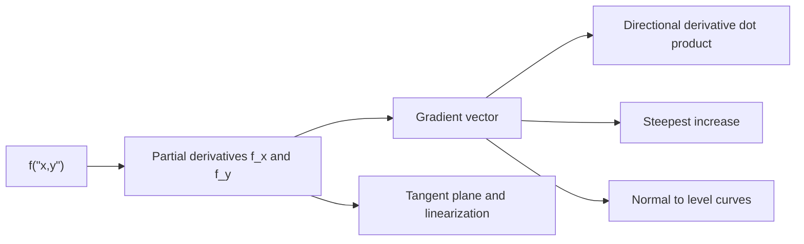

# Partial Derivatives and the Gradient

Partial derivatives extend the derivative to functions of several variables by changing one input at a time. The gradient collects those first partial derivatives into a vector. Together they describe slopes, tangent planes, directional derivatives, level curves, and local linear approximation for surfaces.

The main conceptual shift is that a multivariable function can change in many directions from the same point. A single derivative number is no longer enough. The gradient gives the direction of steepest increase and organizes all directional rates into one vector formula.

## Definitions

For a function $f(x,y)$, the partial derivative with respect to $x$ is

$$
f_x(x,y)=\lim_{h\to 0}\frac{f(x+h,y)-f(x,y)}{h},
$$

and the partial derivative with respect to $y$ is

$$
f_y(x,y)=\lim_{h\to 0}\frac{f(x,y+h)-f(x,y)}{h}.
$$

When computing $f_x$, treat $y$ as constant. When computing $f_y$, treat $x$ as constant.

The gradient is

$$
\nabla f(x,y)=\langle f_x(x,y),f_y(x,y)\rangle.
$$

For $f(x,y,z)$,

$$
\nabla f=\langle f_x,f_y,f_z\rangle.
$$

The directional derivative of $f$ at a point in the unit direction $\mathbf{u}$ is

$$
D_{\mathbf{u}}f=\nabla f\cdot\mathbf{u}.
$$

A level curve of $f(x,y)$ is a curve

$$
f(x,y)=c.
$$

A level surface of $f(x,y,z)$ is

$$
f(x,y,z)=c.
$$

## Key results

The gradient points in the direction of steepest increase. Since

$$
D_{\mathbf{u}}f=\nabla f\cdot\mathbf{u}
=|\nabla f||\mathbf{u}|\cos\theta,
$$

and $\vert \mathbf{u}\vert =1$, the maximum directional derivative is $\vert \nabla f\vert $, achieved when $\mathbf{u}$ points in the gradient direction.

The gradient is perpendicular to level curves and level surfaces. If a path $\mathbf{r}(t)$ stays on a level curve $f(x,y)=c$, then

$$
f(\mathbf{r}(t))=c.
$$

Differentiating gives

$$
\nabla f(\mathbf{r}(t))\cdot\mathbf{r}'(t)=0.
$$

Thus the gradient is orthogonal to the tangent direction $\mathbf{r}'(t)$.

The tangent plane to $z=f(x,y)$ at $(a,b,f(a,b))$ is

$$
z=f(a,b)+f_x(a,b)(x-a)+f_y(a,b)(y-b).
$$

This is the multivariable version of linearization. The corresponding linear approximation is

$$
L(x,y)=f(a,b)+f_x(a,b)(x-a)+f_y(a,b)(y-b).
$$

For an implicit surface $F(x,y,z)=c$, the tangent plane at point $(a,b,c_0)$ has normal vector $\nabla F(a,b,c_0)$:

$$
\nabla F(a,b,c_0)\cdot\langle x-a,y-b,z-c_0\rangle=0.
$$

Second partial derivatives include $f_{xx}$, $f_{xy}$, $f_{yx}$, and $f_{yy}$. Under suitable continuity hypotheses,

$$
f_{xy}=f_{yx}.
$$

This equality is called Clairaut's Theorem.

The chain rule for a path $(x(t),y(t))$ is

$$
\frac{d}{dt}f(x(t),y(t))
=f_x\frac{dx}{dt}+f_y\frac{dy}{dt}
=\nabla f\cdot\mathbf{r}'(t).
$$

This is the same dot product structure that appears in directional derivatives.

Differentiability in several variables is stronger than the existence of partial derivatives. A function can have both $f_x$ and $f_y$ at a point and still fail to have a good tangent plane there. A common sufficient condition is that the first partial derivatives exist in a neighborhood of the point and are continuous at the point. Under that condition, the linear approximation really is the best first-order approximation.

The total differential records this approximation:

$$
dz=f_x(a,b)\,dx+f_y(a,b)\,dy.
$$

It estimates the output change caused by small input changes. In measurement problems, if $x$ and $y$ have small errors, the differential estimates the resulting error in $z=f(x,y)$.

For functions of three variables, the gradient normal property is especially important. If $F(x,y,z)=c$ is a level surface, then $\nabla F$ is perpendicular to the tangent plane. This is why tangent planes to spheres, ellipsoids, and implicit surfaces are often found more cleanly with gradients than by solving for one variable.

The directional derivative formula also makes angle dependence explicit. Moving perpendicular to the gradient gives zero first-order change because the dot product is zero. Moving opposite the gradient gives the steepest decrease, with value $-\vert \nabla f\vert $.

Second partials describe bending. The Hessian matrix

$$
H=
\begin{bmatrix}
f_{xx} & f_{xy}\\
f_{yx} & f_{yy}
\end{bmatrix}
$$

is used in the multivariable second derivative test. Its determinant and signs determine whether the surface bends upward, downward, or like a saddle near a critical point.

Partial derivatives also have units. If $T(x,y)$ is temperature in degrees Celsius and $x,y$ are measured in meters, then $T_x$ and $T_y$ are degrees Celsius per meter. A directional derivative has the same units and gives the rate of temperature change per meter in the chosen direction. This unit check is useful in physical fields such as temperature, pressure, elevation, and concentration.

The gradient can be zero at flat points. When $\nabla f(a,b)=\mathbf{0}$, every directional derivative is zero because $\nabla f\cdot\mathbf{u}=0$ for every unit vector $\mathbf{u}$. This makes the point a candidate for a local extremum, but not a guarantee. A saddle point also has zero gradient, just as $f(x)=x^3$ has zero derivative at a point that is not a one-variable extremum.

For level curves on a contour map, closely spaced contours indicate a large gradient magnitude because the function changes rapidly over a short distance. Widely spaced contours indicate a small gradient magnitude. The gradient direction crosses contour lines at right angles and points toward increasing labels.

Linear approximation is local. If $(x,y)$ moves too far from $(a,b)$, curvature and higher-order terms can dominate. The tangent plane gives first-order behavior, and the Hessian describes the next-order correction.

## Visual



| Object | Formula | Meaning |
|---|---:|---|
| Partial derivative | $f_x$, $f_y$ | change one variable at a time |
| Gradient | $\nabla f$ | vector of first partials |
| Directional derivative | $\nabla f\cdot\mathbf{u}$ | rate in unit direction |
| Tangent plane | $z=f(a,b)+f_x(x-a)+f_y(y-b)$ | best local linear surface |
| Level curve normal | $\nabla f$ | perpendicular to constant-value curve |

## Worked example 1: gradient and directional derivative

**Problem.** Let

$$
f(x,y)=x^2y+3y^2.
$$

Find $\nabla f(2,1)$ and the directional derivative at $(2,1)$ in the direction of $\mathbf{v}=\langle3,4\rangle$.

**Method.**

1. Compute partial derivatives:

$$
f_x=2xy,
\qquad
f_y=x^2+6y.
$$

2. Evaluate at $(2,1)$:

$$
f_x(2,1)=2(2)(1)=4,
\qquad
f_y(2,1)=2^2+6(1)=10.
$$

Thus

$$
\nabla f(2,1)=\langle4,10\rangle.
$$

3. Convert $\mathbf{v}$ to a unit vector:

$$
|\mathbf{v}|=\sqrt{3^2+4^2}=5,
\qquad
\mathbf{u}=\left\langle\frac35,\frac45\right\rangle.
$$

4. Compute the directional derivative:

$$
D_{\mathbf{u}}f(2,1)=\langle4,10\rangle\cdot\left\langle\frac35,\frac45\right\rangle.
$$

5. Evaluate:

$$
D_{\mathbf{u}}f(2,1)=\frac{12}{5}+\frac{40}{5}=\frac{52}{5}.
$$

**Checked answer.** $\nabla f(2,1)=\langle4,10\rangle$, and the directional derivative in the direction $\langle3,4\rangle$ is $52/5$. The maximum directional derivative at the point would be $\vert \nabla f\vert =\sqrt{116}=2\sqrt{29}$.

## Worked example 2: tangent plane and linear approximation

**Problem.** Find the tangent plane to

$$
z=f(x,y)=\sqrt{x^2+y^2}
$$

at $(3,4,5)$, and use it to approximate $f(3.1,3.9)$.

**Method.**

1. Compute partial derivatives:

$$
f_x=\frac{x}{\sqrt{x^2+y^2}},
\qquad
f_y=\frac{y}{\sqrt{x^2+y^2}}.
$$

2. Evaluate at $(3,4)$:

$$
f_x(3,4)=\frac35,
\qquad
f_y(3,4)=\frac45.
$$

3. Write the tangent plane:

$$
z=5+\frac35(x-3)+\frac45(y-4).
$$

4. For $(3.1,3.9)$, the changes are

$$
\Delta x=0.1,
\qquad
\Delta y=-0.1.
$$

5. Approximate:

$$
L(3.1,3.9)=5+\frac35(0.1)+\frac45(-0.1).
$$

6. Simplify:

$$
L=5+0.06-0.08=4.98.
$$

**Checked answer.** The tangent plane is $z=5+\frac35(x-3)+\frac45(y-4)$, and $f(3.1,3.9)\approx 4.98$.

A direct check gives

$$
f(3.1,3.9)=\sqrt{3.1^2+3.9^2}
=\sqrt{9.61+15.21}
=\sqrt{24.82}\approx 4.982.
$$

The linear approximation is close because $(3.1,3.9)$ is near $(3,4)$. The tangent plane is not expected to remain accurate far from the base point.

The gradient at $(3,4)$ is $\langle3/5,4/5\rangle$, a unit vector pointing radially outward. This fits the geometry of $f(x,y)=\sqrt{x^2+y^2}$: the steepest increase in distance from the origin is directly away from the origin.

In applications, the same computation estimates sensitivity. If $x$ and $y$ are measured values, the coefficients $3/5$ and $4/5$ tell how much each small input error contributes to the first-order output error. This is the multivariable version of using $dy=f'(x)dx$ in one variable.

When using finite differences numerically, the same hold-one-variable-fixed interpretation applies. A central difference for $f_x$ changes $x$ in both directions while keeping $y$ fixed. Changing both variables at once estimates a directional derivative, not a partial derivative.

The notation should reflect that distinction. The symbol $\partial$ signals that other independent variables are held fixed, while $d/dt$ along a path means every coordinate depending on $t$ may change. Many multivariable mistakes come from using a partial derivative when a total derivative along a curve is required in context.

Writing the dependency first prevents that error in solutions and explanations consistently enough.

It is a small notation habit with large payoff.

## Code

```python
def f(x, y):
    return x*x*y + 3*y*y

def partial_x(f, x, y, h=1e-5):
    return (f(x + h, y) - f(x - h, y)) / (2*h)

def partial_y(f, x, y, h=1e-5):
    return (f(x, y + h) - f(x, y - h)) / (2*h)

print(partial_x(f, 2, 1), partial_y(f, 2, 1))
```

## Common pitfalls

- Forgetting to use a unit vector for directional derivatives.
- Treating partial derivatives as if all variables change at once. One variable changes; the others are held constant.
- Assuming $\nabla f=\mathbf{0}$ whenever a level curve has a horizontal tangent. The gradient is normal, not tangent.
- Writing a tangent plane without evaluating derivatives at the base point.
- Confusing a tangent plane to $z=f(x,y)$ with a level-surface tangent plane for $F(x,y,z)=c$.
- Assuming mixed partials are equal without the needed continuity conditions.

## Connections

- [Derivatives and Rates](/math/calculus/derivatives-and-rates): partial derivatives are one-variable derivatives in coordinate directions.
- [Vectors and Geometry of Space](/math/calculus/vectors-and-geometry-of-space): gradients are vectors and often normals.
- [Extrema and Lagrange Multipliers](/math/calculus/extrema-and-lagrange-multipliers): gradients and second partials classify multivariable extrema.
- [Vector Calculus](/math/calculus/vector-calculus): grad is one of the central vector differential operators.
