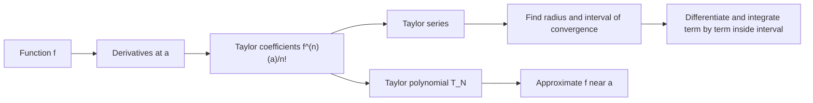

# Power Series and Taylor Polynomials

Power series represent functions as infinite polynomials. Taylor polynomials use derivatives at a point to build finite polynomial approximations. Together they turn difficult functions into algebraic objects that can be differentiated, integrated, and evaluated approximately.

The key idea is local representation. A Taylor polynomial near $a$ is designed to match a function's value and derivatives at $a$. A Taylor series asks whether the infinite version actually converges back to the function, and on which interval that is true.


*Figure: Taylor polynomial approximations to $\sin x$. Image: [Wikimedia Commons](https://commons.wikimedia.org/wiki/File:Taylor_Approximation_of_sin%28x%29.svg), MikeRun, CC BY-SA 4.0.*

## Definitions

A power series centered at $a$ has form

$$
\sum_{n=0}^{\infty} c_n(x-a)^n.
$$

For each fixed $x$, it becomes an ordinary numerical series. The set of $x$ values for which it converges is the interval of convergence. The radius of convergence $R$ is the number such that the series converges for $\vert x-a\vert \lt R$ and diverges for $\vert x-a\vert \gt R$. Endpoints must be tested separately.

The Taylor series of a function $f$ centered at $a$ is

$$
\sum_{n=0}^{\infty}\frac{f^{(n)}(a)}{n!}(x-a)^n.
$$

The $N$th Taylor polynomial is

$$
T_N(x)=\sum_{n=0}^{N}\frac{f^{(n)}(a)}{n!}(x-a)^n.
$$

When $a=0$, the Taylor series is called a Maclaurin series.

Common Maclaurin series include

$$
\begin{aligned}
e^x &= \sum_{n=0}^{\infty}\frac{x^n}{n!},\\
\sin x &= \sum_{n=0}^{\infty}(-1)^n\frac{x^{2n+1}}{(2n+1)!},\\
\cos x &= \sum_{n=0}^{\infty}(-1)^n\frac{x^{2n}}{(2n)!},\\
\frac{1}{1-x} &= \sum_{n=0}^{\infty}x^n \quad (|x|<1).
\end{aligned}
$$

## Key results

The Ratio Test often finds the radius of convergence. For

$$
\sum c_n(x-a)^n,
$$

compute

$$
L=\lim_{n\to\infty}\left|\frac{c_{n+1}(x-a)^{n+1}}{c_n(x-a)^n}\right|.
$$

The series converges when $L\lt 1$ and diverges when $L\gt 1$. This usually produces an inequality involving $\vert x-a\vert $.

Inside its interval of convergence, a power series can be differentiated and integrated term by term:

$$
\frac{d}{dx}\sum_{n=0}^{\infty}c_n(x-a)^n
=
\sum_{n=1}^{\infty}n c_n(x-a)^{n-1},
$$

and

$$
\int \sum_{n=0}^{\infty}c_n(x-a)^n\,dx
=
\sum_{n=0}^{\infty}c_n\frac{(x-a)^{n+1}}{n+1}+C.
$$

The radius of convergence stays the same after differentiation or integration, although endpoint behavior may change.

Taylor's theorem gives an error formula. One common form is

$$
f(x)=T_N(x)+R_N(x),
$$

where

$$
R_N(x)=\frac{f^{(N+1)}(c)}{(N+1)!}(x-a)^{N+1}
$$

for some $c$ between $a$ and $x$, assuming the required derivatives exist. This formula explains why Taylor approximations improve near the center and why higher-degree polynomials usually improve accuracy when derivatives remain controlled.

For alternating Taylor series such as $\sin x$ and $\cos x$, the alternating series error estimate often gives a simple bound: the error is no larger than the first omitted term, provided the term magnitudes decrease.

A function may have a Taylor series that converges but not to the function at every point. Taylor series representation requires more than having derivatives of all orders. In first calculus examples, standard functions behave well, but the distinction matters in advanced analysis.

Power series behave like polynomials inside their intervals of convergence. They can be added, multiplied, differentiated, and integrated term by term, provided the operations are performed where convergence is valid. This makes them useful for creating new series from known ones. For example, starting from

$$
\frac{1}{1-x}=\sum_{n=0}^{\infty}x^n,
$$

substituting $-x^2$ gives

$$
\frac{1}{1+x^2}=\sum_{n=0}^{\infty}(-1)^n x^{2n},
\qquad |x|<1.
$$

Integrating term by term produces the Maclaurin series for $\arctan x$:

$$
\arctan x=\sum_{n=0}^{\infty}(-1)^n\frac{x^{2n+1}}{2n+1}.
$$

Endpoint behavior can change after integration. The geometric series $\sum x^n$ diverges at $x=1$, but the integrated series for $\ln(1+x)$ can converge at $x=1$. This is why endpoints must always be tested separately for the specific series, not copied from a related series without checking.

Taylor polynomials are local approximations. The center $a$ is the point where the polynomial matches the function most tightly. Moving farther from $a$ usually increases error. Choosing a center near the input value can dramatically reduce the number of terms needed. For example, approximating $\ln(1.02)$ with a series centered near $1$ is much faster than using a series far from the value.

The order of contact explains why Taylor polynomials are powerful. If $T_N$ is the Taylor polynomial for $f$ at $a$, then

$$
T_N(a)=f(a),\quad T_N'(a)=f'(a),\quad \dots,\quad T_N^{(N)}(a)=f^{(N)}(a).
$$

The polynomial is not just close in value; its first $N$ derivatives match at the center.

Radius of convergence is controlled by coefficient growth. Factorials in the denominator, as in $e^x$, usually lead to convergence for all real $x$. Powers such as $3^n$ in the denominator often lead to a finite radius. Coefficients that grow too quickly can make the radius zero. The Ratio Test turns these growth rates into an explicit interval.

Power series also provide a systematic way to approximate integrals. If an integrand has a known series, integrate term by term and then evaluate the resulting polynomial or series. For example,

$$
e^{-x^2}=\sum_{n=0}^{\infty}(-1)^n\frac{x^{2n}}{n!}
$$

has no elementary antiderivative, but

$$
\int_0^1 e^{-x^2}\,dx
$$

can be approximated by integrating several terms. The accuracy can often be bounded using alternating or absolute convergence estimates.

Remainder bounds should be tied to the requested accuracy. If a problem asks for four decimal places, the error should be below $0.00005$ or another appropriate tolerance. Giving many polynomial terms without an error bound may produce a good number, but it does not prove the approximation is good enough.

Algebraic manipulation of series should stay inside common convergence intervals. If two series are multiplied, the resulting expression is guaranteed by the standard power-series rules only where both original series converge absolutely. Endpoint questions may need fresh testing after the manipulation.

A clean final answer should state center, radius, interval, approximation, and error bound when those items are relevant to the problem being solved.

This prevents local approximations from being mistaken for global identities later on.

## Visual



| Series | Formula | Interval | Use |
|---|---|---|---|
| Geometric | $\sum x^n=1/(1-x)$ | $\vert x\vert \lt 1$ | builds many other series |
| Exponential | $\sum x^n/n!$ | all real $x$ | growth and differential equations |
| Sine | $\sum (-1)^n x^{2n+1}/(2n+1)!$ | all real $x$ | oscillation approximation |
| Cosine | $\sum (-1)^n x^{2n}/(2n)!$ | all real $x$ | oscillation approximation |
| Logarithm | $\sum (-1)^{n-1}x^n/n$ for $\ln(1+x)$ | $-1\lt x\le 1$ | slow-growth approximation |

## Worked example 1: radius and interval of convergence

**Problem.** Find the radius and interval of convergence of

$$
\sum_{n=1}^{\infty}\frac{(x-2)^n}{n3^n}.
$$

**Method.**

1. Let

$$
a_n=\frac{(x-2)^n}{n3^n}.
$$

2. Use the Ratio Test:

$$
\left|\frac{a_{n+1}}{a_n}\right|
=
\left|\frac{(x-2)^{n+1}}{(n+1)3^{n+1}}\cdot\frac{n3^n}{(x-2)^n}\right|.
$$

3. Simplify:

$$
\left|\frac{a_{n+1}}{a_n}\right|
=\left|\frac{x-2}{3}\right|\frac{n}{n+1}.
$$

4. Take the limit:

$$
L=\left|\frac{x-2}{3}\right|.
$$

5. Convergence requires

$$
\left|\frac{x-2}{3}\right|<1
\quad\Rightarrow\quad
|x-2|<3.
$$

Thus

$$
-1<x<5.
$$

6. Test the left endpoint $x=-1$:

$$
\sum_{n=1}^{\infty}\frac{(-3)^n}{n3^n}
=\sum_{n=1}^{\infty}\frac{(-1)^n}{n},
$$

which converges by the Alternating Series Test.

7. Test the right endpoint $x=5$:

$$
\sum_{n=1}^{\infty}\frac{3^n}{n3^n}
=\sum_{n=1}^{\infty}\frac1n,
$$

which diverges.

**Checked answer.** The radius is $R=3$, and the interval of convergence is $[-1,5)$.

## Worked example 2: Taylor approximation for $\sin x$

**Problem.** Use a Taylor polynomial to approximate $\sin(0.2)$ with error less than $0.00001$.

**Method.**

1. Use the Maclaurin series:

$$
\sin x=x-\frac{x^3}{3!}+\frac{x^5}{5!}-\frac{x^7}{7!}+\cdots.
$$

2. At $x=0.2$, the term magnitudes decrease quickly:

$$
0.2,\quad \frac{0.2^3}{6},\quad \frac{0.2^5}{120},\quad \dots
$$

3. Compute through the $x^5$ term:

$$
T_5(0.2)=0.2-\frac{0.2^3}{6}+\frac{0.2^5}{120}.
$$

4. Evaluate pieces:

$$
0.2^3=0.008,
\qquad
\frac{0.008}{6}=0.001333333\ldots
$$

and

$$
0.2^5=0.00032,
\qquad
\frac{0.00032}{120}=0.000002666\ldots
$$

5. Combine:

$$
T_5(0.2)\approx 0.2-0.001333333+0.000002667=0.198669334.
$$

6. The next omitted term has magnitude

$$
\frac{0.2^7}{7!}
=\frac{0.0000128}{5040}
\approx 0.00000000254.
$$

This is less than $0.00001$.

**Checked answer.** $\sin(0.2)\approx 0.198669334$, with error below $0.00001$ by the alternating series estimate.

The approximation is efficient because $0.2$ is close to the center $0$ and factorials grow quickly. If the input were much larger, reducing the angle using periodicity or choosing another method might be better. Taylor polynomials are local tools, so the distance from the center is part of the error analysis.

For a nonalternating series, Taylor's theorem with remainder or another bound on derivatives may be needed instead. The method changes, but the goal is the same: control the part of the function not captured by the finite polynomial.

## Code

```python
from math import factorial, sin

def sin_taylor(x, degree):
    total = 0.0
    for n in range((degree + 1) // 2):
        total += (-1)**n * x**(2*n + 1) / factorial(2*n + 1)
    return total

x = 0.2
approx = sin_taylor(x, 5)
print(approx, sin(x), abs(approx - sin(x)))
```

## Common pitfalls

- Finding the radius of convergence but forgetting to test endpoints separately.
- Assuming a power series converges at both endpoints because it converges inside the radius.
- Applying term-by-term differentiation at an endpoint without checking endpoint behavior.
- Confusing Taylor polynomial degree with number of nonzero terms.
- Forgetting factorials in Taylor coefficients.
- Using an alternating error bound when the term magnitudes are not decreasing.
- Assuming every smooth function equals its Taylor series everywhere.

## Connections

- [Sequences and Series](/math/calculus/sequences-and-series): power series convergence uses series tests.
- [Applications of Derivatives](/math/calculus/applications-of-derivatives): Taylor polynomials refine linear approximation and L'Hopital-style limits.
- [Integration Techniques and Improper Integrals](/math/calculus/integration-techniques-improper-integrals): power series can approximate integrals without elementary antiderivatives.
- [Exponential Log and Inverse Functions](/math/calculus/exponential-log-inverse-functions): standard Taylor series include $e^x$, $\ln(1+x)$, sine, and cosine.
