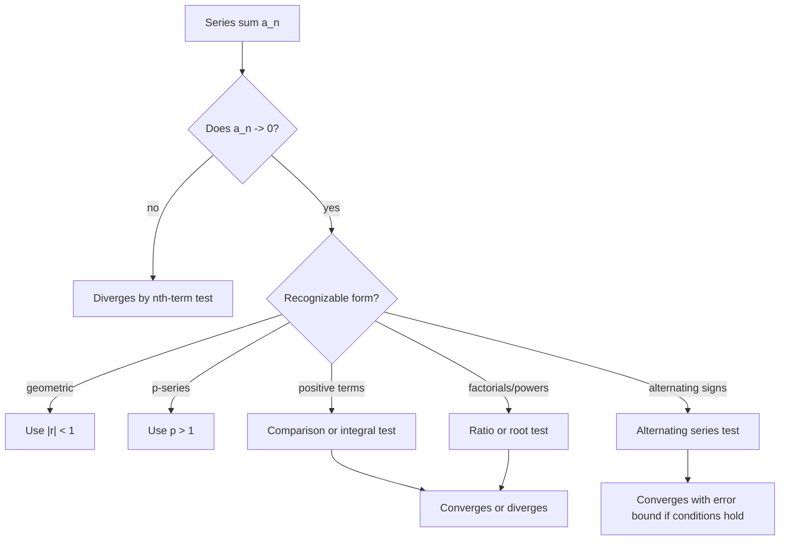

# Sequences and Series

Sequences and series apply the limit concept to infinite lists and infinite sums. A sequence asks whether the terms $a_n$ settle toward a value. A series asks whether the accumulated partial sums $a_1+a_2+\cdots+a_n$ settle toward a finite total. These are related questions, but they are not the same question.


*Figure: The Sierpinski triangle connects recursion, self-similarity, and geometric counting. Image: [Wikimedia Commons](https://commons.wikimedia.org/wiki/File:Big_Sierpinski_triangle.svg), Medvedev, public domain.*

Infinite series are essential for approximating functions, solving differential equations, estimating errors, and understanding power series. The work is mostly diagnostic: identify the structure of the terms, choose an appropriate convergence test, and state exactly what the test proves.

## Definitions

A sequence is an ordered list

$$
\{a_n\}_{n=1}^{\infty}.
$$

It converges to $L$ if

$$
\lim_{n\to\infty}a_n=L.
$$

If no finite limit exists, the sequence diverges.

An infinite series is

$$
\sum_{n=1}^{\infty}a_n.
$$

Its $N$th partial sum is

$$
s_N=\sum_{n=1}^{N}a_n.
$$

The series converges to $S$ if the sequence of partial sums $\{s_N\}$ converges to $S$:

$$
\sum_{n=1}^{\infty}a_n=S.
$$

A geometric series has form

$$
\sum_{n=0}^{\infty} ar^n.
$$

It converges when $\vert r\vert \lt 1$ and then

$$
\sum_{n=0}^{\infty} ar^n=\frac{a}{1-r}.
$$

A $p$-series is

$$
\sum_{n=1}^{\infty}\frac{1}{n^p}.
$$

It converges if $p\gt 1$ and diverges if $p\le 1$.

## Key results

The nth-term test for divergence says:

$$
\text{If }\lim_{n\to\infty}a_n\ne 0\text{ or does not exist, then }\sum a_n\text{ diverges.}
$$

The converse is false. If $a_n\to 0$, the series may converge or diverge. For example, $\sum 1/n$ diverges even though $1/n\to 0$.

The Integral Test applies when $a_n=f(n)$ and $f$ is positive, continuous, and decreasing for large $x$:

$$
\sum_{n=1}^{\infty}a_n
\quad\text{and}\quad
\int_1^\infty f(x)\,dx
$$

converge or diverge together.

The Direct Comparison Test uses inequalities. If $0\le a_n\le b_n$ and $\sum b_n$ converges, then $\sum a_n$ converges. If $0\le b_n\le a_n$ and $\sum b_n$ diverges, then $\sum a_n$ diverges.

The Limit Comparison Test says that for positive terms, if

$$
\lim_{n\to\infty}\frac{a_n}{b_n}=c
$$

where $0\lt c\lt \infty$, then $\sum a_n$ and $\sum b_n$ have the same convergence behavior.

The Alternating Series Test applies to

$$
\sum_{n=1}^{\infty}(-1)^{n-1}b_n
$$

when $b_n\ge 0$, $b_{n+1}\le b_n$ eventually, and $b_n\to 0$. The series converges, and the error after $N$ terms satisfies

$$
|R_N|\le b_{N+1}.
$$

The Ratio Test examines

$$
L=\lim_{n\to\infty}\left|\frac{a_{n+1}}{a_n}\right|.
$$

If $L\lt 1$, the series converges absolutely. If $L\gt 1$ or $L=\infty$, it diverges. If $L=1$, the test is inconclusive.

Absolute convergence means $\sum \vert a_n\vert $ converges. Conditional convergence means $\sum a_n$ converges but $\sum \vert a_n\vert $ diverges. Absolute convergence is stronger and allows more algebraic manipulation.

The Root Test is another absolute convergence test:

$$
L=\lim_{n\to\infty}\sqrt[n]{|a_n|}.
$$

If $L\lt 1$, the series converges absolutely. If $L\gt 1$, it diverges. If $L=1$, the test is inconclusive. The Root Test is especially useful when the whole term is raised to the $n$th power, such as $\left(\frac{2n+1}{3n}\right)^n$.

Telescoping series collapse after partial fraction decomposition or cancellation. For example,

$$
\sum_{n=1}^{N}\left(\frac1n-\frac{1}{n+1}\right)
=1-\frac{1}{N+1}.
$$

Taking $N\to\infty$ gives a sum of $1$. Telescoping is one of the few cases where the partial sums can be written explicitly.

The distinction between convergence of terms and convergence of sums is the most important conceptual point. A convergent series must have terms that go to zero because the partial sums cannot settle if the added pieces stay large. But small pieces can still accumulate forever. The harmonic series $\sum 1/n$ is the standard example: terms shrink to zero, but the accumulated sum grows without bound.

Series tests should be chosen from the shape of $a_n$. Rational functions of $n$ often compare to $p$-series. Factorials and exponentials often suggest the Ratio Test. Alternating signs suggest checking absolute convergence first, then the Alternating Series Test if absolute convergence fails. Logarithms may require the Integral Test or comparison with known slow-growth benchmarks.

Error estimates matter when a series is used for approximation. For a convergent alternating series satisfying the test conditions, the first omitted term bounds the error. For positive series, bounding the remainder often requires an integral estimate or comparison to a geometric tail. A convergence statement alone does not say how many terms are needed for a desired accuracy.

The Integral Test also gives remainder bounds. If $f$ is positive, continuous, decreasing, and $a_n=f(n)$, then for the remainder

$$
R_N=\sum_{n=N+1}^{\infty}a_n
$$

we have

$$
\int_{N+1}^{\infty} f(x)\,dx
\le R_N \le
\int_N^{\infty} f(x)\,dx.
$$

This turns an infinite tail into computable improper integrals. It is especially useful for $p$-series and other positive decreasing terms.

Index shifts do not affect convergence, but they do affect formulas. The series $\sum_{n=0}^{\infty} ar^n$ has first term $a$, while $\sum_{n=1}^{\infty} ar^n$ has first term $ar$. Before applying a memorized geometric formula, identify the starting index and first term. A wrong index often changes the sum even though convergence behavior is unchanged.

Series can be combined safely under convergence hypotheses. The sum of two convergent series converges, and scalar multiples preserve convergence. But subtracting two divergent series or rearranging conditionally convergent series can be dangerous. Absolute convergence is the condition that makes rearrangements behave predictably.

Monotone bounded sequences provide another foundational result. If a sequence is increasing and bounded above, it converges. If it is decreasing and bounded below, it converges. This theorem often appears before series because partial sums of positive series are increasing; convergence then depends on whether those partial sums are bounded above by a finite number in the real line.

That viewpoint links sequence limits directly to series convergence.

## Visual



| Test | Best for | Concludes convergence when | Inconclusive case |
|---|---|---|---|
| nth-term | quick divergence | never proves convergence | $a_n\to 0$ |
| geometric | $ar^n$ | $\vert r\vert \lt 1$ | none |
| $p$-series | $1/n^p$ | $p\gt 1$ | none |
| comparison | positive terms | bounded by convergent benchmark | bad comparison |
| alternating | alternating decreasing terms | $b_n\downarrow 0$ | monotonicity or limit fails |
| ratio | factorials and exponentials | $L\lt 1$ | $L=1$ |

## Worked example 1: choose tests for two positive series

**Problem.** Determine whether each series converges:

$$
\sum_{n=1}^{\infty}\frac{3n+1}{n^3+n},
\qquad
\sum_{n=1}^{\infty}\frac{n}{n^2+1}.
$$

**Method for the first series.**

1. For large $n$, compare leading powers:

$$
\frac{3n+1}{n^3+n}\sim \frac{3n}{n^3}=\frac{3}{n^2}.
$$

2. Use limit comparison with $b_n=1/n^2$:

$$
\lim_{n\to\infty}\frac{(3n+1)/(n^3+n)}{1/n^2}
=\lim_{n\to\infty}\frac{n^2(3n+1)}{n^3+n}.
$$

3. Simplify by dividing by $n^3$:

$$
\lim_{n\to\infty}\frac{3+1/n}{1+1/n^2}=3.
$$

4. Since $0\lt 3\lt \infty$ and $\sum 1/n^2$ converges, the first series converges.

**Method for the second series.**

1. For large $n$,

$$
\frac{n}{n^2+1}\sim \frac{1}{n}.
$$

2. Use limit comparison with $b_n=1/n$:

$$
\lim_{n\to\infty}\frac{n/(n^2+1)}{1/n}
=\lim_{n\to\infty}\frac{n^2}{n^2+1}=1.
$$

3. Since $\sum 1/n$ diverges, the second series diverges.

**Checked answer.** The first series converges by comparison with a $p$-series with $p=2$. The second diverges by comparison with the harmonic series.

## Worked example 2: alternating series and error estimate

**Problem.** Approximate

$$
\sum_{n=1}^{\infty}(-1)^{n-1}\frac{1}{n^2}
$$

using the first four terms, and bound the error.

**Method.**

1. Identify

$$
b_n=\frac{1}{n^2}.
$$

2. Check the conditions. The terms are positive, decreasing, and

$$
\lim_{n\to\infty}\frac{1}{n^2}=0.
$$

Therefore the Alternating Series Test applies.

3. Compute the fourth partial sum:

$$
s_4=1-\frac14+\frac19-\frac{1}{16}.
$$

4. Use a common denominator $144$:

$$
s_4=\frac{144}{144}-\frac{36}{144}+\frac{16}{144}-\frac{9}{144}
=\frac{115}{144}.
$$

5. The alternating error estimate gives

$$
|R_4|\le b_5=\frac{1}{25}.
$$

**Checked answer.** The approximation is $115/144\approx 0.7986$, with error at most $0.04$. The exact sum lies between $s_4$ and $s_5$.

If a smaller error is needed, choose $N$ so that

$$
b_{N+1}=\frac{1}{(N+1)^2}<\epsilon.
$$

For example, to guarantee error below $0.001$, solve

$$
\frac{1}{(N+1)^2}<0.001.
$$

This gives

$$
N+1>\sqrt{1000}\approx 31.62,
$$

so $N=31$ terms are enough. The alternating structure gives a practical stopping rule without knowing the exact infinite sum.

This is why alternating series are valuable computationally. Even when the exact sum is unknown, the next term gives a certified error bound, so the approximation can be matched to a required tolerance.

## Code

```python
def partial_sum(term, n):
    return sum(term(k) for k in range(1, n + 1))

alt = lambda n: (-1)**(n - 1) / (n*n)
for n in [4, 10, 100]:
    print(n, partial_sum(alt, n))
```

## Common pitfalls

- Using the nth-term test backward. $a_n\to 0$ does not prove convergence.
- Forgetting positivity conditions for comparison and integral tests.
- Applying the Alternating Series Test without checking that $b_n$ decreases to $0$.
- Treating ratio test result $L=1$ as convergence. It is inconclusive.
- Confusing a sequence $\{a_n\}$ with the series $\sum a_n$.
- Ignoring absolute convergence when rearranging or combining series.
- Comparing to the wrong benchmark power. Leading-order behavior usually decides rational terms.

## Connections

- [Limits and Continuity](/math/calculus/limits-and-continuity): sequence convergence is a limit at infinity.
- [Integration Techniques and Improper Integrals](/math/calculus/integration-techniques-improper-integrals): the integral test links series and improper integrals.
- [Power Series and Taylor Polynomials](/math/calculus/power-series-and-taylor-polynomials): power series are series whose terms contain powers of a variable.
- [Exponential Log and Inverse Functions](/math/calculus/exponential-log-inverse-functions): growth rates guide comparison tests.
