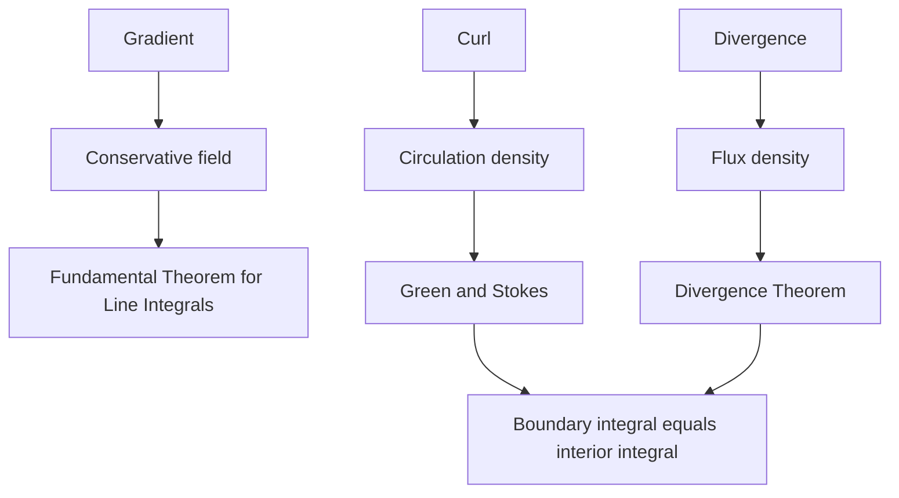

# Vector Calculus

Vector calculus studies fields, flow, circulation, and flux. It connects line integrals over curves, double integrals over regions, and surface integrals over surfaces through the Fundamental Theorem for Line Integrals, Green's Theorem, Stokes' Theorem, and the Divergence Theorem.

These theorems are higher-dimensional versions of the Fundamental Theorem of Calculus. They say that an integral over a boundary can often be computed from information inside the region, or that an integral over a region can be converted to a boundary integral when that is easier.


*Figure: A planar vector field, $f(x,y)=(-y,x)$. Image: [Wikimedia Commons](https://commons.wikimedia.org/wiki/File:Vector_field.svg), Fibonacci, public domain.*

## Definitions

A vector field in the plane has form

$$
\mathbf{F}(x,y)=\langle P(x,y),Q(x,y)\rangle.
$$

In space,

$$
\mathbf{F}(x,y,z)=\langle P,Q,R\rangle.
$$

A scalar line integral along a curve $C$ is

$$
\int_C f\,ds.
$$

A vector line integral along $\mathbf{r}(t)$, $a\le t\le b$, is

$$
\int_C \mathbf{F}\cdot d\mathbf{r}
=
\int_a^b \mathbf{F}(\mathbf{r}(t))\cdot\mathbf{r}'(t)\,dt.
$$

If $\mathbf{F}=\nabla f$, then $\mathbf{F}$ is conservative and $f$ is a potential function.

Divergence is

$$
\nabla\cdot\mathbf{F}=P_x+Q_y+R_z.
$$

Curl is

$$
\nabla\times\mathbf{F}.
$$

For a plane field $\langle P,Q\rangle$, the scalar curl component is

$$
Q_x-P_y.
$$

Flux measures flow through a curve or surface. Circulation measures flow along a curve.

## Key results

The Fundamental Theorem for Line Integrals says that if $\mathbf{F}=\nabla f$ and $C$ goes from point $A$ to point $B$, then

$$
\int_C \mathbf{F}\cdot d\mathbf{r}=f(B)-f(A).
$$

The proof is the chain rule:

$$
\nabla f(\mathbf{r}(t))\cdot\mathbf{r}'(t)
=\frac{d}{dt}f(\mathbf{r}(t)).
$$

Green's Theorem states that for a positively oriented simple closed curve $C$ bounding region $D$,

$$
\oint_C P\,dx+Q\,dy
=
\iint_D\left(Q_x-P_y\right)\,dA.
$$

Stokes' Theorem states

$$
\oint_C \mathbf{F}\cdot d\mathbf{r}
=
\iint_S(\nabla\times\mathbf{F})\cdot d\mathbf{S},
$$

where $C$ is the oriented boundary of $S$.

The Divergence Theorem states

$$
\iint_S \mathbf{F}\cdot d\mathbf{S}
=
\iiint_E \nabla\cdot\mathbf{F}\,dV,
$$

where $S$ is a closed outward-oriented surface bounding solid $E$.

For a plane field on a simply connected domain, a common test for conservativeness is

$$
P_y=Q_x.
$$

The domain condition matters. A field may pass the partial derivative test on a domain with a hole but fail to have a global potential.

Orientation is part of every theorem. Green's Theorem uses counterclockwise orientation for positive boundary direction. Stokes' Theorem uses the right-hand rule between the surface normal and boundary orientation. The Divergence Theorem uses outward normals on closed surfaces.

A line integral of a vector field computes accumulated tangential component. Along a parametrized curve $\mathbf{r}(t)$, the term

$$
\mathbf{F}(\mathbf{r}(t))\cdot\mathbf{r}'(t)
$$

measures the part of the field pointing along the motion, scaled by speed. This is why vector line integrals model work.

Flux integrals compute normal component. For a parametrized surface $\mathbf{r}(u,v)$, an oriented surface element is

$$
\mathbf{r}_u\times\mathbf{r}_v\,du\,dv.
$$

Then

$$
\iint_S \mathbf{F}\cdot d\mathbf{S}
=
\iint_D \mathbf{F}(\mathbf{r}(u,v))\cdot(\mathbf{r}_u\times\mathbf{r}_v)\,du\,dv.
$$

The sign depends on the chosen normal orientation.

Divergence has a source interpretation. Positive divergence means the field has net outward flow near a point; negative divergence means net inward flow. Curl has a rotation interpretation. In a fluid analogy, curl measures the tendency of a small paddle wheel to spin.

The big theorems form a hierarchy. Green's Theorem is a two-dimensional curl theorem. Stokes' Theorem generalizes circulation-curl relationships to surfaces in space. The Divergence Theorem relates flux through a closed surface to source strength in the enclosed volume. Each theorem requires smoothness and orientation hypotheses that should be checked before use.

Conservative fields are path independent. If $\mathbf{F}=\nabla f$, the work between two endpoints depends only on the endpoints. Equivalently, every closed-loop integral is zero:

$$
\oint_C \mathbf{F}\cdot d\mathbf{r}=0.
$$

On a simply connected domain, this is closely related to curl being zero. On domains with holes, a field can have zero curl where it is defined but still fail to be globally conservative.

Green's Theorem has two common forms. The circulation form is

$$
\oint_C P\,dx+Q\,dy
=\iint_D(Q_x-P_y)\,dA.
$$

The flux form is

$$
\oint_C \mathbf{F}\cdot\mathbf{n}\,ds
=
\iint_D \nabla\cdot\mathbf{F}\,dA.
$$

Both compare boundary behavior with a region integral, but one uses tangential circulation and the other uses outward normal flux.

The Divergence Theorem is especially useful when a direct surface integral would require several surface pieces. If a closed surface is made from a cylinder plus caps, direct flux requires each piece. The divergence theorem may replace all pieces with one triple integral over the enclosed solid.

Stokes' Theorem is useful because many different surfaces can have the same boundary curve. If orientation is handled consistently, the surface integral of curl is the same over any convenient surface spanning the boundary. Choosing a flat disk instead of a curved cap can turn a difficult integral into an easy one.

## Visual



| Theorem | Boundary integral | Interior integral | Main idea |
|---|---|---|---|
| FTC for line integrals | work along path | potential difference | conservative fields |
| Green | circulation around plane curve | double integral of curl | 2D boundary to region |
| Stokes | circulation around space curve | surface integral of curl | boundary to surface |
| Divergence | flux through closed surface | triple integral of divergence | surface to volume |

## Worked example 1: work in a conservative field

**Problem.** Let

$$
\mathbf{F}(x,y)=\langle 2x,2y\rangle.
$$

Find the work done along any path from $(1,0)$ to $(0,2)$.

**Method.**

1. Look for a potential function $f$ with

$$
\nabla f=\langle2x,2y\rangle.
$$

2. Integrate $f_x=2x$ with respect to $x$:

$$
f(x,y)=x^2+g(y).
$$

3. Differentiate with respect to $y$:

$$
f_y=g'(y).
$$

4. Match $f_y=2y$:

$$
g'(y)=2y
\quad\Rightarrow\quad
g(y)=y^2+C.
$$

5. A potential is

$$
f(x,y)=x^2+y^2.
$$

6. Apply the Fundamental Theorem for Line Integrals:

$$
\int_C \mathbf{F}\cdot d\mathbf{r}
=f(0,2)-f(1,0).
$$

7. Evaluate:

$$
f(0,2)=4,
\qquad
f(1,0)=1.
$$

**Checked answer.** The work is $4-1=3$. The path does not matter because the field is conservative.

## Worked example 2: Green's Theorem around the unit circle

**Problem.** Evaluate

$$
\oint_C -y\,dx+x\,dy
$$

where $C$ is the positively oriented unit circle.

**Method.**

1. Identify

$$
P=-y,
\qquad
Q=x.
$$

2. Compute partial derivatives:

$$
Q_x=1,
\qquad
P_y=-1.
$$

3. The curl scalar is

$$
Q_x-P_y=1-(-1)=2.
$$

4. The unit circle bounds the disk $D$ of area $\pi$.

5. Apply Green's Theorem:

$$
\oint_C -y\,dx+x\,dy
=\iint_D 2\,dA.
$$

6. Evaluate:

$$
\iint_D 2\,dA=2\operatorname{Area}(D)=2\pi.
$$

**Checked answer.** The circulation is $2\pi$. The positive orientation is counterclockwise, matching Green's Theorem.

A direct parametrization check gives the same value. Let

$$
\mathbf{r}(t)=\langle\cos t,\sin t\rangle,
\qquad
0\le t\le 2\pi.
$$

Then

$$
d\mathbf{r}=\langle-\sin t,\cos t\rangle\,dt
$$

and

$$
\mathbf{F}(\mathbf{r}(t))=\langle-\sin t,\cos t\rangle.
$$

The dot product is $1$, so the line integral is

$$
\int_0^{2\pi}1\,dt=2\pi.
$$

The direct computation also confirms the orientation. The parametrization $\langle\cos t,\sin t\rangle$ moves counterclockwise, so it matches the positive orientation assumed by Green's Theorem.

If the circle were traversed clockwise, the same computation would give $-2\pi$. The region integral from Green's Theorem would still be $2\pi$, but the theorem's positive-orientation hypothesis would be violated, so a negative sign would be needed.

For flux, the analogous orientation choice is the normal direction. On a closed surface, "outward" is the standard convention. On an open surface, the problem must specify or imply a normal direction, and the boundary orientation for Stokes' Theorem must match that choice by the right-hand rule.

The safest workflow is to name the theorem, state the orientation, rewrite the integral in the theorem's notation, and only then compute. This prevents mixing a circulation integral with a flux theorem or applying a closed-surface theorem to an open surface by accident during setup and checking work later on.

That workflow keeps geometry and algebra aligned throughout the computation and final interpretation clearly enough for checking answers carefully.

## Code

```python
from math import cos, sin, pi

def line_integral_circle(n=10000):
    total = 0.0
    dt = 2*pi / n
    for i in range(n):
        t = (i + 0.5) * dt
        x, y = cos(t), sin(t)
        dx_dt, dy_dt = -sin(t), cos(t)
        p, q = -y, x
        total += (p * dx_dt + q * dy_dt) * dt
    return total

print(line_integral_circle())
```

## Common pitfalls

- Ignoring orientation. Reversing a curve reverses circulation.
- Checking $P_y=Q_x$ for a conservative field without checking domain conditions.
- Confusing flux with circulation. Flux uses normal direction; circulation uses tangent direction.
- Applying the Divergence Theorem to a surface that is not closed without adding missing pieces or using another method.
- Forgetting that Stokes' Theorem requires compatible boundary and normal orientations.
- Treating $\nabla\cdot\mathbf{F}$ and $\nabla\times\mathbf{F}$ as interchangeable. Divergence measures source strength; curl measures rotational tendency.

## Connections

- [Vector Functions and Motion](/math/calculus/vector-functions-and-motion): line integrals use parametrized curves.
- [Partial Derivatives and the Gradient](/math/calculus/partial-derivatives-and-gradient): gradient, divergence, and curl are built from partial derivatives.
- [Multiple Integrals](/math/calculus/multiple-integrals): Green's and Divergence Theorems convert boundary integrals to multiple integrals.
- [Vectors and Geometry of Space](/math/calculus/vectors-and-geometry-of-space): orientation, normals, dot products, and cross products support the big theorems.
