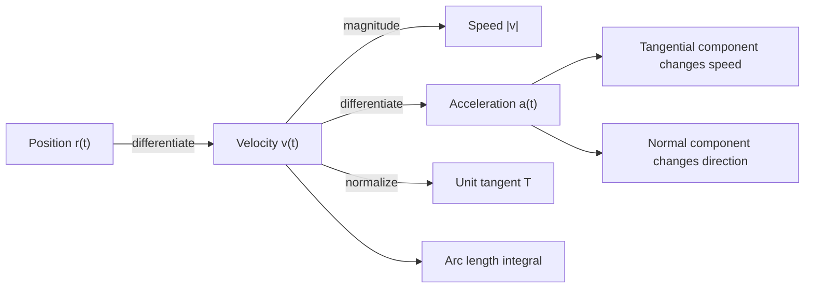

# Vector Functions and Motion

Vector functions describe curves and motion in the plane or in space. Instead of tracking one output, a vector function tracks several coordinates at once. The derivative of a vector function gives velocity, and the second derivative gives acceleration. This makes vector calculus a natural extension of parametric calculus.


*Figure: The Lorenz attractor visualizes sensitive dependence on initial conditions in nonlinear systems. Image: [Wikimedia Commons](https://commons.wikimedia.org/wiki/File:Lorenz_attractor_yb.svg), Wikimol and Dschwen, CC BY-SA 3.0.*

Motion problems become clearer when position, velocity, acceleration, speed, tangent direction, and curvature are separated. The vector notation keeps direction and magnitude together while still allowing ordinary differentiation component by component.

## Definitions

A vector-valued function in space has form

$$
\mathbf{r}(t)=\langle x(t),y(t),z(t)\rangle.
$$

Its derivative is

$$
\mathbf{r}'(t)=\langle x'(t),y'(t),z'(t)\rangle.
$$

For motion, position is $\mathbf{r}(t)$, velocity is

$$
\mathbf{v}(t)=\mathbf{r}'(t),
$$

and acceleration is

$$
\mathbf{a}(t)=\mathbf{v}'(t)=\mathbf{r}''(t).
$$

Speed is the magnitude of velocity:

$$
|\mathbf{v}(t)|.
$$

The unit tangent vector is

$$
\mathbf{T}(t)=\frac{\mathbf{r}'(t)}{|\mathbf{r}'(t)|}
$$

when $\mathbf{r}'(t)\ne \mathbf{0}$.

Arc length from $t=a$ to $t=b$ is

$$
L=\int_a^b |\mathbf{r}'(t)|\,dt.
$$

Curvature measures how quickly the tangent direction changes with respect to arc length. In space,

$$
\kappa(t)=\frac{|\mathbf{r}'(t)\times\mathbf{r}''(t)|}{|\mathbf{r}'(t)|^3}
$$

when the denominator is nonzero.

## Key results

Vector differentiation is componentwise:

$$
\frac{d}{dt}\langle f(t),g(t),h(t)\rangle
=
\langle f'(t),g'(t),h'(t)\rangle.
$$

Dot and cross products obey product rules:

$$
\frac{d}{dt}[\mathbf{u}\cdot\mathbf{v}]
=
\mathbf{u}'\cdot\mathbf{v}+\mathbf{u}\cdot\mathbf{v}',
$$

and

$$
\frac{d}{dt}[\mathbf{u}\times\mathbf{v}]
=
\mathbf{u}'\times\mathbf{v}+\mathbf{u}\times\mathbf{v}'.
$$

If speed is constant, then velocity and acceleration are orthogonal. This follows by differentiating

$$
\mathbf{v}\cdot\mathbf{v}=|\mathbf{v}|^2.
$$

If $\vert \mathbf{v}\vert $ is constant, the derivative of the left side is

$$
2\mathbf{v}\cdot\mathbf{a}=0,
$$

so $\mathbf{v}\cdot\mathbf{a}=0$.

Acceleration splits into tangential and normal components:

$$
\mathbf{a}=a_T\mathbf{T}+a_N\mathbf{N}.
$$

The tangential component changes speed:

$$
a_T=\frac{d}{dt}|\mathbf{v}|.
$$

The normal component changes direction. One formula is

$$
a_N=\sqrt{|\mathbf{a}|^2-a_T^2}.
$$

Projectile motion without air resistance has constant acceleration

$$
\mathbf{a}(t)=\langle0,-g\rangle
$$

in the plane. Integrating gives velocity and position, with constants determined by initial velocity and initial position.

A curve is regular at $t$ if $\mathbf{r}'(t)\ne \mathbf{0}$. Regularity matters because tangent direction and curvature require a nonzero velocity vector. A parametrization may stop momentarily even when the geometric curve continues smoothly, so conclusions about tangents should distinguish the parametrization from the curve itself.

Arc length can be used to reparametrize a curve. Define

$$
s(t)=\int_a^t |\mathbf{r}'(u)|\,du.
$$

If $s$ can be inverted, the curve can be written in terms of arc length. In an arc-length parametrization, speed is $1$, and curvature simplifies to

$$
\kappa=\left|\frac{d\mathbf{T}}{ds}\right|.
$$

This is conceptually important even when the inversion is algebraically difficult.

The unit normal vector $\mathbf{N}$ points in the direction the curve is turning:

$$
\mathbf{N}=\frac{\mathbf{T}'(t)}{|\mathbf{T}'(t)|}
$$

when $\mathbf{T}'(t)\ne \mathbf{0}$. The binormal vector is

$$
\mathbf{B}=\mathbf{T}\times\mathbf{N}.
$$

Together, $\mathbf{T}$, $\mathbf{N}$, and $\mathbf{B}$ form the moving frame used to describe space curves.

Tangential and normal acceleration separate speed change from direction change. If an object moves at constant speed around a circle, its tangential acceleration is zero but its normal acceleration is not. This is the vector reason uniform circular motion still has acceleration.

Vector integrals are componentwise. If

$$
\mathbf{v}(t)=\langle f(t),g(t),h(t)\rangle,
$$

then

$$
\int \mathbf{v}(t)\,dt
=
\left\langle\int f(t)\,dt,\int g(t)\,dt,\int h(t)\,dt\right\rangle.
$$

Constants of integration become constant vectors, fixed by initial position.

A smooth curve can be studied as geometry or as motion. The same set of points may have different parametrizations with different speeds. For example, $\langle\cos t,\sin t\rangle$ and $\langle\cos 2t,\sin 2t\rangle$ trace the same unit circle, but the second moves twice as fast. Curvature is geometric and does not depend on speed, while velocity and acceleration do depend on the parametrization.

For plane curves, curvature can also be written in terms of coordinate functions:

$$
\kappa(t)=
\frac{|x'(t)y''(t)-y'(t)x''(t)|}
{\left((x'(t))^2+(y'(t))^2\right)^{3/2}}.
$$

This is the two-dimensional version of the cross-product formula.

The tangent line to a vector curve at $t=t_0$ is

$$
\mathbf{L}(s)=\mathbf{r}(t_0)+s\mathbf{r}'(t_0),
$$

provided $\mathbf{r}'(t_0)\ne \mathbf{0}$. The normal plane in space is

$$
\mathbf{r}'(t_0)\cdot(\mathbf{r}-\mathbf{r}(t_0))=0.
$$

These formulas mirror line and plane geometry: the tangent line uses the velocity as direction, and the normal plane uses velocity as normal.

Energy intuition can also help. Acceleration parallel to velocity changes speed; acceleration perpendicular to velocity changes direction. The dot product $\mathbf{v}\cdot\mathbf{a}$ detects the tangential part. If it is positive, speed is increasing; if negative, speed is decreasing; if zero, speed is momentarily constant.

Line integrals later use the same parametrized motion language. A vector field $\mathbf{F}$ evaluated along a path becomes $\mathbf{F}(\mathbf{r}(t))$, and the differential displacement is $d\mathbf{r}=\mathbf{r}'(t)\,dt$. Thus the work integral

$$
\int_C \mathbf{F}\cdot d\mathbf{r}
$$

is built from velocity along a vector-parametrized curve.

For numerical work, vector functions are sampled componentwise. A small time step estimates displacement by

$$
\Delta\mathbf{r}\approx \mathbf{v}(t)\Delta t.
$$

More accurate methods use acceleration and higher derivatives, but the geometric interpretation remains: velocity gives the local tangent displacement.

When acceleration is constant, the vector kinematic formula is

$$
\mathbf{r}(t)=\mathbf{r}_0+\mathbf{v}_0t+\frac12\mathbf{a}t^2.
$$

This is just the componentwise antiderivative of constant acceleration. It works in two or three dimensions as long as the acceleration vector is constant. Projectile motion is the standard example, with gravity contributing only to the vertical component in the simplest model.

Speed controls arc length but not position alone. Two particles can pass through the same point at the same time with different velocities, or trace the same curve with different timing. The vector function includes both the geometric path and the schedule along that path, which is why the parameter interval and initial conditions are part of the model.

## Visual



| Quantity | Formula | Meaning |
|---|---:|---|
| Position | $\mathbf{r}(t)$ | location |
| Velocity | $\mathbf{r}'(t)$ | rate of change of position |
| Speed | $\vert \mathbf{r}'(t)\vert $ | scalar rate of travel |
| Acceleration | $\mathbf{r}''(t)$ | rate of change of velocity |
| Unit tangent | $\mathbf{T}=\mathbf{r}'/\vert \mathbf{r}'\vert $ | direction of motion |
| Curvature | $\vert \mathbf{r}'\times\mathbf{r}''\vert /\vert \mathbf{r}'\vert ^3$ | turning per unit length |

## Worked example 1: helix motion

**Problem.** Let

$$
\mathbf{r}(t)=\langle \cos t,\sin t,t\rangle.
$$

Find velocity, speed, acceleration, and curvature.

**Method.**

1. Differentiate position:

$$
\mathbf{v}(t)=\mathbf{r}'(t)=\langle-\sin t,\cos t,1\rangle.
$$

2. Compute speed:

$$
|\mathbf{v}(t)|
=\sqrt{\sin^2 t+\cos^2 t+1}
=\sqrt{2}.
$$

3. Differentiate velocity:

$$
\mathbf{a}(t)=\mathbf{r}''(t)=\langle-\cos t,-\sin t,0\rangle.
$$

4. Compute the cross product:

$$
\mathbf{r}'(t)\times\mathbf{r}''(t)
=\langle \sin t,-\cos t,1\rangle.
$$

5. Its magnitude is

$$
\sqrt{\sin^2 t+\cos^2 t+1}=\sqrt{2}.
$$

6. Curvature is

$$
\kappa(t)=\frac{\sqrt2}{(\sqrt2)^3}=\frac12.
$$

**Checked answer.** The helix has constant speed $\sqrt2$ and constant curvature $1/2$. Constant speed also implies $\mathbf{v}\cdot\mathbf{a}=0$, which can be checked directly.

Indeed,

$$
\mathbf{v}\cdot\mathbf{a}
=(-\sin t)(-\cos t)+(\cos t)(-\sin t)+1\cdot 0
=0.
$$

The acceleration is not zero; it points inward toward the axis of the helix's circular projection. This illustrates the difference between changing direction and changing speed.

## Worked example 2: projectile motion

**Problem.** A projectile starts at the origin with initial velocity

$$
\mathbf{v}(0)=\langle 30,40\rangle
$$

ft/s and acceleration

$$
\mathbf{a}(t)=\langle0,-32\rangle
$$

ft/s$^2$. Find position and the time when it returns to ground level.

**Method.**

1. Integrate acceleration:

$$
\mathbf{v}(t)=\langle C_1,-32t+C_2\rangle.
$$

2. Use $\mathbf{v}(0)=\langle30,40\rangle$:

$$
\mathbf{v}(t)=\langle30,40-32t\rangle.
$$

3. Integrate velocity:

$$
\mathbf{r}(t)=\langle30t+D_1,40t-16t^2+D_2\rangle.
$$

4. Since the projectile starts at the origin, $\mathbf{r}(0)=\langle0,0\rangle$, so $D_1=D_2=0$.

5. The height is

$$
y(t)=40t-16t^2.
$$

6. Return to ground level means $y(t)=0$:

$$
40t-16t^2=0
\quad\Rightarrow\quad
8t(5-2t)=0.
$$

7. The positive return time is

$$
t=\frac52.
$$

**Checked answer.** Position is

$$
\mathbf{r}(t)=\langle30t,40t-16t^2\rangle,
$$

and the projectile returns to ground level at $t=2.5$ seconds.

The horizontal range is found by substituting $t=2.5$ into $x(t)=30t$:

$$
x(2.5)=75.
$$

So the projectile lands $75$ ft from the starting point. The vertical velocity at impact is

$$
40-32(2.5)=-40,
$$

which has the same magnitude as the initial vertical velocity but opposite sign because the launch and landing heights match.

The speed at impact is therefore

$$
\sqrt{30^2+(-40)^2}=50\text{ ft/s}.
$$

This equals the initial speed $\sqrt{30^2+40^2}=50$ ft/s in the ideal no-air-resistance model, another consistency check.

If launch and landing heights differed, that equality would generally fail because gravity would change kinetic energy relative to the starting height.

## Code

```python
from math import sin, cos, sqrt

def helix(t):
    r = (cos(t), sin(t), t)
    v = (-sin(t), cos(t), 1)
    a = (-cos(t), -sin(t), 0)
    speed = sqrt(sum(component * component for component in v))
    return r, v, a, speed

for t in [0, 1, 2]:
    print(t, helix(t))
```

## Common pitfalls

- Confusing velocity with speed. Velocity is a vector; speed is its magnitude.
- Differentiating vector magnitudes as if $\vert \mathbf{r}\vert '=\vert \mathbf{r}'\vert $. This is not generally true.
- Forgetting that constant speed does not mean zero acceleration. Direction can change.
- Using scalar projectile formulas without tracking vector components and units.
- Computing curvature when $\mathbf{r}'(t)=\mathbf{0}$ without checking regularity.
- Treating parameter $t$ as arc length when speed is not $1$.

## Connections

- [Vectors and Geometry of Space](/math/calculus/vectors-and-geometry-of-space): vector operations support motion formulas.
- [Parametric Polar and Conic Curves](/math/calculus/parametric-polar-conics): vector functions generalize parametric curves.
- [Partial Derivatives and the Gradient](/math/calculus/partial-derivatives-and-gradient): curves through surfaces support directional derivatives.
- [Vector Calculus](/math/calculus/vector-calculus): line integrals use vector fields along vector-parametrized curves.
