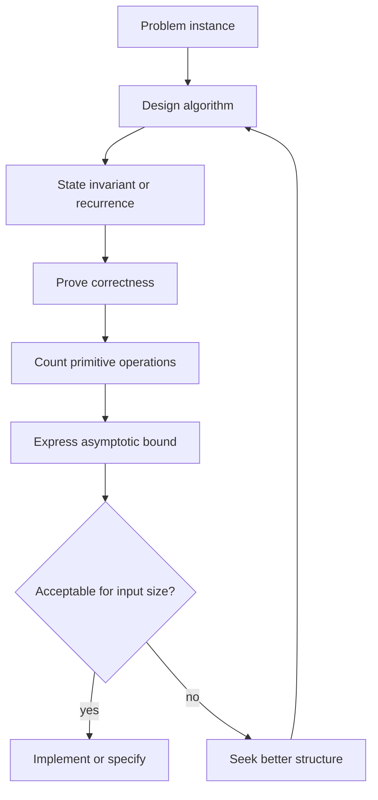

# Algorithms and Complexity

An algorithm is a finite, precise procedure for solving a class of problems. Discrete mathematics studies algorithms at two levels: correctness and cost. Correctness asks whether the algorithm always returns the intended answer. Complexity asks how resource use grows as the input size grows.

The subject is not just about writing code. It is about describing a procedure independently of a programming language, proving that the procedure terminates with the right result, and estimating the amount of work needed for large inputs. This is why algorithms connect proof techniques, functions, sums, recurrence relations, number theory, graphs, and computation theory.

## Definitions

An **algorithm** has specified input, specified output, definiteness of each step, correctness, finiteness, and effectiveness. Pseudocode abstracts away machine details while keeping the logical structure. A step is effective when it can be carried out exactly in a finite amount of time by the intended model of computation.

The **input size** is the parameter used to measure growth. For a list, it may be the number of elements $n$. For an integer $N$, it is often the number of bits, about $\lfloor\log_2 N\rfloor+1$. This distinction matters: trial division up to $\sqrt N$ is roughly $O(\sqrt N)$ arithmetic divisions as a function of the integer value, but that is exponential in the number of input bits.

Asymptotic notation compares functions for large input:

- $f(n)=O(g(n))$ if $\vert f(n)\vert \le C\vert g(n)\vert $ for all sufficiently large $n$.
- $f(n)=\Omega(g(n))$ if $\vert f(n)\vert \ge C\vert g(n)\vert $ for all sufficiently large $n$.
- $f(n)=\Theta(g(n))$ if both $f(n)=O(g(n))$ and $f(n)=\Omega(g(n))$.

Worst-case complexity bounds the maximum cost over all inputs of size $n$. Best-case complexity bounds the minimum. Average-case complexity uses a probability distribution over inputs. Space complexity measures memory use rather than time.

A **loop invariant** is a statement true before and after each loop iteration. It is the standard tool for proving iterative algorithms correct. A recursive algorithm is usually proved correct by induction on the input size or on the recursive structure.

## Key results

If

$$
f(n)=a_k n^k+a_{k-1}n^{k-1}+\cdots+a_0
$$

with $a_k\ne0$, then $f(n)=\Theta(n^k)$. The leading term dominates because each lower power is eventually bounded by a constant multiple of $n^k$.

For a simple nested loop

```text
for i = 1 to n:
    for j = 1 to n:
        do constant work
```

the number of constant-work operations is $n^2$, so the time is $\Theta(n^2)$. If the inner loop instead runs from $1$ to $i$, the count is

$$
\sum_{i=1}^{n}i=\frac{n(n+1)}{2}=\Theta(n^2).
$$

Binary search on a sorted list takes $O(\log n)$ comparisons. Each comparison discards about half the remaining candidates. After $k$ comparisons, at most $n/2^k$ candidates remain. The search ends when $n/2^k\le1$, so $k\ge\log_2 n$.

Merge sort has recurrence

$$
T(n)=2T(n/2)+cn.
$$

For powers of two, the recursion tree has $\log_2 n$ nontrivial levels, and each level costs $\Theta(n)$ for merging. Thus $T(n)=\Theta(n\log n)$. This style of reasoning prepares for recurrence relations and the master theorem.

Polynomial time is usually treated as feasible in theoretical computer science, while exponential time often becomes infeasible quickly. This is a classification, not a stopwatch. Constants, memory locality, implementation details, and input distribution still matter in real programs.

## Visual



| Growth | Example source | Typical description |
| --- | --- | --- |
| $O(1)$ | array index, fixed arithmetic | constant time |
| $O(\log n)$ | binary search, repeated halving | logarithmic |
| $O(n)$ | scan a list | linear |
| $O(n\log n)$ | merge sort | near linear |
| $O(n^2)$ | all unordered pairs | quadratic |
| $O(2^n)$ | all subsets | exponential |
| $O(n!)$ | all permutations | factorial |

## Worked example 1: Count comparisons in binary search

**Problem.** A sorted list has $1000$ elements. What is the maximum number of comparisons binary search needs to decide whether a target is present?

**Method.**

1. After $k$ comparisons, binary search leaves at most $1000/2^k$ candidates.
2. We need this number to be at most $1$:

$$
\frac{1000}{2^k}\le1.
$$

3. Rearranging gives

$$
1000\le2^k.
$$

4. Compare powers of two:

$$
2^9=512,\qquad 2^{10}=1024.
$$

5. Therefore $k=10$ comparisons are enough in the worst case. Nine are not always enough, because $512\lt 1000$.

**Checked answer.** The worst-case number of comparisons is $\lceil\log_2 1000\rceil=10$. This count is independent of the target value; it depends on the repeated-halving structure.

## Worked example 2: Analyze a brute-force closest-pair algorithm

**Problem.** Given $n$ points in the plane, analyze the brute-force algorithm that computes the squared distance between every pair and returns a closest pair.

**Method.**

1. The unordered pairs of distinct points correspond to two-element subsets of an $n$-element set.
2. The number of pairs is

$$
\binom{n}{2}=\frac{n(n-1)}{2}.
$$

3. For each pair $(x_i,y_i),(x_j,y_j)$, compute

$$
d_{ij}^2=(x_i-x_j)^2+(y_i-y_j)^2.
$$

4. Squared distance is enough because $d\mapsto d^2$ is increasing for nonnegative distances, so the pair with smallest squared distance also has smallest distance.
5. Each pair costs constant arithmetic operations if coordinate arithmetic is treated as constant time.
6. Keeping the smallest distance seen so far costs one comparison per pair after the first.

**Checked answer.** The algorithm performs $\binom{n}{2}$ distance computations, so the time is $\Theta(n^2)$ under the usual unit-cost model. It uses $O(1)$ extra space beyond the input if it stores only the current best pair and current best squared distance.

## Code

```python
def binary_search(xs, target):
    lo, hi = 0, len(xs) - 1
    while lo <= hi:
        mid = (lo + hi) // 2
        if xs[mid] == target:
            return mid
        if xs[mid] < target:
            lo = mid + 1
        else:
            hi = mid - 1
    return None

def closest_pair(points):
    best = None
    best_dist = None
    for i in range(len(points)):
        x1, y1 = points[i]
        for j in range(i + 1, len(points)):
            x2, y2 = points[j]
            dist = (x1 - x2) ** 2 + (y1 - y2) ** 2
            if best_dist is None or dist < best_dist:
                best_dist = dist
                best = (points[i], points[j])
    return best, best_dist

print(binary_search([2, 5, 8, 13, 21, 34], 21))
print(closest_pair([(0, 0), (3, 4), (1, 1), (8, 8)]))
```

The binary-search loop invariant is that if the target is present, it is always within `xs[lo:hi+1]`. The closest-pair loop invariant is that after each completed pair check, `best` stores a pair with minimum squared distance among all pairs checked so far.

## Common pitfalls

- Measuring integer algorithms by the value of the integer when the input size is the number of bits.
- Ignoring loop bounds that depend on the outer loop index.
- Dropping lower-order terms correctly but dropping dominant terms accidentally.
- Calling $O(g(n))$ an exact runtime. Big-O is an upper-bound class, not equality of operation counts.
- Forgetting to prove correctness. A fast procedure is not an algorithmic solution until it is shown to return the right answer.
- Assuming average case without specifying an input distribution.

Correctness proofs usually have two parts: partial correctness and termination. Partial correctness says that if the algorithm terminates, its output is correct. Termination says it actually stops on every valid input. For loops, a variant such as a shrinking interval or decreasing counter often proves termination. For recursion, the input size or another well-founded measure should decrease.

Big-O notation suppresses constants and lower-order terms, but it does not justify ignoring the input model. Sorting $n$ integers and multiplying two $n$-bit integers both involve a parameter called $n$, but the primitive operations being counted may differ. State whether the analysis counts comparisons, arithmetic operations, bit operations, memory cells, or graph edge scans.

Worst-case analysis is deliberately pessimistic. It gives a guarantee for every input of size $n$. Average-case analysis can be more predictive, but only after specifying a distribution over inputs. Amortized analysis is different again: it bounds the average cost per operation over a worst-case sequence of operations, without assuming random inputs.

Lower bounds are as important as upper bounds. Showing an algorithm runs in $O(n\log n)$ does not prove no faster algorithm exists. A lower bound such as $\Omega(n\log n)$ for comparison sorting explains why merge sort is asymptotically optimal in that model. Always ask whether a bound describes an algorithm or the inherent difficulty of the problem.

When comparing algorithms, keep the problem fixed. Linear search and binary search both solve search, but binary search assumes sorted input. Sorting first and then using binary search changes the task cost if only one lookup is needed. Complexity comparisons are meaningful only when input assumptions and required outputs match.

For loops, derive counts from bounds rather than from visual nesting alone. Two nested loops are not automatically $\Theta(n^2)$: the inner loop might halve a variable, stop early, or depend on sparse graph degree. Summation notation is the bridge between pseudocode and asymptotic classification.

## Connections

- [Functions, sequences, and sums](/math/discrete/functions-sequences-sums) supplies the summations used in operation counts.
- [Proof techniques](/math/discrete/proof-techniques) supplies loop invariants, contradiction, and induction-style correctness proofs.
- [Recurrence relations](/math/discrete/recurrence-relations) solves divide-and-conquer running times.
- [Number theory basics](/math/discrete/number-theory-basics) gives algorithms such as Euclid's algorithm and trial division.
- [Graph paths, connectivity, and shortest paths](/math/discrete/graph-paths-connectivity-shortest-paths) studies BFS, DFS, and shortest-path algorithms.
