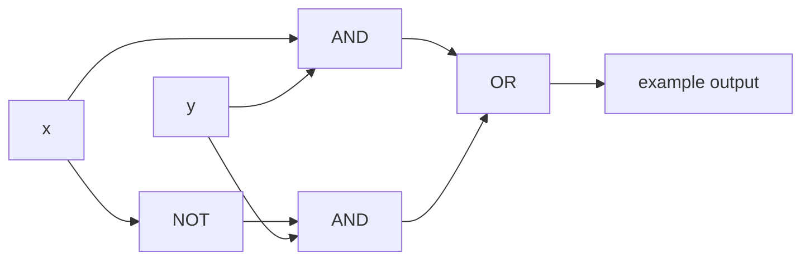

# Boolean Algebra and Logic Circuits

Boolean algebra is the algebra of two values, $0$ and $1$. It is equivalent in structure to propositional logic and to set algebra, and it is the mathematical foundation for digital circuit design. Boolean expressions describe Boolean functions; gates implement those expressions physically.

The value of Boolean algebra is that symbolic laws can simplify hardware. Equivalent expressions compute the same function, but one may use fewer gates, fewer inputs, or a more convenient universal gate type. This makes the topic a meeting point for logic, algebra, and computer engineering.

## Definitions

The basic Boolean operations on $\{0,1\}$ are:

- Complement: $\overline{x}$, with $\overline{0}=1$ and $\overline{1}=0$.
- Boolean sum: $x+y$, corresponding to OR.
- Boolean product: $xy$, corresponding to AND.

A **Boolean variable** takes values in $\{0,1\}$. A **Boolean function of degree $n$** is a function

$$
F:\{0,1\}^n\to\{0,1\}.
$$

Boolean expressions are built recursively from variables, $0$, $1$, complement, Boolean sum, and Boolean product.

A **literal** is a variable or its complement. A **minterm** is a product containing one literal for each variable. A **sum-of-products** expression is a Boolean sum of product terms. A **maxterm** is a sum containing one literal for each variable, and a **product-of-sums** expression is a product of sum terms.

Logic gates implement Boolean operations: NOT, AND, OR, NAND, NOR, XOR, and XNOR. A set of gates is **functionally complete** if every Boolean function can be implemented using only gates from that set.

## Key results

There are

$$
2^{2^n}
$$

Boolean functions of degree $n$. Reason: there are $2^n$ input tuples, and each input can be assigned output $0$ or $1$ independently.

Every Boolean function can be represented by a sum of minterms. For each input tuple on which $F=1$, build a minterm that is $1$ exactly on that tuple: use $x_i$ if the tuple has $1$ in coordinate $i$, and $\overline{x_i}$ if it has $0$. The OR of all such minterms matches $F$ on every input.

Important identities:

$$
\begin{aligned}
x+0&=x,& x1&=x,\\
x+\overline{x}&=1,& x\overline{x}&=0,\\
x+x&=x,& xx&=x,\\
x+xy&=x,& x(x+y)&=x,\\
\overline{x+y}&=\overline{x}\,\overline{y},&
\overline{xy}&=\overline{x}+\overline{y}.
\end{aligned}
$$

These parallel logical and set identities. De Morgan's laws are especially important because they let circuits move between AND/OR designs and NAND/NOR designs.

NAND and NOR gates are functionally complete. For NAND:

$$
\overline{x}=x\operatorname{NAND}x.
$$

Once NOT is available,

$$
xy=\overline{x\operatorname{NAND}y}
$$

and OR follows from De Morgan's law:

$$
x+y=\overline{\overline{x}\,\overline{y}}.
$$

Thus NAND can build NOT, AND, OR, and therefore every Boolean expression.

## Visual

| Logic | Boolean algebra | Set algebra | Circuit gate |
| --- | --- | --- | --- |
| $\neg p$ | $\overline{x}$ | complement | NOT |
| $p\lor q$ | $x+y$ | union | OR |
| $p\land q$ | $xy$ | intersection | AND |
| De Morgan | $\overline{x+y}=\overline{x}\overline{y}$ | complement of union | NOR plus NOT |
| exclusive or | $x\overline{y}+\overline{x}y$ | symmetric difference | XOR |



## Worked example 1: Build a sum-of-products expression

**Problem.** A Boolean function $F(x,y,z)$ is $1$ exactly on input tuples $001$, $010$, and $111$. Write a sum-of-products expression.

**Method.**

1. For tuple $001$, use complemented literals for $0$ coordinates and an uncomplemented literal for the $1$ coordinate:

$$
\overline{x}\,\overline{y}z.
$$

2. For tuple $010$:

$$
\overline{x}y\overline{z}.
$$

3. For tuple $111$:

$$
xyz.
$$

4. OR the minterms:

$$
F(x,y,z)=\overline{x}\,\overline{y}z+\overline{x}y\overline{z}+xyz.
$$

**Checked answer.** Each minterm is $1$ on exactly one of the listed tuples and $0$ elsewhere. Their Boolean sum is $1$ exactly on the union of those three input cases.

## Worked example 2: Simplify a Boolean expression

**Problem.** Simplify

$$
F=xy+x\overline{y}+x z.
$$

**Method.**

1. Group the first two terms:

$$
xy+x\overline{y}=x(y+\overline{y}).
$$

2. Use complementarity:

$$
y+\overline{y}=1.
$$

3. Therefore

$$
xy+x\overline{y}=x.
$$

4. Substitute:

$$
F=x+xz.
$$

5. Use absorption:

$$
x+xz=x.
$$

**Checked answer.** The simplified expression is $F=x$. A truth table confirms that the original output depends only on $x$.

## Code

```python
from itertools import product

def F_original(x, y, z):
    return (x and y) or (x and (not y)) or (x and z)

def F_simplified(x, y, z):
    return x

def full_adder(x, y, c):
    s = x ^ y ^ c
    carry = (x and y) or (x and c) or (y and c)
    return int(s), int(carry)

for bits in product([0, 1], repeat=3):
    print(bits, int(F_original(*bits)), int(F_simplified(*bits)), full_adder(*bits))
```

The first two output columns match for every input tuple, verifying the simplification by exhaustive truth table.

## Common pitfalls

- Treating Boolean sum as ordinary integer addition. In Boolean algebra, $1+1=1$ for OR.
- Forgetting that $xy$ means AND, not multiplication over ordinary integers.
- Dropping complements when translating minterms from a truth table.
- Assuming a shorter-looking expression always uses fewer gates after implementation details are considered.
- Confusing XOR with OR. XOR is true only when exactly one input is true.
- Using De Morgan's laws in the wrong direction: $\overline{x+y}$ becomes $\overline{x}\,\overline{y}$, not $\overline{x}+\overline{y}$.

Truth tables are the safest correctness check for small Boolean functions. With $n$ variables there are only $2^n$ rows, so for $n=2,3,4$ it is realistic to compare an original expression, a simplified expression, and a proposed circuit directly. A simplification is valid only if every row matches. Matching on the rows where the function is $1$ is not enough unless the rows where it is $0$ have also been accounted for by the construction.

For circuit design, cost depends on the gate library. An expression with fewer algebraic symbols may not be cheaper if it requires gates that are unavailable or expensive. A NAND-only implementation, for example, may intentionally introduce double negations because NAND is the available universal gate. This is why algebraic simplification and technology mapping are related but distinct steps.

Minterm expansions are canonical but not necessarily minimal. They are excellent for constructing a function from a truth table because each $1$ row contributes exactly one product term. However, adjacent minterms often combine. For instance, $xy+x\overline{y}=x$ eliminates a variable. Karnaugh maps visualize this combining process for small numbers of variables by placing adjacent input tuples next to each other.

The duality principle is another useful check. Many Boolean identities have a dual obtained by swapping $+$ with multiplication and swapping $0$ with $1$. For example, $x+0=x$ has dual $x1=x$. If an alleged pair of identities is not dual in this sense, inspect it carefully before using it.

When translating from propositional logic, keep notation consistent. Logical $\lor$ corresponds to Boolean $+$, and logical $\land$ corresponds to Boolean product. Ordinary arithmetic precedence can mislead readers, so use parentheses in mixed expressions such as $\overline{x}(y+z)$ or $x+\overline{yz}$.

A useful simplification strategy is to look first for complements, duplicates, and absorption. Complements create constants: $x+\overline{x}=1$ and $x\overline{x}=0$. Duplicates collapse: $x+x=x$ and $xx=x$. Absorption removes redundant detail: $x+xy=x$ and $x(x+y)=x$. These small moves often simplify a circuit more reliably than expanding everything into minterms.

When drawing circuits from expressions, preserve the parse tree. The expression $\overline{x+y}z$ means first OR $x$ and $y$, then negate the result, then AND with $z$. It is not the same as $\overline{x}+yz$ or $\overline{x+y z}$. Parentheses and overbar length carry structure. In handwritten work, a long overbar must visibly cover exactly the intended subexpression.

For multi-output circuits, shared subexpressions matter. A full adder has both a sum output and a carry output; computing $x\oplus y$ once and reusing it can reduce hardware. Boolean algebra at the expression level should therefore be combined with a circuit-level view of which intermediate signals are worth sharing.

A final circuit check is to compare levels of logic as well as expression value. Two expressions can be equivalent but have different propagation delay because one requires more gate layers. In theoretical Boolean algebra the expressions are the same function; in hardware, the implementation cost may depend on fan-in, fan-out, delay, and available gates.

For small designs, keep both a truth table and an algebraic simplification. The truth table verifies behavior, while algebra explains why the simplification works and can generalize to larger inputs. Relying only on a table becomes impractical as variables grow, but relying only on algebra makes it easier to miss a translation error.

When converting a truth table to a circuit, decide whether to use rows where the output is $1$ or rows where the output is $0$. Sum-of-products uses the $1$ rows. Product-of-sums uses the $0$ rows. Choosing the shorter side can lead to a simpler expression before any further minimization.

For sequential circuits, Boolean logic describes the combinational part, while stored state supplies memory. This page focuses on combinational logic; finite-state machines add feedback through state registers and transition functions.

## Connections

- [Propositional logic](/math/discrete/propositional-logic) gives the logical connectives mirrored by Boolean operations.
- [Sets and set operations](/math/discrete/sets-and-set-operations) mirrors Boolean identities with set identities.
- [Functions, sequences, and sums](/math/discrete/functions-sequences-sums) frames Boolean functions as maps from $\{0,1\}^n$ to $\{0,1\}$.
- [Finite-state machines and computation](/math/discrete/finite-state-machines-and-computation) uses Boolean logic in digital state machines.
