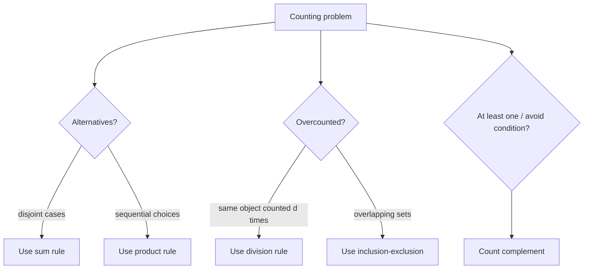

# Counting Principles

Counting turns structure into numbers. Before using formulas, identify whether choices are independent, mutually exclusive, ordered, unordered, repeatable, or constrained. Most errors in elementary combinatorics come from counting the same object more than once or failing to count all cases.


*Figure: Pascal's triangle organizes binomial coefficients, combinations, and recurrence patterns. Image: [Wikimedia Commons](https://commons.wikimedia.org/wiki/File:PascalTriangleAnimated2.gif), Hersfold, public domain.*

The goal is not to memorize a formula for every situation. It is to describe the objects being counted so precisely that the correct rule becomes visible. Sum, product, subtraction, division, pigeonhole, and inclusion-exclusion are the core tools behind permutations, combinations, probability, graph enumeration, and recurrence modeling.

## Definitions

The **sum rule** applies to disjoint alternatives. If a task can be done in one of $m$ ways or one of $n$ other ways, with no overlap, then it can be done in $m+n$ ways. If the alternatives overlap, the sum rule must be corrected by subtracting the overlap.

The **product rule** applies to sequential choices. If a task has $m$ choices for the first step and $n$ choices for the second step for each first choice, then there are $mn$ total outcomes. More generally, multiply the number of choices at each stage when the stage counts are fixed.

The **subtraction rule** counts valid objects by removing invalid ones:

$$
|A-B|=|A|-|A\cap B|.
$$

It is often easier to count the complement than to count valid objects directly.

The **division rule** applies when every object is counted exactly $d$ times by a simpler counting procedure; divide the simple count by $d$.

The **pigeonhole principle** says that placing $N$ objects into $k$ boxes forces some box to contain at least $\lceil N/k\rceil$ objects. The basic version says that placing $k+1$ objects into $k$ boxes forces a collision.

A **case split** is useful when different parts of the sample space have different counting rules. The cases must be exhaustive and disjoint, or the counts must be adjusted.

## Key results

For finite sets,

$$
|A\cup B|=|A|+|B|-|A\cap B|.
$$

Proof: adding $\vert A\vert $ and $\vert B\vert $ counts every element in the intersection twice, so subtract one copy.

The generalized product rule says that if a process has $k$ stages and stage $i$ has $n_i$ choices regardless of previous choices, then there are

$$
n_1n_2\cdots n_k
$$

outcomes. If the number of choices depends on previous choices, draw a decision tree, multiply along each branch, and add branch totals.

The generalized pigeonhole principle follows because if every box had at most $\lceil N/k\rceil-1$ objects, the total capacity would be less than $N$. Therefore some box must have at least $\lceil N/k\rceil$ objects.

The complement method is a special use of subtraction:

$$
|\text{valid}|=|\text{all}|-|\text{invalid}|.
$$

It is especially effective for "at least one" conditions, because the complement of "at least one success" is "no successes."

The division rule explains why unordered choices often involve factorials. If an ordered procedure lists each unordered object in $d$ different orders, divide by $d$ to remove the artificial order.

## Visual



| Phrase in problem | Likely tool | Warning |
| --- | --- | --- |
| "or" between disjoint types | sum rule | check overlap |
| "and then" stages | product rule | stage counts may depend on earlier choices |
| "at least one" | complement or inclusion-exclusion | direct cases may overlap |
| "up to order" | division rule | divide only if every object is counted equally often |
| "force a repeat" | pigeonhole principle | identify boxes correctly |
| "no adjacent" | recurrence or case split | local constraints affect later choices |

## Worked example 1: Count strings with a complement

**Problem.** How many length-$8$ bit strings contain at least one $1$ and at least one $0$?

**Method.**

1. Count all length-$8$ bit strings. Each position has $2$ choices, so there are

$$
2^8=256.
$$

2. The invalid strings are those missing at least one symbol.
3. Missing $1$ means the string is all zeros: $00000000$.
4. Missing $0$ means the string is all ones: $11111111$.
5. These two invalid strings are distinct and do not overlap.
6. Subtract:

$$
256-2=254.
$$

**Checked answer.** There are $254$ length-$8$ bit strings containing both symbols. Directly counting by the number of ones gives the same result:

$$
\sum_{k=1}^{7}\binom{8}{k}=2^8-\binom80-\binom88=254.
$$

## Worked example 2: Use product and subtraction for passwords

**Problem.** A password has length $6$ and uses uppercase letters A-Z and digits 0-9. Repetition is allowed. How many passwords contain at least one digit?

**Method.**

1. There are $26+10=36$ allowed characters.
2. All length-$6$ passwords:

$$
36^6.
$$

3. The complement of "at least one digit" is "no digits."
4. If there are no digits, every position must be one of $26$ letters:

$$
26^6.
$$

5. Subtract:

$$
36^6-26^6.
$$

6. Compute if a numeric value is desired:

$$
36^6=2,176,782,336,\qquad 26^6=308,915,776.
$$

7. Therefore

$$
36^6-26^6=1,867,866,560.
$$

**Checked answer.** There are $1,867,866,560$ such passwords. The complement method avoids six overlapping cases: digit in position $1$, digit in position $2$, and so on.

## Code

```python
from itertools import product

def bitstrings(n):
    return ["".join(bits) for bits in product("01", repeat=n)]

def count_passwords(length):
    all_chars = 36 ** length
    no_digits = 26 ** length
    return all_chars - no_digits

strings = bitstrings(5)
both_symbols = [s for s in strings if "0" in s and "1" in s]

print(len(strings))
print(len(both_symbols))
print(count_passwords(6))
```

For small $n$, brute force is a good way to test a proposed counting formula. For real sizes, formulas replace enumeration.

## Common pitfalls

- Applying the sum rule to overlapping cases without subtracting the overlap.
- Multiplying choices after a previous choice has changed the number of later possibilities.
- Dividing by a factorial when not every unordered object has the same number of orderings.
- Counting "at least one" directly with overlapping position cases instead of using the complement.
- Misidentifying pigeonholes. The boxes must represent the feature that can repeat.
- Forgetting that constraints such as "no adjacent" create dependence between positions.

Before calculating, write a one-sentence description of the final object. "A length-$8$ string with exactly three ones" is different from "a choice of three positions" only after you notice that the remaining positions are forced. "A committee with a chair" is different from "a committee" because one member has an extra role. This sentence often determines whether order matters.

Casework is safe only when the cases are disjoint and exhaustive. If cases overlap, either refine them until they do not overlap or switch to inclusion-exclusion. For instance, counting strings with a zero in the first position or a zero in the last position double-counts strings with zeros in both positions. The formula must subtract that overlap or define cases such as "first position is zero" and "first position is one but last position is zero."

Complements are especially useful when a requirement says "at least one." Count all objects, then subtract those with none. For "at least one digit," subtract all-letter strings. For "at least one repeated birthday," subtract the case where all birthdays are distinct. The complement is often a single clean product where the direct count would require many overlapping cases.

The division rule needs uniform overcounting. If each final object is counted exactly $d$ times, division by $d$ is correct. If some objects are counted more often than others, division gives a distorted result. This is why arranging words with repeated letters requires division by the factorial of each repeated multiplicity, not by one universal factorial unless all symbols are distinct.

When uncertain, compute a small version by hand or with code. A proposed formula for length-$n$ strings can be checked at $n=1,2,3$. A formula for distributing objects can be checked with two boxes and three objects. Small cases do not prove the formula, but they expose many modeling errors before a formal proof is written.

When using the product rule, confirm that every partial choice can be extended in the stated number of ways. If choosing a first character changes which second characters are legal, the count may require cases or a recurrence. Fixed stage counts are a hypothesis of the simple product rule, not a conclusion.

For subtraction counts, describe the invalid set precisely. "Bad strings" is not enough; say whether bad means no digit, repeated adjacent symbols, forbidden prefix, or something else. The complement method is powerful only when the complement is easier and exactly matches the negation of the requirement.

If the complement is not easier, return to cases, recurrences, or inclusion-exclusion.

## Connections

- [Sets and set operations](/math/discrete/sets-and-set-operations) supplies unions, intersections, complements, and products.
- [Permutations and combinations](/math/discrete/permutations-and-combinations) specializes these principles for arrangements and selections.
- [Pigeonhole and inclusion-exclusion](/math/discrete/pigeonhole-and-inclusion-exclusion) expands two major counting tools.
- [Discrete probability](/math/discrete/discrete-probability) turns counts into probabilities for equally likely outcomes.
- [Recurrence relations](/math/discrete/recurrence-relations) handles counting problems with step-by-step constraints.
