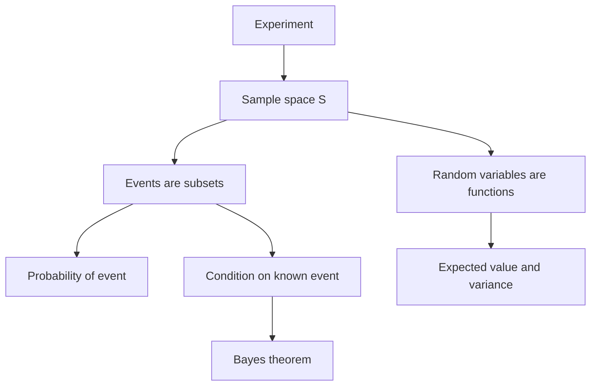

# Discrete Probability

Discrete probability assigns weights to finite or countable outcomes. It uses counting when outcomes are equally likely, and it uses functions on sample spaces when outcomes have different probabilities. The subject is essential for randomized algorithms, average-case analysis, hashing, data science, and risk reasoning.


*Figure: A Galton box turns repeated random left-right choices into an approximate bell-shaped distribution. Image: [Wikimedia Commons](https://commons.wikimedia.org/wiki/File:Galton_Box.svg), Marcin Floryan, CC BY-SA 3.0.*

In discrete mathematics, probability is often a counting problem with uncertainty attached. A clean sample space, precise events, and careful conditioning are more important than formula memorization. Random variables then turn outcomes into numbers, making expected values and variances possible.

## Definitions

An **experiment** is a process with possible outcomes. The **sample space** $S$ is the set of all outcomes. An **event** is a subset of $S$.

If $S$ is finite and all outcomes are equally likely, then

$$
P(E)=\frac{|E|}{|S|}.
$$

For a general finite or countable sample space, a probability distribution assigns each outcome $s\in S$ a number $p(s)$ such that $p(s)\ge0$ and

$$
\sum_{s\in S}p(s)=1.
$$

Then

$$
P(E)=\sum_{s\in E}p(s).
$$

Conditional probability is

$$
P(E\mid F)=\frac{P(E\cap F)}{P(F)}
$$

when $P(F)\gt 0$. Events $E$ and $F$ are **independent** if $P(E\cap F)=P(E)P(F)$, equivalently $P(E\mid F)=P(E)$ when $P(F)\gt 0$.

A **random variable** $X$ is a function from the sample space to the real numbers. Its expected value is

$$
E(X)=\sum_s X(s)p(s).
$$

Variance measures spread:

$$
V(X)=E((X-E(X))^2)=E(X^2)-E(X)^2.
$$

## Key results

Complement rule:

$$
P(\overline{E})=1-P(E).
$$

Addition rule:

$$
P(E\cup F)=P(E)+P(F)-P(E\cap F).
$$

If $E$ and $F$ are disjoint, this reduces to $P(E\cup F)=P(E)+P(F)$. Disjointness and independence are different: two nonempty disjoint events cannot be independent because $P(E\cap F)=0$ while $P(E)P(F)\gt 0$.

Bayes' theorem:

$$
P(E\mid F)=\frac{P(F\mid E)P(E)}{P(F)}
$$

when the denominator is nonzero. If $E_1,\dots,E_n$ partition the sample space, then

$$
P(E_i\mid F)=
\frac{P(F\mid E_i)P(E_i)}
{\sum_{j=1}^{n}P(F\mid E_j)P(E_j)}.
$$

Linearity of expectation is one of the most useful tools:

$$
E(X+Y)=E(X)+E(Y)
$$

for random variables $X$ and $Y$, even when they are not independent. This makes indicator variables powerful. If $I_j$ is $1$ when event $A_j$ occurs and $0$ otherwise, then $E(I_j)=P(A_j)$.

## Visual



| Concept | Formula | Interpretation |
| --- | --- | --- |
| equally likely event | $P(E)=\vert E\vert /\vert S\vert $ | favorable outcomes over all outcomes |
| complement | $1-P(E)$ | often easier for "at least one" |
| union | $P(E)+P(F)-P(E\cap F)$ | corrects double counting |
| conditional | $P(E\cap F)/P(F)$ | restrict sample space to $F$ |
| independence | $P(E\cap F)=P(E)P(F)$ | knowing one does not change the other |
| expectation | $\sum_s X(s)p(s)$ | long-run average value |

## Worked example 1: Dice sums and conditional probability

**Problem.** Roll two fair six-sided dice. Find the probability that the sum is $8$ given that at least one die shows $3$.

**Method.**

1. Use ordered outcomes $(a,b)$, so there are $36$ equally likely outcomes.
2. Let $F$ be the event "at least one die shows $3$." Count $F$:
   - First die is $3$: $6$ outcomes.
   - Second die is $3$: $6$ outcomes.
   - Both counted overlap $(3,3)$ once too many.

$$
|F|=6+6-1=11.
$$

3. Let $E$ be the event "sum is $8$."
4. The outcomes with sum $8$ are

$$
(2,6),(3,5),(4,4),(5,3),(6,2).
$$

5. Intersect with $F$. The outcomes with at least one $3$ are

$$
(3,5),(5,3).
$$

6. Therefore

$$
P(E\mid F)=\frac{|E\cap F|}{|F|}=\frac{2}{11}.
$$

**Checked answer.** The probability is $2/11$. The denominator is $11$, not $36$, because conditioning restricts the sample space to outcomes where at least one die is $3$.

## Worked example 2: Expected fixed points in a random permutation

**Problem.** A random permutation of $\{1,2,\dots,n\}$ is chosen uniformly. Find the expected number of fixed points.

**Method.**

1. Let $X$ be the number of fixed points.
2. Define indicator variables

$$
I_j=
\begin{cases}
1, & \text{position }j\text{ is fixed},\\
0, & \text{otherwise}.
\end{cases}
$$

3. Then

$$
X=I_1+I_2+\cdots+I_n.
$$

4. For a fixed $j$, exactly $(n-1)!$ of the $n!$ permutations fix $j$, so

$$
P(I_j=1)=\frac{(n-1)!}{n!}=\frac1n.
$$

5. Thus

$$
E(I_j)=\frac1n.
$$

6. Use linearity of expectation:

$$
E(X)=\sum_{j=1}^{n}E(I_j)=n\cdot\frac1n=1.
$$

**Checked answer.** The expected number of fixed points is $1$, for every positive integer $n$. The indicators are not independent, but linearity of expectation does not require independence.

## Code

```python
from collections import Counter
from itertools import product, permutations

outcomes = list(product(range(1, 7), repeat=2))
sums = Counter(a + b for a, b in outcomes)
given = [o for o in outcomes if 3 in o]
sum8_given = [o for o in given if sum(o) == 8]

def fixed_points(perm):
    return sum(1 for i, value in enumerate(perm, start=1) if i == value)

perms = list(permutations([1, 2, 3, 4]))
expected_fixed = sum(fixed_points(p) for p in perms) / len(perms)

print(len(sum8_given), len(given), len(sum8_given) / len(given))
print(expected_fixed)
```

The permutation computation verifies the fixed-point expectation for $n=4$ by exhaustive enumeration.

## Common pitfalls

- Using unordered dice outcomes when the sample space of ordered rolls is equally likely.
- Forgetting to change the denominator after conditioning.
- Treating disjoint events as independent. Nonempty disjoint events give information about each other.
- Assuming equally likely outcomes without checking the experiment.
- Multiplying probabilities for events that have not been shown independent.
- Believing expectation must be a possible outcome. An expected die roll is $3.5$, although no face shows $3.5$.

The first step in a probability problem is choosing the sample space. For two dice, ordered pairs are equally likely; unordered sums are not. The sum $7$ occurs in six ordered ways, while the sum $2$ occurs in one ordered way. If the sample space is changed to sums without assigning their unequal probabilities, the computation will be biased. Always ask whether the listed outcomes have equal probability before using $\vert E\vert /\vert S\vert $.

Conditioning should be read as replacing the universe. After conditioning on $F$, outcomes outside $F$ are no longer possible, and probabilities must be renormalized by $P(F)$. This is why $P(E\mid F)$ may be much larger or smaller than $P(E)$. A useful check is that $P(F\mid F)=1$ whenever $P(F)\gt 0$, because within the restricted universe $F$ is certain.

Independence is a statement about information, not about visual separation in a diagram. Events can overlap and still be independent, as with drawing a card that is a heart and drawing a card that is an ace from a standard deck. They can also be non-overlapping and therefore dependent if both have positive probability. The equation $P(E\cap F)=P(E)P(F)$ is the definitive test.

Linearity of expectation is often easier than distribution counting. To find the expected number of occupied boxes after throwing balls into boxes, define indicators for each box being occupied. To find expected fixed points, define indicators for each position. The events may be dependent, but expectation still adds. This is one reason expectation problems in discrete mathematics often look simpler than probability distribution problems.

Variance, unlike expectation, does care about dependence through cross terms. The shortcut $V(X+Y)=V(X)+V(Y)$ requires independence or at least zero covariance. When variance is requested, check whether the random variables interact before adding variances.

Bayes' theorem is easiest to use when every term has a story. $P(E)$ is the prior probability of the explanation, $P(F\mid E)$ is the likelihood of seeing the evidence under that explanation, and $P(E\mid F)$ is the updated probability after observing the evidence. The denominator $P(F)$ is not optional; it is the total probability of the evidence across all explanations.

Tree diagrams help when an experiment happens in stages. Multiply probabilities along a branch and add probabilities of branches that lead to the event. If sampling is without replacement, branch probabilities change after each draw. If sampling is with replacement, they often stay the same. Drawing two levels of the tree can prevent the common error of treating dependent draws as independent.

For random variables, always specify the values and their probabilities. The same experiment can support many random variables: in a dice roll, $X$ might be the sum, the maximum, an indicator for doubles, or the number of sixes. Expectation is computed from the random variable's values, not directly from the raw outcome labels unless the variable is the identity value.

A probability answer should include both the event and the denominator being used. Writing $6/36$ is less informative than "six ordered dice outcomes out of thirty-six." This habit makes it easier to catch denominator errors after conditioning or after changing from ordered to unordered outcomes.

For expectation problems, check units. If $X$ counts heads, $E(X)$ is a number of heads. If $X$ is a dollar payoff, $E(X)$ is dollars. Unit checks reveal mistakes such as adding a probability directly to a payoff or averaging event labels instead of random-variable values.

## Connections

- [Counting principles](/math/discrete/counting-principles) supplies sample-space counts.
- [Permutations and combinations](/math/discrete/permutations-and-combinations) counts hands, arrangements, and fixed-position events.
- [Pigeonhole and inclusion-exclusion](/math/discrete/pigeonhole-and-inclusion-exclusion) supports probabilities of unions and derangements.
- [Algorithms and complexity](/math/discrete/algorithms-and-complexity) uses probability in randomized and average-case analysis.
