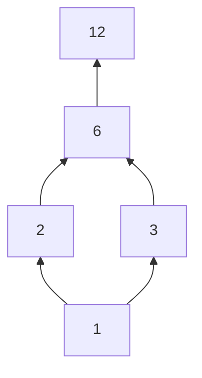

# Equivalence Relations and Partial Orders

Equivalence relations formalize sameness for a chosen purpose. Partial orders formalize comparison when not every pair must be comparable. Both are special kinds of relations, and both organize sets into useful structure.

The contrast is useful. Equivalence relations collapse a set into blocks of objects considered the same, such as integers with the same remainder modulo $m$. Partial orders arrange objects by precedence or containment, such as tasks ordered by prerequisites or sets ordered by inclusion.

## Definitions

A relation $R$ on $A$ is an **equivalence relation** if it is reflexive, symmetric, and transitive.

The **equivalence class** of $a$ is

$$
[a]_R=\{x\in A:xRa\}.
$$

A **partition** of $A$ is a collection of nonempty, pairwise disjoint subsets whose union is $A$.

A relation $R$ on $A$ is a **partial order** if it is reflexive, antisymmetric, and transitive. A set with a partial order is a **poset**.

In a poset, elements $a$ and $b$ are **comparable** if $aRb$ or $bRa$. A partial order in which every pair is comparable is a **total order**.

A **Hasse diagram** represents a finite poset by drawing only cover relations and omitting reflexive loops and edges implied by transitivity. An element $b$ **covers** $a$ if $a\lt b$ and no element lies strictly between them.

A **minimal** element has no strictly smaller element. A **maximal** element has no strictly larger element. A **least** element is below every element, and a **greatest** element is above every element. Least and greatest elements, if they exist, are unique; minimal and maximal elements need not be.

## Key results

Equivalence relations and partitions are two views of the same structure.

If $R$ is an equivalence relation on $A$, then its equivalence classes partition $A$. Every element belongs to its own class by reflexivity. If two classes overlap, say $x\in[a]\cap[b]$, then $xRa$ and $xRb$. Symmetry gives $aRx$, and transitivity gives $aRb$. Then any element related to $a$ is related to $b$, and conversely, so the classes are equal. Thus distinct classes are disjoint.

Conversely, given a partition of $A$, define $aRb$ if $a$ and $b$ lie in the same block. This relation is reflexive because each element lies in a block, symmetric because "same block" has no direction, and transitive because if $a$ and $b$ share a block and $b$ and $c$ share a block, then all three are in the same block.

For a partial order, antisymmetry prevents cycles among distinct elements: if $aRb$ and $bRa$, then $a=b$. This is why Hasse diagrams can be drawn upward without directed cycles.

Every finite nonempty poset has at least one minimal element and at least one maximal element. Starting from any element and repeatedly moving downward must eventually stop because the set is finite; where it stops is minimal. The upward argument gives a maximal element.

Topological sorting takes a finite partial order and produces a linear order compatible with it. This is fundamental for scheduling tasks with prerequisites.

## Visual



This Hasse diagram represents divisibility on $\{1,2,3,6,12\}$. Edges point upward from smaller to larger elements; implied transitive edges such as $1\mid6$ are omitted.

| Structure | Relation properties | Output structure | Example |
| --- | --- | --- | --- |
| equivalence relation | reflexive, symmetric, transitive | partition into classes | congruence modulo $m$ |
| partial order | reflexive, antisymmetric, transitive | ranked or constrained comparison | subset inclusion |
| total order | partial order plus comparability | linear order | $\le$ on integers |
| strict order | irreflexive and transitive | directed acyclic comparison | $\lt $ on integers |

## Worked example 1: Find equivalence classes modulo 4

**Problem.** On $\mathbb{Z}$, define $aRb$ if $a\equiv b\pmod4$. Prove this is an equivalence relation and list its classes.

**Method.**

1. Reflexive: for every integer $a$, $a-a=0$, and $4\mid0$. Thus $aRa$.
2. Symmetric: if $aRb$, then $4\mid(a-b)$. Since $b-a=-(a-b)$, $4\mid(b-a)$, so $bRa$.
3. Transitive: if $aRb$ and $bRc$, then $4\mid(a-b)$ and $4\mid(b-c)$. Adding gives

$$
(a-b)+(b-c)=a-c,
$$

so $4\mid(a-c)$ and $aRc$.

4. The possible remainders modulo $4$ are $0,1,2,3$.
5. Therefore the classes are

$$
\begin{aligned}
[0]&=\{\dots,-8,-4,0,4,8,\dots\},\\
[1]&=\{\dots,-7,-3,1,5,9,\dots\},\\
[2]&=\{\dots,-6,-2,2,6,10,\dots\},\\
[3]&=\{\dots,-5,-1,3,7,11,\dots\}.
\end{aligned}
$$

**Checked answer.** Congruence modulo $4$ is an equivalence relation, and its four equivalence classes partition the integers.

## Worked example 2: Analyze a subset poset

**Problem.** Consider $\mathcal{P}(\{a,b,c\})$ ordered by inclusion. Find the least element, greatest element, minimal elements, maximal elements, and determine whether it is a total order.

**Method.**

1. The elements are all subsets of $\{a,b,c\}$.
2. The least element must be contained in every subset. The empty set satisfies this, so $\emptyset$ is least.
3. The greatest element must contain every subset. The full set $\{a,b,c\}$ satisfies this, so it is greatest.
4. Since a least element is below every element, it is the only minimal element:

$$
\emptyset.
$$

5. Since a greatest element is above every element, it is the only maximal element:

$$
\{a,b,c\}.
$$

6. The order is not total because $\{a\}$ and $\{b\}$ are incomparable:

$$
\{a\}\nsubseteq\{b\},\qquad \{b\}\nsubseteq\{a\}.
$$

**Checked answer.** The least and only minimal element is $\emptyset$; the greatest and only maximal element is $\{a,b,c\}$; the poset is not totally ordered.

## Code

```python
from itertools import combinations

def powerset(s):
    items = list(s)
    for r in range(len(items) + 1):
        for combo in combinations(items, r):
            yield frozenset(combo)

def equivalence_classes(items, related):
    unseen = set(items)
    classes = []
    while unseen:
        a = next(iter(unseen))
        cls = {x for x in items if related(x, a)}
        classes.append(cls)
        unseen -= cls
    return classes

print(equivalence_classes(range(12), lambda a, b: (a - b) % 4 == 0))

P = list(powerset({"a", "b", "c"}))
incomparable = [(x, y) for x in P for y in P if not x <= y and not y <= x]
print(incomparable[:5])
```

The first computation builds residue classes modulo $4$ on a finite sample. The second finds incomparable pairs in a subset poset.

## Common pitfalls

- Calling a relation an equivalence relation after checking only two of reflexive, symmetric, and transitive.
- Confusing equivalence classes with individual representatives. Many representatives can name the same class.
- Forgetting that partition blocks must be nonempty, disjoint, and cover the whole set.
- Confusing antisymmetric with asymmetric. A partial order is reflexive, so it is not asymmetric unless the set is empty.
- Treating minimal as the same as least. There can be many minimal elements and no least element.
- Drawing all transitive edges in a Hasse diagram. Hasse diagrams omit edges implied by transitivity.

For equivalence relations, the fastest way to understand a relation is often to identify its invariant. Congruence modulo $m$ preserves remainder. Same birthday preserves month and day. Same connected component in a graph preserves reachability. The invariant tells you what the equivalence classes should be and helps prove the three required properties.

Equivalence classes are either identical or disjoint. They cannot partially overlap. This fact is often the key step when moving from a relation to a partition. If two classes share even one element, transitivity and symmetry force every member of one class to be a member of the other. This is why residue classes modulo $m$ cleanly split the integers.

For partial orders, draw a few comparable and incomparable pairs before looking for least or greatest elements. A least element must compare below every other element, not merely have nothing below it. A minimal element only needs no smaller element. In a set of tasks with two independent starting tasks, both can be minimal while neither is least.

Hasse diagrams are transitive reductions of finite posets. They omit loops because reflexivity is understood, and they omit long edges implied by shorter upward paths. If $1\mid2$ and $2\mid6$, the diagram does not need a direct edge from $1$ to $6$. The relation still contains $1\mid6$; the diagram simply avoids redundancy.

Topological sorting converts a finite partial order into one compatible linear order. There may be many valid linear extensions. If two tasks are incomparable, either order may be acceptable. This flexibility is useful in scheduling but also means that a topological order is not usually unique.

When proving a relation comes from a partition, use the phrase "same block" as the rule. This immediately gives reflexivity, symmetry, and transitivity because blocks are sets and each element lies in exactly one block. Conversely, when proving an equivalence relation creates a partition, the key is to show overlapping classes are equal.

For posets, examples with small power sets are useful test cases. In $\mathcal{P}(\{a,b\})$, the sets $\{a\}$ and $\{b\}$ are incomparable. This single example prevents the mistaken belief that subset inclusion is always a total order. Many scheduling and dependency orders have the same incomparability.

## Connections

- [Relations](/math/discrete/relations) defines reflexive, symmetric, antisymmetric, and transitive.
- [Modular arithmetic and cryptography](/math/discrete/modular-arithmetic-and-cryptography) supplies congruence classes.
- [Sets and set operations](/math/discrete/sets-and-set-operations) supplies partitions and power sets.
- [Graphs basics](/math/discrete/graphs-basics) gives graph representations of relations and Hasse diagrams.
- [Algorithms and complexity](/math/discrete/algorithms-and-complexity) connects partial orders to topological sorting and scheduling.
