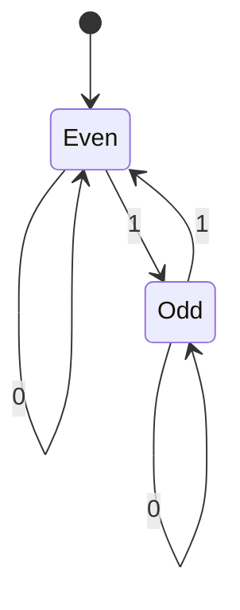

# Finite-State Machines and Computation

Rosen's final topic connects discrete structures to models of computation. Grammars generate languages. Finite-state machines recognize simple languages with limited memory. Turing machines model general effective computation and support the distinction between tractable, intractable, and unsolvable problems.


*Figure: A finite-state machine represents computation as transitions among discrete states. Image: [Wikimedia Commons](https://commons.wikimedia.org/wiki/File:Finite_state_machine_example_with_comments.svg), Macguy314, reworked by Perhelion, public domain.*

The theme is memory. A finite-state machine has only finitely many states, so it can remember bounded information such as parity or a fixed suffix. A pushdown automaton adds a stack and recognizes many nested structures. A Turing machine adds unbounded tape and becomes a model for general algorithms.

## Definitions

An **alphabet** is a finite set of symbols. A **string** is a finite sequence of symbols. The empty string is often written $\epsilon$. A **language** over an alphabet is a set of strings.

A **grammar** has terminals, nonterminals, a start symbol, and productions. It generates strings by repeatedly applying productions until only terminals remain.

In the Chomsky hierarchy:

- Type 0 grammars are unrestricted.
- Type 1 grammars are context-sensitive.
- Type 2 grammars are context-free.
- Type 3 grammars are regular.

A **finite-state machine** has a finite set of states, an input alphabet, a start state, and a transition function. Some machines produce output; recognizers instead have final or accepting states.

A deterministic finite automaton can be written as

$$
M=(S,I,f,s_0,F),
$$

where $S$ is the finite state set, $I$ is the input alphabet, $f:S\times I\to S$ is the transition function, $s_0$ is the start state, and $F\subseteq S$ is the set of accepting states.

A **Turing machine** has finite control, an unbounded tape, a tape head, and transition rules. It can read, write, move, and change state.

## Key results

Regular languages are exactly the languages recognized by finite-state machines. The proof has two directions: a regular grammar can be converted into an automaton that tracks the current nonterminal, and an automaton can be converted into a grammar whose productions simulate transitions.

Finite-state machines have limited memory because the current state is the only stored information. This is why they can recognize patterns such as "binary strings ending in 01" or "binary strings with an even number of $1$s" but cannot recognize

$$
\{0^n1^n:n\ge0\},
$$

which requires matching an unbounded number of zeros with ones.

The pumping lemma for regular languages formalizes this limitation. If a language is regular, sufficiently long strings in it can be split into pieces $xyz$ so that $y$ is nonempty and $xy^iz$ remains in the language for all $i\ge0$. The lemma is usually used to prove languages are not regular.

The Church-Turing thesis states that every effectively computable function can be computed by a Turing machine. It is not a theorem in the usual mathematical sense; it identifies the informal notion of effective computation with a precise model. The thesis is supported by the equivalence of many independent computation models.

The distinction between recognition and decision is important. A recognizer may accept strings in a language and run forever on strings outside it. A decider must halt on every input, accepting strings in the language and rejecting strings outside it.

## Visual



The accepting state is `Even`; this automaton recognizes binary strings with an even number of `1` symbols.

| Model | Extra memory | Example language | Limitation or role |
| --- | --- | --- | --- |
| finite automaton | finite state only | even number of $1$s | cannot count unbounded matching |
| regular grammar | right-linear productions | regular languages | equivalent to finite automata |
| context-free grammar | derivation stack in parsers | balanced parentheses | not all context-sensitive patterns |
| pushdown automaton | stack | $0^n1^n$ | one stack, limited comparisons |
| Turing machine | unbounded tape | general computable languages | some problems still undecidable |

## Worked example 1: Trace a finite automaton

**Problem.** Use the automaton in the visual to decide whether the string $10110$ has an even number of $1$s.

**Method.**

1. Start in state `Even`.
2. Read the first symbol `1`: toggle to `Odd`.
3. Read `0`: stay in `Odd`.
4. Read `1`: toggle to `Even`.
5. Read `1`: toggle to `Odd`.
6. Read `0`: stay in `Odd`.
7. The input is exhausted in state `Odd`.

**Checked answer.** The string $10110$ is rejected because it has three $1$s, an odd number. The automaton does not store the count $3$; it stores only the parity.

## Worked example 2: Generate a string from a grammar

**Problem.** Consider the grammar

$$
S\to0S1,\qquad S\to\epsilon.
$$

Show a derivation of $000111$ and explain what language the grammar generates.

**Method.**

1. Start with $S$.
2. Apply $S\to0S1$ once:

$$
S\Rightarrow0S1.
$$

3. Apply it again:

$$
0S1\Rightarrow00S11.
$$

4. Apply it a third time:

$$
00S11\Rightarrow000S111.
$$

5. Finish with $S\to\epsilon$:

$$
000S111\Rightarrow000111.
$$

6. Each use of $S\to0S1$ adds one $0$ to the front and one $1$ to the back.

**Checked answer.** The grammar generates $\{0^n1^n:n\ge0\}$. The string $000111$ corresponds to $n=3$. This language is context-free but not regular.

## Code

```python
def accepts_even_ones(bits):
    state = "even"
    for bit in bits:
        if bit not in "01":
            raise ValueError("alphabet is {0, 1}")
        if bit == "1":
            state = "odd" if state == "even" else "even"
    return state == "even"

def generate_zero_n_one_n(n):
    s = ""
    for _ in range(n):
        s = "0" + s + "1"
    return s

tests = ["", "0", "1", "101", "1011", "1111", "10110"]
for t in tests:
    print(t, accepts_even_ones(t))
print([generate_zero_n_one_n(n) for n in range(5)])
```

The state machine tracks parity with constant memory. The generator for $0^n1^n$ shows the nested structure a finite automaton cannot remember for unbounded $n$.

## Common pitfalls

- Confusing a string with a language. A language is a set of strings.
- Forgetting that the empty string may be accepted or generated.
- Treating finite automata as if they can store an unbounded counter.
- Thinking a pumping-lemma proof proves a language is regular. The pumping lemma is mainly a tool for proving nonregularity.
- Confusing recognition with decision. A recognizer may fail to halt on strings outside the language.
- Treating the Church-Turing thesis as a formal theorem rather than a bridge between informal and formal computation.

When designing a finite automaton, decide what information must be remembered after reading a prefix. For even parity, the exact number of ones is unnecessary; only even versus odd matters. For strings ending in `01`, the machine needs to remember the longest suffix of the input so far that could still become `01`. States should represent these memory summaries, not the entire input history.

A transition table is often clearer than a picture for implementation. Each row is a state, each column is an input symbol, and each entry is the next state. A deterministic automaton must have exactly one next state for every state-symbol pair. If a transition is missing, the machine description is incomplete unless an implicit rejecting sink state has been specified.

To prove that a finite automaton recognizes a language, state an invariant for each state. For the parity machine, the invariant is: state `Even` means the prefix read so far has an even number of ones, and state `Odd` means it has an odd number. Prove that the start state satisfies the invariant and that every transition preserves the intended meaning.

For nonregularity, the pumping lemma must be used carefully. It says every regular language has a pumping length with a property for every sufficiently long string in the language. To prove a language is not regular, choose a string, consider every allowed split, and show that some pumped version leaves the language. It is not enough to show one convenient split fails.

The computational hierarchy is about capability, not convenience. A finite automaton is simpler and faster than a Turing machine for regular languages, even though a Turing machine can simulate it. Use the weakest model that naturally fits the language or task; doing so reveals exactly how much memory the problem requires.

When tracing automata, record the state after each input symbol, including the start state before reading anything. This produces a sequence of states of length one more than the input string. The final accept or reject decision depends only on the state after the entire input is consumed, not on whether an accepting state appeared earlier.

For grammars, distinguish derivation from recognition. A derivation shows how a grammar generates one string. Recognition asks whether a given string belongs to the language at all. A parser is a recognition procedure, while a grammar is a generative description. The two views are equivalent for many grammar classes but serve different tasks.

## Connections

- [Propositional logic](/math/discrete/propositional-logic) and [Boolean algebra and logic circuits](/math/discrete/boolean-algebra-and-logic-circuits) underlie digital state machines.
- [Graphs basics](/math/discrete/graphs-basics) represents automata as directed labeled graphs.
- [Relations](/math/discrete/relations) frames transition functions and reachability.
- [Algorithms and complexity](/math/discrete/algorithms-and-complexity) studies tractable, intractable, and undecidable computation.
