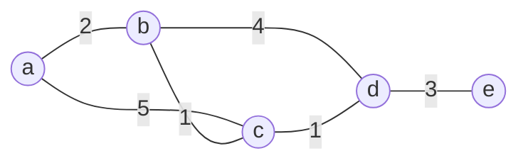

# Graph Paths, Connectivity, and Shortest Paths

Paths are how local edges become global structure. Connectivity asks whether vertices can reach one another. Shortest-path algorithms add weights and optimize travel, cost, latency, or risk across a network.

These ideas are the algorithmic core of graph theory. A graph representation tells us who is adjacent; traversal algorithms turn that local information into reachability, components, spanning trees, and distances. Weighted graphs then require more careful algorithms because the fewest edges need not give the lowest total cost.

## Definitions

A **walk** in an undirected graph is a sequence of vertices where consecutive vertices are adjacent. Its **length** is the number of edges used. A **trail** has no repeated edges. A **path** often means no repeated vertices, although some texts use "path" for any walk and "simple path" for no repeated vertices.

A **circuit** or **cycle** begins and ends at the same vertex and has positive length, with conventions varying about repeated vertices.

An undirected graph is **connected** if every pair of vertices has a path between them. A **connected component** is a maximal connected subgraph.

A directed graph is **strongly connected** if every vertex can reach every other by directed paths. It is **weakly connected** if replacing directed edges by undirected edges gives a connected graph.

In a weighted graph, each edge has a numerical weight. A **shortest path** from $s$ to $t$ minimizes total edge weight, not necessarily number of edges. A **spanning tree** of a connected graph is a subgraph that includes every vertex and is a tree.

## Key results

If a simple graph with $n$ vertices has a walk from $u$ to $v$, then it has a path from $u$ to $v$ of length at most $n-1$. If a walk repeats a vertex, remove the closed portion between repeated occurrences. Repeating this process eventually gives a walk with no repeated vertices.

Breadth-first search (BFS) finds shortest path lengths in unweighted graphs. It explores vertices in layers: distance $0$, then distance $1$, then distance $2$, and so on. When a vertex is first discovered, every shorter path would have had to pass through an earlier layer, so the recorded distance is minimal.

Depth-first search (DFS) explores as far as possible before backtracking. It is useful for connected components, cycle detection, topological sorting in directed acyclic graphs, and finding structural features such as bridges and articulation points.

Dijkstra's algorithm finds shortest paths from one source when all edge weights are nonnegative. Its invariant is that when a vertex is removed from the priority queue as final, its distance cannot later improve, because every remaining path extension has nonnegative cost.

The adjacency matrix $A$ of a graph also counts walks: the $(i,j)$ entry of $A^k$ is the number of walks of length $k$ from vertex $i$ to vertex $j$ in a simple graph. This links graph theory with matrix arithmetic.

## Visual



| Algorithm | Graph type | Main output | Typical time with adjacency lists |
| --- | --- | --- | --- |
| BFS | unweighted | distances in edge count, BFS tree | $O(n+m)$ |
| DFS | directed or undirected | discovery forest, components, cycles | $O(n+m)$ |
| Dijkstra | nonnegative weights | shortest weighted paths | $O((n+m)\log n)$ with heap |
| matrix powers | small dense graphs | number of walks of fixed length | matrix multiplication cost |

## Worked example 1: Run BFS by layers

**Problem.** In the graph with adjacency list

$$
\begin{aligned}
a&:\{b,c\},\\
b&:\{a,d\},\\
c&:\{a,d\},\\
d&:\{b,c,e\},\\
e&:\{d\},
\end{aligned}
$$

find BFS distances from $a$.

**Method.**

1. Start with $a$ at distance $0$.
2. Neighbors of $a$ are $b$ and $c$, so they are at distance $1$.
3. From $b$, discover $d$ at distance $2$. From $c$, $d$ is already discovered, so do not change it.
4. From $d$, discover $e$ at distance $3$.
5. From $e$, no new vertices are discovered.

**Checked answer.**

$$
\operatorname{dist}(a)=0,\quad
\operatorname{dist}(b)=1,\quad
\operatorname{dist}(c)=1,\quad
\operatorname{dist}(d)=2,\quad
\operatorname{dist}(e)=3.
$$

The BFS tree can use predecessor edges $(a,b),(a,c),(b,d),(d,e)$.

## Worked example 2: Run Dijkstra's algorithm

**Problem.** In the weighted graph from the visual, find shortest distances from $a$.

**Method.**

1. Initialize $d(a)=0$ and all other distances to infinity.
2. Finalize $a$. Relax edges:

$$
d(b)=2,\qquad d(c)=5.
$$

3. Finalize $b$ because it has the smallest tentative distance. Relax:

$$
d(c)=\min(5,2+1)=3,\qquad d(d)=2+4=6.
$$

4. Finalize $c$. Relax:

$$
d(d)=\min(6,3+1)=4.
$$

5. Finalize $d$. Relax:

$$
d(e)=4+3=7.
$$

6. Finalize $e$.

**Checked answer.** The shortest distances from $a$ are

$$
d(a)=0,\quad d(b)=2,\quad d(c)=3,\quad d(d)=4,\quad d(e)=7.
$$

The shortest path to $e$ is $a\to b\to c\to d\to e$ with total weight $2+1+1+3=7$.

## Code

```python
from collections import deque
import heapq

def bfs_distances(graph, source):
    dist = {source: 0}
    queue = deque([source])
    while queue:
        v = queue.popleft()
        for w in graph[v]:
            if w not in dist:
                dist[w] = dist[v] + 1
                queue.append(w)
    return dist

def dijkstra(graph, source):
    dist = {source: 0}
    heap = [(0, source)]
    while heap:
        d, v = heapq.heappop(heap)
        if d != dist[v]:
            continue
        for w, weight in graph[v]:
            nd = d + weight
            if nd < dist.get(w, float("inf")):
                dist[w] = nd
                heapq.heappush(heap, (nd, w))
    return dist

G = {"a": ["b", "c"], "b": ["a", "d"], "c": ["a", "d"], "d": ["b", "c", "e"], "e": ["d"]}
W = {"a": [("b", 2), ("c", 5)], "b": [("c", 1), ("d", 4)], "c": [("d", 1)], "d": [("e", 3)], "e": []}
print(bfs_distances(G, "a"))
print(dijkstra(W, "a"))
```

BFS uses a queue because vertices are processed by distance layer. Dijkstra uses a priority queue because the next safest vertex is the one with smallest tentative weighted distance.

## Common pitfalls

- Using BFS for weighted shortest paths when weights are not all equal.
- Applying Dijkstra's algorithm to graphs with negative edge weights.
- Confusing a walk with a path that forbids repeated vertices.
- Claiming a graph is connected after reaching only one component from an arbitrary start without checking all vertices.
- Forgetting direction when testing reachability in directed graphs.
- Treating weak connectivity as strong connectivity.

For connectivity in undirected graphs, traversal gives both a yes-or-no answer and the component containing the start vertex. To find all components, run BFS or DFS from an unvisited vertex, mark everything reached, and repeat until every vertex has been marked. The number of starts needed is the number of connected components.

In directed graphs, reachability is not symmetric. A vertex may reach many others without being reachable from them. Strong components group vertices that mutually reach one another. A directed graph can be weakly connected because its underlying undirected graph is connected, while still failing strong connectivity because directions block return paths.

Shortest paths depend on the cost model. If every edge has equal cost, BFS is optimal because it explores by number of edges. If weights are nonnegative but not equal, Dijkstra is appropriate. If negative edges appear, Bellman-Ford or another method is needed. If negative cycles are reachable, a shortest path may be undefined because looping can decrease the cost without bound.

Predecessor information is as important as distance information when reconstructing paths. BFS and Dijkstra usually store `pred[w]=v` when a better path to $w$ is first found. After the algorithm ends, follow predecessors backward from the target to the source. Without predecessors, the algorithm may tell you the distance but not the route.

Matrix powers count walks, not necessarily simple paths. A walk may repeat vertices and edges, so $(A^k)_{ij}$ can be positive even when every corresponding length-$k$ walk revisits a vertex. This distinction matters when comparing algebraic walk counts with path problems that forbid repetition.

When working by hand, maintain a table with columns for vertex, current distance, predecessor, and finalized status. BFS fills the table by layers; Dijkstra repeatedly finalizes the smallest tentative distance. The table prevents a common mistake: updating a distance but forgetting which predecessor produced the update.

For proofs, name the invariant. In BFS, the invariant is that all vertices removed from the queue have correct shortest unweighted distance. In Dijkstra, finalized vertices have correct shortest weighted distance when all edge weights are nonnegative. These invariants explain why the algorithms are correct, not just how they run.

When a graph is disconnected, shortest-path distances from one source are undefined or infinite for unreachable vertices. Code often represents this by leaving vertices absent from the distance dictionary or by using infinity. State the convention, because it affects later computations such as eccentricity, diameter, and routing tables.

If several shortest paths have the same length, BFS or Dijkstra may return any one of them depending on neighbor order or priority-queue tie-breaking. The distance is unique, but the predecessor tree need not be.

## Connections

- [Graphs basics](/math/discrete/graphs-basics) supplies graph representations and degree language.
- [Algorithms and complexity](/math/discrete/algorithms-and-complexity) analyzes BFS, DFS, and Dijkstra.
- [Trees](/math/discrete/trees) appear as BFS and DFS spanning trees.
- [Euler, Hamilton, planarity, and coloring](/math/discrete/euler-hamilton-planarity-coloring) studies special paths, circuits, and graph constraints.
- [Relations](/math/discrete/relations) interprets reachability as transitive closure.
