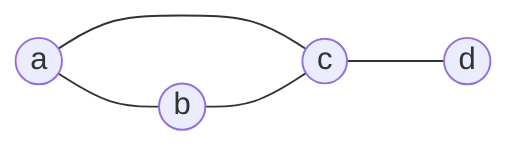

# Graphs Basics

Graphs model pairwise connections. Vertices represent objects and edges represent relationships: roads between cities, links between computers, prerequisites among tasks, collaborations among people, and bonds in molecules. The same definitions support many different applications.

The first skill is translation: decide what the vertices are, decide what the edges mean, and decide whether direction, weights, loops, or multiple edges matter. Once the graph is chosen, degree counts, adjacency representations, isomorphism checks, and special graph families provide a vocabulary for reasoning about structure.

## Definitions

An **undirected graph** $G=(V,E)$ consists of a vertex set $V$ and an edge set $E$ whose elements join pairs of vertices. A **simple graph** has no loops and no multiple edges. A **multigraph** may have multiple edges. A **pseudograph** may also have loops.

A **directed graph** or **digraph** has edges with direction, represented as ordered pairs. A directed edge from $u$ to $v$ is not the same as one from $v$ to $u$.

Two vertices are **adjacent** if they are joined by an edge. An edge is **incident** with its endpoints. The **degree** of a vertex in an undirected graph, written $\deg(v)$, is the number of incident edges, with a loop counted twice.

In a directed graph, the **in-degree** $\deg^-(v)$ counts incoming edges and the **out-degree** $\deg^+(v)$ counts outgoing edges.

Special graphs:

- Complete graph $K_n$: every pair of distinct vertices is adjacent.
- Cycle $C_n$: vertices form one cycle of length $n$.
- Wheel $W_n$: a cycle plus one hub joined to every cycle vertex.
- Bipartite graph: vertices split into two parts and every edge goes between parts.
- Complete bipartite graph $K_{m,n}$: every vertex in one part is joined to every vertex in the other.

An **adjacency list** stores each vertex's neighbors. An **adjacency matrix** stores a zero-one table where entry $(i,j)$ records whether $v_i$ is adjacent to $v_j$. For undirected simple graphs, the matrix is symmetric with zeros on the diagonal.

## Key results

The handshaking theorem:

$$
\sum_{v\in V}\deg(v)=2|E|.
$$

Each edge contributes exactly $2$ to the total degree count, one for each endpoint, with loops still contributing $2$.

A consequence: every undirected graph has an even number of vertices of odd degree. Since the total degree sum is even, the sum of the odd-degree terms must include an even number of odd integers.

For a directed graph,

$$
\sum_{v\in V}\deg^-(v)=|E|=\sum_{v\in V}\deg^+(v).
$$

Each directed edge contributes one to exactly one in-degree and one to exactly one out-degree.

The complete graph $K_n$ has

$$
\binom{n}{2}=\frac{n(n-1)}{2}
$$

edges, because each edge corresponds to a two-element subset of vertices. The complete bipartite graph $K_{m,n}$ has $mn$ edges, because each edge chooses one vertex from each part.

A simple graph is bipartite if and only if its vertices can be colored with two colors so adjacent vertices have different colors. Equivalently, it has no odd cycle. One direction is immediate: walking around an odd cycle would force the starting vertex to receive both colors.

Graph isomorphism asks whether two graphs are structurally identical after renaming vertices. Equal degree sequences are necessary for isomorphism but not sufficient. Invariants such as number of vertices, edges, components, cycles, and bipartiteness can prove non-isomorphism.

## Visual



| Representation | Space for $n$ vertices, $m$ edges | Fast operation | Weakness |
| --- | --- | --- | --- |
| adjacency list | $O(n+m)$ | iterate neighbors | adjacency test can be slower |
| adjacency matrix | $O(n^2)$ | test adjacency in $O(1)$ | wasteful for sparse graphs |
| edge list | $O(m)$ | scan or sort edges | neighbor lookup requires search |
| incidence matrix | $O(nm)$ | algebraic edge-vertex questions | large for many graphs |

## Worked example 1: Use the handshaking theorem

**Problem.** A simple graph has degree sequence

$$
3,3,2,2,2,1,1.
$$

How many edges does it have? Is the number of odd-degree vertices possible?

**Method.**

1. Sum the degrees:

$$
3+3+2+2+2+1+1=14.
$$

2. By the handshaking theorem,

$$
2|E|=14.
$$

3. Therefore

$$
|E|=7.
$$

4. Count odd-degree vertices: degrees $3,3,1,1$ are odd, so there are $4$ odd-degree vertices.
5. The count of odd-degree vertices is even, as required.

**Checked answer.** The graph would have $7$ edges, and the parity condition is satisfied. This does not prove the degree sequence is graphical, but it passes a necessary test.

## Worked example 2: Build an adjacency matrix

**Problem.** Let $V=\{a,b,c,d\}$ and

$$
E=\{\{a,b\},\{a,c\},\{b,c\},\{c,d\}\}.
$$

Write the adjacency matrix in the vertex order $a,b,c,d$.

**Method.**

1. Create a $4\times4$ matrix with rows and columns ordered as $a,b,c,d$.
2. Put $1$ in row $u$, column $v$ if $u$ is adjacent to $v$.
3. Since the graph is undirected, mirror every $1$ across the diagonal.
4. There are no loops, so the diagonal entries are $0$.

$$
\begin{array}{c|cccc}
 & a&b&c&d\\
\hline
a&0&1&1&0\\
b&1&0&1&0\\
c&1&1&0&1\\
d&0&0&1&0
\end{array}
$$

**Checked answer.** The row sums are $2,2,3,1$, matching the degrees of $a,b,c,d$. The total row sum is $8$, so there are $4$ edges, as listed.

## Code

```python
def degrees(graph):
    return {v: len(neighbors) for v, neighbors in graph.items()}

def edge_count(graph):
    return sum(len(neighbors) for neighbors in graph.values()) // 2

def adjacency_matrix(graph, order):
    return [
        [1 if v in graph[u] else 0 for v in order]
        for u in order
    ]

G = {
    "a": {"b", "c"},
    "b": {"a", "c"},
    "c": {"a", "b", "d"},
    "d": {"c"},
}

print(degrees(G))
print(edge_count(G))
for row in adjacency_matrix(G, ["a", "b", "c", "d"]):
    print(row)
```

The handshaking theorem appears in the final check: the sum of all degrees is twice the number of undirected edges.

## Common pitfalls

- Counting each undirected edge twice when computing $\vert E\vert $ from adjacency lists.
- Forgetting that a loop contributes $2$ to degree in an undirected graph.
- Assuming equal degree sequences prove isomorphism. They only give a necessary condition.
- Using an adjacency matrix for a sparse graph without noticing the $O(n^2)$ space cost.
- Treating a directed edge $(u,v)$ as if it automatically includes $(v,u)$.
- Confusing complete graphs $K_n$ with complete bipartite graphs $K_{m,n}$.

When modeling a real situation, decide whether edges represent symmetric relationships. Friendship might be modeled as undirected if it is mutual, but "follows" in a social network is directed. Roads may be undirected for two-way streets and directed for one-way streets. The model determines which graph theorems apply; an undirected degree argument cannot be copied unchanged into a directed setting without using in-degree and out-degree.

Degree sequences provide useful necessary tests. The sum of degrees must be even, no degree in a simple graph can exceed $n-1$, and the number of odd degrees must be even. These tests can reject impossible sequences quickly. Passing them does not guarantee a simple graph exists, but it prevents obvious contradictions before more advanced graphical-sequence tests are used.

Adjacency matrices and adjacency lists also shape algorithms. BFS on an adjacency list runs in $O(n+m)$ because it scans actual edges. On an adjacency matrix, scanning neighbors of each vertex costs $O(n)$ per vertex, so traversal becomes $O(n^2)$. Dense graphs may justify that cost; sparse graphs usually favor adjacency lists.

Graph isomorphism should be attacked with invariants before attempting a vertex mapping. Compare vertex counts, edge counts, degree sequences, number of components, cycle lengths, and special structures such as cut vertices. If any invariant differs, the graphs are not isomorphic. If all easy invariants match, a mapping may still be needed; invariants are strong filters, not complete certificates.

For bipartite graphs, a two-coloring attempt is both a test and a construction. Start with one vertex, color its neighbors with the opposite color, and continue by BFS. If an edge ever joins vertices of the same color, an odd cycle has been detected and the graph is not bipartite.

When drawing graphs, label whether the drawing is part of the structure or only a representation. In ordinary graph theory, edge lengths, angles, and vertex positions usually do not matter; only adjacency matters. In planar graph problems, however, the drawing must respect crossings. In weighted graph problems, edge labels add data beyond adjacency.

A good representation check is to compute the same invariant two ways. Count edges from the edge list and from the degree sum. Count directed edges from out-degrees and in-degrees. Build an adjacency matrix and confirm its row sums match the adjacency list. Agreement across representations is a strong guard against transcription errors.

For special graphs, memorize the construction more than the picture. $K_n$ joins every pair of vertices, $C_n$ uses one cycle through all vertices, and $K_{m,n}$ joins across two parts but never within a part. Reconstructing the edge rule prevents confusing similar-looking drawings.

## Connections

- [Relations](/math/discrete/relations) represents directed graphs as relations on vertices.
- [Graph paths, connectivity, and shortest paths](/math/discrete/graph-paths-connectivity-shortest-paths) studies movement through graphs.
- [Euler, Hamilton, planarity, and coloring](/math/discrete/euler-hamilton-planarity-coloring) uses degree, cycles, and coloring.
- [Trees](/math/discrete/trees) studies connected acyclic graphs.
- [Algorithms and complexity](/math/discrete/algorithms-and-complexity) analyzes graph traversal and representation costs.
