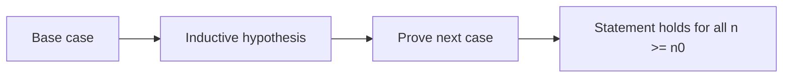

# Induction and Recursion

Induction proves infinitely many statements by showing how each case follows from earlier cases. Recursion defines objects or algorithms by reducing them to smaller objects or inputs. The two ideas fit together: recursive definitions give objects step by step, and induction proves facts about every step.


*Figure: The Sierpinski triangle connects recursion, self-similarity, and geometric counting. Image: [Wikimedia Commons](https://commons.wikimedia.org/wiki/File:Big_Sierpinski_triangle.svg), Medvedev, public domain.*

The connection is practical. A recursive algorithm is trustworthy only when it has a base case, makes progress toward that base case, and combines smaller answers correctly. An induction proof has exactly the same shape: verify the base case, assume smaller or previous cases, and prove the next case.

## Definitions

The **principle of mathematical induction** proves statements $P(n)$ for all integers $n\ge n_0$ by showing:

1. Base case: $P(n_0)$ is true.
2. Inductive step: for every $k\ge n_0$, $P(k)\to P(k+1)$.

The statement $P(k)$ assumed in the inductive step is the **inductive hypothesis**. The statement $P(k+1)$ is the **inductive conclusion**. A proof is not complete until both the base case and the inductive step have been shown.

**Strong induction** replaces the single inductive hypothesis $P(k)$ with all earlier statements:

$$
P(n_0)\land P(n_0+1)\land\cdots\land P(k)\to P(k+1).
$$

Strong induction is often cleaner when the next object may depend on several previous objects, as in prime factorization, recurrence relations, tilings, and recursive algorithms that split an input into uneven pieces.

The **well-ordering principle** says every nonempty set of nonnegative integers has a least element. It is equivalent in strength to induction. Many contradiction proofs over integers secretly use well-ordering: assume counterexamples exist, choose the smallest counterexample, and show it leads to a smaller one.

A **recursive definition** gives initial values and a rule that builds later values from earlier ones. A **recursive algorithm** solves a problem by calling itself on smaller inputs. A **structural induction** proof works over recursively built objects such as strings, trees, formulas, and lists.

## Key results

For all positive integers $n$,

$$
1+2+\cdots+n=\frac{n(n+1)}{2}.
$$

Base case $n=1$: both sides are $1$.

Inductive step: assume

$$
1+2+\cdots+k=\frac{k(k+1)}{2}.
$$

Then

$$
\begin{aligned}
1+2+\cdots+k+(k+1)
&=\frac{k(k+1)}{2}+(k+1)\\
&=\frac{k(k+1)+2(k+1)}{2}\\
&=\frac{(k+1)(k+2)}{2}.
\end{aligned}
$$

This is the desired formula with $n=k+1$, so the formula holds for every positive integer $n$.

Strong induction proves that every integer $n\gt 1$ can be written as a product of primes. Assume the claim holds for all integers $2,\dots,k$. If $k+1$ is prime, it is already a product of one prime. If $k+1$ is composite, then $k+1=ab$ with $2\le a,b\le k$, and both $a$ and $b$ are products of primes by the strong inductive hypothesis. Multiplying those prime products gives a prime factorization of $k+1$.

A recursive algorithm terminates when each recursive call decreases a well-founded measure. For nonnegative integers, the measure is often the input itself. For lists, it may be length. For trees, it may be the number of nodes. Correctness then follows by induction on that measure.

## Visual



| Method | Hypothesis allowed | Best for | Typical proof obligation |
| --- | --- | --- | --- |
| ordinary induction | $P(k)$ | formulas depending on previous case | prove $P(k)\to P(k+1)$ |
| strong induction | $P(n_0),\dots,P(k)$ | factorization, tilings, recurrences | prove all earlier cases imply next |
| structural induction | property for smaller built objects | trees, strings, formulas | prove constructors preserve property |
| loop invariant | property after $k$ iterations | iterative programs | initialization, maintenance, termination |

## Worked example 1: Prove a closed form by induction

**Problem.** Prove that for every integer $n\ge1$,

$$
\sum_{i=1}^{n}(2i-1)=n^2.
$$

**Method.**

1. Define $P(n)$ to be the statement $\sum_{i=1}^{n}(2i-1)=n^2$.
2. Base case $n=1$:

$$
\sum_{i=1}^{1}(2i-1)=1=1^2.
$$

So $P(1)$ is true.

3. Inductive hypothesis: assume $P(k)$ is true for some arbitrary $k\ge1$:

$$
\sum_{i=1}^{k}(2i-1)=k^2.
$$

4. Prove $P(k+1)$:

$$
\begin{aligned}
\sum_{i=1}^{k+1}(2i-1)
&=\sum_{i=1}^{k}(2i-1)+(2(k+1)-1)\\
&=k^2+(2k+1)\\
&=(k+1)^2.
\end{aligned}
$$

**Checked answer.** The base case is true and the inductive step proves $P(k)\to P(k+1)$ for arbitrary $k\ge1$. Therefore the sum of the first $n$ positive odd integers is $n^2$ for every $n\ge1$.

## Worked example 2: Use strong induction for postage

**Problem.** Prove that every integer amount of postage $n\ge12$ cents can be formed using only $4$-cent and $5$-cent stamps.

**Method.**

1. Strong induction is natural because adding one stamp changes the amount by $4$ or $5$, not by $1$.
2. Establish enough base cases:

$$
12=4+4+4,\quad 13=4+4+5,\quad 14=4+5+5,\quad 15=5+5+5.
$$

3. Inductive hypothesis: assume every amount from $12$ through $k$ can be formed, where $k\ge15$.
4. To form $k+1$, observe that

$$
k+1-4=k-3.
$$

5. Since $k\ge15$, we have $k-3\ge12$. Also $k-3\le k$, so the inductive hypothesis applies.
6. Form $k-3$ cents using $4$- and $5$-cent stamps, then add one more $4$-cent stamp.

**Checked answer.** The base cases cover $12,13,14,15$, and the strong inductive step constructs $k+1$ from $k-3$. Therefore every amount $n\ge12$ cents can be formed.

## Code

```python
from functools import lru_cache

def factorial(n):
    if n < 0:
        raise ValueError("n must be nonnegative")
    if n == 0:
        return 1
    return n * factorial(n - 1)

@lru_cache(maxsize=None)
def can_make_postage(n):
    if n == 0:
        return True
    if n < 0:
        return False
    return can_make_postage(n - 4) or can_make_postage(n - 5)

print(factorial(6))
print([(n, can_make_postage(n)) for n in range(8, 21)])
```

The recursive postage function mirrors the inductive proof: a target amount is possible if subtracting one legal stamp leaves a smaller possible amount.

## Common pitfalls

- Omitting the base case. The inductive step alone proves only that truth would propagate if it ever started.
- Assuming $P(k+1)$ in the inductive step. The hypothesis is $P(k)$, or earlier cases for strong induction.
- Proving the inductive step only for a few values of $k$. The step must work for arbitrary $k$ in the range.
- Using ordinary induction when the construction depends on more than one previous case.
- Writing recursive code without a decreasing measure. A recursive call must move toward a base case.
- Confusing a recursive definition with an efficient algorithm. The naive recursive Fibonacci definition is mathematically clear but computationally wasteful without memoization.

When writing an induction proof, name the proposition $P(n)$ explicitly. This prevents the inductive hypothesis from drifting. If the target statement has several variables, decide which variable is being inducted on and which are fixed or arbitrary. For example, proving a formula for all $n$ and all $x$ may require "fix $x$ and induct on $n$" or a different strategy.

Base cases must cover the recurrence or construction. Ordinary induction often needs one base case. Strong induction or recurrences of order two may need two or more. In the postage example, four base cases are needed because the inductive step reaches back by $4$. If the base range has a gap, the proof may only cover one congruence class of integers.

Strong induction is not a license to assume the conclusion for every number. The hypothesis covers only earlier cases. In a proof for $k+1$, you may use $P(j)$ for $n_0\le j\le k$, but not $P(k+1)$. Writing the allowed range explicitly helps avoid circular reasoning.

Recursive programs should be checked with the same structure as recursive proofs. Identify a measure, prove each recursive call decreases that measure, prove the base case returns the right answer, and prove the recursive combination is correct assuming smaller calls are correct. This is induction phrased as program correctness.

Structural induction uses constructors instead of integers. To prove a property of all binary trees, prove it for the empty tree or one-node tree, then show that combining left and right subtrees under a root preserves the property. The proof follows the way the objects are built, not necessarily a numeric sequence.

A useful editing pass for induction proofs is to highlight every place the inductive hypothesis is used. If it is never used, the proof may be a direct proof rather than an induction proof. If it is used on an index not allowed by the hypothesis, the proof is invalid. If the base case does not connect to the step, the proof may leave early values uncovered.

For recursive algorithms, test the base cases first, then test the smallest non-base input. The smallest non-base input exercises the recursive call and the combine step with minimal complexity. If factorial works for $0$ but fails for $1$, or a tree traversal works for a leaf but fails for a root with one child, the recursive structure is wrong.

In strong induction, make sure the base cases extend far enough for the first use of the step. If the step for $k+1$ uses $P(k-3)$, then the proof cannot start from a single base case. The base interval must cover all values before the recurrence or construction can feed itself.

## Connections

- [Proof techniques](/math/discrete/proof-techniques) gives the general proof framework used by induction.
- [Functions, sequences, and sums](/math/discrete/functions-sequences-sums) supplies the formulas and sequences often proved by induction.
- [Recurrence relations](/math/discrete/recurrence-relations) turns recursive definitions into equations and closed forms.
- [Number theory basics](/math/discrete/number-theory-basics) uses strong induction for prime factorization and integer representations.
- [Trees](/math/discrete/trees) uses structural induction over recursively defined graph objects.
