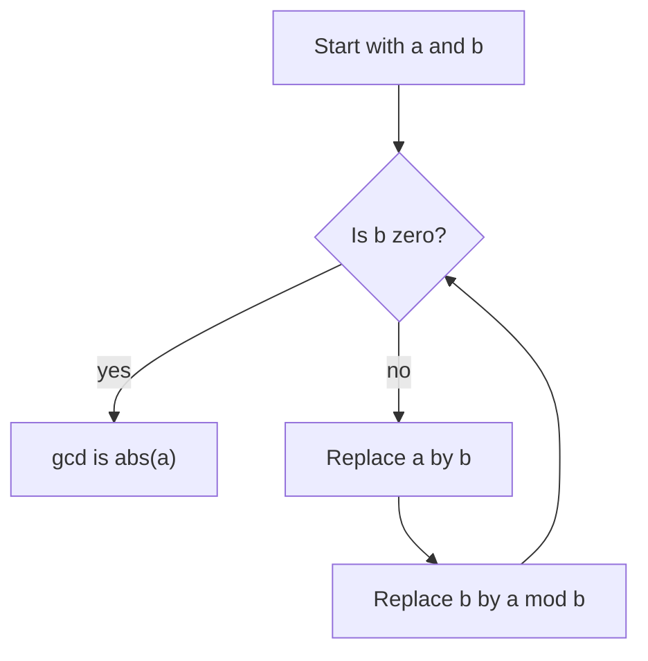

# Number Theory Basics

Number theory studies integers and their divisibility structure. In discrete mathematics it supplies proof examples, efficient algorithms, and the arithmetic foundation for cryptography. The central objects are divisibility, primes, greatest common divisors, and integer representations.


*Figure: Carl Friedrich Gauss is central to number theory, linear algebra, statistics, and numerical methods. Image: [Wikimedia Commons](https://commons.wikimedia.org/wiki/File:Carl_Friedrich_Gauss.jpg), Gottlieb Biermann after Christian Albrecht Jensen, public domain.*

The topic is both ancient and computational. Divisibility statements train proof writing; Euclid's algorithm is one of the oldest efficient algorithms; prime factorization leads directly to modern public-key cryptography. The habit to build here is to move between equations, divisibility notation, and algorithms without losing track of hypotheses such as "nonzero" or "positive."

## Definitions

For integers $a$ and $b$ with $a\ne0$, $a$ **divides** $b$, written $a\mid b$, if there is an integer $k$ such that $b=ak$. If no such integer exists, write $a\nmid b$. Divisibility is a statement about exact integer multiples, not approximate division.

The **division algorithm** says that for every integer $a$ and positive integer $d$, there are unique integers $q$ and $r$ such that

$$
a=dq+r,\qquad 0\le r<d.
$$

Here $q$ is the quotient and $r$ is the remainder. This theorem is the basis for modular arithmetic and for Euclid's algorithm.

An integer $p\gt 1$ is **prime** if its only positive divisors are $1$ and $p$. An integer greater than $1$ that is not prime is **composite**. The number $1$ is neither prime nor composite.

The **greatest common divisor** of integers $a$ and $b$, not both zero, is the largest positive integer dividing both. It is written $\gcd(a,b)$. The **least common multiple** of nonzero integers $a$ and $b$ is the smallest positive integer divisible by both, written $\operatorname{lcm}(a,b)$.

Integers $a$ and $b$ are **relatively prime** if $\gcd(a,b)=1$. A **base-$b$ expansion** of a positive integer $n$ is an expression

$$
n=a_kb^k+a_{k-1}b^{k-1}+\cdots+a_1b+a_0,
$$

where each digit satisfies $0\le a_i\lt b$ and $a_k\ne0$.

## Key results

Basic divisibility facts:

$$
a\mid b \land a\mid c \implies a\mid (mb+nc)
$$

for all integers $m,n$. Proof: if $b=as$ and $c=at$, then $mb+nc=a(ms+nt)$, and $ms+nt$ is an integer.

The **fundamental theorem of arithmetic** states that every integer greater than $1$ can be written uniquely as a product of primes, up to the order of the factors. This is why prime factorization can be used to compute gcds, lcms, and divisibility.

If $n$ is composite, then $n$ has a prime divisor at most $\sqrt n$. Proof: write $n=ab$ with $1\lt a\lt n$ and $1\lt b\lt n$. If both $a$ and $b$ were greater than $\sqrt n$, then $ab\gt n$, impossible. So one factor is at most $\sqrt n$, and that factor has a prime divisor at most itself.

Euclid's algorithm rests on

$$
\gcd(a,b)=\gcd(b,a\bmod b).
$$

If $a=bq+r$, then a common divisor of $a$ and $b$ also divides $r=a-bq$, and a common divisor of $b$ and $r$ also divides $a=bq+r$. Thus the common divisors are the same.

There are infinitely many primes. Suppose there were only finitely many, $p_1,\dots,p_k$. Let

$$
N=p_1p_2\cdots p_k+1.
$$

No listed prime divides $N$, because division by any $p_i$ leaves remainder $1$. But $N\gt 1$, so by prime factorization it has a prime divisor. That prime is not on the list, contradiction.

For positive integers $a,b$,

$$
ab=\gcd(a,b)\operatorname{lcm}(a,b).
$$

This follows by comparing prime exponents: the gcd takes minimum exponents, the lcm takes maximum exponents, and the sum of the minimum and maximum is the sum of the two original exponents.

## Visual



| Task | Main tool | Key bound or fact |
| --- | --- | --- |
| test divisibility | definition $b=ak$ | quotient must be integer |
| find quotient and remainder | division algorithm | $0\le r\lt d$ |
| test primality by trial division | prime divisor bound | test primes $\le\sqrt n$ |
| compute gcd | Euclidean algorithm | repeated remainders decrease |
| compute lcm | gcd-lcm identity | $\operatorname{lcm}(a,b)=ab/\gcd(a,b)$ for positive $a,b$ |
| convert base | repeated division | remainders become digits |

## Worked example 1: Use the Euclidean algorithm and back-substitution

**Problem.** Compute $\gcd(252,198)$ and express it as an integer combination of $252$ and $198$.

**Method.**

1. Apply the Euclidean algorithm:

$$
\begin{aligned}
252 &= 198\cdot1+54,\\
198 &= 54\cdot3+36,\\
54 &= 36\cdot1+18,\\
36 &= 18\cdot2+0.
\end{aligned}
$$

2. The last nonzero remainder is $18$, so $\gcd(252,198)=18$.
3. Back-substitute:

$$
18=54-36.
$$

4. Substitute $36=198-54\cdot3$:

$$
\begin{aligned}
18
&=54-(198-54\cdot3)\\
&=4\cdot54-198.
\end{aligned}
$$

5. Substitute $54=252-198$:

$$
\begin{aligned}
18
&=4(252-198)-198\\
&=4\cdot252-5\cdot198.
\end{aligned}
$$

**Checked answer.** $\gcd(252,198)=18$, and $18=4\cdot252-5\cdot198$. The combination confirms that any common divisor of $252$ and $198$ must divide $18$.

## Worked example 2: Test primality and factor a number

**Problem.** Determine whether $221$ is prime. If it is composite, factor it.

**Method.**

1. Compute the square-root cutoff:

$$
\sqrt{221}\approx14.86.
$$

2. Test primes at most $14.86$: $2,3,5,7,11,13$.
3. $221$ is odd, so $2\nmid221$.
4. Sum of digits is $2+2+1=5$, so $3\nmid221$.
5. It does not end in $0$ or $5$, so $5\nmid221$.
6. Check $7$: $7\cdot31=217$, so $7\nmid221$.
7. Check $11$: $11\cdot20=220$, so $11\nmid221$.
8. Check $13$: $13\cdot17=221$.

**Checked answer.** $221$ is composite, and $221=13\cdot17$. The search could stop as soon as the factor $13$ was found. If no prime up to $\sqrt{221}$ had divided it, then $221$ would have been prime.

## Code

```python
def gcd(a, b):
    a, b = abs(a), abs(b)
    while b:
        a, b = b, a % b
    return a

def factor(n):
    result = []
    d = 2
    while d * d <= n:
        while n % d == 0:
            result.append(d)
            n //= d
        d += 1 if d == 2 else 2
    if n > 1:
        result.append(n)
    return result

def to_base(n, base):
    if n == 0:
        return [0]
    digits = []
    while n:
        n, r = divmod(n, base)
        digits.append(r)
    return digits[::-1]

print(gcd(252, 198))
print(factor(221))
print(to_base(241, 2))
```

The `factor` function is trial division. It is suitable for small examples and for learning the logic, but large-scale factoring requires much more sophisticated algorithms.

## Common pitfalls

- Calling $1$ prime. It is neither prime nor composite; otherwise unique factorization would fail.
- Forgetting the condition $a\ne0$ in the definition of $a\mid b$.
- Using the division algorithm with a negative divisor. The standard statement takes the divisor $d$ to be positive.
- Stopping trial division too late or too early. Testing primes up to $\sqrt n$ is enough; testing only to $n/2$ is unnecessary.
- Confusing gcd with lcm in prime factorizations. Gcd uses minimum exponents; lcm uses maximum exponents.
- Treating Euclid's algorithm as a black box without preserving the back-substitution equations needed for Bezout coefficients.

Divisibility proofs should always return to the definition. To prove $a\mid b$, exhibit an integer $k$ with $b=ak$. To disprove it, show no such integer can exist, often by using remainders, parity, or bounds. Manipulating the vertical bar as if it were an arithmetic fraction is a common source of invalid reasoning.

The division algorithm is also the reason remainders are well-defined. For a positive divisor $d$, every integer falls into exactly one of the $d$ remainder classes $0,1,\dots,d-1$. Negative dividends still have nonnegative remainders in the standard convention: for example, $-11=3(-4)+1$, so the remainder on division by $3$ is $1$.

Prime factorization gives a second way to compute gcd and lcm. If

$$
a=\prod p_i^{\alpha_i},\qquad b=\prod p_i^{\beta_i},
$$

then

$$
\gcd(a,b)=\prod p_i^{\min(\alpha_i,\beta_i)},\qquad
\operatorname{lcm}(a,b)=\prod p_i^{\max(\alpha_i,\beta_i)}.
$$

This method is conceptually clear but requires factoring, which may be expensive for large integers. Euclid's algorithm avoids full factorization and is much more efficient for gcd computation.

Base expansion is another application of repeated division. Dividing by the base gives the least significant digit as a remainder; repeating on the quotient gives the next digit. The digits appear in reverse order of discovery, which is why base-conversion algorithms usually collect remainders and then reverse the list.

When doing Euclidean algorithm work by hand, keep the quotient-remainder equations aligned and do not overwrite them. The same equations used to find the gcd are needed for back-substitution. Losing one equation often forces the computation to be repeated from the beginning.

For primality testing, test divisibility only by primes up to the square root, not every integer. If a composite number has a factor larger than $\sqrt n$, the matching factor is smaller than $\sqrt n$. This is the reason trial division can stop at the square-root boundary. It is also the reason finding no small prime divisor proves primality.

When using prime factorizations, keep the same prime list for both numbers by allowing exponent $0$. For example, $12=2^2 3^1 5^0$ and $20=2^2 3^0 5^1$. Then minimum and maximum exponents can be read componentwise for gcd and lcm without forgetting primes that appear in only one number.

## Connections

- [Proof techniques](/math/discrete/proof-techniques) explains the direct and contradiction proofs used for divisibility and primes.
- [Modular arithmetic and cryptography](/math/discrete/modular-arithmetic-and-cryptography) builds congruences and RSA from gcds and primes.
- [Algorithms and complexity](/math/discrete/algorithms-and-complexity) analyzes Euclid's algorithm, trial division, and base conversion.
- [Induction and recursion](/math/discrete/induction-and-recursion) proves statements about integer representations and recursive algorithms.
