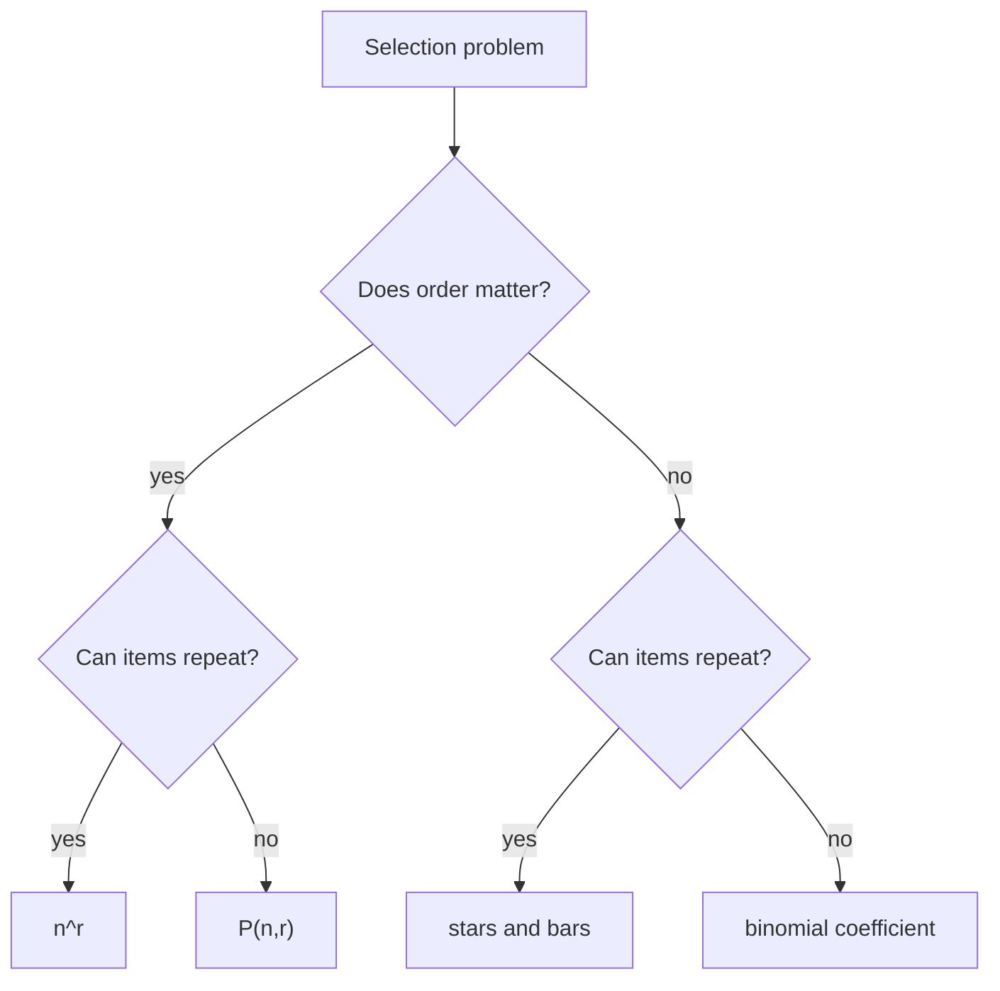

# Permutations and Combinations

Permutations and combinations count selections from a finite set. The key distinction is order. If the order of selected objects matters, use permutations or ordered arrangements. If order does not matter, use combinations.

These formulas are special cases of the product and division rules. The safest approach is to describe the object being counted in words before choosing a formula: ordered or unordered, with or without repetition, all objects or only some objects, distinct objects or repeated types.

## Definitions

A **permutation** of $n$ distinct objects is an ordering of all $n$ objects. There are

$$
n!
$$

permutations, where $n!=n(n-1)\cdots2\cdot1$ and $0!=1$.

An **$r$-permutation** of $n$ distinct objects is an ordered selection of $r$ objects from $n$:

$$
P(n,r)=n(n-1)\cdots(n-r+1)=\frac{n!}{(n-r)!}.
$$

An **$r$-combination** of $n$ distinct objects is an unordered selection of $r$ objects from $n$:

$$
\binom{n}{r}=\frac{n!}{r!(n-r)!}.
$$

A **multiset** permits repeated elements. Counting with repetition changes the formula. Ordered selections with repetition from $n$ types have $n^r$ possibilities. Unordered selections with repetition of $r$ objects from $n$ types have

$$
\binom{n+r-1}{r}
$$

possibilities, the stars-and-bars count.

If a word has $n$ letters with repeated multiplicities $n_1,n_2,\dots,n_k$, then the number of distinct rearrangements is

$$
\frac{n!}{n_1!n_2!\cdots n_k!}.
$$

## Key results

The formula for combinations follows from the division rule. First count ordered selections:

$$
P(n,r)=\frac{n!}{(n-r)!}.
$$

Each unordered $r$-element subset has exactly $r!$ orderings, so

$$
\binom{n}{r}=\frac{P(n,r)}{r!}=\frac{n!}{r!(n-r)!}.
$$

Symmetry:

$$
\binom{n}{r}=\binom{n}{n-r}.
$$

Choosing $r$ objects to include is equivalent to choosing $n-r$ objects to exclude.

Pascal's identity:

$$
\binom{n}{r}=\binom{n-1}{r-1}+\binom{n-1}{r}.
$$

Proof: fix a particular element $x$. An $r$-subset either contains $x$, in which case choose $r-1$ more from the other $n-1$ elements, or does not contain $x$, in which case choose all $r$ from the other $n-1$ elements.

The binomial theorem states

$$
(x+y)^n=\sum_{r=0}^{n}\binom{n}{r}x^{n-r}y^r.
$$

The coefficient $\binom nr$ counts the choice of which $r$ of the $n$ factors contribute a $y$ term.

Stars and bars counts nonnegative integer solutions to

$$
x_1+x_2+\cdots+x_n=r
$$

as $\binom{n+r-1}{r}$. Think of $r$ stars and $n-1$ bars; the bars separate stars into $n$ boxes.

## Visual

| Selection model | Order matters? | Repetition allowed? | Formula |
| --- | --- | --- | --- |
| arrange all $n$ distinct objects | yes | no | $n!$ |
| choose ordered $r$ from $n$ | yes | no | $P(n,r)=n!/(n-r)!$ |
| choose unordered $r$ from $n$ | no | no | $\binom nr$ |
| length-$r$ strings from $n$ symbols | yes | yes | $n^r$ |
| unordered $r$ from $n$ types | no | yes | $\binom{n+r-1}{r}$ |
| rearrange multiset | yes | repeated given | $n!/(n_1!\cdots n_k!)$ |



## Worked example 1: Count committees with roles

**Problem.** From $12$ students, choose a committee of $4$. Then choose a chair and secretary from the committee. How many outcomes are possible?

**Method.**

1. First choose the committee. Order does not matter:

$$
\binom{12}{4}=\frac{12!}{4!8!}=495.
$$

2. For each committee, choose the chair. There are $4$ choices.
3. Then choose the secretary from the remaining committee members. There are $3$ choices.
4. Multiply:

$$
495\cdot4\cdot3=5940.
$$

5. Alternative check: choose the chair and secretary first as an ordered pair, then choose the other two committee members:

$$
P(12,2)\binom{10}{2}=12\cdot11\cdot45=5940.
$$

**Checked answer.** There are $5940$ outcomes. The two methods agree because they describe the same final object: a $4$-person committee with two distinct roles assigned.

## Worked example 2: Count solutions with stars and bars

**Problem.** How many nonnegative integer solutions are there to

$$
x_1+x_2+x_3+x_4=10?
$$

**Method.**

1. Interpret the equation as distributing $10$ identical objects among $4$ boxes.
2. Use $10$ stars and $4-1=3$ bars.
3. There are $10+3=13$ positions in the star-bar string.
4. Choose which $3$ positions contain bars:

$$
\binom{13}{3}=286.
$$

5. Equivalently choose the $10$ positions containing stars:

$$
\binom{13}{10}=286.
$$

**Checked answer.** There are $286$ nonnegative integer solutions. For example, the pattern `**|*****||***` corresponds to $(2,5,0,3)$.

## Code

```python
from math import factorial, comb, perm

def multiset_permutations(counts):
    total = sum(counts)
    result = factorial(total)
    for c in counts:
        result //= factorial(c)
    return result

def stars_and_bars(types, items):
    return comb(types + items - 1, items)

print(factorial(5))
print(perm(10, 3))
print(comb(52, 5))
print(multiset_permutations([1, 4, 4, 2]))  # MISSISSIPPI
print(stars_and_bars(4, 10))
```

Python's `math.comb` and `math.perm` are exact integer functions, useful for checking combinatorial calculations.

## Common pitfalls

- Using permutations when order does not matter.
- Dividing by $r!$ when repetition or repeated types mean not every object has exactly $r!$ orderings.
- Forgetting that $0!=1$, which is needed for edge cases such as choosing all objects.
- Applying stars and bars to distinct objects. It counts identical objects distributed among labeled boxes.
- Counting roles and membership in the wrong order without checking that the final object is counted exactly once.
- Treating $\binom nr$ as zero or undefined without checking conventions; for integer counting, it is $0$ when $r\lt 0$ or $r\gt n$.

When a problem mixes membership and roles, decide what the final outcome contains. A committee with a chair is not merely an unordered set; it is an unordered set plus one distinguished member. You can count by choosing the committee first and then the chair, or by choosing the chair first and then the remaining members. Both methods should agree if they describe each final outcome exactly once. If they do not agree, one method is probably counting a different object.

Repeated letters and repeated selections are different issues. The word `LEVEL` has repeated letters already present, so distinct rearrangements require dividing by repeated multiplicities. By contrast, forming a length-$5$ password from letters with repetition allowed means each position may independently choose any letter. That count is $26^5$, not $26!/21!$ and not a multiset count, because the positions are ordered.

Stars and bars also has boundary conditions. It counts nonnegative solutions by default. If a problem requires positive solutions to $x_1+\cdots+x_k=n$, first set $y_i=x_i-1$, so the transformed equation is $y_1+\cdots+y_k=n-k$ with $y_i\ge0$. If upper bounds appear, plain stars and bars is no longer enough; use inclusion-exclusion or generating functions to remove solutions violating the bounds.

Binomial coefficients have several interchangeable interpretations. $\binom nr$ can count subsets of size $r$, paths with $r$ steps of one kind and $n-r$ of another, coefficients in $(1+x)^n$, or ways to place $r$ identical markers among $n$ labeled positions. Choosing the interpretation that matches the problem often gives a proof as well as a number.

A strong final check is to compare extreme cases. If $r=0$, there should usually be one way to choose nothing. If $r=n$, there should usually be one way to choose everything. If a formula fails these edge cases, the model likely used ordered choices, repetition, or division incorrectly.

For arrangements around a circle, be careful about symmetries. Seating $n$ distinct people around a round table usually gives $(n-1)!$ arrangements because rotating the whole table does not change the seating. If mirror images are also considered identical, divide by another factor of $2$ for $n\gt 2$. These formulas are not ordinary permutations; they come from deciding which transformations leave the final arrangement unchanged.

For distributions, distinguish labeled and unlabeled boxes. Stars and bars counts identical objects into labeled boxes: giving $3$ candies to Alice and $2$ to Bo is different from giving $2$ to Alice and $3$ to Bo. If boxes are also unlabeled, the problem becomes an integer partition problem and requires different tools. Many mistakes come from silently changing whether recipients are distinct.

When a problem says "at least" or "at most," formulas often need summation. Choosing at most $3$ members from $10$ is not $\binom{10}{3}$; it is $\binom{10}{0}+\binom{10}{1}+\binom{10}{2}+\binom{10}{3}$. Choosing at least $1$ may be easier by complement: $2^{10}-1$ nonempty subsets of a $10$-element set.

A useful way to avoid formula hunting is to build the object in stages. If the stages are ordered choices, multiply. If the staged construction imposes an artificial order that the final object does not have, divide by the number of artificial orderings. This explains the formulas instead of treating them as separate memorized facts.

For combinations with restrictions, consider whether to choose the special objects first or last. Counting poker hands with exactly two aces starts by choosing the aces and then choosing non-aces. Counting committees with at least one senior may be easier by complement. The right order is the one that makes later choices independent and avoids overlap.

If a counting problem has identical objects and labeled boxes, stars and bars may apply. If the objects are distinct and the boxes are labeled, each object chooses a box, giving a product count instead. If both objects and boxes are unlabeled, the problem is usually about partitions and needs different methods.

## Connections

- [Counting principles](/math/discrete/counting-principles) supplies the product and division rules behind these formulas.
- [Pigeonhole and inclusion-exclusion](/math/discrete/pigeonhole-and-inclusion-exclusion) handles overlapping restrictions.
- [Discrete probability](/math/discrete/discrete-probability) uses combinations to count equally likely outcomes.
- [Generating functions](/math/discrete/generating-functions) generalizes stars and bars and coefficient extraction.
