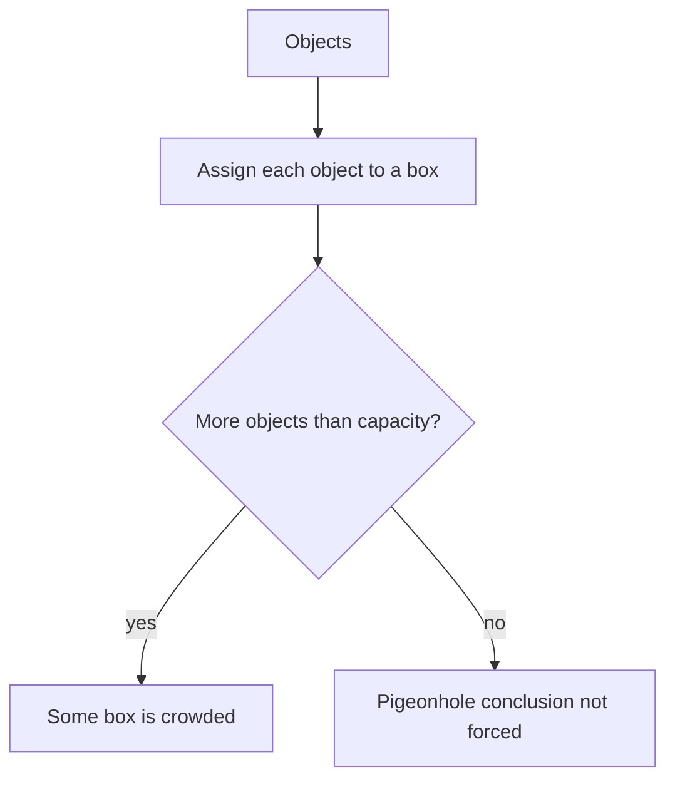

# Pigeonhole and Inclusion-Exclusion

The pigeonhole principle proves that collisions are unavoidable. Inclusion-exclusion counts unions by correcting overcounting. Together they handle problems where direct counting is messy because objects overlap or constraints force repetition.

Both tools require careful modeling. For pigeonhole arguments, the hard part is choosing boxes so that sharing a box gives the desired conclusion. For inclusion-exclusion, the hard part is identifying which objects were counted more than once and correcting in the right alternating pattern.

## Definitions

The **pigeonhole principle** says that if $N$ objects are placed into $k$ boxes and $N\gt k$, then some box contains at least two objects.

The generalized form says that some box contains at least

$$
\left\lceil \frac{N}{k}\right\rceil
$$

objects. Equivalently, if more than $k(r-1)$ objects are placed into $k$ boxes, then some box contains at least $r$ objects.

The **principle of inclusion-exclusion** for two sets is

$$
|A\cup B|=|A|+|B|-|A\cap B|.
$$

For three sets:

$$
|A\cup B\cup C|
=|A|+|B|+|C|
-|A\cap B|-|A\cap C|-|B\cap C|
+|A\cap B\cap C|.
$$

A **derangement** is a permutation with no fixed points. Derangements are a classic inclusion-exclusion application because the forbidden events "position $i$ is fixed" overlap.

## Key results

General inclusion-exclusion for finite sets $A_1,\dots,A_n$:

$$
\left|\bigcup_{i=1}^{n}A_i\right|
=\sum_i |A_i|
-\sum_{i<j}|A_i\cap A_j|
+\sum_{i<j<k}|A_i\cap A_j\cap A_k|
-\cdots
 +(-1)^{n+1}|A_1\cap\cdots\cap A_n|.
$$

Proof idea: fix an element that belongs to exactly $r$ of the sets. Its total contribution to the right side is

$$
\binom{r}{1}-\binom{r}{2}+\binom{r}{3}-\cdots+(-1)^{r+1}\binom{r}{r}=1,
$$

using the binomial identity from $(1-1)^r=0$. So every element in the union is counted once.

The derangement formula is

$$
!n=n!\sum_{k=0}^{n}\frac{(-1)^k}{k!}.
$$

To derive it, let $A_i$ be the set of permutations fixing position $i$. Then $\vert A_{i_1}\cap\cdots\cap A_{i_k}\vert =(n-k)!$, and there are $\binom nk$ choices of the fixed positions. Inclusion-exclusion gives

$$
n!-\binom n1(n-1)!+\binom n2(n-2)!-\cdots+(-1)^n\binom nn0!.
$$

Factoring out $n!$ yields the formula above.

## Visual



| Tool | What it proves or counts | Modeling question |
| --- | --- | --- |
| basic pigeonhole | at least one collision | what are the boxes? |
| generalized pigeonhole | at least $r$ in one box | what is box capacity? |
| complement | avoid direct "at least one" count | what does failure look like? |
| two-set inclusion-exclusion | union of two overlapping sets | what was double counted? |
| full inclusion-exclusion | union of many overlapping sets | what intersections have each size? |
| derangements | avoid all fixed points | what forbidden events overlap? |

## Worked example 1: Force a shared remainder

**Problem.** Prove that among any $8$ integers, two have the same remainder when divided by $7$.

**Method.**

1. The objects are the $8$ integers.
2. The boxes are the possible remainders modulo $7$:

$$
0,1,2,3,4,5,6.
$$

3. There are $7$ boxes.
4. Each integer goes into exactly one box, according to its remainder.
5. Since $8\gt 7$, the pigeonhole principle implies that some box contains at least two integers.

**Checked answer.** Two of the integers have the same remainder modulo $7$. Equivalently, their difference is divisible by $7$.

## Worked example 2: Count integers divisible by 2, 3, or 5

**Problem.** How many positive integers at most $100$ are divisible by $2$, $3$, or $5$?

**Method.**

1. Let $A_2,A_3,A_5$ be the sets of positive integers at most $100$ divisible by $2,3,5$ respectively.
2. Single counts:

$$
|A_2|=\lfloor100/2\rfloor=50,\quad
|A_3|=\lfloor100/3\rfloor=33,\quad
|A_5|=\lfloor100/5\rfloor=20.
$$

3. Pairwise intersections are multiples of lcms:

$$
\begin{aligned}
|A_2\cap A_3|&=\lfloor100/6\rfloor=16,\\
|A_2\cap A_5|&=\lfloor100/10\rfloor=10,\\
|A_3\cap A_5|&=\lfloor100/15\rfloor=6.
\end{aligned}
$$

4. Triple intersection:

$$
|A_2\cap A_3\cap A_5|=\lfloor100/30\rfloor=3.
$$

5. Apply inclusion-exclusion:

$$
50+33+20-16-10-6+3=74.
$$

**Checked answer.** There are $74$ positive integers at most $100$ divisible by $2$, $3$, or $5$. The final $+3$ restores multiples of $30$, which were subtracted once too many after being included in all three single counts.

## Code

```python
from math import factorial

def derangements(n):
    total = 0
    for k in range(n + 1):
        total += (-1) ** k * factorial(n) // factorial(k)
    return total

def count_divisible(limit, divisors):
    return sum(
        1
        for x in range(1, limit + 1)
        if any(x % d == 0 for d in divisors)
    )

print([derangements(n) for n in range(1, 8)])
print(count_divisible(100, [2, 3, 5]))
```

The brute-force divisibility count is useful for checking the inclusion-exclusion calculation on small limits.

## Common pitfalls

- Choosing boxes that do not imply the desired conclusion when two objects share a box.
- Forgetting the ceiling in the generalized pigeonhole principle.
- Treating inclusion-exclusion as simple subtraction. Triple overlaps must be added back.
- Counting intersections with products instead of least common multiples in divisibility problems.
- Applying derangement formulas to objects with repeated labels without adjusting the model.
- Assuming pigeonhole arguments identify which box is crowded. They usually prove existence only.

A reliable pigeonhole proof has three visible parts: the objects, the boxes, and the reason that two objects in one box force the desired conclusion. If any part is missing, the proof is usually incomplete. For example, to show two selected integers have the same remainder modulo $7$, the boxes are remainders. To show two selected subsets have the same size, the boxes are possible cardinalities. The boxes should be chosen from the conclusion, not from the surface wording of the problem.

Capacity arguments are often easier in contrapositive form. To prove that some box contains at least $r$ objects, suppose every box contains at most $r-1$ objects. Then $k$ boxes contain at most $k(r-1)$ objects total. If the actual number of objects is larger, the supposition is impossible. This form avoids rounding mistakes because it turns the ceiling statement into an integer capacity statement.

For inclusion-exclusion, organize the computation by intersection size. In a divisibility problem, single sets count multiples of one divisor, pairwise intersections count multiples of least common multiples of two divisors, and triple intersections count multiples of least common multiples of three divisors. In derangement problems, a $k$-fold intersection means $k$ specified positions are fixed. Naming this pattern before calculating reduces the chance of omitting an intersection term.

The sign pattern also has a reason. Elements in exactly one set are counted once by the single terms. Elements in exactly two sets are counted twice and then subtracted once. Elements in exactly three sets are counted three times, subtracted three times in pairwise intersections, and added once in the triple intersection. When unsure about a formula, test one element belonging to exactly $r$ sets and compute its net contribution.

Inclusion-exclusion counts a union of forbidden events just as well as a union of desired events. Many problems ask for objects with none of several bad properties. The standard route is to count all objects and subtract the union of bad events, using inclusion-exclusion to count that union accurately.

For pigeonhole problems involving integers, remainders, parity, and intervals are common boxes. If the desired conclusion is "two numbers have a difference divisible by $m$," use residue classes modulo $m$. If the conclusion is "two numbers sum to a fixed value," pair possible numbers into boxes such as $\{1,10\},\{2,9\}$ and so on. If the conclusion is "two values are close," divide the number line into intervals whose lengths force closeness.

For inclusion-exclusion problems involving functions or strings, define a forbidden event for each violated condition. A password problem with missing required character types might use events $A_L$ for no letters, $A_D$ for no digits, and $A_S$ for no symbols. The intersections then have a concrete interpretation: $A_L\cap A_D$ means the password uses only symbols. This naming discipline prevents formulas from becoming detached from the objects counted.

The strongest check is to test a small case by enumeration. For derangements, compute $!1=0$, $!2=1$, and $!3=2$ by listing. For divisibility, list integers up to $20$ before trusting a formula up to $1000$. Small cases expose missing intersection terms quickly because the final count may be negative, too large, or inconsistent with an obvious list.

For inclusion-exclusion with many sets, write a table of intersection sizes before substituting into the formula. The table should have rows for single sets, pair intersections, triple intersections, and so on. This separates the combinatorial modeling from the arithmetic and makes sign mistakes easier to spot.

Pigeonhole conclusions are existential. They usually do not identify which object pair collides or which box is crowded. If a problem asks for an algorithm to find the pair, the pigeonhole principle may prove the pair exists, but an additional search or constructive argument is needed to locate it.

For inclusion-exclusion, the full universe should be clear even when only a union is counted. In derangements, the universe is all permutations. In divisibility problems, it is usually integers in a bounded interval. Naming the universe clarifies whether the final answer is a raw union size, a complement count, or a probability.

## Connections

- [Counting principles](/math/discrete/counting-principles) introduces the sum, subtraction, and division rules.
- [Permutations and combinations](/math/discrete/permutations-and-combinations) supplies factorials and binomial coefficients.
- [Discrete probability](/math/discrete/discrete-probability) uses inclusion-exclusion for probabilities of unions.
- [Number theory basics](/math/discrete/number-theory-basics) supplies divisibility, remainders, gcds, and lcms.
