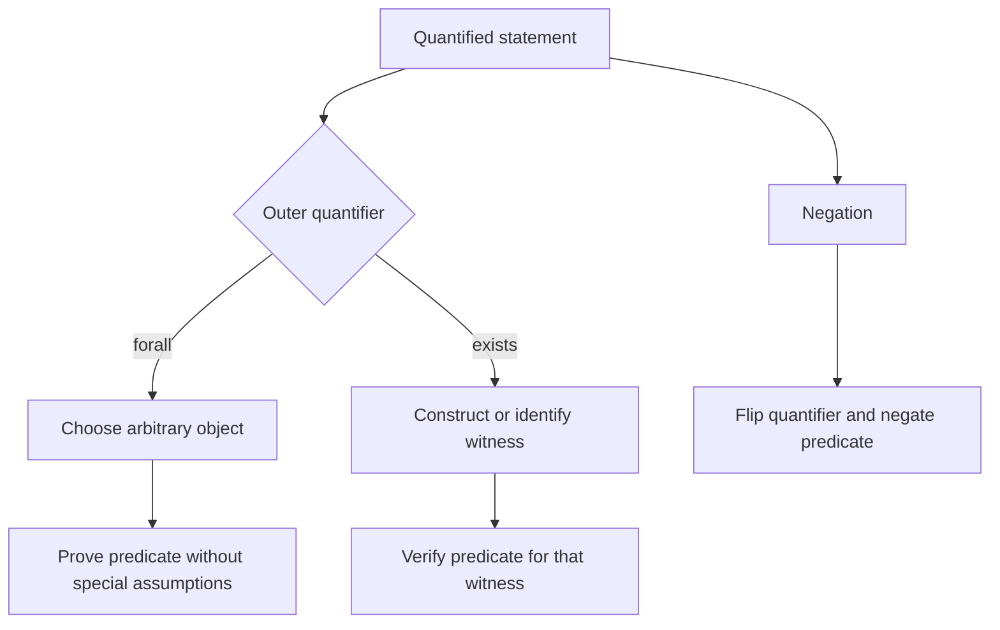

# Predicates and Quantifiers

Propositional logic cannot express statements such as "every prime greater than $2$ is odd" without flattening the whole sentence into one atomic symbol. Predicate logic opens the sentence and exposes its variables. A predicate such as $P(x)$ becomes a proposition only after $x$ is assigned a value or after a quantifier says how broadly $P$ is being asserted.

This is the language used for definitions, theorems, loop invariants, database queries, and specifications. Universal quantifiers support claims about all objects in a domain. Existential quantifiers support claims that at least one object exists. Much of proof writing is the disciplined process of introducing, transforming, and eliminating these quantifiers.

## Definitions

A **predicate** or **propositional function** is a statement containing variables. For example, $P(x)$: "$x^2\ge 0$" is not a proposition until the domain of $x$ is known and $x$ is given a value or quantified. Over the real numbers, $P(3)$ is true. Over the same domain, $Q(x)$: "$x^2=2$" is true for some values but not all.

The **domain of discourse** is the set of objects a variable is allowed to represent. Changing the domain can change the truth value. The statement $\forall x(x^2\ge x)$ is false over the real numbers, false over the integers, but true over the nonnegative integers only for $x=0$ or $x\ge1$; if the domain is $\{0,1,2,\dots\}$, it is true.

The two basic quantifiers are:

- **Universal quantifier:** $\forall x\,P(x)$ means "$P(x)$ is true for every $x$ in the domain."
- **Existential quantifier:** $\exists x\,P(x)$ means "there is at least one $x$ in the domain for which $P(x)$ is true."

A **unique existence** statement, written $\exists!x\,P(x)$, means there is exactly one object satisfying $P$. It abbreviates

$$
\exists x\bigl(P(x)\land \forall y(P(y)\to y=x)\bigr).
$$

Variables inside a quantifier's scope are **bound**. Variables not bound by a quantifier are **free**. A formula with free variables is not a complete proposition until those variables are assigned or quantified.

## Key results

Negating quantified statements reverses the quantifier and negates the predicate:

$$
\begin{aligned}
\neg\forall x\,P(x) &\equiv \exists x\,\neg P(x),\\
\neg\exists x\,P(x) &\equiv \forall x\,\neg P(x).
\end{aligned}
$$

These are De Morgan laws for quantifiers. The first says that to refute "everyone has property $P$," it is enough to find one counterexample. The second says that to refute "someone has property $P$," one must show that no object has it.

Quantifier order matters. In general,

$$
\forall x\exists y\,R(x,y)
$$

is not equivalent to

$$
\exists y\forall x\,R(x,y).
$$

The first allows $y$ to depend on $x$. The second requires one single $y$ that works for every $x$. For example, over the integers, $\forall x\exists y(y\gt x)$ is true, because each integer has a larger integer. But $\exists y\forall x(y\gt x)$ is false, because no fixed integer is larger than every integer.

Universal statements are usually proved by choosing an arbitrary element of the domain and proving the predicate for it. Existential statements are usually proved by constructing a witness. To disprove a universal statement, produce a counterexample. To disprove an existential statement, prove a universal negation.

Nested quantifiers also interact with implication. The statement

$$
\forall x(P(x)\to Q(x))
$$

does not assert that any object satisfies $P(x)$. It asserts that every object that satisfies $P$ also satisfies $Q$. This is why mathematical definitions often have the form "for all $x$, if $x$ has the hypotheses, then $x$ has the conclusion."

## Visual

| Claim form | Meaning | How to prove | How to disprove |
| --- | --- | --- | --- |
| $\forall x\,P(x)$ | every object works | take arbitrary $x$ and prove $P(x)$ | find one $x$ with $\neg P(x)$ |
| $\exists x\,P(x)$ | at least one object works | give a witness $a$ and prove $P(a)$ | prove $\forall x\,\neg P(x)$ |
| $\forall x\exists y\,R(x,y)$ | each $x$ has a possibly different $y$ | give a rule for $y$ in terms of $x$ | find one $x$ with no possible $y$ |
| $\exists y\forall x\,R(x,y)$ | one $y$ works for all $x$ | give a single universal witness | show every candidate $y$ fails for some $x$ |



## Worked example 1: Negate a nested statement

**Problem.** Let the domain be the integers. Negate the statement

$$
\forall x\exists y\,(y>x \land y \text{ is even}).
$$

Then decide whether the original statement is true.

**Method.**

1. Start with the negation:

$$
\neg\forall x\exists y\,(y>x \land y \text{ is even}).
$$

2. Move the negation through the universal quantifier:

$$
\exists x\,\neg\exists y\,(y>x \land y \text{ is even}).
$$

3. Move the negation through the existential quantifier:

$$
\exists x\forall y\,\neg(y>x \land y \text{ is even}).
$$

4. Apply De Morgan's law inside:

$$
\exists x\forall y\,(y\le x \lor y \text{ is not even}).
$$

**Checked answer.** The negation says: "There is an integer $x$ such that every integer $y$ is either not greater than $x$ or is not even." The original statement is true. Given any integer $x$, choose $y=2x+2$ if $x\ge0$ and choose $y=0$ if $x\lt 0$. In both cases $y$ is even and $y\gt x$. The chosen $y$ is allowed to depend on $x$, which is exactly what $\forall x\exists y$ permits.

## Worked example 2: Compare quantifier orders

**Problem.** Over the real numbers, compare the truth values of:

$$
\forall x\exists y\,(x+y=0)
$$

and

$$
\exists y\forall x\,(x+y=0).
$$

**Method.**

1. For $\forall x\exists y(x+y=0)$, choose an arbitrary real number $x$.
2. We need a real number $y$ satisfying $x+y=0$.
3. The equation gives $y=-x$, which is a real number.
4. Therefore each $x$ has a witness, so the first statement is true.
5. For $\exists y\forall x(x+y=0)$, suppose a single real number $y$ worked for every $x$.
6. Taking $x=0$ gives $y=0$.
7. Taking $x=1$ gives $1+y=0$, so $y=-1$.
8. No single $y$ can be both $0$ and $-1$.

**Checked answer.** The first statement is true and the second is false. The only difference is quantifier order. In the first, $y$ may depend on $x$; in the second, one fixed $y$ must work for all $x$.

## Code

```python
def forall(domain, predicate):
    return all(predicate(x) for x in domain)

def exists(domain, predicate):
    return any(predicate(x) for x in domain)

domain = range(-5, 6)

statement1 = forall(
    domain,
    lambda x: exists(domain, lambda y: x + y == 0),
)

statement2 = exists(
    domain,
    lambda y: forall(domain, lambda x: x + y == 0),
)

print(statement1)
print(statement2)
```

On the finite sample domain $\{-5,\dots,5\}$, the output is `True` and `False`. Finite testing is not a proof over all real numbers, but it reflects the same quantifier-order difference that the proof establishes.

## Common pitfalls

- Forgetting to state the domain. A quantified formula can change truth value when the domain changes.
- Reversing quantifier order. $\forall x\exists y$ usually means "a custom response for each input"; $\exists y\forall x$ means "one response fits all inputs."
- Negating only the predicate and forgetting to flip the quantifier.
- Treating $\exists x$ as "many." It means at least one unless uniqueness is explicitly stated.
- Proving a universal statement by testing several examples. Examples can suggest a proof, but they do not prove "for all."
- Using a special element when proving a universal statement. The chosen element must be arbitrary.

When translating English, identify the domain before choosing quantifiers. "Every student has taken a math course" might mean every student in a class, every student at a university, or every student in some database table. The predicate and the truth value both depend on this domain. A good translation states the domain in words or in the formula.

Restricted quantifiers can be written with implications or conjunctions. "Every prime greater than $2$ is odd" becomes $\forall n((P(n)\land n\gt 2)\to O(n))$. "There exists a prime greater than $100$" becomes $\exists n(P(n)\land n\gt 100)$. Universal restrictions usually use implication; existential restrictions usually use conjunction. Reversing these patterns changes the meaning.

For nested quantifiers, read from left to right while tracking dependency. In $\forall x\exists y\,R(x,y)$, the witness $y$ may be chosen after seeing $x$. In $\exists y\forall x\,R(x,y)$, the witness $y$ is chosen before any $x$ and must work for all of them. This dependency is often the whole point of the statement.

A useful translation check is to negate the formula and see whether the result matches the ordinary-language failure case. The negation of "every server has a backup" should be "some server has no backup." If the symbolic negation says something different, the original quantifier or connective was probably mistranslated.

When a statement contains several variables, specify whether they share a domain. In $\forall x\exists y(x\lt y)$ over integers, both variables are integers. In applied settings, $x$ might range over users while $y$ ranges over permissions or files. Mixed-domain predicates should make each variable's type explicit.

## Connections

- [Propositional logic](/math/discrete/propositional-logic) supplies the connectives inside quantified formulas.
- [Proof techniques](/math/discrete/proof-techniques) explains arbitrary-element proofs, counterexamples, and existence proofs.
- [Sets and set operations](/math/discrete/sets-and-set-operations) provides domains, membership, and subset language.
- [Relations](/math/discrete/relations) expresses properties such as reflexive and transitive with quantified statements.
