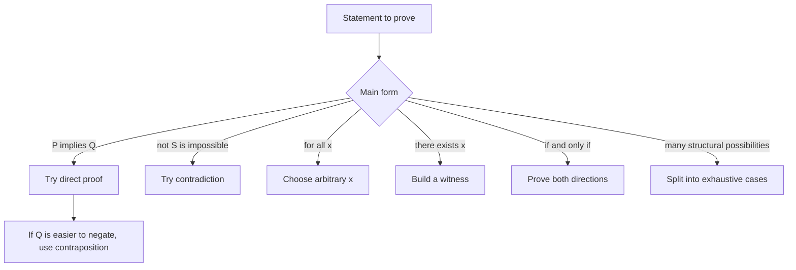

# Proof Techniques

A proof is a finite chain of justified steps from hypotheses to a conclusion. The main challenge is not remembering a ritual but matching the form of the statement to a method that exposes why it is true. Conditional statements invite direct proof or contraposition. Negated statements invite contradiction. Universal statements require arbitrary elements. Existential statements require witnesses or a carefully justified nonconstructive argument.

Discrete mathematics uses proof techniques constantly because many objects are finite, symbolic, and rule based. Algorithms need correctness proofs, counting formulas need double-counting or bijective proofs, graph statements need structural arguments, and number theory statements need divisibility reasoning. A good proof makes the dependencies visible enough that another reader can check every step.

## Definitions

A **theorem** is a statement that has been proved. A **lemma** is a supporting theorem used to prove larger results. A **corollary** follows quickly from a theorem. A **conjecture** is a statement believed to be true but not yet proved.

A **direct proof** of $P\to Q$ assumes $P$ and derives $Q$. A proof by **contraposition** proves $\neg Q\to\neg P$, which is equivalent to $P\to Q$. A proof by **contradiction** assumes the negation of the desired conclusion and derives an impossibility, such as $0=1$ or a statement and its negation.

An **existence proof** shows that an object with a desired property exists. It is **constructive** if it gives an object or a method to find one. It is **nonconstructive** if it proves existence without identifying a specific witness. A **counterexample** disproves a universal claim by giving one object for which the claim fails.

A **proof by cases** divides the hypotheses into exhaustive possibilities and proves the conclusion in every possibility. A **biconditional proof** of $P\leftrightarrow Q$ usually proves both directions $P\to Q$ and $Q\to P$. A **vacuous proof** proves $P\to Q$ by showing $P$ is impossible. A **trivial proof** proves $P\to Q$ by showing $Q$ is always true under the relevant domain.

## Key results

The logical equivalences behind proof methods are:

$$
\begin{aligned}
P\to Q &\equiv \neg Q\to \neg P,\\
\neg(P\to Q) &\equiv P\land \neg Q,\\
P\leftrightarrow Q &\equiv (P\to Q)\land(Q\to P).
\end{aligned}
$$

The first justifies contraposition. The second explains how counterexamples work. The third explains why "if and only if" proofs have two directions.

For universal statements, the standard template is:

1. Let $x$ be an arbitrary element of the domain.
2. Use only facts true of every such $x$, plus the hypotheses.
3. Derive the desired property.
4. Conclude the statement holds for all $x$.

For existential statements, the standard template is:

1. Name a candidate witness or describe how it is chosen.
2. Verify it belongs to the domain.
3. Verify it has the required property.

Contradiction is powerful but should be used with discipline. To prove $S$, assume $\neg S$ and combine that assumption with known facts until an impossibility follows. The contradiction must depend on the assumption; otherwise the proof has only shown the surrounding facts are inconsistent.

Proof by cases requires two checks: the cases cover all possibilities, and the conclusion is proved in each case. For integer parity, the cases "even" and "odd" are exhaustive. For modular arithmetic modulo $m$, the cases are usually the $m$ possible remainders.

## Visual



| Goal shape | Usually effective method | What must be checked |
| --- | --- | --- |
| $P\to Q$ | direct proof | all uses of $P$ are explicit |
| $P\to Q$ with awkward $Q$ | contraposition | prove $\neg Q\to\neg P$ |
| $\forall x\,P(x)$ | arbitrary element | no hidden special choice of $x$ |
| $\exists x\,P(x)$ | constructive witness | witness is in the domain and satisfies $P$ |
| $P\leftrightarrow Q$ | two implications | both directions are present |
| disprove $\forall x\,P(x)$ | counterexample | one valid domain element violates $P$ |

## Worked example 1: Use contraposition for a divisibility claim

**Problem.** Prove: If $n^2$ is even, then $n$ is even.

**Method.**

1. A direct proof would assume $n^2$ is even and try to show $n$ is even. That is possible but awkward without prime factorization.
2. Use contraposition. The contrapositive is: If $n$ is not even, then $n^2$ is not even.
3. "Not even" for an integer means odd. Let $n$ be odd.
4. Then $n=2k+1$ for some integer $k$.
5. Square it:

$$
\begin{aligned}
n^2
&=(2k+1)^2\\
&=4k^2+4k+1\\
&=2(2k^2+2k)+1.
\end{aligned}
$$

6. Since $2k^2+2k$ is an integer, $n^2$ has the form $2m+1$ and is odd.

**Checked answer.** We have proved the contrapositive: if $n$ is odd, then $n^2$ is odd. Therefore the original implication is true: if $n^2$ is even, then $n$ is even.

## Worked example 2: Prove an existence statement constructively

**Problem.** Prove that for every integer $n$, there exists an integer $m$ such that $m\gt n$ and $m$ is divisible by $3$.

**Method.**

1. The statement has the form $\forall n\exists m\,P(n,m)$.
2. Choose an arbitrary integer $n$.
3. Divide $n$ by $3$. By the division algorithm, $n=3q+r$ where $r\in\{0,1,2\}$.
4. Define the witness by cases:

$$
m=
\begin{cases}
3q+3, & r=0,\\
3q+3, & r=1,\\
3q+3, & r=2.
\end{cases}
$$

In all cases this is just $m=3q+3$.

5. Check divisibility: $m=3(q+1)$, so $3\mid m$.
6. Check that $m\gt n$:
   - If $r=0$, then $m-n=(3q+3)-3q=3\gt 0$.
   - If $r=1$, then $m-n=(3q+3)-(3q+1)=2\gt 0$.
   - If $r=2$, then $m-n=(3q+3)-(3q+2)=1\gt 0$.

**Checked answer.** For arbitrary $n$, the constructed integer $m=3q+3$ is divisible by $3$ and greater than $n$. Since the construction works for every possible remainder, the universal-existential statement is proved.

## Code

```python
def witness_multiple_of_three_above(n):
    q, r = divmod(n, 3)
    return 3 * q + 3

def verify(limit=20):
    for n in range(-limit, limit + 1):
        m = witness_multiple_of_three_above(n)
        assert m > n
        assert m % 3 == 0
    return True

print(verify())
print([(n, witness_multiple_of_three_above(n)) for n in range(-4, 8)])
```

The code checks the witness formula on a finite range. This is not a replacement for the proof, but it is a useful way to test whether the proposed construction behaves as intended before writing the formal argument.

## Common pitfalls

- Starting a direct proof by assuming the conclusion. That is circular unless the statement is being proved by a valid equivalence chain.
- Proving examples instead of a universal statement. Examples can guide a proof, but they do not establish "for all."
- Using contradiction when contraposition is clearer. Contraposition often gives a more readable proof for parity and divisibility.
- Forgetting one direction of an "if and only if" proof.
- Giving a witness for an existence proof but not checking all required properties.
- Splitting into cases that are not exhaustive or that overlap in a confusing way.
- Using a theorem whose hypotheses have not been verified.

A proof should make quantifier movement visible. To prove $\forall x\exists y\,P(x,y)$, begin with an arbitrary $x$ and then construct a $y$ that may depend on that $x$. To prove $\exists y\forall x\,P(x,y)$, one single $y$ must work for every $x$. Many invalid proofs accidentally prove the first statement while claiming the second.

Counterexamples should satisfy the hypotheses of the statement being disproved. To refute "every prime greater than $2$ is odd," the number $9$ is irrelevant because it is not prime. A valid counterexample must live in the domain and meet the hypothesis while violating the conclusion. Writing the statement as $P(x)\to Q(x)$ helps identify both requirements.

Proof by contradiction is strongest when the contradiction is explicit. The endpoint should be a statement known to be false, such as an integer being both even and odd, a positive number being less than itself, or a violation of a previously proved theorem. Simply reaching an unexpected result is not enough; the result must be impossible under accepted assumptions.

Existence proofs come in layers. A constructive proof gives a witness and verifies it. A counting proof may show more objects are available than forbidden objects, so some valid object must exist. A contradiction proof may show nonexistence is impossible. In all cases, identify whether the proof actually tells how to find the object.

After drafting a proof, check every sentence for its source. Each claim should come from a hypothesis, a definition, an earlier line, an established theorem, or a clearly introduced construction. This source check catches hidden assumptions, especially in divisibility, parity, and set-inclusion proofs.

The proof method should fit the statement, but first attempts are allowed to change. If a direct proof stalls, try the contrapositive. If an existence proof lacks a witness, try a counting or extremal argument. If a universal claim seems false, search for a counterexample before forcing a proof.

## Connections

- [Propositional logic](/math/discrete/propositional-logic) explains the equivalences behind implication and contraposition.
- [Predicates and quantifiers](/math/discrete/predicates-and-quantifiers) supplies the formal structure of universal and existential claims.
- [Induction and recursion](/math/discrete/induction-and-recursion) adds proof methods for statements indexed by integers.
- [Number theory basics](/math/discrete/number-theory-basics) provides many standard direct, contradiction, and contraposition examples.
