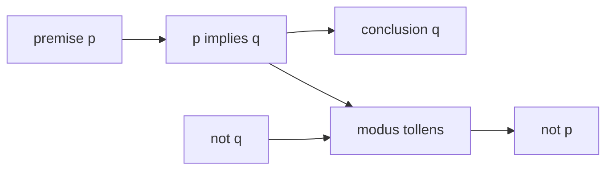

# Propositional Logic

Propositional logic is the grammar of precise yes-or-no statements. A proposition is not a vague claim, a command, or an expression with an unassigned variable; it is a declarative sentence with a definite truth value. Once propositions are named by variables such as $p$, $q$, and $r$, larger statements can be built with logical connectives. This lets mathematical arguments be checked by form rather than by the accidental wording of English.

This topic sits at the entrance to proof, set theory, circuit design, program specification, and Boolean search. Its power is that complicated statements can be reduced to small truth tables and algebraic laws. Its limitation is also important: propositional logic treats each simple sentence as atomic, so it cannot express "for every integer" or "there exists a vertex" until predicates and quantifiers are introduced.

## Definitions

A **proposition** is a declarative sentence that is either true or false, but not both. "Seven is prime" is a proposition. "Close the door" is not, because it is a command. "$x+2=5$" is not a proposition until $x$ has a value or the statement is quantified.

Compound propositions are built from simpler propositions using connectives.

| Connective | Symbol | Read as | True exactly when |
| --- | --- | --- | --- |
| Negation | $\neg p$ | not $p$ | $p$ is false |
| Conjunction | $p \land q$ | $p$ and $q$ | both $p$ and $q$ are true |
| Inclusive disjunction | $p \lor q$ | $p$ or $q$ | at least one of $p,q$ is true |
| Exclusive or | $p \oplus q$ | $p$ xor $q$ | exactly one of $p,q$ is true |
| Conditional | $p \to q$ | if $p$, then $q$ | not the case that $p$ is true and $q$ is false |
| Biconditional | $p \leftrightarrow q$ | $p$ iff $q$ | $p$ and $q$ have the same truth value |

The conditional is often the first conceptual hurdle. In mathematics, $p \to q$ does not assert that $p$ causes $q$. It asserts that the failure pattern $p$ true and $q$ false never occurs. This is why a conditional with a false hypothesis is true: it has not been contradicted.

A compound proposition is a **tautology** if it is true for every assignment of truth values, a **contradiction** if it is false for every assignment, and a **contingency** otherwise. Two propositions $P$ and $Q$ are **logically equivalent**, written $P \equiv Q$, when $P \leftrightarrow Q$ is a tautology. An argument form is **valid** if the conclusion is true in every row in which all premises are true.

## Key results

The most useful equivalences are the ones that remove conditionals, move negations inward, or rewrite a statement into a form that is easier to test.

$$
\begin{aligned}
\neg(p \land q) &\equiv \neg p \lor \neg q,\\
\neg(p \lor q) &\equiv \neg p \land \neg q,\\
p \to q &\equiv \neg p \lor q,\\
p \leftrightarrow q &\equiv (p \to q) \land (q \to p),\\
\neg(p \to q) &\equiv p \land \neg q,\\
p \lor (q \land r) &\equiv (p \lor q)\land(p \lor r),\\
p \land (q \lor r) &\equiv (p \land q)\lor(p \land r).
\end{aligned}
$$

The first two are De Morgan's laws. They are the propositional version of the set identities for complements of unions and intersections. The equivalence $p \to q \equiv \neg p \lor q$ is the standard way to analyze implications by truth table or by Boolean algebra.

Here is a proof of the negated implication law using only equivalences:

$$
\begin{aligned}
\neg(p \to q)
&\equiv \neg(\neg p \lor q)\\
&\equiv \neg\neg p \land \neg q\\
&\equiv p \land \neg q.
\end{aligned}
$$

This matters because it gives the exact shape of a counterexample. To disprove "if $p$, then $q$," do not try to make both statements false. Make the hypothesis true and the conclusion false.

Rules of inference preserve truth. **Modus ponens** has the form $p$, $p \to q$, therefore $q$. **Modus tollens** has the form $\neg q$, $p \to q$, therefore $\neg p$. **Hypothetical syllogism** chains implications: from $p \to q$ and $q \to r$, infer $p \to r$. **Disjunctive syllogism** says that from $p \lor q$ and $\neg p$, infer $q$.

## Visual

| $p$ | $q$ | $p \to q$ | $\neg(p \to q)$ | $p \land \neg q$ |
| --- | --- | --- | --- | --- |
| T | T | T | F | F |
| T | F | F | T | T |
| F | T | T | F | F |
| F | F | T | F | F |

The last two columns match, so the table confirms $\neg(p \to q)\equiv p\land\neg q$.



## Worked example 1: Translate and negate an access rule

**Problem.** Translate "A user can log in only if the password is correct and the account is active." Then negate the statement in plain English. Let $p$ mean "the user can log in," $q$ mean "the password is correct," and $r$ mean "the account is active."

**Method.**

1. The phrase "only if" introduces a necessary condition. If the user can log in, then the necessary condition must hold.
2. "The password is correct and the account is active" is $q\land r$.
3. The whole statement is therefore

$$
p \to (q\land r).
$$

4. Negate it algebraically:

$$
\begin{aligned}
\neg(p \to (q\land r))
&\equiv p \land \neg(q\land r)\\
&\equiv p \land (\neg q \lor \neg r).
\end{aligned}
$$

**Checked answer.** The negation is: "The user can log in, and either the password is not correct or the account is not active." This is the only kind of observation that would refute the original rule. Merely finding an inactive account that cannot log in would not refute it, because the original statement only constrains users who can log in.

## Worked example 2: Test an argument form

**Problem.** Determine whether this argument is valid:

- If the build passes, then the tests ran.
- If the tests ran, then the deployment is allowed.
- The deployment is not allowed.
- Therefore, the build did not pass.

Let $p$ mean "the build passes," $q$ mean "the tests ran," and $r$ mean "the deployment is allowed."

**Method.**

1. The premises are $p\to q$, $q\to r$, and $\neg r$.
2. From $p\to q$ and $q\to r$, hypothetical syllogism gives

$$
p\to r.
$$

3. From $p\to r$ and $\neg r$, modus tollens gives

$$
\neg p.
$$

4. This is exactly the proposed conclusion.

**Checked answer.** The argument is valid. A truth-table check reaches the same result: every row satisfying all three premises has $p=F$. For example, if $p$ were true, then $q$ would be true by the first premise, $r$ would be true by the second premise, contradicting $\neg r$.

## Code

```python
from itertools import product

def implies(p, q):
    return (not p) or q

def equivalent(expr1, expr2, variables):
    for values in product([False, True], repeat=len(variables)):
        env = dict(zip(variables, values))
        if expr1(env) != expr2(env):
            return False, env
    return True, None

ok, counterexample = equivalent(
    lambda e: not implies(e["p"], e["q"] and e["r"]),
    lambda e: e["p"] and ((not e["q"]) or (not e["r"])),
    ["p", "q", "r"],
)

print(ok)
print(counterexample)
```

The program exhausts all truth assignments. It prints `True` and no counterexample, confirming the equivalence used in the first worked example.

## Common pitfalls

- Reading $p\to q$ as causation. In logic, it only rules out the row $p=T,q=F$.
- Reversing "if" and "only if." "$p$ if $q$" is $q\to p$; "$p$ only if $q$" is $p\to q$.
- Negating an implication as $\neg p\to\neg q$. The correct negation is $p\land\neg q$.
- Treating inclusive "or" as exclusive "or." In mathematics, $p\lor q$ allows both to be true unless the problem explicitly says "but not both."
- Using a true conclusion to claim an argument is valid. Validity depends on form: every premise-true row must force the conclusion.

Truth tables scale exponentially: $n$ propositional variables require $2^n$ rows. For two or three variables, truth tables are usually the clearest method. For many variables, equivalence laws, normal forms, or satisfiability methods become more practical. This is one reason symbolic manipulation matters; it avoids rebuilding a huge table for every argument.

When translating requirements, mark each English connective. "Unless" often translates as an inclusive or or as a conditional after careful rewriting. "Necessary" and "sufficient" point in opposite directions: $p$ is sufficient for $q$ means $p\to q$, while $p$ is necessary for $q$ means $q\to p$. Writing a quick failure case helps verify the direction.

Validity and satisfiability answer different questions. An argument is valid when there is no truth assignment making all premises true and the conclusion false. A formula is satisfiable when at least one assignment makes it true. A set of specifications is consistent when their conjunction is satisfiable. Mixing these notions can make a correct truth table support the wrong claim.

## Connections

- [Predicates and quantifiers](/math/discrete/predicates-and-quantifiers) extends propositions with variables and domains.
- [Proof techniques](/math/discrete/proof-techniques) uses implication, contraposition, contradiction, and counterexamples.
- [Sets and set operations](/math/discrete/sets-and-set-operations) mirrors De Morgan's laws with complements of unions and intersections.
- [Boolean algebra and logic circuits](/math/discrete/boolean-algebra-and-logic-circuits) implements propositions using gates.
