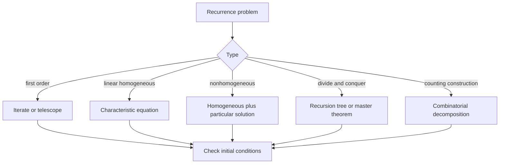

# Recurrence Relations

A recurrence relation defines each term of a sequence from previous terms. It is a natural language for processes that evolve step by step: population models, recursive algorithms, dynamic programming, and counting strings with constraints.


*Figure: Pascal's triangle organizes binomial coefficients, combinations, and recurrence patterns. Image: [Wikimedia Commons](https://commons.wikimedia.org/wiki/File:PascalTriangleAnimated2.gif), Hersfold, public domain.*

Solving a recurrence means replacing the step-by-step definition with a closed form or at least a sharp growth estimate. Modeling and solving are different skills. The modeling step explains why the terms satisfy the recurrence; the solving step uses iteration, characteristic equations, generating functions, recursion trees, or asymptotic methods.

## Definitions

A **recurrence relation** for a sequence $\{a_n\}$ is an equation that expresses $a_n$ in terms of earlier terms. **Initial conditions** specify enough starting values to determine the sequence uniquely.

A recurrence is **linear homogeneous with constant coefficients** if it has the form

$$
a_n=c_1a_{n-1}+c_2a_{n-2}+\cdots+c_ka_{n-k}.
$$

It is **nonhomogeneous** if an extra term depending on $n$ appears:

$$
a_n=c_1a_{n-1}+\cdots+c_ka_{n-k}+F(n).
$$

A **divide-and-conquer recurrence** often has the form

$$
T(n)=aT(n/b)+g(n),
$$

where $a$ subproblems of size $n/b$ are solved and $g(n)$ additional work is done to split or combine.

A **closed form** expresses $a_n$ directly in terms of $n$ without referring to earlier terms. An **asymptotic solution** describes growth, such as $T(n)=\Theta(n\log n)$, even if no exact closed form is needed.

## Key results

For the first-order geometric recurrence

$$
a_n=ca_{n-1},\qquad a_0=A,
$$

iteration gives $a_n=Ac^n$.

For the arithmetic recurrence

$$
a_n=a_{n-1}+d,\qquad a_0=A,
$$

iteration gives $a_n=A+nd$.

For a second-order linear homogeneous recurrence

$$
a_n=c_1a_{n-1}+c_2a_{n-2},
$$

try $a_n=r^n$. This yields the characteristic equation

$$
r^2-c_1r-c_2=0.
$$

If it has distinct roots $r_1,r_2$, then

$$
a_n=\alpha r_1^n+\beta r_2^n
$$

for constants determined by the initial conditions. If there is a repeated root $r$, then

$$
a_n=\alpha r^n+\beta n r^n.
$$

For merge sort,

$$
T(n)=2T(n/2)+cn
$$

solves to $\Theta(n\log n)$ because each recursion level costs $\Theta(n)$ and there are $\log_2 n$ levels. More generally, recursion trees expose whether cost is concentrated near the root, evenly across levels, or near the leaves.

The master theorem for many recurrences $T(n)=aT(n/b)+g(n)$ compares $g(n)$ with $n^{\log_b a}$. It is powerful but not universal; it requires regularity conditions and does not handle every recurrence.

## Visual



| Recurrence | Method | Result pattern |
| --- | --- | --- |
| $a_n=ca_{n-1}$ | iteration | exponential or constant |
| $a_n=a_{n-1}+d$ | telescoping | linear |
| $a_n=a_{n-1}+a_{n-2}$ | characteristic equation | Fibonacci-type |
| $T(n)=2T(n/2)+cn$ | recursion tree | $\Theta(n\log n)$ |
| $a_n=a_{n-1}+F(n)$ | summation | accumulated forcing term |

## Worked example 1: Solve a linear recurrence

**Problem.** Solve

$$
a_n=5a_{n-1}-6a_{n-2},\qquad a_0=2,\quad a_1=5.
$$

**Method.**

1. Try $a_n=r^n$:

$$
r^n=5r^{n-1}-6r^{n-2}.
$$

2. Divide by $r^{n-2}$ for $r\ne0$:

$$
r^2=5r-6.
$$

3. The characteristic equation is

$$
r^2-5r+6=0=(r-2)(r-3).
$$

4. Distinct roots give

$$
a_n=\alpha2^n+\beta3^n.
$$

5. Use $a_0=2$:

$$
\alpha+\beta=2.
$$

6. Use $a_1=5$:

$$
2\alpha+3\beta=5.
$$

7. Subtract twice the first equation from the second:

$$
\beta=1.
$$

Then $\alpha=1$.

**Checked answer.** The solution is

$$
a_n=2^n+3^n.
$$

Checking: $a_0=1+1=2$, $a_1=2+3=5$, and $5(2^{n-1}+3^{n-1})-6(2^{n-2}+3^{n-2})=2^n+3^n$.

## Worked example 2: Count bit strings with no consecutive zeros

**Problem.** Let $a_n$ be the number of bit strings of length $n$ with no consecutive zeros. Find a recurrence and compute $a_5$.

**Method.**

1. Separate valid strings by their ending.
2. If a valid string of length $n$ ends in $1$, then the first $n-1$ bits can be any valid string of length $n-1$. This contributes $a_{n-1}$ strings.
3. If it ends in $0$, then the previous bit must be $1$, so the string ends in $10$. The first $n-2$ bits can be any valid string of length $n-2$. This contributes $a_{n-2}$ strings.
4. Therefore

$$
a_n=a_{n-1}+a_{n-2}\quad(n\ge2).
$$

5. Initial values:

$$
a_0=1
$$

for the empty string, and

$$
a_1=2
$$

for strings $0$ and $1$.

6. Compute:

$$
\begin{aligned}
a_2&=a_1+a_0=3,\\
a_3&=a_2+a_1=5,\\
a_4&=a_3+a_2=8,\\
a_5&=a_4+a_3=13.
\end{aligned}
$$

**Checked answer.** There are $13$ length-$5$ bit strings with no consecutive zeros. A brute-force listing confirms this count.

## Code

```python
def no_consecutive_zeros(n):
    if n == 0:
        return 1
    if n == 1:
        return 2
    prev2, prev1 = 1, 2
    for _ in range(2, n + 1):
        prev2, prev1 = prev1, prev1 + prev2
    return prev1

def solve_second_order(a0, a1, c1, c2, nmax):
    seq = [a0, a1]
    for n in range(2, nmax + 1):
        seq.append(c1 * seq[n - 1] + c2 * seq[n - 2])
    return seq

print([no_consecutive_zeros(n) for n in range(8)])
print(solve_second_order(2, 5, 5, -6, 8))
```

The second function numerically checks the recurrence from the first worked example, producing values of $2^n+3^n$.

## Common pitfalls

- Giving a recurrence without enough initial conditions. A second-order recurrence usually needs two starting values.
- Solving a recurrence but not checking the initial conditions.
- Treating the characteristic-equation method as valid for non-linear recurrences.
- Forgetting the empty object in counting recurrences. Often $a_0=1$ is the clean base case.
- Miscounting ending cases that overlap. In the bit-string example, "ends in $1$" and "ends in $10$" are disjoint and exhaustive.
- Applying the master theorem outside its hypotheses.

A good recurrence solution has three separate checks: the model, the algebra, and the initial conditions. The model explains why the recurrence counts the intended objects or measures the intended running time. The algebra solves that recurrence. The initial conditions pin down the constants. A closed form that satisfies the recurrence but misses $a_0$ or $a_1$ is not the solution to the original problem.

When deriving counting recurrences, make cases disjoint by using the end, beginning, or first special position. For bit strings with no consecutive zeros, "ends in $1$" and "ends in $10$" work because they are disjoint and cover all valid strings. Cases such as "has a $1$ somewhere" and "has a $0$ somewhere" overlap and cannot simply be added.

Characteristic equations apply to linear homogeneous recurrences with constant coefficients. They do not directly solve $a_n=a_{n-1}^2+1$, $a_n=na_{n-1}$, or $a_n=a_{\lfloor n/2\rfloor}+1$. Those require other methods. Before using the characteristic equation, identify the recurrence type and verify that the coefficients are constant and the recurrence is linear in previous terms.

For nonhomogeneous recurrences, solve the homogeneous part and then find one particular solution. For example, $a_n=2a_{n-1}+3$ has homogeneous solution $C2^n$ and a constant particular solution $a=-3$, giving $a_n=C2^n-3$. Substituting back is the fastest way to check the guessed particular form.

For algorithmic recurrences, specify the input sizes covered. Many divide-and-conquer formulas are first solved for powers of two and then extended asymptotically. That is acceptable when stated, but exact formulas may differ for non-powers of two because floors and ceilings change subproblem sizes.

Iteration is often the simplest first attempt. For $a_n=3a_{n-1}+2$, write $a_n=3(3a_{n-2}+2)+2=3^2a_{n-2}+2(3+1)$ and continue until a pattern appears. The pattern can then be proved by induction. This method is especially useful before introducing characteristic equations, because it keeps the meaning of each term visible.

For recurrences that count strings, draw the last few valid objects. If a recurrence predicts $a_3=5$ for no consecutive zeros, list $111,110,101,011,010$. The list confirms both the count and the decomposition. If the list contains an object in two cases or misses an object, the recurrence needs adjustment.

For dynamic programming recurrences, identify the state carefully. A state should contain enough information to make the next decision without remembering the entire history. For example, counting strings with no consecutive zeros needs to know whether the previous bit was zero if building left to right. Choosing a state that is too small gives wrong transitions; choosing one that is too large makes the algorithm harder than necessary.

When a closed form is proposed, verify it in two places: the initial conditions and the recurrence. Checking only the first few terms can miss a formula that matches early values by coincidence. Checking only the recurrence can miss the constants. A complete verification substitutes the formula into the recurrence and separately checks all required initial values.

In algorithm analysis, decide whether the recurrence is exact or asymptotic. Writing $T(n)=2T(n/2)+n$ may ignore floor, ceiling, and base-case details. That is often fine for $\Theta$ bounds, but exact operation counts require a precise domain such as powers of two and a precise base case.

When a recurrence is solved by a table of values, look for both additive and multiplicative patterns. First differences may reveal an arithmetic component; ratios may reveal geometric growth. These observations are not proofs, but they suggest which formal method to try next: telescoping, characteristic equations, or generating functions.

## Connections

- [Induction and recursion](/math/discrete/induction-and-recursion) gives the proof method for recursive definitions.
- [Functions, sequences, and sums](/math/discrete/functions-sequences-sums) introduces sequences and summation notation.
- [Generating functions](/math/discrete/generating-functions) solves recurrences by turning sequences into power series.
- [Algorithms and complexity](/math/discrete/algorithms-and-complexity) uses recurrences to analyze divide-and-conquer algorithms.
- [Counting principles](/math/discrete/counting-principles) supplies combinatorial decompositions that lead to recurrences.
