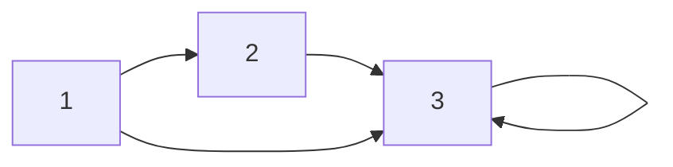

# Relations

A relation records which ordered pairs are connected by a rule. Functions are special relations, but relations are more flexible: one input may be related to many outputs, to no outputs, or to itself. They model databases, directed graphs, modular congruence, ordering, reachability, and equivalence.

Relations are the common language behind many discrete structures. A directed graph is a relation on vertices. A database table is a finite relation among attribute domains. A partial order is a relation with reflexivity, antisymmetry, and transitivity. Because of this, learning relation properties pays off repeatedly.

## Definitions

A **binary relation** from $A$ to $B$ is a subset of $A\times B$. A relation on $A$ is a subset of $A\times A$. If $(a,b)\in R$, write $aRb$.

Important properties for a relation $R$ on $A$:

- Reflexive: $\forall a\in A,\,(a,a)\in R$.
- Irreflexive: $\forall a\in A,\,(a,a)\notin R$.
- Symmetric: $(a,b)\in R\to(b,a)\in R$.
- Antisymmetric: $(a,b)\in R\land(b,a)\in R\to a=b$.
- Asymmetric: $(a,b)\in R\to(b,a)\notin R$.
- Transitive: $(a,b)\in R\land(b,c)\in R\to(a,c)\in R$.

A relation from $A$ to $B$ can be represented by a zero-one matrix $M_R$, where entry $m_{ij}=1$ exactly when $(a_i,b_j)\in R$. A relation on a set can also be represented by a directed graph.

An **$n$-ary relation** is a set of ordered $n$-tuples. Relational databases are built from finite $n$-ary relations, with columns as attributes and rows as records. A **primary key** is a set of attributes whose values identify each tuple uniquely.

The **inverse relation** $R^{-1}$ from $B$ to $A$ is

$$
R^{-1}=\{(b,a):(a,b)\in R\}.
$$

## Key results

The number of relations on an $n$-element set is

$$
2^{n^2}.
$$

Reason: $A\times A$ has $n^2$ ordered pairs. A relation is any subset of that Cartesian product, and a set with $n^2$ elements has $2^{n^2}$ subsets.

Composition of relations works like relational chaining. If $R\subseteq A\times B$ and $S\subseteq B\times C$, then

$$
S\circ R=\{(a,c):\exists b\in B((a,b)\in R\land(b,c)\in S)\}.
$$

For zero-one matrices, composition corresponds to Boolean matrix multiplication:

$$
(M_{S\circ R})_{ij}=\bigvee_k ((M_R)_{ik}\land(M_S)_{kj}).
$$

The transitive closure of a relation $R$ is the smallest transitive relation containing $R$. In graph terms, it connects $a$ to $b$ exactly when there is a directed path from $a$ to $b$.

Closures add the fewest pairs needed to force a property. The reflexive closure adds missing $(a,a)$ pairs. The symmetric closure adds $(b,a)$ whenever $(a,b)$ is present. The transitive closure adds reachability pairs.

## Visual



| Property | Matrix sign | Directed-graph sign |
| --- | --- | --- |
| reflexive | all diagonal entries are $1$ | every vertex has a loop |
| irreflexive | all diagonal entries are $0$ | no vertex has a loop |
| symmetric | matrix equals its transpose | every arrow has a reverse arrow |
| antisymmetric | off-diagonal pairs do not both occur | no two-way arrows between distinct vertices |
| transitive | Boolean square entries are already present | every directed two-step path has a shortcut |

## Worked example 1: Analyze a divisibility relation

**Problem.** Let $A=\{1,2,3,4,6,12\}$ and define $R$ on $A$ by $aRb$ if $a\mid b$. List the relation and determine whether it is reflexive, symmetric, antisymmetric, and transitive.

**Method.**

1. List all pairs where the first number divides the second:

$$
\begin{aligned}
R=\{&(1,1),(1,2),(1,3),(1,4),(1,6),(1,12),\\
&(2,2),(2,4),(2,6),(2,12),\\
&(3,3),(3,6),(3,12),\\
&(4,4),(4,12),\\
&(6,6),(6,12),(12,12)\}.
\end{aligned}
$$

2. Reflexive: every $a\in A$ divides itself, so every $(a,a)$ appears.
3. Symmetric: false. For example, $(2,4)\in R$ but $(4,2)\notin R$.
4. Antisymmetric: true. If $a\mid b$ and $b\mid a$ for positive integers, then $a=b$.
5. Transitive: true. If $a\mid b$ and $b\mid c$, then $b=ak$ and $c=b\ell$, so $c=a(k\ell)$ and $a\mid c$.

**Checked answer.** The relation is reflexive, antisymmetric, and transitive, but not symmetric. It is therefore a partial order.

## Worked example 2: Compute a composition of relations

**Problem.** Let

$$
R=\{(1,a),(1,b),(2,b),(3,c)\}\subseteq \{1,2,3\}\times\{a,b,c\}
$$

and

$$
S=\{(a,x),(b,x),(b,y),(c,z)\}\subseteq \{a,b,c\}\times\{x,y,z\}.
$$

Find $S\circ R$.

**Method.**

1. A pair $(u,v)$ is in $S\circ R$ when there is a middle element $m$ with $(u,m)\in R$ and $(m,v)\in S$.
2. From $(1,a)$ and $(a,x)$, get $(1,x)$.
3. From $(1,b)$ and $(b,x),(b,y)$, get $(1,x)$ and $(1,y)$.
4. From $(2,b)$ and $(b,x),(b,y)$, get $(2,x)$ and $(2,y)$.
5. From $(3,c)$ and $(c,z)$, get $(3,z)$.
6. Remove duplicates.

**Checked answer.**

$$
S\circ R=\{(1,x),(1,y),(2,x),(2,y),(3,z)\}.
$$

The duplicate $(1,x)$ appears through two middle elements, but relations are sets, so it is listed once.

## Code

```python
def compose(R, S):
    return {
        (a, c)
        for (a, b) in R
        for (b2, c) in S
        if b == b2
    }

def transitive_closure(relation):
    closure = set(relation)
    changed = True
    while changed:
        changed = False
        new_pairs = compose(closure, closure) - closure
        if new_pairs:
            closure |= new_pairs
            changed = True
    return closure

R = {(1, "a"), (1, "b"), (2, "b"), (3, "c")}
S = {("a", "x"), ("b", "x"), ("b", "y"), ("c", "z")}
print(compose(R, S))
print(transitive_closure({(1, 2), (2, 3)}))
```

The transitive closure loop repeatedly adds pairs created by two-step paths until no new reachability pairs appear.

## Common pitfalls

- Forgetting that a relation is a set, so duplicate ordered pairs do not count twice.
- Confusing symmetric and antisymmetric. A relation can be neither; equality is both symmetric and antisymmetric.
- Assuming antisymmetric means "not symmetric." That is false.
- Reversing the order in relation composition. In $S\circ R$, apply $R$ first and then $S$.
- Omitting diagonal entries when checking reflexivity.
- Treating transitive closure as the same as symmetric closure. They add different kinds of pairs.

When checking relation properties, use both positive and negative evidence. To prove reflexivity, verify every diagonal pair. To disprove it, give one missing diagonal pair. To prove symmetry, take an arbitrary pair $(a,b)$ in the relation and show $(b,a)$ is also in it. To disprove symmetry, one counterexample pair is enough. Transitivity is usually the most demanding because it concerns every compatible pair of pairs.

Matrix representations make some errors easier to see. Reflexivity is a diagonal condition. Symmetry is equality with the transpose. Antisymmetry means that outside the diagonal, the matrix cannot have $1$s in both positions $(i,j)$ and $(j,i)$. Boolean matrix multiplication helps detect transitivity: if a two-step path exists from $i$ to $j$, then transitivity requires the direct pair $(i,j)$.

Closures should be minimal. A reflexive closure does not add every possible pair; it adds only missing diagonal pairs. A symmetric closure does not add all pairs in both directions; it adds just the reverse of each existing pair. A transitive closure may require repeated additions because one new reachability pair can combine with another pair to force still more pairs.

For database-style relations, remember that rows are tuples and attributes have domains. A relation with columns `(student_id, course, grade)` is not a function unless one set of attributes uniquely determines the others. A primary key is a uniqueness claim, so it must be checked against all tuples and against possible future tuples if the database is meant to enforce a rule.

Relations also clarify why functions are special. A function from $A$ to $B$ is a relation in which every $a\in A$ appears as first coordinate exactly once. If an input appears twice with different outputs, the relation is not a function. If an input is missing, it is not a total function from $A$.

As a final check, translate each relation into at least two representations when the set is finite. List the ordered pairs, draw the directed graph, or write the zero-one matrix. A property that is hard to see in one representation is often obvious in another: symmetry appears as paired arrows, reflexivity as loops, and transitivity as shortcuts for directed two-step paths.

Also separate relation properties from relation names. "Divides" on positive integers is a partial order because it has the right properties; "congruence modulo $m$" is an equivalence relation because it has a different set of properties. The words are not labels to memorize. They are conclusions justified by checking definitions.

When a relation is defined by a formula, test boundary and diagonal cases first. For $aRb$ if $a\lt b$, the diagonal immediately shows it is not reflexive. For $aRb$ if $a\le b$, the diagonal works, but symmetry fails. These quick checks help decide which full proofs or counterexamples are still needed.

For finite relations, count possible ordered pairs before counting relations. If $\vert A\vert =m$ and $\vert B\vert =n$, then $A\times B$ has $mn$ pairs, so there are $2^{mn}$ relations from $A$ to $B$. This simple count reinforces that a relation is a subset, not a rule that must connect every input.

That subset viewpoint also explains why empty and universal relations are legitimate relations.

Both are useful edge cases.

## Connections

- [Sets and set operations](/math/discrete/sets-and-set-operations) supplies Cartesian products and subsets.
- [Functions, sequences, and sums](/math/discrete/functions-sequences-sums) treats functions as special relations.
- [Equivalence relations and partial orders](/math/discrete/equivalence-relations-and-partial-orders) studies two major relation types.
- [Graphs basics](/math/discrete/graphs-basics) represents relations as directed graphs.
- [Modular arithmetic and cryptography](/math/discrete/modular-arithmetic-and-cryptography) uses congruence as an equivalence relation.
