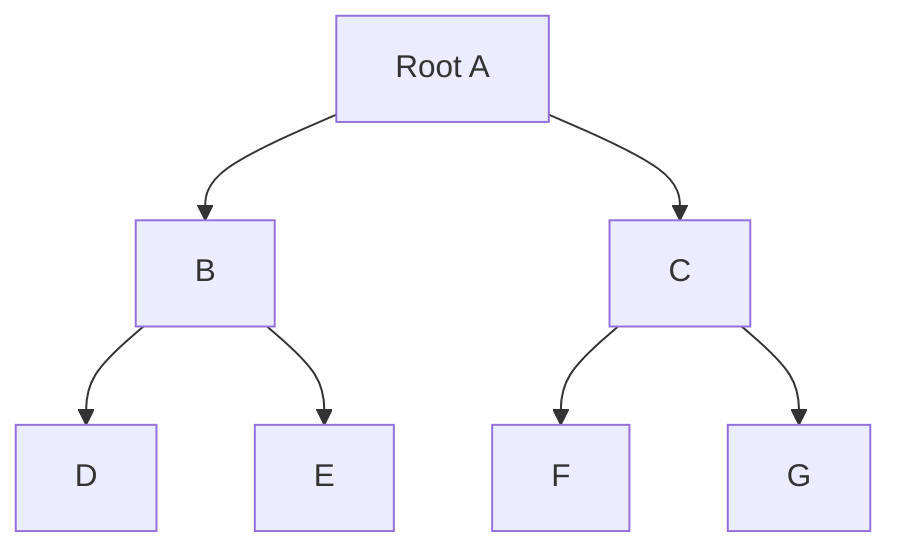

# Trees

Trees are connected graphs with no cycles. They are minimal connected structures: removing any edge disconnects them, and adding any edge creates a cycle. This makes them useful for hierarchy, searching, parsing, routing, spanning networks, and optimization.

Tree arguments are often simpler than general graph arguments because there is exactly one simple path between any two vertices. That uniqueness supports recursive definitions, induction proofs, traversal algorithms, and greedy optimization methods such as minimum spanning trees.


*Figure: Example of a binary tree. Image: [Wikimedia Commons](https://commons.wikimedia.org/wiki/File:Binary_tree.svg), Derrick Coetzee, public domain.*

## Definitions

A **tree** is a connected undirected graph with no simple circuits. A graph with no simple circuits but possibly several components is a **forest**. Each connected component of a forest is a tree.

A **rooted tree** has one distinguished vertex called the root. In a rooted tree, parent, child, sibling, ancestor, descendant, leaf, and internal vertex describe relative positions. The **level** of a vertex is its distance from the root. The **height** is the maximum level.

An **ordered rooted tree** gives an order to the children of each vertex. A **binary tree** is a rooted tree where each vertex has at most two children, usually called left and right. A **full binary tree** is one in which each internal vertex has exactly two children.

A **spanning tree** of a connected graph $G$ is a subgraph that includes every vertex of $G$ and is a tree. For a weighted connected graph, a **minimum spanning tree** is a spanning tree whose total edge weight is as small as possible.

## Key results

For a tree with $n$ vertices, the number of edges is $n-1$.

Proof by induction: the one-vertex tree has $0$ edges. Every finite tree with at least two vertices has a leaf. Remove a leaf and its incident edge; the remaining graph is still a tree with one fewer vertex. By induction it has $n-2$ edges, so the original has $n-1$.

Equivalent characterizations for a finite simple graph $G$ with $n$ vertices:

- $G$ is a tree.
- $G$ is connected and has $n-1$ edges.
- $G$ has no cycles and has $n-1$ edges.
- Between every pair of vertices there is a unique simple path.
- $G$ is minimally connected: removing any edge disconnects it.
- $G$ is maximally acyclic: adding any edge creates a cycle.

Every connected graph has a spanning tree. Repeatedly remove edges that belong to cycles; connectivity is preserved, and the process stops when no cycles remain.

Kruskal's and Prim's algorithms find minimum spanning trees in weighted connected graphs. Their correctness follows from the cut property: for any cut, a lightest edge crossing the cut is safe to add to some minimum spanning tree.

In a full binary tree with $i$ internal vertices, the number of leaves is $i+1$. Counting edges gives one proof: the tree has $i+\ell$ vertices and therefore $i+\ell-1$ edges. It also has $2i$ child edges because each internal vertex has two children. Hence $2i=i+\ell-1$, so $\ell=i+1$.

## Visual



| Traversal | Visit order rule | Common use |
| --- | --- | --- |
| preorder | root, then children/subtrees | copying trees, prefix expressions |
| inorder | left, root, right for binary trees | sorted order in binary search trees |
| postorder | children/subtrees, then root | deleting trees, postfix expressions |
| level order | breadth-first by level | shortest root distance, heaps |
| DFS spanning tree | depth-first exploration | components, cycle analysis |
| MST algorithms | add safe edges | minimum-cost connected network |

## Worked example 1: Use tree edge counts

**Problem.** A tree has $18$ vertices. How many edges does it have? If the sum of degrees of $17$ vertices is $31$, what is the degree of the remaining vertex?

**Method.**

1. A tree with $n$ vertices has $n-1$ edges.
2. With $n=18$:

$$
|E|=18-1=17.
$$

3. By the handshaking theorem, the total degree sum is

$$
2|E|=34.
$$

4. If $17$ vertices have degree sum $31$, the remaining degree is

$$
34-31=3.
$$

**Checked answer.** The tree has $17$ edges, and the remaining vertex has degree $3$. The answer uses both the tree edge formula and the graph handshaking theorem.

## Worked example 2: Run Kruskal's algorithm

**Problem.** Find a minimum spanning tree for vertices $A,B,C,D$ with weighted edges:

$$
AB:1,\quad AC:4,\quad AD:3,\quad BC:2,\quad BD:5,\quad CD:6.
$$

**Method.**

1. Sort edges by weight:

$$
AB(1),\ BC(2),\ AD(3),\ AC(4),\ BD(5),\ CD(6).
$$

2. Add $AB$; it creates no cycle.
3. Add $BC$; it connects $C$ to the component $\{A,B\}$ and creates no cycle.
4. Add $AD$; it connects $D$ to the component and creates no cycle.
5. Now all $4$ vertices are connected with $3$ edges, so the spanning tree is complete.
6. Its total weight is

$$
1+2+3=6.
$$

**Checked answer.** One MST is $\{AB,BC,AD\}$ with total weight $6$. Edges $AC,BD,CD$ are skipped because a spanning tree on $4$ vertices needs exactly $3$ edges, and adding any further edge would create a cycle.

## Code

```python
def preorder(tree, root):
    yield root
    for child in tree.get(root, []):
        yield from preorder(tree, child)

def kruskal(vertices, edges):
    parent = {v: v for v in vertices}

    def find(x):
        while parent[x] != x:
            parent[x] = parent[parent[x]]
            x = parent[x]
        return x

    mst = []
    for w, u, v in sorted(edges):
        ru, rv = find(u), find(v)
        if ru != rv:
            parent[ru] = rv
            mst.append((u, v, w))
    return mst

tree = {"A": ["B", "C"], "B": ["D", "E"], "C": ["F", "G"]}
edges = [(1, "A", "B"), (4, "A", "C"), (3, "A", "D"), (2, "B", "C"), (5, "B", "D"), (6, "C", "D")]
print(list(preorder(tree, "A")))
print(kruskal({"A", "B", "C", "D"}, edges))
```

The traversal function is recursive because a rooted tree is recursively made of a root and its subtrees. Kruskal's algorithm uses disjoint-set representatives to avoid cycles.

## Common pitfalls

- Forgetting that a tree must be connected and acyclic. A forest is acyclic but may be disconnected.
- Using $n-1$ edges as the only tree test without checking connectedness or acyclicity.
- Assuming a rooted tree has an inherent root. Rooting is extra structure.
- Confusing height with number of vertices.
- Thinking every spanning tree is minimum. Minimum spanning trees depend on edge weights.
- Adding an edge in Kruskal's algorithm just because it is light, without checking whether it creates a cycle.

Tree proofs often become easy after choosing the right characterization. If a graph is connected and has $n-1$ edges, it is a tree; if it is acyclic and has $n-1$ edges, it is also a tree. If every pair of vertices has a unique simple path, it is a tree. Switching between these forms can turn a difficult cycle argument into a simple edge-count argument.

Leaves are the engine behind many induction proofs on trees. Every finite tree with at least two vertices has at least two leaves. Removing a leaf preserves the tree property for the remaining graph, while adding a leaf to a smaller tree preserves connectedness and acyclicity. This is why induction on the number of vertices works so naturally for trees.

Rooted-tree terminology depends on the chosen root. The same unrooted tree can produce different parent-child relationships if a different root is selected. Ancestor, descendant, level, and height are therefore not properties of the unrooted graph alone. In algorithms, the root is often determined by a search start vertex or by a data-structure invariant.

For binary search trees, shape matters as much as stored keys. The inorder traversal property gives sorted order for any binary search tree, but efficiency depends on height. A path-shaped tree with $n$ vertices has height $n-1$ and gives linear search time. A balanced tree has height $O(\log n)$ and supports efficient operations.

For minimum spanning trees, equal edge weights can produce multiple valid MSTs. Kruskal's algorithm may choose different safe edges depending on tie-breaking, but the total weight remains minimum. Do not assume uniqueness unless the problem gives a condition, such as all edge weights being distinct.

For spanning tree problems, check the result has exactly $n-1$ edges and is connected. These two facts together prove the result is a tree. If an alleged spanning tree has too many edges, it contains a cycle. If it has too few edges, it cannot connect all vertices. This quick edge-count check catches many algorithm traces.

In rooted trees, traversal order is a convention with consequences. Preorder lists a parent before descendants, postorder lists descendants before the parent, and inorder is special to binary trees. When reconstructing a tree from traversals, state which traversal conventions are being used; otherwise the same sequence can be interpreted differently.

## Connections

- [Graphs basics](/math/discrete/graphs-basics) supplies graph, degree, connectedness, and handshaking definitions.
- [Graph paths, connectivity, and shortest paths](/math/discrete/graph-paths-connectivity-shortest-paths) supplies paths, BFS trees, and DFS trees.
- [Induction and recursion](/math/discrete/induction-and-recursion) supports tree proofs and recursive traversals.
- [Algorithms and complexity](/math/discrete/algorithms-and-complexity) analyzes Kruskal, Prim, and tree traversal costs.
- [Equivalence relations and partial orders](/math/discrete/equivalence-relations-and-partial-orders) connects trees to Hasse diagrams and hierarchies.
