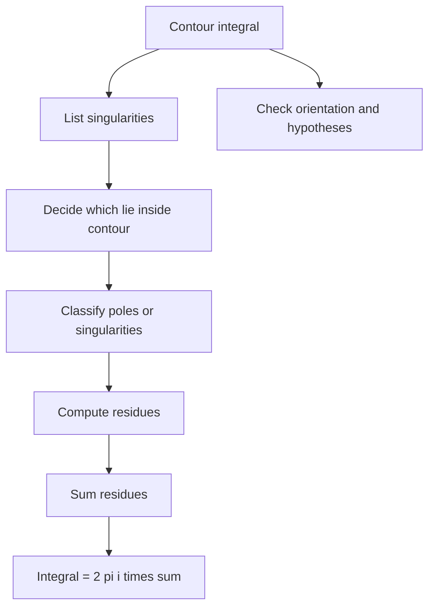

# Complex Integration and Residues

Complex integration is powerful because analyticity controls whole contour integrals. Cauchy's theorem, Cauchy's integral formula, Laurent series, and the residue theorem turn many difficult integrals into local calculations around singularities. The global path matters, but the answer is often determined by a few coefficients.


*Figure: Augustin-Louis Cauchy is a central figure in rigorous limits, continuity, and complex analysis. Image: [Wikimedia Commons](https://commons.wikimedia.org/wiki/File:Augustin_Louis_Cauchy.jpg), Charles H. Reutlinger, public domain.*

Residues are central in engineering mathematics because they evaluate real integrals, invert transforms, and identify modal contributions from poles. The same pole locations that control Laplace transform solutions also control contour-integral contributions in the complex plane.

## Definitions

For a curve $C$ parametrized by $z(t)$, $a\le t\le b$, the complex line integral is

$$
\int_C f(z)\,dz=\int_a^b f(z(t))z'(t)\,dt.
$$

Orientation matters. Reversing the curve changes the sign.

A contour is a piecewise smooth oriented curve. A closed contour starts and ends at the same point.

An isolated singularity of $f$ at $z_0$ is a point where $f$ is not analytic but is analytic in a punctured neighborhood around $z_0$.

A Laurent series near an isolated singularity has the form

$$
f(z)=\sum_{n=-\infty}^{\infty}a_n(z-z_0)^n.
$$

The residue is the coefficient of $(z-z_0)^{-1}$:

$$
\operatorname{Res}(f,z_0)=a_{-1}.
$$

For a simple pole,

$$
\operatorname{Res}(f,z_0)=\lim_{z\to z_0}(z-z_0)f(z).
$$

## Key results

Cauchy's integral theorem says that if $f$ is analytic in a simply connected domain and $C$ is a closed contour in that domain, then

$$
\oint_C f(z)\,dz=0.
$$

Cauchy's integral formula says that if $f$ is analytic inside and on a positively oriented simple closed contour $C$, and $z_0$ is inside $C$, then

$$
f(z_0)=\frac{1}{2\pi i}\oint_C\frac{f(z)}{z-z_0}\,dz.
$$

The derivative version is

$$
f^{(n)}(z_0)=\frac{n!}{2\pi i}\oint_C\frac{f(z)}{(z-z_0)^{n+1}}\,dz.
$$

These formulas show that analytic functions have derivatives of all orders.

The residue theorem states that if $f$ is analytic inside and on $C$ except for isolated singularities $z_1,\ldots,z_m$ inside $C$, then

$$
\oint_C f(z)\,dz=2\pi i\sum_{k=1}^m\operatorname{Res}(f,z_k).
$$

Singularities are classified by Laurent series. A removable singularity has no negative-power terms. A pole has finitely many negative-power terms. An essential singularity has infinitely many negative-power terms. For a pole of order $m$,

$$
\operatorname{Res}(f,z_0)=\frac{1}{(m-1)!}
\lim_{z\to z_0}\frac{d^{m-1}}{dz^{m-1}}
\left[(z-z_0)^m f(z)\right].
$$

Contour choice is part of the method. Rational integrals over the real line often use semicircular contours. Trigonometric integrals over $0$ to $2\pi$ often use $z=e^{it}$, so the unit circle becomes the contour and sine and cosine become rational functions of $z$.

Jordan-type estimates show when integrals over large arcs vanish. The residue theorem does not by itself justify discarding an arc; one must estimate the integrand on that arc. This is a common source of incomplete real-integral solutions.

Cauchy's theorem can be interpreted as a path-independence result. If a function is analytic on a simply connected domain, then the integral from one point to another does not depend on the path, because any two paths enclose a region where the closed contour integral is zero. This is the complex analog of conservative vector fields, but analyticity is a very strong condition that makes the result especially useful.

Cauchy's integral formula is more than an integration trick. It says values inside a contour are determined by boundary values. The derivative formula then says all derivatives are also determined by boundary values. This rigidity explains why analytic functions behave so differently from general real differentiable functions and why singularities carry so much information.

Residues are local. To compute a contour integral, one does not need the full Laurent series everywhere, only the coefficient of $(z-z_0)^{-1}$ at each enclosed singularity. For rational functions with simple poles, the limit formula is usually fastest. For products involving exponentials, sines, or cosines, a short series expansion may be cleaner.

The residue theorem also clarifies inverse transforms. In a Bromwich inversion or Fourier inversion problem, poles of the transformed function contribute exponential or oscillatory terms. The real parts of pole locations determine decay or growth, while imaginary parts determine oscillation. This is the complex-analysis version of the characteristic-root viewpoint from ODEs.

The coefficient $a_{-1}$ is special because every other Laurent power integrates to zero around a small circle. Parametrize $z-z_0=re^{it}$. The integral of $(z-z_0)^n\,dz$ over the circle vanishes for $n\ne -1$, while the $n=-1$ term gives $2\pi i$. This is the local reason residues control contour integrals.

When singularities lie on the contour, principal value methods or indentation contours may be needed. Those are different theorems with additional hypotheses and sign conventions. In an introductory setting, the safest response is to note that the standard residue theorem does not apply directly and then modify the contour carefully if the problem calls for it.

For trigonometric integrals, the substitution $z=e^{it}$ uses

$$
\cos t=\frac{1}{2}\left(z+\frac{1}{z}\right),\qquad
\sin t=\frac{1}{2i}\left(z-\frac{1}{z}\right),\qquad
dt=\frac{dz}{iz}.
$$

The extra factor $1/(iz)$ is easy to forget and changes residues.

For rational real integrals, the choice of upper or lower half-plane can depend on exponential factors. If the integrand contains $e^{iaz}$, the sign of $a$ determines which half-plane gives decay on the arc. Choosing the wrong half-plane can make the arc estimate fail even if the pole calculation is otherwise correct.

## Visual



| Singularity type | Laurent behavior | Residue method |
|---|---|---|
| Removable | No negative powers after simplification | Residue $0$ |
| Simple pole | One negative power | $\lim (z-z_0)f(z)$ |
| Pole of order $m$ | Powers down to $(z-z_0)^{-m}$ | Derivative formula |
| Essential | Infinitely many negative powers | Series coefficient extraction |

## Worked example 1: Residue theorem on a circle

Problem. Compute

$$
\oint_{|z|=2}\frac{e^z}{z(z-1)}\,dz.
$$

Method.

1. Identify singularities:

$$
z=0,\qquad z=1.
$$

2. Both are inside $\vert z\vert =2$ and both are simple poles.

3. Residue at $0$:

$$
\operatorname{Res}(f,0)=\lim_{z\to 0}z\frac{e^z}{z(z-1)}
=\lim_{z\to 0}\frac{e^z}{z-1}=-1.
$$

4. Residue at $1$:

$$
\operatorname{Res}(f,1)=\lim_{z\to 1}(z-1)\frac{e^z}{z(z-1)}
=\lim_{z\to 1}\frac{e^z}{z}=e.
$$

5. Sum residues:

$$
-1+e=e-1.
$$

6. Apply the residue theorem:

$$
\oint_{|z|=2}\frac{e^z}{z(z-1)}\,dz=2\pi i(e-1).
$$

Answer.

$$
2\pi i(e-1).
$$

Check. If the contour had radius less than $1$, the pole at $1$ would not contribute.

The example also shows why listing singularities before computing residues is good practice. The residue at a pole outside the contour may be perfectly valid locally, but it has no contribution to that particular contour integral. A correct residue calculation can still lead to a wrong integral if the inside-outside decision is wrong.

## Worked example 2: Real integral by residues

Problem. Evaluate

$$
\int_{-\infty}^{\infty}\frac{dx}{x^2+1}.
$$

Method.

1. Consider

$$
f(z)=\frac{1}{z^2+1}=\frac{1}{(z-i)(z+i)}.
$$

2. Use a large semicircle in the upper half-plane. The only pole inside is $z=i$.

3. Compute the residue:

$$
\operatorname{Res}(f,i)=\lim_{z\to i}(z-i)\frac{1}{(z-i)(z+i)}
=\frac{1}{2i}.
$$

4. The residue theorem gives the contour integral:

$$
\oint f(z)\,dz=2\pi i\cdot \frac{1}{2i}=\pi.
$$

5. The integral over the large arc tends to zero because $\vert f(z)\vert \le 1/(R^2-1)$ on the arc for large $R$, while arc length is $\pi R$.

6. Therefore the real-axis integral equals the contour integral limit.

Answer.

$$
\int_{-\infty}^{\infty}\frac{dx}{x^2+1}=\pi.
$$

Check. This matches the elementary antiderivative $\arctan x$ from $-\infty$ to $\infty$.

This integral is intentionally simple because the contour method can be checked against real calculus. For integrals without elementary antiderivatives, the same structure applies: choose a contour, identify enclosed singularities, compute residues, and justify that the added contour pieces vanish or have known limits.

## Code

```python
import sympy as sp

z = sp.symbols("z")
f = sp.exp(z) / (z * (z - 1))

res0 = sp.residue(f, z, 0)
res1 = sp.residue(f, z, 1)
integral = 2 * sp.pi * sp.I * (res0 + res1)

print(res0, res1)
print(sp.simplify(integral))
```

Symbolic residue tools are good for checking algebra, but they do not choose contours or verify arc estimates. Those analytic decisions remain part of the solution.

When using software, always specify the expansion point. A function can have several singularities, and the residue is different at each one. Software can also return residues at removable singularities as zero after simplification, which is correct but may hide the need to simplify the integrand manually in a written solution.

## Common pitfalls

- Including poles outside the contour in the residue sum.
- Forgetting orientation; clockwise contours introduce a negative sign.
- Using the simple-pole formula at a higher-order pole.
- Assuming an arc integral vanishes without estimating it.
- Ignoring singularities on the contour; the standard residue theorem requires them off the path.
- Confusing Taylor series with Laurent series near singularities.
- Dropping factors from the substitution $z=e^{it}$ in trigonometric integrals, especially $dz=iz\,dt$.
- Forgetting that removable singularities have residue zero after simplification.
- Treating the residue theorem as if it applies to nonclosed paths without adding a closing contour.
- Forgetting to check whether the function is analytic on the contour itself.
- Choosing a contour that crosses a branch cut without defining the branch.
- Ignoring the contribution of small indentation arcs around poles on the real axis in principal-value problems.
- Summing residues with the wrong sign after reversing contour orientation.
- Forgetting that poles hidden by cancellation may be removable after simplification.
- Overrounding pole locations.

## Connections

- [Complex Functions and Analyticity](/math/engineering-math/complex-functions-and-analyticity)
- [Laplace Transform](/math/engineering-math/laplace-transform)
- [Fourier Integrals and Transforms](/math/engineering-math/fourier-integrals-and-transforms)
- [Laplace Equation and Potential](/math/engineering-math/laplace-equation-and-potential)
