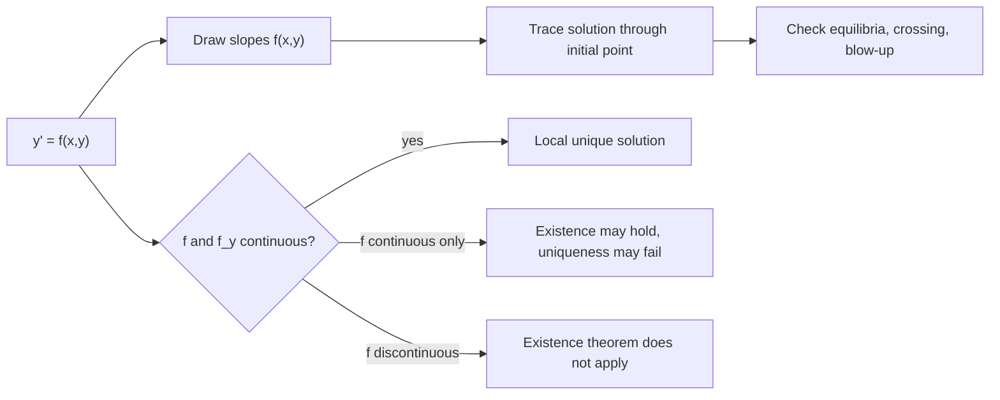

# Direction Fields and Existence

Direction fields connect the equation $y'=f(x,y)$ to the geometry of its solutions. At each point $(x,y)$ in the plane, the value $f(x,y)$ gives the slope of any solution curve that passes through that point. Before solving symbolically, a direction field can reveal equilibrium solutions, blow-up, attraction, repulsion, and whether a proposed formula has the right qualitative behavior.


*Figure: A planar vector field shows how direction and magnitude vary from point to point. Image: [Wikimedia Commons](https://commons.wikimedia.org/wiki/File:Vector_field.svg), Fibonacci, public domain.*

Existence and uniqueness theorems explain when an initial value problem is well posed. They do not usually give the solution, but they tell us whether one solution curve should pass through a starting point or whether several curves might pass through the same point. This is essential in engineering modeling because a deterministic model should usually produce a unique future from a specified present state.

## Definitions

For an explicit first-order ODE

$$
y'=f(x,y),
$$

a direction field, or slope field, assigns to each point $(x,y)$ a short line segment of slope $f(x,y)$. A solution curve is tangent to these segments at every point it crosses.

An initial value problem is

$$
y'=f(x,y),\qquad y(x_0)=y_0.
$$

The function $f$ is the velocity field in the $(x,y)$ phase picture. When $f$ depends only on $y$, the equation is autonomous:

$$
y'=f(y).
$$

The zeros of $f(y)$ are equilibrium solutions. If $f(y_*)=0$, then $y(x)=y_*$ is a constant solution.

Euler's method approximates the solution by stepping along the local slope. With step size $h$,

$$
\begin{aligned}
x_{n+1}&=x_n+h,\\
y_{n+1}&=y_n+h f(x_n,y_n).
\end{aligned}
$$

This is a numerical version of following the direction field.

## Key results

The basic existence theorem says that if $f$ is continuous in a rectangle around $(x_0,y_0)$, then at least one local solution exists. The stronger existence and uniqueness theorem says that if both $f$ and $f_y$ are continuous in such a rectangle, then exactly one local solution passes through $(x_0,y_0)$.

The word local matters. The theorem may guarantee a solution near $x_0$ even though the solution later leaves the rectangle, hits a singularity, or becomes unbounded. For example, $y'=y^2$, $y(0)=1$, has solution $y=1/(1-x)$, which exists only for $x\lt 1$ despite the smooth right side.

Uniqueness has a geometric meaning: solution curves cannot cross in a region where the uniqueness hypotheses hold. If two different curves crossed at the same point, the same initial condition would have two futures. This crossing rule is often the fastest way to reject an incorrect sketch.

Nonuniqueness commonly appears when $f_y$ is not continuous or when $f$ is not Lipschitz in $y$. The classic example is

$$
y'=\sqrt{|y|},\qquad y(0)=0.
$$

The zero solution is valid, but so are solutions that remain zero for a while and then peel away. The direction field alone may look harmless near the axis, so the theorem's hypotheses provide a sharper warning.

For autonomous equations, a phase line summarizes all solution directions. Mark the equilibria on the $y$-axis and test the sign of $f(y)$ between them. Positive sign means arrows upward as $x$ increases; negative sign means arrows downward. Stable equilibria attract nearby solutions, unstable equilibria repel them, and semistable equilibria attract from one side and repel from the other.

Euler's method has local truncation error of order $h^2$ and global error of order $h$ under typical smoothness assumptions. That means halving $h$ usually halves the accumulated error. This is useful for estimates, but Euler's method can behave poorly on stiff equations or over long intervals. Direction fields are qualitative; numerical values still need step-size checks.

Isoclines make slope fields easier to draw by hand. An isocline is a curve on which $f(x,y)$ has a constant value $c$. Along that curve, every field segment has slope $c$. For the equation $y'=x-y$, the isoclines are lines $x-y=c$, or $y=x-c$. Drawing a few isoclines gives the field's structure without computing a separate slope at every grid point.

Nullclines are especially important. In a first-order scalar equation, a nullcline is a curve where $y'=0$. A solution crossing such a curve has a horizontal tangent. In autonomous equations the nullclines are exactly the equilibrium levels, but in nonautonomous equations they can move with $x$. A nullcline is not automatically a solution curve unless the right side remains zero along that curve in the way the differential equation requires.

Comparison ideas also come from the direction field. If two solution curves start ordered and uniqueness holds, they cannot cross, so their order is preserved as long as both remain in the same uniqueness region. This is often used to bound complicated solutions between simpler ones. For instance, if a model has a nonlinear drag term that is difficult to solve exactly, one can compare it with a linear drag model to estimate decay.

The theorem's hypotheses are sufficient, not necessary. A problem can have a unique solution even if the standard condition on $f_y$ fails, and a problem can be useful even if the theorem does not apply at a few exceptional points. The practical habit is to state what the theorem guarantees, then use direct checking or modeling information for points outside its reach.

When using a direction field as a diagnostic, check three features. First, the initial tangent should match $f(x_0,y_0)$. Second, a solution should flatten near attracting equilibria or nullclines. Third, any claimed explicit solution should follow the same monotonicity and concavity suggested by nearby field segments. These checks catch many algebra mistakes before substitution.

## Visual



| Situation | What to inspect | Qualitative consequence |
|---|---|---|
| $f(y_*)=0$ | Horizontal phase-line mark | Constant solution $y=y_*$ |
| $f_y$ continuous | Uniqueness hypotheses | Solution curves do not cross |
| $f$ discontinuous | Breaks in slope field | Existence may fail at that point |
| Large $\vert f\vert $ | Very steep field segments | Rapid change or possible blow-up |
| Euler step too large | Numerical path cuts across slopes | Apparent behavior may be artificial |

## Worked example 1: Phase line for logistic growth

Problem. Analyze the autonomous equation

$$
y'=0.4y\left(1-\frac{y}{10}\right).
$$

Method.

1. Find equilibria:

$$
0.4y\left(1-\frac{y}{10}\right)=0.
$$

Thus

$$
y=0\quad \text{or}\quad y=10.
$$

2. Test intervals.

For $y\lt 0$, choose $y=-1$:

$$
0.4(-1)(1+0.1)<0,
$$

so arrows point downward.

For $0\lt y\lt 10$, choose $y=5$:

$$
0.4(5)(1-0.5)>0,
$$

so arrows point upward.

For $y\gt 10$, choose $y=11$:

$$
0.4(11)(1-1.1)<0,
$$

so arrows point downward.

3. Determine stability. Arrows point away from $0$ on both sides, so $0$ is unstable. Arrows point toward $10$ from both sides, so $10$ is stable.

Answer. Positive initial data below $10$ increase toward $10$, while positive initial data above $10$ decrease toward $10$.

Check. The carrying capacity is $10$. The model's long-term behavior matches the interpretation: growth slows as the population approaches the carrying capacity.

## Worked example 2: Existence without uniqueness

Problem. Show that the initial value problem

$$
y'=\sqrt{|y|},\qquad y(0)=0
$$

does not have a unique solution.

Method.

1. Verify the zero solution:

$$
y(x)=0\quad \Rightarrow\quad y'=0,\qquad \sqrt{|y|}=0.
$$

So $y=0$ satisfies the ODE and initial condition.

2. Look for a positive solution for $x\ge 0$. If $y\gt 0$,

$$
y'=\sqrt{y}.
$$

Separate:

$$
\frac{dy}{\sqrt{y}}=dx.
$$

3. Integrate:

$$
2\sqrt{y}=x+C.
$$

4. Use a curve that leaves the origin immediately. With $y(0)=0$,

$$
C=0,
$$

so

$$
\sqrt{y}=\frac{x}{2},\qquad y=\frac{x^2}{4}\quad (x\ge 0).
$$

5. Check:

$$
y'=\frac{x}{2},\qquad \sqrt{y}=\sqrt{\frac{x^2}{4}}=\frac{x}{2}\quad (x\ge 0).
$$

6. More generally, for any delay $a\ge 0$,

$$
y(x)=
\begin{cases}
0,&0\le x\le a,\\
\dfrac{(x-a)^2}{4},&x>a
\end{cases}
$$

is also a solution.

Answer. The problem has infinitely many solutions, so uniqueness fails.

Check. The derivative of $f(y)=\sqrt{\vert y\vert }$ is unbounded near $y=0$, so the usual uniqueness hypothesis is not satisfied.

## Code

```python
import numpy as np

def euler(f, x0, y0, h, n):
    xs = [x0]
    ys = [y0]
    x, y = x0, y0
    for _ in range(n):
        y = y + h * f(x, y)
        x = x + h
        xs.append(x)
        ys.append(y)
    return np.array(xs), np.array(ys)

def logistic(x, y):
    return 0.4 * y * (1.0 - y / 10.0)

xs, ys = euler(logistic, 0.0, 2.0, h=0.1, n=100)
print(ys[-1])
```

## Common pitfalls

- Treating the existence theorem as a global theorem. It only guarantees a solution near the initial point.
- Forgetting that uniqueness requires more than continuity of $f$; a condition such as continuity of $f_y$ or a Lipschitz condition in $y$ is needed.
- Drawing solution curves that cross in a region where uniqueness holds.
- Inferring stability from the location of equilibria alone. The signs of $f(y)$ between equilibria determine the arrows.
- Using Euler's method with a large step size and trusting the plot without checking convergence as $h$ decreases.
- Ignoring singular lines such as $x=0$ or $y=0$ when the formula for $f$ contains denominators.
- Calling a horizontal tangent an equilibrium in a nonautonomous equation. A moving nullcline only marks where the instantaneous slope is zero.
- Forgetting to report the interval over which a numerical or qualitative conclusion is being made.

## Connections

- [First-Order ODEs](/math/engineering-math/first-order-odes)
- [Numerical Methods Overview](/math/engineering-math/numerical-methods-overview)
- [Systems of ODEs and Phase Planes](/math/engineering-math/systems-of-odes-and-phase-plane)
- [Second-Order Linear ODEs](/math/engineering-math/second-order-linear-odes)
