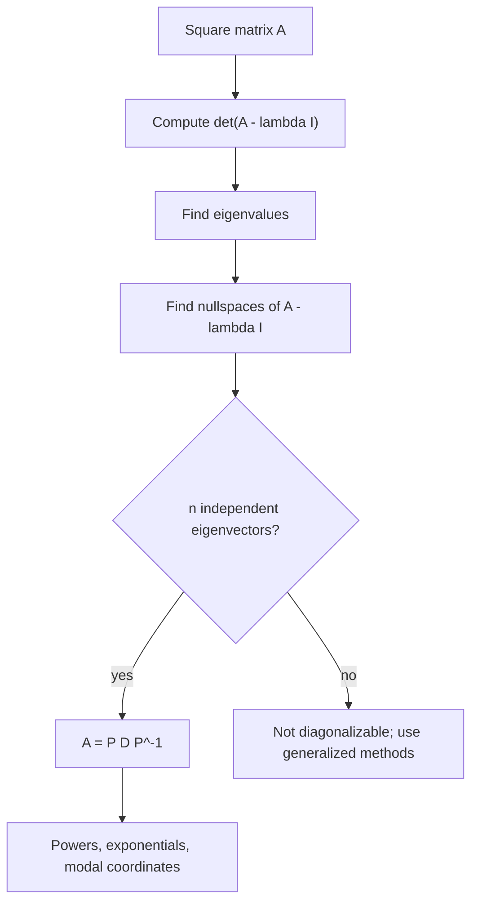

# Eigenvalues and Diagonalization

Eigenvalues identify directions that a linear transformation stretches without turning. If $A\mathbf{v}=\lambda\mathbf{v}$, the vector $\mathbf{v}$ keeps its direction and the scalar $\lambda$ gives the stretch factor. This idea organizes vibration modes, stability of ODE systems, Markov chains, principal axes, and many numerical algorithms.

Diagonalization is powerful because it replaces a coupled linear map with independent scalar actions along eigenvector directions. When a matrix can be diagonalized, powers, exponentials, and recurrence formulas become much easier. When it cannot, generalized eigenvectors and Jordan or Schur forms explain what replaces the ideal picture.

## Definitions

An eigenvalue of a square matrix $A$ is a scalar $\lambda$ such that

$$
A\mathbf{v}=\lambda\mathbf{v}
$$

for some nonzero vector $\mathbf{v}$. The vector $\mathbf{v}$ is an eigenvector. Equivalently,

$$
(A-\lambda I)\mathbf{v}=\mathbf{0},
$$

so $\lambda$ must satisfy

$$
\det(A-\lambda I)=0.
$$

The polynomial

$$
p_A(\lambda)=\det(A-\lambda I)
$$

is the characteristic polynomial. The algebraic multiplicity of an eigenvalue is its multiplicity as a root of $p_A$. The geometric multiplicity is the dimension of its eigenspace.

A matrix is diagonalizable if there is an invertible matrix $P$ and a diagonal matrix $D$ such that

$$
A=PDP^{-1}.
$$

The columns of $P$ are eigenvectors, and the diagonal entries of $D$ are the corresponding eigenvalues.

## Key results

An $n\times n$ matrix is diagonalizable if it has $n$ linearly independent eigenvectors. Distinct eigenvalues always have linearly independent eigenvectors, so a matrix with $n$ distinct eigenvalues is diagonalizable. Repeated eigenvalues require checking geometric multiplicity.

If $A=PDP^{-1}$, then

$$
A^k=PD^kP^{-1}
$$

for nonnegative integers $k$. Also,

$$
e^{At}=Pe^{Dt}P^{-1},
$$

where $e^{Dt}$ is diagonal with entries $e^{\lambda_i t}$. This is why diagonalization is so useful for linear ODE systems.

Trace and determinant are linked to eigenvalues:

$$
\operatorname{tr}(A)=\lambda_1+\cdots+\lambda_n,\qquad
\det(A)=\lambda_1\cdots\lambda_n,
$$

counting algebraic multiplicity over the complex numbers. For $2\times2$ systems, these two quantities help classify phase portraits quickly.

Symmetric real matrices have especially good behavior. The spectral theorem says that a real symmetric matrix has real eigenvalues and an orthonormal basis of eigenvectors. Thus it can be orthogonally diagonalized:

$$
A=QDQ^T.
$$

This is more stable numerically than a general diagonalization because orthogonal matrices preserve lengths.

Defective matrices lack enough eigenvectors. A repeated eigenvalue with geometric multiplicity smaller than algebraic multiplicity prevents diagonalization. Such matrices can still be analyzed, but powers and exponentials include polynomial factors. In ODE systems this creates terms such as $te^{\lambda t}$.

Eigenvalues are basis-independent but matrices are basis-dependent. Changing coordinates by an invertible matrix replaces $A$ with $P^{-1}AP$, a similar matrix. Similar matrices have the same characteristic polynomial, trace, determinant, and eigenvalues. Diagonalization is therefore a change to an eigenvector basis when such a basis exists.

Numerical eigenvalue problems are sensitive to conditioning and structure. Symmetric eigenvalue problems are comparatively stable and common in mechanics because stiffness and mass matrices often lead to symmetric forms. General nonsymmetric matrices can have ill-conditioned eigenvectors, so small perturbations may move eigenvalues or eigenvectors noticeably.

The geometric meaning of an eigenvector is easiest to see in two dimensions. Most vectors change both length and direction when multiplied by $A$. Eigenvectors are the exceptional directions that stay on their own lines. If two independent eigenvector directions exist in the plane, every vector can be decomposed into those directions, and the matrix acts by independently scaling the two components. Diagonalization is exactly this decomposition written in matrix form.

Eigenvalues of powers and inverses follow simple rules when the operations exist. If $A\mathbf{v}=\lambda\mathbf{v}$, then $A^k\mathbf{v}=\lambda^k\mathbf{v}$. If $A$ is invertible, then $A^{-1}\mathbf{v}=\lambda^{-1}\mathbf{v}$. These facts are useful for discrete dynamical systems, where repeated multiplication by a matrix models time steps. The eigenvalue with largest magnitude usually dominates long-term behavior.

For differential equations, the sign of the real part matters more than the magnitude alone. In $\mathbf{x}'=A\mathbf{x}$, a real eigenvalue $\lambda\lt 0$ gives decay, while $\lambda\gt 0$ gives growth. A complex pair $\alpha\pm i\beta$ gives rotation with exponential envelope $e^{\alpha t}$. Thus eigenvalues are a bridge between linear algebra and phase-plane classification.

Diagonalization is not always numerically wise even when it is algebraically possible. If eigenvectors are nearly dependent, the matrix $P$ is ill-conditioned. Then forming $PDP^{-1}$ can amplify roundoff. Algorithms for powers, exponentials, and eigenvalue computations often use Schur decompositions or specialized symmetric methods instead of explicitly forming a poorly conditioned eigenbasis.

The spectral theorem has strong consequences for quadratic forms. If $A$ is real symmetric, then after an orthogonal change of variables,

$$
\mathbf{x}^TA\mathbf{x}=\lambda_1z_1^2+\cdots+\lambda_nz_n^2.
$$

The signs of the eigenvalues determine whether the quadratic form is positive definite, negative definite, indefinite, or semidefinite. This matters in optimization, energy methods, and stability analysis.

In vibration problems, eigenvectors are mode shapes and eigenvalues are related to natural frequencies. Orthogonality of modes means a complicated displacement can be decomposed into independent modal coordinates. In Markov chains, the eigenvalue $1$ represents a steady state under suitable hypotheses, and other eigenvalues determine the rate of convergence toward equilibrium. The same algebra supports very different interpretations.

Repeated eigenvalues require a calm check. A repeated root of the characteristic polynomial is not automatically bad. The identity matrix has one repeated eigenvalue but every nonzero vector is an eigenvector, so it is diagonalizable. A Jordan block has the same repeated eigenvalue but too few eigenvectors. The difference is geometric multiplicity.

## Visual



| Matrix type | Eigenvalue behavior | Diagonalization result |
|---|---|---|
| Distinct eigenvalues | Independent eigenvectors | Diagonalizable |
| Real symmetric | Real eigenvalues, orthogonal eigenvectors | Orthogonally diagonalizable |
| Repeated eigenvalue | Must check eigenspace dimension | May be defective |
| Triangular | Eigenvalues on diagonal | Diagonalizable only if enough eigenvectors |

## Worked example 1: Diagonalizing a two-by-two matrix

Problem. Diagonalize

$$
A=
\begin{bmatrix}
4&1\\
2&3
\end{bmatrix}.
$$

Method.

1. Compute the characteristic polynomial:

$$
\det(A-\lambda I)=
\begin{vmatrix}
4-\lambda&1\\
2&3-\lambda
\end{vmatrix}
=(4-\lambda)(3-\lambda)-2.
$$

2. Expand:

$$
(4-\lambda)(3-\lambda)-2=\lambda^2-7\lambda+10.
$$

3. Factor:

$$
\lambda^2-7\lambda+10=(\lambda-5)(\lambda-2).
$$

4. For $\lambda=5$,

$$
A-5I=
\begin{bmatrix}
-1&1\\
2&-2
\end{bmatrix},
$$

so $-v_1+v_2=0$, and an eigenvector is

$$
\mathbf{v}_1=\begin{bmatrix}1\\1\end{bmatrix}.
$$

5. For $\lambda=2$,

$$
A-2I=
\begin{bmatrix}
2&1\\
2&1
\end{bmatrix},
$$

so $2v_1+v_2=0$, and an eigenvector is

$$
\mathbf{v}_2=\begin{bmatrix}1\\-2\end{bmatrix}.
$$

6. Form

$$
P=
\begin{bmatrix}
1&1\\
1&-2
\end{bmatrix},
\qquad
D=
\begin{bmatrix}
5&0\\
0&2
\end{bmatrix}.
$$

Answer.

$$
A=PDP^{-1}.
$$

Check. Multiplying $AP$ gives columns $5\mathbf{v}_1$ and $2\mathbf{v}_2$, which equals $PD$.

The diagonalization also makes powers transparent. For example, $A^{10}=PD^{10}P^{-1}$, and $D^{10}$ has diagonal entries $5^{10}$ and $2^{10}$. The mode associated with $\lambda=5$ dominates repeated multiplication unless its initial coefficient is zero. This is the same modal dominance idea used in linear systems of ODEs.

## Worked example 2: Detecting a defective matrix

Problem. Determine whether

$$
A=
\begin{bmatrix}
1&1\\
0&1
\end{bmatrix}
$$

is diagonalizable.

Method.

1. Since $A$ is triangular, its eigenvalues are the diagonal entries:

$$
\lambda=1
$$

with algebraic multiplicity $2$.

2. Compute the eigenspace:

$$
A-I=
\begin{bmatrix}
0&1\\
0&0
\end{bmatrix}.
$$

3. Solve

$$
(A-I)\mathbf{v}=\mathbf{0}.
$$

This gives

$$
v_2=0,
$$

while $v_1$ is free.

4. The eigenspace is

$$
\operatorname{span}\left\{\begin{bmatrix}1\\0\end{bmatrix}\right\}.
$$

5. Its dimension is $1$, not $2$.

Answer. The matrix is not diagonalizable.

Check. A $2\times2$ matrix needs two independent eigenvectors for diagonalization. This matrix has only one.

This matrix is the simplest Jordan block. Its powers contain terms that grow like $k$ as well as $1^k$, and its exponential contains a term proportional to $t e^t$. Those polynomial factors are the practical consequence of missing eigenvectors.

## Code

```python
import numpy as np

A = np.array([[4.0, 1.0],
              [2.0, 3.0]])
w, P = np.linalg.eig(A)
D = np.diag(w)

print(w)
print(np.linalg.norm(A @ P - P @ D))
print(np.linalg.cond(P))
```

The residual `A @ P - P @ D` checks the computed eigenpairs. The condition number of `P` gives a warning about how sensitive the eigenvector basis may be. For symmetric matrices, `np.linalg.eigh` is usually preferred because it uses algorithms specialized for Hermitian structure.

## Common pitfalls

- Treating algebraic multiplicity as if it automatically equals the number of eigenvectors.
- Forgetting that eigenvectors cannot be the zero vector.
- Mixing the order of columns in $P$ with the order of eigenvalues in $D$.
- Assuming every real matrix has real eigenvalues.
- Using diagonalization for a defective matrix without checking eigenspace dimensions.
- Computing powers of a matrix by repeated multiplication when a reliable diagonalization or decomposition is available.
- Ignoring eigenvector conditioning in numerical diagonalization.
- Forgetting that symmetric matrices should use orthogonal diagonalization.
- Assuming that similar matrices look numerically similar. A poorly conditioned change of basis can make equivalent algebra unstable in floating-point arithmetic.
- Sorting eigenvalues without sorting the corresponding eigenvectors in the same order.
- Forgetting that complex eigenvectors of a real matrix usually combine into real sine-cosine behavior in ODE applications.
- Reporting approximate eigenvalues without checking residuals $A\mathbf{v}-\lambda\mathbf{v}$.
- Using determinant expansion by hand for large matrices when numerical algorithms are more appropriate.
- Ignoring units in modal interpretations.

## Connections

- [Matrices and Linear Systems](/math/engineering-math/matrices-and-linear-systems)
- [Systems of ODEs and Phase Planes](/math/engineering-math/systems-of-odes-and-phase-plane)
- [Second-Order Linear ODEs](/math/engineering-math/second-order-linear-odes)
- [Numerical Methods Overview](/math/engineering-math/numerical-methods-overview)
