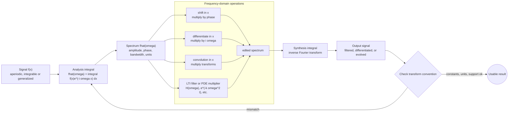

# Fourier Integrals and Transforms

Fourier transforms extend Fourier series from periodic functions to signals on the whole real line. Instead of discrete harmonic frequencies $n\pi/L$, a nonperiodic signal is decomposed into a continuum of frequencies. This is the mathematical foundation of spectra, filtering, diffraction, signal processing, and many PDE solution formulas.

The transform trades localization in time or space for frequency information. Smoothness, decay, shifts, modulation, and convolution all have clean frequency-domain interpretations. Compared with the Laplace transform, the Fourier transform is usually two-sided and emphasizes steady spectral content rather than initial-value algebra.

## Definitions

One common convention for the Fourier transform is

$$
\hat f(\omega)=\mathcal{F}\{f\}(\omega)=\int_{-\infty}^{\infty}f(x)e^{-i\omega x}\,dx.
$$

The inverse transform is

$$
f(x)=\frac{1}{2\pi}\int_{-\infty}^{\infty}\hat f(\omega)e^{i\omega x}\,d\omega,
$$

when the hypotheses for inversion hold.

Linearity is

$$
\mathcal{F}\{af+bg\}=a\hat f+b\hat g.
$$

Translation in $x$ gives modulation in frequency:

$$
\mathcal{F}\{f(x-a)\}=e^{-i\omega a}\hat f(\omega).
$$

Modulation in $x$ gives translation in frequency:

$$
\mathcal{F}\{e^{iax}f(x)\}=\hat f(\omega-a).
$$

Convolution is

$$
(f*g)(x)=\int_{-\infty}^{\infty}f(\xi)g(x-\xi)\,d\xi,
$$

and the convolution theorem is

$$
\mathcal{F}\{f*g\}=\hat f(\omega)\hat g(\omega).
$$

## Key results

The Fourier integral can be viewed as a limiting form of Fourier series as the period tends to infinity. Discrete frequencies become continuously spaced, sums become integrals, and coefficients become a spectral density. This connection explains why the same sine-cosine intuition remains useful.

Differentiation becomes multiplication by frequency:

$$
\mathcal{F}\{f'(x)\}=i\omega\hat f(\omega),
$$

assuming boundary terms vanish. More generally,

$$
\mathcal{F}\{f^{(n)}(x)\}=(i\omega)^n\hat f(\omega).
$$

This property turns constant-coefficient differential equations on infinite domains into algebraic equations in $\omega$.

Scaling obeys

$$
\mathcal{F}\{f(ax)\}=\frac{1}{|a|}\hat f\left(\frac{\omega}{a}\right),\qquad a\ne 0.
$$

Compressing a function in space spreads its transform in frequency. This is one form of the uncertainty principle: a signal cannot be both sharply localized in space and sharply localized in frequency.

Parseval's identity, under this convention, is

$$
\int_{-\infty}^{\infty}|f(x)|^2\,dx
=\frac{1}{2\pi}\int_{-\infty}^{\infty}|\hat f(\omega)|^2\,d\omega.
$$

It says that energy is preserved up to the convention factor. Different transform conventions distribute factors of $2\pi$ differently, so formulas must be used consistently.

Fourier transforms are often interpreted distributionally. The transform of a constant is a multiple of the Dirac delta, and the transform of a pure sinusoid consists of impulses at its frequencies. This is natural for idealized signals that do not decay.

Filtering is multiplication in the frequency domain. A low-pass filter reduces high-frequency components, a high-pass filter reduces low-frequency components, and a band-pass filter keeps a selected frequency range. In the time domain, this multiplication corresponds to convolution with an impulse response.

The transform of a Gaussian is another Gaussian, up to convention-dependent constants. This special self-similarity is one reason Gaussians appear throughout probability, heat kernels, optics, and signal processing. The heat equation on the real line has a Gaussian fundamental solution, and Fourier transforms make that result almost algebraic because each frequency decays independently.

Smoothness and decay trade places. If $f$ has many derivatives that decay well, then $\hat f$ tends to decay rapidly. If $f$ is sharply cut off or discontinuous, the transform decays more slowly and often has oscillatory side lobes. The rectangular pulse example produces a sinc-shaped transform precisely because the pulse has jump discontinuities at its endpoints.

Frequency-domain phase is as important as magnitude. The magnitude $\vert \hat f(\omega)\vert $ tells how much of a frequency is present, but the phase tells how components align in space or time. A shift in the original signal changes phase but not magnitude. Therefore two signals can have the same magnitude spectrum and still look different because their phases differ.

The Fourier transform is often used to solve linear PDEs on infinite domains. For the heat equation $u_t=ku_{xx}$, transforming in $x$ gives

$$
\hat u_t=-k\omega^2\hat u,
$$

so

$$
\hat u(\omega,t)=e^{-k\omega^2t}\hat u(\omega,0).
$$

Each frequency decays at a rate proportional to $\omega^2$, so high-frequency roughness disappears quickly.

The inverse transform of the multiplier $e^{-k\omega^2t}$ is the heat kernel. Convolving the initial data with that kernel gives the solution. This shows the same convolution-multiplication duality from another angle: a PDE evolution can be interpreted as filtering the initial condition by a time-dependent smoothing kernel.

For the wave equation $u_{tt}=c^2u_{xx}$, transforming in $x$ gives an oscillator equation for each frequency:

$$
\hat u_{tt}+c^2\omega^2\hat u=0.
$$

Thus each frequency oscillates with angular frequency $c\vert \omega\vert $. This is the infinite-domain counterpart of Fourier-series mode evolution on a finite interval.

In numerical work, the discrete Fourier transform assumes periodic data over the sampled window. If the first and last sample do not match smoothly, the periodic extension has artificial jumps, which create high-frequency content. Windowing, padding, or choosing a better sampling interval can reduce leakage, but each choice changes the interpretation of the spectrum.

Conventions must be tracked carefully. Some fields put $1/\sqrt{2\pi}$ in both transform and inverse. Some use frequency $\xi$ in cycles per unit rather than angular frequency $\omega$ in radians per unit. Then exponentials use $e^{-2\pi i\xi x}$ instead of $e^{-i\omega x}$. The mathematics is equivalent, but formulas change.

Dimensional units help catch convention mistakes. If $x$ is measured in meters, angular frequency $\omega$ has units of radians per meter, and the transform integral includes a factor of meters from $dx$. Scaling constants are not arbitrary decorations; they preserve the dimensions of inverse reconstruction.

## Visual



This transform diagram makes the analysis/synthesis contract explicit: an aperiodic signal becomes a continuous spectrum, operations are performed as algebraic multipliers or phase factors, and the inverse integral reconstructs the result. The operations subgraph covers the common architecture behind filtering, convolution, differentiation, and PDE evolution. The verification branch is necessary because Fourier conventions and units change the constants even when the structural pipeline is the same.

| Time or space operation | Frequency effect |
|---|---|
| Shift $f(x-a)$ | Multiply by $e^{-i\omega a}$ |
| Modulate $e^{iax}f(x)$ | Shift spectrum to $\omega-a$ |
| Differentiate $f'$ | Multiply by $i\omega$ |
| Convolve $f*g$ | Multiply transforms |
| Compress $f(ax)$ | Stretch spectrum and scale by $1/\vert a\vert $ |

## Worked example 1: Transform of a rectangular pulse

Problem. Find the Fourier transform of

$$
f(x)=
\begin{cases}
1,& |x|\le a,\\
0,& |x|>a.
\end{cases}
$$

Method.

1. Use the definition:

$$
\hat f(\omega)=\int_{-\infty}^{\infty}f(x)e^{-i\omega x}\,dx.
$$

2. Since $f=1$ only on $[-a,a]$,

$$
\hat f(\omega)=\int_{-a}^{a}e^{-i\omega x}\,dx.
$$

3. Integrate for $\omega\ne 0$:

$$
\hat f(\omega)=\left[\frac{e^{-i\omega x}}{-i\omega}\right]_{-a}^{a}
=\frac{e^{-i\omega a}-e^{i\omega a}}{-i\omega}.
$$

4. Use $e^{i\theta}-e^{-i\theta}=2i\sin\theta$:

$$
\hat f(\omega)=\frac{2\sin(\omega a)}{\omega}.
$$

5. At $\omega=0$, compute by continuity:

$$
\hat f(0)=\int_{-a}^{a}1\,dx=2a.
$$

Answer.

$$
\hat f(\omega)=\frac{2\sin(\omega a)}{\omega},\qquad \hat f(0)=2a.
$$

Check. The transform is real and even because the original pulse is real and even.

The zeros occur when $\omega a$ is a nonzero multiple of $\pi$. Widening the pulse increases $a$, which moves the zeros closer together in frequency. This is the width tradeoff in a concrete form: a wider object in space has a narrower central spectral lobe, while a narrower object has a broader spectrum.

## Worked example 2: Solving a transformed differential equation

Problem. Solve on the real line, formally,

$$
-u''+u=f(x).
$$

Method.

1. Take Fourier transforms:

$$
\mathcal{F}\{-u''\}+\mathcal{F}\{u\}=\hat f(\omega).
$$

2. Since $\mathcal{F}\{u''\}=(i\omega)^2\hat u=-\omega^2\hat u$,

$$
\mathcal{F}\{-u''\}=\omega^2\hat u.
$$

3. The transformed equation is

$$
\omega^2\hat u+\hat u=\hat f.
$$

4. Factor:

$$
(1+\omega^2)\hat u=\hat f.
$$

5. Solve:

$$
\hat u(\omega)=\frac{\hat f(\omega)}{1+\omega^2}.
$$

Answer. The solution is obtained by inverse transform:

$$
u=\mathcal{F}^{-1}\left\{\frac{\hat f(\omega)}{1+\omega^2}\right\}.
$$

Check. The factor $1/(1+\omega^2)$ damps high frequencies, so the solution is smoother than the input.

This algebraic multiplier is the transfer function of the operator $-d^2/dx^2+1$ on the real line. Because the denominator never vanishes, every frequency can be solved for. If the denominator had zeros on the real axis, solvability and resonance would require more careful interpretation.

## Code

```python
import numpy as np

N = 1024
L = 40.0
x = np.linspace(-L / 2, L / 2, N, endpoint=False)
dx = x[1] - x[0]
f = (np.abs(x) <= 2.0).astype(float)

omega = 2 * np.pi * np.fft.fftfreq(N, d=dx)
F = dx * np.fft.fft(f)
U = F / (1.0 + omega**2)
u = np.fft.ifft(U / dx).real

print(u.max(), u.min())
```

The discrete FFT uses a finite periodic grid, so scaling and endpoint assumptions differ from the continuous transform. The code is still useful for exploring how division by $1+\omega^2$ suppresses high-frequency content.

The variable `omega` is arranged in FFT order, with nonnegative frequencies followed by negative frequencies. Plotting often requires `fftshift` to center zero frequency. Scaling by `dx` is included to make the discrete sum resemble the continuous integral under this convention.

## Common pitfalls

- Mixing Fourier transform conventions and losing factors of $2\pi$.
- Forgetting that the transform is usually two-sided, unlike the one-sided Laplace transform used for IVPs.
- Treating ideal nondecaying signals as ordinary integrable functions instead of distributions.
- Using FFT output as if it were automatically scaled like the continuous transform.
- Ignoring periodic wraparound when applying FFTs to nonperiodic data.
- Confusing shift in time or space with shift in frequency.
- Assuming high-frequency truncation has no effect near discontinuities.
- Forgetting that differentiation formulas require decay or boundary conditions that remove boundary terms.
- Looking only at magnitude spectra when shifts or delays make phase essential.
- Forgetting that angular frequency and cycles-per-unit frequency differ by a factor of $2\pi$.
- Treating finite-window spectra as if they came from an infinite observation interval.
- Ignoring aliasing when sampled data contain frequencies above the Nyquist frequency.
- Comparing FFT amplitudes across different sample spacings without rescaling.
- Overinterpreting noisy spectral peaks.

## Connections

- [Fourier Series](/math/engineering-math/fourier-series)
- [Laplace Transform](/math/engineering-math/laplace-transform)
- [PDEs by Separation of Variables](/math/engineering-math/pdes-separation-of-variables)
- [Numerical Methods Overview](/math/engineering-math/numerical-methods-overview)
