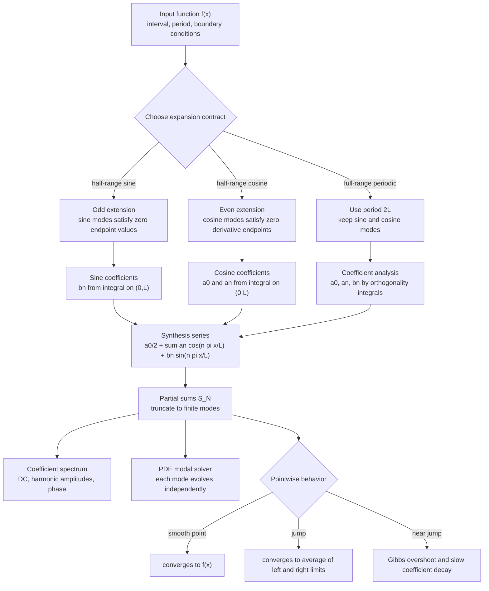

# Fourier Series

Fourier series represent periodic functions as sums of sines and cosines. The engineering interpretation is modal decomposition: a complicated periodic signal, force, temperature distribution, or vibration shape is built from pure harmonic components. Each coefficient measures how much of one frequency is present.


*Figure: Joseph Fourier's work on heat flow led to Fourier series and transforms. Image: [Wikimedia Commons](https://commons.wikimedia.org/wiki/File:Joseph_Fourier.jpg), Jules Boilly, public domain.*

The same idea solves boundary-value PDEs. If the boundary conditions match sine or cosine modes, the initial shape can be expanded in that basis and each mode evolves independently. Fourier series therefore connect approximation, signal analysis, heat flow, wave motion, and Sturm-Liouville theory.

## Definitions

For a $2\pi$-periodic function,

$$
f(x)\sim \frac{a_0}{2}+\sum_{n=1}^{\infty}\left(a_n\cos nx+b_n\sin nx\right).
$$

The coefficients are

$$
\begin{aligned}
a_n&=\frac{1}{\pi}\int_{-\pi}^{\pi}f(x)\cos nx\,dx,\qquad n\ge 0,\\
b_n&=\frac{1}{\pi}\int_{-\pi}^{\pi}f(x)\sin nx\,dx,\qquad n\ge 1.
\end{aligned}
$$

For period $2L$,

$$
f(x)\sim \frac{a_0}{2}+\sum_{n=1}^{\infty}
\left(a_n\cos\frac{n\pi x}{L}+b_n\sin\frac{n\pi x}{L}\right),
$$

where

$$
\begin{aligned}
a_n&=\frac{1}{L}\int_{-L}^{L}f(x)\cos\frac{n\pi x}{L}\,dx,\\
b_n&=\frac{1}{L}\int_{-L}^{L}f(x)\sin\frac{n\pi x}{L}\,dx.
\end{aligned}
$$

A half-range sine series on $0\lt x\lt L$ uses odd extension. A half-range cosine series uses even extension.

## Key results

Orthogonality is the source of the coefficient formulas. On $[-\pi,\pi]$,

$$
\int_{-\pi}^{\pi}\cos mx\cos nx\,dx=0\quad (m\ne n),
$$

and similar identities hold for sine-sine and sine-cosine products. Orthogonality lets each coefficient be computed independently by projection.

If $f$ is even, then all sine coefficients vanish because the product of an even function and $\sin nx$ is odd. If $f$ is odd, then all cosine coefficients and the constant term vanish. Symmetry can cut the work in half and reduce errors.

At a point where $f$ is sufficiently smooth, the Fourier series converges to $f(x)$. At a jump discontinuity, it converges to the midpoint of the one-sided limits:

$$
\frac{f(x^-)+f(x^+)}{2}.
$$

Near jumps, partial sums show Gibbs overshoot. The overshoot does not disappear in height as more terms are added; it becomes narrower. This distinction matters in signal reconstruction and PDE solutions with discontinuous initial data.

Fourier coefficients also measure smoothness. Smooth periodic functions usually have rapidly decaying coefficients. Functions with jumps have slower decay, often like $1/n$. Corner-like derivative jumps give intermediate decay. Coefficient decay is therefore a diagnostic for how many modes are needed.

The partial Fourier sum is the best approximation in the mean-square sense among trigonometric polynomials of the same degree. This does not guarantee uniform accuracy near discontinuities, but it explains why Fourier series are so useful for energy and least-squares approximations.

Boundary conditions determine which family of modes is natural. Fixed-end string or zero-temperature boundary conditions use sine modes because they vanish at endpoints. Insulated-end heat problems use cosine modes because their derivatives vanish at endpoints. Choosing modes that already satisfy the boundary conditions leaves only the initial data to expand.

The coefficient $a_0/2$ is the average value of the function over one period. In signal language it is the DC component. Removing the mean before analyzing oscillations is often useful because it separates the constant offset from the dynamic harmonic content. In heat problems, the average temperature may be the steady mode while higher modes decay.

Fourier series are periodic by construction. A function given only on an interval must be extended periodically once a full-range or half-range choice is made. Discontinuities can appear at the endpoints of the periodic extension even if the original function is smooth inside the interval. These endpoint jumps are responsible for many surprising plots of partial sums.

The sine-cosine form can also be written in amplitude-phase form. A combination

$$
a_n\cos nx+b_n\sin nx
$$

can be expressed as

$$
R_n\cos(nx-\phi_n),
$$

where $R_n=\sqrt{a_n^2+b_n^2}$. This form is common in signal processing because it separates magnitude and phase. The coefficient pair contains the same information; the best representation depends on the application.

Complex Fourier series use exponentials:

$$
f(x)\sim \sum_{n=-\infty}^{\infty}c_ne^{inx}.
$$

This notation is compact and connects directly to Fourier transforms, but the real sine-cosine form is often easier for real boundary-value problems. Euler's formula translates between the two. Complex coefficients also make convolution and frequency shifting cleaner in later analysis.

The convergence theorem is not a license to ignore regularity. The usual elementary result assumes piecewise smoothness or similar hypotheses. Wild functions may require more advanced notions of convergence. Engineering data are usually finite-resolution measurements, so the practical issue is often not whether an infinite series converges, but how many modes should be kept and how noise affects high-frequency coefficients.

Truncation acts like filtering. Keeping only low-frequency terms smooths sharp features, while high-frequency terms represent rapid variation. In numerical PDEs, unresolved high frequencies can produce oscillations or aliasing. Sampling theory explains how discrete data can misrepresent frequencies if the grid is too coarse, a theme that continues in Fourier transform and numerical analysis.

Parseval's identity connects coefficients to energy. For suitable $2\pi$-periodic functions,

$$
\frac{1}{\pi}\int_{-\pi}^{\pi}|f(x)|^2\,dx=\frac{a_0^2}{2}+\sum_{n=1}^{\infty}(a_n^2+b_n^2).
$$

This says that mean-square size in physical space equals size in coefficient space. It justifies interpreting coefficient magnitudes as modal energy.

## Visual



The Fourier-series architecture starts by choosing the periodic contract: full range, odd half-range, or even half-range. The coefficient sublayers use orthogonality to analyze the input, while the synthesis layer reconstructs partial sums and exposes spectra or PDE modes. The convergence branch shows why the same pipeline produces accurate smooth regions but Gibbs behavior near jumps.

| Function feature | Coefficient effect | Practical meaning |
|---|---|---|
| Even symmetry | $b_n=0$ | Cosine series only |
| Odd symmetry | $a_n=0$ | Sine series only |
| Jump discontinuity | Slow decay | Gibbs phenomenon |
| Smooth periodic data | Fast decay | Few modes may suffice |
| Endpoint boundary condition | Select sine or cosine | Built-in PDE constraints |

## Worked example 1: Sine series for $f(x)=x$

Problem. Find the sine series of $f(x)=x$ on $0\lt x\lt \pi$.

Method.

1. Use a half-range sine series:

$$
x\sim \sum_{n=1}^{\infty}b_n\sin nx.
$$

2. Coefficients are

$$
b_n=\frac{2}{\pi}\int_0^\pi x\sin nx\,dx.
$$

3. Integrate by parts with $u=x$ and $dv=\sin nx\,dx$:

$$
du=dx,\qquad v=-\frac{\cos nx}{n}.
$$

4. Then

$$
\begin{aligned}
\int_0^\pi x\sin nx\,dx
&=\left[-\frac{x\cos nx}{n}\right]_0^\pi+\frac{1}{n}\int_0^\pi\cos nx\,dx\\
&=-\frac{\pi\cos n\pi}{n}+\frac{1}{n}\left[\frac{\sin nx}{n}\right]_0^\pi\\
&=-\frac{\pi(-1)^n}{n}.
\end{aligned}
$$

5. Therefore

$$
b_n=\frac{2}{\pi}\left(-\frac{\pi(-1)^n}{n}\right)=\frac{2(-1)^{n+1}}{n}.
$$

Answer.

$$
x\sim 2\sum_{n=1}^{\infty}\frac{(-1)^{n+1}}{n}\sin nx,\qquad 0<x<\pi.
$$

Check. The sine series vanishes at the endpoints in the periodic odd extension, so at $x=\pi$ it converges to the midpoint of the jump, not to $\pi$.

This example is a useful warning about endpoint interpretation. The original problem asks only for $0\lt x\lt \pi$, where the series represents $x$ at interior points. The sine expansion implicitly creates an odd $2\pi$-periodic extension, which jumps from $\pi$ to $-\pi$ at the endpoint. The formula is correct, but the periodic extension must be remembered when evaluating limits at the boundary.

## Worked example 2: Cosine series for $f(x)=1$

Problem. Find the half-range cosine series of $f(x)=1$ on $0\lt x\lt L$.

Method.

1. Write

$$
1\sim \frac{a_0}{2}+\sum_{n=1}^{\infty}a_n\cos\frac{n\pi x}{L}.
$$

2. Compute

$$
a_0=\frac{2}{L}\int_0^L1\,dx=2.
$$

3. For $n\ge 1$,

$$
a_n=\frac{2}{L}\int_0^L\cos\frac{n\pi x}{L}\,dx.
$$

4. Integrate:

$$
a_n=\frac{2}{L}\left[\frac{L}{n\pi}\sin\frac{n\pi x}{L}\right]_0^L.
$$

5. Evaluate endpoints:

$$
\sin n\pi=0,\qquad \sin 0=0.
$$

Thus

$$
a_n=0\quad (n\ge 1).
$$

Answer.

$$
1=\frac{2}{2}+0+0+\cdots.
$$

Check. A constant function is already the zero-frequency cosine mode.

This example looks trivial, but it explains the normalization. The coefficient $a_0$ is $2$, yet the series uses $a_0/2$, so the constant term is $1$. Many coefficient mistakes are off by a factor of two precisely at the zero-frequency term.

## Code

```python
import numpy as np

def sine_series_x(x, N):
    n = np.arange(1, N + 1)[:, None]
    coeff = 2.0 * (-1.0)**(n + 1) / n
    return np.sum(coeff * np.sin(n * x), axis=0)

grid = np.linspace(0.05, np.pi - 0.05, 200)
approx = sine_series_x(grid, 20)
print(np.max(np.abs(approx - grid)))
```

The error is largest near endpoints because the odd periodic extension jumps there. Increasing $N$ improves the interior approximation faster than it removes endpoint oscillation. This is the numerical signature of Gibbs behavior.

For a fair numerical test, avoid evaluating exactly at discontinuities of the periodic extension unless the midpoint value is intended. A grid that includes endpoints may show a large error even though the series is behaving correctly according to the convergence theorem.

## Common pitfalls

- Using full-range coefficient formulas for a half-range problem.
- Forgetting the factor $L$ or $\pi$ in arbitrary-period formulas.
- Assuming a Fourier series equals the original function at a jump rather than the midpoint value.
- Ignoring parity and doing twice as much integration as necessary.
- Choosing cosine modes for fixed-zero endpoint conditions or sine modes for insulated endpoint conditions without checking the boundary behavior.
- Treating pointwise convergence and mean-square convergence as the same concept.
- Plotting too few modes and mistaking truncation artifacts for features of the function.
- Forgetting that the constant term is $a_0/2$, not $a_0$.
- Comparing coefficient magnitudes across different normalizations without adjusting for the interval length.
- Assuming high-frequency coefficients are always meaningful when the input data are noisy or undersampled.
- Forgetting that a half-range expansion chooses an extension outside the original interval.
- Using degrees instead of radians in computational sine and cosine functions.
- Assuming a finite partial sum automatically preserves positivity, monotonicity, or other shape constraints of the original function.
- Dropping units when interpreting frequency; $n$ is an index, while $n\pi/L$ has spatial frequency units.
- Ignoring phase information in sine-cosine pairs.
- Overrounding coefficients.

## Connections

- [Orthogonal Functions and Sturm-Liouville Problems](/math/engineering-math/orthogonal-functions-and-sturm-liouville)
- [Fourier Integrals and Transforms](/math/engineering-math/fourier-integrals-and-transforms)
- [PDEs by Separation of Variables](/math/engineering-math/pdes-separation-of-variables)
- [Wave and Heat Equations](/math/engineering-math/wave-and-heat-equations)
