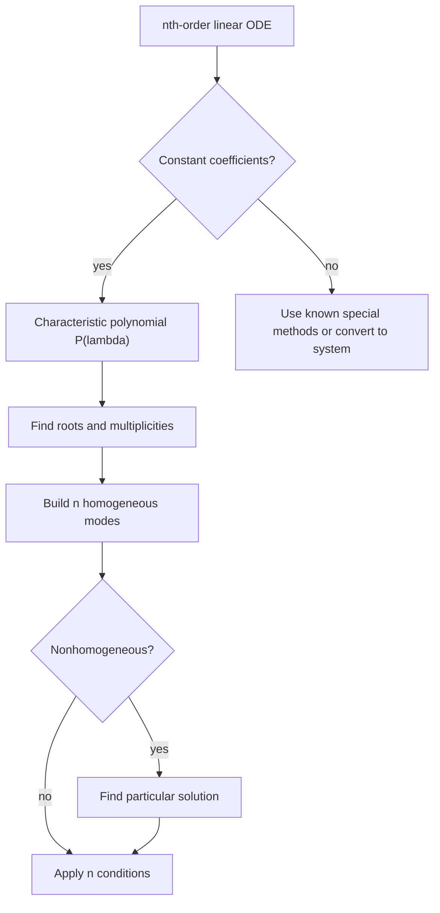

# Higher-Order Linear ODEs

Higher-order linear ODEs generalize the second-order models used for vibration and circuits. They arise directly in beam theory and indirectly when systems are reduced to a single scalar equation. The order tells how many independent pieces of initial data are required and how many independent homogeneous modes must be found.


*Figure: The inverted pendulum is a compact physical model for stability, linearization, and control. Image: [Wikimedia Commons](https://commons.wikimedia.org/wiki/File:2-D_inverted_pendulum.svg), Arne Nordmann, CC BY-SA 3.0.*

The algebra is familiar: linearity gives superposition, constant coefficients lead to a characteristic polynomial, repeated roots produce powers of $x$, and nonhomogeneous terms require a particular solution. The main new issue is bookkeeping. A third-order or fourth-order equation has more roots, more constants, and more possible combinations of real, complex, and repeated factors.

## Definitions

An $n$th-order linear ODE has the form

$$
a_n(x)y^{(n)}+a_{n-1}(x)y^{(n-1)}+\cdots+a_1(x)y'+a_0(x)y=r(x).
$$

On an interval where $a_n(x)\ne 0$, it can be normalized to

$$
y^{(n)}+p_{n-1}(x)y^{(n-1)}+\cdots+p_0(x)y=g(x).
$$

The associated homogeneous equation has $g(x)=0$. A fundamental set contains $n$ linearly independent homogeneous solutions $y_1,\ldots,y_n$. The general homogeneous solution is

$$
y_h=c_1y_1+\cdots+c_ny_n.
$$

For constant coefficients,

$$
a_ny^{(n)}+\cdots+a_1y'+a_0y=0,
$$

the characteristic polynomial is

$$
P(\lambda)=a_n\lambda^n+\cdots+a_1\lambda+a_0.
$$

If $\lambda$ is a root of multiplicity $m$, then the solution list includes

$$
e^{\lambda x},\; xe^{\lambda x},\;\ldots,\;x^{m-1}e^{\lambda x}.
$$

For complex roots $\alpha\pm i\beta$, real solutions are made from

$$
e^{\alpha x}\cos\beta x,\qquad e^{\alpha x}\sin\beta x,
$$

with the same power factors if the root is repeated.

## Key results

If the normalized coefficient functions and $g(x)$ are continuous on an interval, then an initial value problem with data

$$
y(x_0),y'(x_0),\ldots,y^{(n-1)}(x_0)
$$

has a unique solution on that interval. The number of initial conditions must match the order. Supplying fewer data leaves free constants; supplying inconsistent extra data can make the problem impossible.

The Wronskian of $n$ functions is the determinant of the matrix whose rows are derivatives from order $0$ to $n-1$. A nonzero Wronskian at one point proves linear independence for a fundamental set of solutions of a linear homogeneous equation. Abel's formula generalizes the second-order result and shows that the Wronskian is either identically zero or never zero on the interval.

For a nonhomogeneous equation, the complete solution still has the form

$$
y=y_h+y_p.
$$

Undetermined coefficients extends directly when the coefficients are constant and the forcing belongs to the usual finite family of exponentials, polynomials, sines, and cosines. If a trial term overlaps with any homogeneous mode, multiply by $x$ enough times to make it independent. For an $n$th-order equation, overlap can occur with higher multiplicity, so the exponent on $x$ must match the multiplicity of the corresponding root.

The companion-system viewpoint is often the clearest way to understand order. Define

$$
x_1=y,\quad x_2=y',\quad \ldots,\quad x_n=y^{(n-1)}.
$$

Then a scalar $n$th-order equation becomes a first-order system in $n$ variables. The roots of the characteristic polynomial are the eigenvalues of the companion matrix. This connection explains why higher-order scalar equations and systems of first-order ODEs share the same stability language.

Stability is governed by the real parts of the characteristic roots. If every root has negative real part, all homogeneous modes decay. If any root has positive real part, some homogeneous mode grows. If roots lie on the imaginary axis, repeated roots or forcing can produce polynomial growth even when pure exponential growth is absent. Engineering design often focuses on moving roots into the left half-plane.

Boundary conditions can be more delicate than initial conditions. A fourth-order beam equation, for instance, may need displacement and slope conditions at both ends. These conditions create a linear system for the constants. Depending on the load and boundary setup, the system may be well conditioned, singular, or physically meaningful only under compatibility conditions.

The order of an equation should not be confused with the degree of algebraic expressions inside it. The equation $y''+(y')^3=0$ is second order but nonlinear, while $y^{(5)}+2y=0$ is fifth order and linear. The linear theory on this page depends on the unknown function and its derivatives appearing only to the first power and not multiplied together. Once products such as $yy'$ or powers such as $(y'')^2$ appear, superposition no longer applies.

Factoring the characteristic polynomial is the main algebraic bottleneck. Low-degree polynomials may factor by inspection, but higher-degree equations often require numerical roots. That does not change the structure of the solution. A numerical root with small imaginary part should be interpreted carefully, especially if the original coefficients are exact and the imaginary part may be roundoff error. In engineering computation, root locations are often more important than closed forms for the roots.

When initial data are supplied, the constants are found from an $n\times n$ linear system. The coefficient matrix is built by evaluating each mode and its first $n-1$ derivatives at the initial point. This matrix is essentially a Wronskian matrix. If the chosen modes form a fundamental set, the matrix is invertible. If the system is singular, the issue is usually that the modes were not independent or that an arithmetic mistake occurred.

Higher-order equations also expose the difference between mathematical order and physical state dimension. A fourth-order beam equation in space does not mean the beam evolves in time with four independent time states; instead, four spatial boundary conditions are needed to determine a static deflection curve. In contrast, a fourth-order time equation would require initial values for displacement and its first three derivatives. The same algebra can therefore have different physical interpretations.

Nonhomogeneous higher-order equations follow the same pattern as second-order equations, but resonance is easier to undercount. If the forcing is $e^{ax}$ and $a$ is a root of multiplicity $m$ of the characteristic polynomial, the trial must be $Ax^me^{ax}$, not merely $Axe^{ax}$ unless $m=1$. For sinusoidal forcing, check the multiplicity of the corresponding complex roots $a\pm ib$.

In design problems, coefficients may depend on parameters. The characteristic roots then move as the parameter changes. A repeated root often marks a transition between qualitatively different behavior, such as overdamped to underdamped response. A root crossing the imaginary axis marks possible onset of instability. This root-locus viewpoint is a bridge from elementary ODEs to control theory.

## Visual



| Root type | Multiplicity | Real solution contribution |
|---|---:|---|
| Real $\lambda$ | $m$ | $e^{\lambda x}, xe^{\lambda x}, \ldots, x^{m-1}e^{\lambda x}$ |
| Complex $\alpha\pm i\beta$ | $1$ | $e^{\alpha x}\cos\beta x$, $e^{\alpha x}\sin\beta x$ |
| Complex repeated | $m$ | Multiply both sine and cosine modes by $1,x,\ldots,x^{m-1}$ |

## Worked example 1: Third-order homogeneous equation

Problem. Solve

$$
y'''-3y''+3y'-y=0.
$$

Method.

1. Form the characteristic polynomial:

$$
P(\lambda)=\lambda^3-3\lambda^2+3\lambda-1.
$$

2. Recognize the binomial factor:

$$
P(\lambda)=(\lambda-1)^3.
$$

3. The root $\lambda=1$ has multiplicity $3$.

4. Therefore the independent modes are

$$
e^x,\qquad xe^x,\qquad x^2e^x.
$$

5. Write the general solution:

$$
y=(c_1+c_2x+c_3x^2)e^x.
$$

Answer.

$$
y=c_1e^x+c_2xe^x+c_3x^2e^x.
$$

Check. There are three arbitrary constants, matching the third order. Also, the operator is $(D-1)^3$, and each listed mode is killed by three applications of $D-1$.

This example also shows why multiplicity matters physically. The three modes all grow like $e^x$, but the factors $1$, $x$, and $x^2$ give different polynomial weights. For large $x$, the $x^2e^x$ term dominates unless its coefficient is zero.

## Worked example 2: Fourth-order equation with complex roots

Problem. Solve

$$
y^{(4)}+4y''+4y=0.
$$

Method.

1. The characteristic equation is

$$
\lambda^4+4\lambda^2+4=0.
$$

2. Factor as a square:

$$
\lambda^4+4\lambda^2+4=(\lambda^2+2)^2.
$$

3. The roots are

$$
\lambda=\pm i\sqrt{2},
$$

each with multiplicity $2$.

4. For the pair $\pm i\sqrt{2}$ with multiplicity $2$, include sine and cosine modes and multiply by $x$ for the repeated level:

$$
\cos(\sqrt{2}x),\quad \sin(\sqrt{2}x),\quad x\cos(\sqrt{2}x),\quad x\sin(\sqrt{2}x).
$$

Answer.

$$
y=c_1\cos(\sqrt{2}x)+c_2\sin(\sqrt{2}x)+c_3x\cos(\sqrt{2}x)+c_4x\sin(\sqrt{2}x).
$$

Check. The four modes match the fourth order. The factors $x\cos(\sqrt{2}x)$ and $x\sin(\sqrt{2}x)$ are required because the quadratic factor is repeated.

The repeated imaginary roots mean the solution is not merely bounded oscillation. The terms multiplied by $x$ have amplitudes that grow linearly, so a model with these roots is not stable in the bounded-response sense.

## Code

```python
import sympy as sp

lam = sp.symbols("lambda")
P = lam**4 + 4 * lam**2 + 4
print(sp.factor(P))
print(sp.roots(P))

x = sp.symbols("x")
modes = [
    sp.cos(sp.sqrt(2) * x),
    sp.sin(sp.sqrt(2) * x),
    x * sp.cos(sp.sqrt(2) * x),
    x * sp.sin(sp.sqrt(2) * x),
]
for mode in modes:
    residual = sp.diff(mode, x, 4) + 4 * sp.diff(mode, x, 2) + 4 * mode
    print(sp.simplify(residual))
```

## Common pitfalls

- Writing only one solution for a repeated root of multiplicity greater than one.
- Forgetting that repeated complex roots produce repeated sine and cosine modes.
- Providing too few initial conditions for an $n$th-order initial value problem.
- Applying constant-coefficient characteristic methods to variable-coefficient equations without justification.
- Losing the interval restriction created by zeros of the leading coefficient.
- Treating a boundary-value problem as if it has the same automatic uniqueness behavior as an initial value problem.
- Missing the companion-system connection, which is often the easiest way to interpret stability.

## Connections

- [Second-Order Linear ODEs](/math/engineering-math/second-order-linear-odes)
- [Nonhomogeneous ODEs and Applications](/math/engineering-math/nonhomogeneous-odes-and-applications)
- [Systems of ODEs and Phase Planes](/math/engineering-math/systems-of-odes-and-phase-plane)
- [Eigenvalues and Diagonalization](/math/engineering-math/eigenvalues-and-diagonalization)
