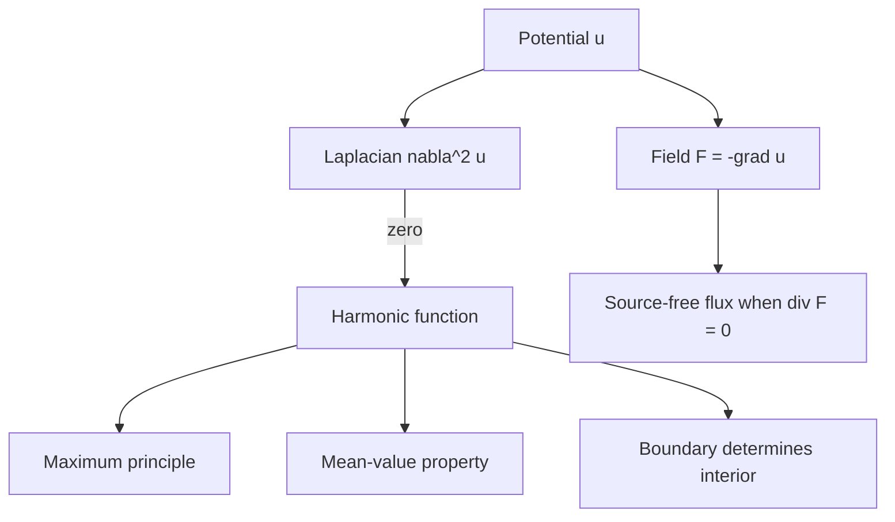

# Laplace Equation and Potential

Laplace's equation describes equilibrium fields with no internal sources. It appears in steady heat conduction, electrostatic potential, gravitational potential, incompressible irrotational flow, and membrane equilibrium. The equation is simple to write but extremely rich because its solutions, called harmonic functions, obey strong geometric restrictions.

Potential theory connects scalar potentials with vector fields. A field such as electric field or velocity can be derived from a potential, and Laplace's equation expresses source-free behavior. In two dimensions, harmonic functions are also tied to analytic complex functions through the Cauchy-Riemann equations.

## Definitions

Laplace's equation in two variables is

$$
u_{xx}+u_{yy}=0.
$$

In three variables it is

$$
u_{xx}+u_{yy}+u_{zz}=0.
$$

Using the Laplacian,

$$
\nabla^2u=0.
$$

A function satisfying Laplace's equation on a region is harmonic.

Poisson's equation includes a source term:

$$
\nabla^2u=f.
$$

For a potential $\phi$, a vector field may be written as

$$
\mathbf{F}=-\nabla\phi
$$

or $\mathbf{F}=\nabla\phi$ depending on convention. The sign is determined by the physical law, such as heat flowing down temperature gradients or electric field pointing in the direction of decreasing electric potential for positive charges.

Boundary conditions are essential. Dirichlet conditions prescribe $u$ on the boundary. Neumann conditions prescribe normal derivative $\partial u/\partial n$. Robin conditions combine both.

## Key results

The maximum principle says that a nonconstant harmonic function on a bounded connected region cannot attain a strict maximum or minimum in the interior. Extremes occur on the boundary. This matches physical intuition: a steady source-free temperature cannot have an isolated hot spot inside the material.

Uniqueness for Dirichlet problems follows from the maximum principle. If two harmonic functions have the same boundary values, their difference is harmonic and zero on the boundary. The maximum principle forces the difference to be zero everywhere.

For Neumann problems, solutions are unique only up to an additive constant because normal derivatives do not determine the absolute potential level. A compatibility condition is also needed: total prescribed flux through the boundary must match total source strength. For pure Laplace Neumann problems with no sources, net boundary flux must be zero.

In rectangular domains, separation of variables gives sine, cosine, and hyperbolic functions. In disks, polar coordinates lead to powers $r^n$ and trigonometric angular modes, or to logarithmic terms if singularities are included. In three-dimensional spherical problems, spherical harmonics appear.

Harmonic functions have the mean-value property: the value at the center of a ball equals the average of the function over the sphere or circle, provided the ball lies inside the domain. This property is another expression of source-free equilibrium.

Potential fields often satisfy both differential and integral laws. If $\mathbf{F}=-\nabla\phi$ and $\nabla^2\phi=0$, then $\nabla\cdot\mathbf{F}=0$ in the source-free region. Flux through closed surfaces is then zero unless a singularity or source lies inside.

Numerical Laplace solvers often rely on finite differences. On a square grid, the equation $u_{xx}+u_{yy}=0$ leads to the update that a grid value is approximately the average of its four nearest neighbors. This discrete averaging mirrors the continuous mean-value property.

Dirichlet boundary data can be interpreted as controlling the entire interior from the boundary. This is why electrostatic shielding and steady temperature problems are boundary-dominated. If the boundary is held at a fixed potential, the source-free interior cannot invent a new extreme value. The shape of the solution is constrained by geometry and boundary values.

Neumann data describe flux rather than potential. In heat conduction, specifying $\partial u/\partial n$ prescribes heat flow through the boundary up to material constants. If every boundary is insulated, the steady temperature can be any constant, so the absolute level is not determined. Only differences or an added normalization such as average temperature fix a unique solution.

The maximum principle is also a stability statement. If boundary measurements are perturbed by at most $\epsilon$, then the harmonic solution inside changes by at most $\epsilon$ under a Dirichlet problem. This makes Laplace boundary-value problems well behaved in the maximum norm, even though computing accurate solutions can still be challenging near corners or singularities.

Corners reduce regularity. A harmonic function in a polygon can have derivative singularities near reentrant corners even when boundary data are smooth. The function remains harmonic inside, but numerical methods may converge more slowly unless the mesh is refined near the corner. Geometry is therefore part of the analysis, not just a drawing.

In two dimensions, harmonic conjugates connect potential and stream functions. If $u$ is harmonic on a simply connected region, one may often find $v$ such that $u+iv$ is analytic. Curves $u=\text{constant}$ and $v=\text{constant}$ form orthogonal families where the gradient is nonzero. This is useful in ideal fluid flow and electrostatic field visualization.

Poisson's equation modifies the picture by adding sources. For steady heat, an internal heat generation term produces $\nabla^2u=f$ after constants are absorbed. Interior maxima may then occur because heat is being produced inside. Distinguishing Laplace from Poisson equations is essential before applying maximum-principle or source-free flux reasoning.

The fundamental solution viewpoint treats point sources as singular potentials. In three dimensions, a potential proportional to $1/r$ is harmonic away from the origin but has a singular source at the origin. This explains why flux through spheres centered at the origin can be nonzero even though the divergence is zero everywhere except the singular point.

## Visual



| Boundary condition | Specifies | Uniqueness behavior |
|---|---|---|
| Dirichlet | Potential value $u$ | Unique under standard hypotheses |
| Neumann | Normal derivative $\partial u/\partial n$ | Unique up to additive constant with compatibility |
| Robin | Linear combination of value and derivative | Often unique with suitable signs |
| Mixed | Different types on boundary pieces | Problem-dependent |

## Worked example 1: Checking harmonicity

Problem. Determine whether

$$
u(x,y)=x^2-y^2+3x
$$

is harmonic.

Method.

1. Compute first and second derivatives in $x$:

$$
u_x=2x+3,\qquad u_{xx}=2.
$$

2. Compute first and second derivatives in $y$:

$$
u_y=-2y,\qquad u_{yy}=-2.
$$

3. Add:

$$
u_{xx}+u_{yy}=2+(-2)=0.
$$

Answer. The function is harmonic on all of $\mathbb{R}^2$.

Check. It is the real part of the analytic function $z^2+3z$, which is another reason it is harmonic.

The gradient $\nabla u=\langle 2x+3,-2y\rangle$ would define a potential field up to sign convention. Since $u$ is harmonic, the divergence of this gradient is zero. That is the vector-calculus form of the same computation: $\nabla\cdot\nabla u=\nabla^2u=0$.

## Worked example 2: Steady heat in a rectangle with one sine boundary

Problem. Solve

$$
u_{xx}+u_{yy}=0,\quad 0<x<L,\quad 0<y<H,
$$

with

$$
u(0,y)=u(L,y)=u(x,0)=0,\qquad u(x,H)=\sin\frac{\pi x}{L}.
$$

Method.

1. From separation for the rectangle, a single top sine mode extends as

$$
u(x,y)=A\sinh\frac{\pi y}{L}\sin\frac{\pi x}{L}.
$$

2. Apply the top boundary condition:

$$
u(x,H)=A\sinh\frac{\pi H}{L}\sin\frac{\pi x}{L}.
$$

3. Match this to

$$
\sin\frac{\pi x}{L}.
$$

4. Therefore

$$
A\sinh\frac{\pi H}{L}=1,
$$

so

$$
A=\frac{1}{\sinh(\pi H/L)}.
$$

Answer.

$$
u(x,y)=
\frac{\sinh(\pi y/L)}{\sinh(\pi H/L)}
\sin\frac{\pi x}{L}.
$$

Check. At $y=0$, the hyperbolic sine is zero. At $y=H$, the quotient is one. At $x=0$ and $x=L$, the sine vanishes.

The solution also respects the maximum principle. The top boundary ranges between $0$ and $1$, while the other boundaries are zero. Inside the rectangle, the harmonic solution stays between these boundary extremes. If a computed approximation overshoots far beyond this range, the discretization or boundary indexing should be checked.

## Code

```python
import numpy as np

def rectangle_mode(x, y, L=1.0, H=1.0):
    return (np.sinh(np.pi * y / L) / np.sinh(np.pi * H / L)) * np.sin(np.pi * x / L)

x = np.linspace(0.0, 1.0, 50)
y = np.linspace(0.0, 1.0, 50)
X, Y = np.meshgrid(x, y)
U = rectangle_mode(X, Y)

print(U.min(), U.max())
print(np.max(np.abs(U[-1, :] - np.sin(np.pi * x))))
```

The code evaluates the single-mode rectangle solution and checks the top boundary. A finite-difference residual could also be computed to confirm that the grid approximation satisfies Laplace's equation away from boundaries.

For a general top boundary, the code would sum several sine modes, each with its own hyperbolic-sine factor. High-frequency boundary modes decay rapidly away from the boundary, which is why harmonic functions smooth boundary oscillations in the interior.

## Common pitfalls

- Forgetting that Laplace's equation is source-free; sources lead to Poisson's equation.
- Expecting interior maxima or minima for nonconstant harmonic functions.
- Treating Neumann boundary data as if they determine the absolute potential constant.
- Ignoring compatibility conditions for pure Neumann problems.
- Using rectangular sine modes in a disk or cylinder where polar modes are natural.
- Losing sign conventions when converting potential to a physical field.
- Applying uniqueness claims without specifying boundary conditions.
- Forgetting that singularities inside the domain invalidate source-free conclusions.
- Treating finite-difference averaging as exact at boundary-adjacent points without applying boundary values correctly.
- Ignoring corner singularities when judging numerical convergence.
- Forgetting that adding a constant to a Neumann solution leaves normal derivatives unchanged.
- Overrounding boundary Fourier coefficients.

## Connections

- [Vector Differential Calculus](/math/engineering-math/vector-differential-calculus)
- [Vector Integral Calculus](/math/engineering-math/vector-integral-calculus)
- [PDEs by Separation of Variables](/math/engineering-math/pdes-separation-of-variables)
- [Complex Functions and Analyticity](/math/engineering-math/complex-functions-and-analyticity)
