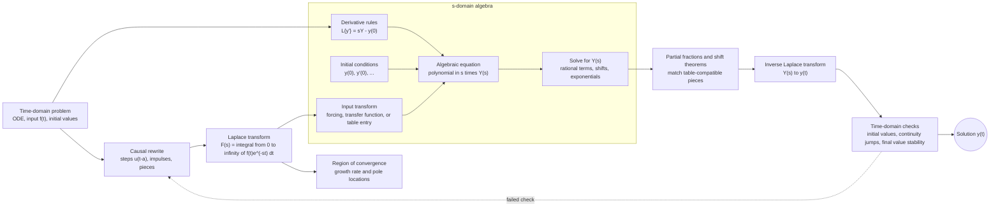

# Laplace Transform

The Laplace transform converts a time-domain function into a function of the complex variable $s$. For linear initial value problems, it turns differentiation into algebra and carries initial conditions into the transformed equation automatically. That is why it is a standard tool for circuits, mechanical vibrations, control systems, discontinuous inputs, and impulses.


*Figure: Pierre-Simon de Laplace is a key figure in probability, transforms, and potential theory. Image: [Wikimedia Commons](https://commons.wikimedia.org/wiki/File:Pierre-Simon_de_Laplace.jpg), Louis Delaistre after Armand-Charles Guilleminot, public domain.*

The transform is also a way of changing perspective. Time-domain convolution becomes multiplication, exponential decay becomes a shift in the $s$-plane, and stability becomes a question about poles. The method is most effective when the system is linear and causal, meaning the behavior begins at $t=0$ and depends only on present and past input.

## Definitions

The one-sided Laplace transform of $f(t)$ is

$$
F(s)=\mathcal{L}\{f(t)\}=\int_0^\infty e^{-st}f(t)\,dt,
$$

where the integral converges for sufficiently large $\operatorname{Re}s$. The inverse transform recovers $f(t)$ from $F(s)$ when the transform is known.

Linearity is

$$
\mathcal{L}\{af+bg\}=aF+bG.
$$

Derivative formulas are

$$
\begin{aligned}
\mathcal{L}\{f'\}&=sF(s)-f(0),\\
\mathcal{L}\{f''\}&=s^2F(s)-sf(0)-f'(0).
\end{aligned}
$$

The unit step function is

$$
u(t-a)=
\begin{cases}
0,&t<a,\\
1,&t\ge a.
\end{cases}
$$

The second shifting theorem is

$$
\mathcal{L}\{u(t-a)f(t-a)\}=e^{-as}F(s).
$$

The convolution of causal functions is

$$
(f*g)(t)=\int_0^t f(\tau)g(t-\tau)\,d\tau,
$$

and

$$
\mathcal{L}\{f*g\}=F(s)G(s).
$$

## Key results

The standard transform method for a linear IVP is direct. Transform every term, insert initial conditions through the derivative formulas, solve for $Y(s)$, decompose into recognizable pieces, and invert. The initial conditions are not applied after the inverse transform; they have already entered the algebra.

Some basic transforms are used constantly:

| $f(t)$ | $F(s)$ | Condition |
|---|---|---|
| $1$ | $1/s$ | $\operatorname{Re}s\gt 0$ |
| $t^n$ | $n!/s^{n+1}$ | $\operatorname{Re}s\gt 0$ |
| $e^{at}$ | $1/(s-a)$ | $\operatorname{Re}s\gt a$ |
| $\cos bt$ | $s/(s^2+b^2)$ | $\operatorname{Re}s\gt 0$ |
| $\sin bt$ | $b/(s^2+b^2)$ | $\operatorname{Re}s\gt 0$ |

The first shifting theorem says

$$
\mathcal{L}\{e^{at}f(t)\}=F(s-a).
$$

It moves the transform in the $s$ variable. The second shifting theorem, involving $u(t-a)$ and $e^{-as}$, delays a signal in time. Confusing these two shifts is one of the most common Laplace errors.

The Dirac delta is an ideal impulse. It is used through the rule

$$
\mathcal{L}\{\delta(t-a)\}=e^{-as}.
$$

Although $\delta$ is not an ordinary function, it models concentrated input. In mechanics, an impulse changes momentum instantaneously; in circuits, an impulse can idealize a very short voltage or current spike.

Partial fractions connect algebra back to time. Simple real poles produce exponentials. Repeated real poles produce polynomial multiples of exponentials. Irreducible quadratics produce sines and cosines. The pole locations therefore encode growth, decay, and oscillation before inversion is even performed.

The final value theorem, when its hypotheses hold, says

$$
\lim_{t\to\infty}f(t)=\lim_{s\to 0}sF(s).
$$

It is useful for stable systems, but it can fail when poles of $sF(s)$ lie in the right half-plane or on the imaginary axis, except for allowed simple behavior at the origin. Always check stability before using it.

Laplace methods are especially natural for piecewise forcing. A function that changes formula at $t=a$ should be rewritten in terms of $u(t-a)$ with the shifted variable $t-a$ before applying the theorem. This rewriting step is where most mistakes occur. The expression must represent the original function for all relevant time intervals, not merely after the switch.

The transform is one-sided in most engineering ODE courses. The lower limit is $0$, so the transform is matched to initial value problems and causal systems. This differs from the two-sided Fourier transform, which integrates over the entire real line and is better suited to steady signals and frequency spectra. The one-sided convention is why initial values appear naturally in derivative formulas.

Existence of the transform is often guaranteed by exponential order. A function is of exponential order $a$ if it grows no faster than a constant times $e^{at}$ for large $t$. Many engineering inputs satisfy this condition even if they have jump discontinuities. Functions that grow faster than every exponential can fail to have a Laplace transform in the usual sense.

The $s$ variable combines decay and oscillation. Writing $s=\sigma+i\omega$, the kernel $e^{-st}=e^{-\sigma t}e^{-i\omega t}$ damps the time signal and measures oscillatory content. Large positive $\sigma$ improves convergence. Poles of $F(s)$ mark the exponential and oscillatory components that appear in the inverse transform.

In system language, the Laplace transform of an impulse response is a transfer function. Multiplying an input transform by a transfer function gives the output transform. This turns a differential equation into an algebraic input-output relation. For a stable linear time-invariant system, the transfer function's poles lie in the left half-plane, so natural modes decay.

Step functions are not only for rectangular pulses. Any piecewise smooth input can be built from a base formula plus corrections that turn on at switching times. For example, if a forcing changes from $f_1(t)$ to $f_2(t)$ at $t=a$, one can write

$$
f_1(t)+u(t-a)[f_2(t)-f_1(t)].
$$

To use the second shifting theorem directly, the bracketed correction may then need to be rewritten as a function of $t-a$.

The inverse transform is sometimes nonunique at isolated discontinuity points because transforms are integrals and do not detect the value of a function at a single point. This is why tables often define the Heaviside value at the jump by convention. For solving ODEs with piecewise continuous inputs, the left and right behavior is what matters.

Laplace transforms can solve systems as well as scalar equations. For $\mathbf{x}'=A\mathbf{x}+\mathbf{g}(t)$,

$$
s\mathbf{X}(s)-\mathbf{x}(0)=A\mathbf{X}(s)+\mathbf{G}(s),
$$

so

$$
\mathbf{X}(s)=(sI-A)^{-1}(\mathbf{x}(0)+\mathbf{G}(s)).
$$

The matrix $(sI-A)^{-1}$ exposes the same eigenvalue poles that appear in the matrix exponential.

## Visual



This diagram shows the full Laplace-transform solution pipeline, including the causal rewrite, transform integral, ROC awareness, derivative rules, initial-condition injection, algebraic solve, inverse transform, and validation checks. The s-domain subgraph is the key architecture: differential equations become algebraic equations because initial data enter through derivative transforms. The dotted feedback arrow marks the common failure mode where a step-function rewrite or stability assumption must be corrected.

## Worked example 1: Initial value problem

Problem. Solve

$$
y''+y=1,\qquad y(0)=0,\qquad y'(0)=0.
$$

Method.

1. Transform the equation:

$$
\mathcal{L}\{y''\}+\mathcal{L}\{y\}=\mathcal{L}\{1\}.
$$

2. Use the derivative formula:

$$
s^2Y(s)-sy(0)-y'(0)+Y(s)=\frac{1}{s}.
$$

3. Insert initial data:

$$
s^2Y(s)+Y(s)=\frac{1}{s}.
$$

4. Factor:

$$
Y(s)(s^2+1)=\frac{1}{s}.
$$

5. Solve for $Y(s)$:

$$
Y(s)=\frac{1}{s(s^2+1)}.
$$

6. Decompose:

$$
\frac{1}{s(s^2+1)}=\frac{1}{s}-\frac{s}{s^2+1}.
$$

7. Invert term by term:

$$
\mathcal{L}^{-1}\left\{\frac{1}{s}\right\}=1,\qquad
\mathcal{L}^{-1}\left\{\frac{s}{s^2+1}\right\}=\cos t.
$$

Answer.

$$
y(t)=1-\cos t.
$$

Check. $y(0)=0$, $y'(t)=\sin t$, so $y'(0)=0$. Also $y''+y=\cos t+1-\cos t=1$.

The answer has a clear physical interpretation. The constant forcing creates the static displacement $1$, while the term $-\cos t$ is the transient needed to satisfy the zero initial displacement. Because the homogeneous equation is undamped, the transient does not decay. In a damped equation, the analogous homogeneous terms would usually disappear as $t$ grows.

## Worked example 2: Delayed sinusoidal input

Problem. Find

$$
\mathcal{L}\{u(t-3)\sin(t-3)\}.
$$

Method.

1. Identify the unshifted function:

$$
f(t)=\sin t.
$$

2. Its transform is

$$
F(s)=\frac{1}{s^2+1}.
$$

3. The given function has the exact shifted form

$$
u(t-a)f(t-a)
$$

with $a=3$.

4. Apply the second shifting theorem:

$$
\mathcal{L}\{u(t-3)\sin(t-3)\}=e^{-3s}F(s).
$$

Answer.

$$
\mathcal{L}\{u(t-3)\sin(t-3)\}=\frac{e^{-3s}}{s^2+1}.
$$

Check. The factor $e^{-3s}$ represents a delay of $3$ time units. It is not the same as replacing $s$ by $s-3$, which would represent multiplication by $e^{3t}$ in time.

If the input had been $u(t-3)\sin t$, the theorem would not apply directly because the sine is not written as $\sin(t-3)$. One would rewrite $\sin t=\sin((t-3)+3)$ and expand with angle formulas. This small algebra step is often the difference between a correct shift and an incorrect transform.

## Code

```python
import sympy as sp

t, s = sp.symbols("t s", positive=True)
Y = 1 / (s * (s**2 + 1))
print(sp.apart(Y, s))
print(sp.inverse_laplace_transform(Y, s, t))

delayed = sp.exp(-3 * s) / (s**2 + 1)
print(sp.inverse_laplace_transform(delayed, s, t))
```

The symbolic inverse of the delayed transform should contain a Heaviside function. Depending on software conventions, the value at the switching time may be represented differently. For ODE applications this single-point value usually does not affect the solution, but it matters in distribution-level identities.

Computer algebra is helpful for checking partial fractions, but it should not replace transform-table recognition. Software may return equivalent expressions using `Heaviside`, exponentials, or unevaluated inverse transforms. A good manual check is to transform the returned expression again and confirm that the original rational function and delay factors are recovered.

## Common pitfalls

- Confusing first shifting $F(s-a)$ with time shifting $e^{-as}F(s)$.
- Forgetting to include initial conditions in transformed derivatives.
- Applying the final value theorem without checking pole conditions.
- Performing partial fractions before simplifying enough to see cancellations.
- Writing a piecewise function with step functions but failing to use the shifted variable $t-a$.
- Treating the Dirac delta as an ordinary finite-height function instead of an idealized impulse.
- Losing factors of $s$ when transforming integrals or derivatives.
- Ignoring the region of convergence when comparing transforms that have similar formulas.
- Treating the one-sided and two-sided transforms as interchangeable. Their derivative and shift formulas use different assumptions.
- Forgetting that a delayed signal is zero before the delay time, even if the unshifted formula is nonzero there.
- Using a table entry for $\sin bt$ or $\cos bt$ with the wrong frequency factor in the numerator.
- Cancelling algebraic factors without considering whether the cancellation hides an impulse or initial-condition contribution in a distributional formulation.
- Reporting $Y(s)$ as the final answer when the problem asked for the time-domain solution.
- Skipping units in transformed circuit equations.

## Connections

- [First-Order ODEs](/math/engineering-math/first-order-odes)
- [Second-Order Linear ODEs](/math/engineering-math/second-order-linear-odes)
- [Nonhomogeneous ODEs and Applications](/math/engineering-math/nonhomogeneous-odes-and-applications)
- [Fourier Integrals and Transforms](/math/engineering-math/fourier-integrals-and-transforms)
