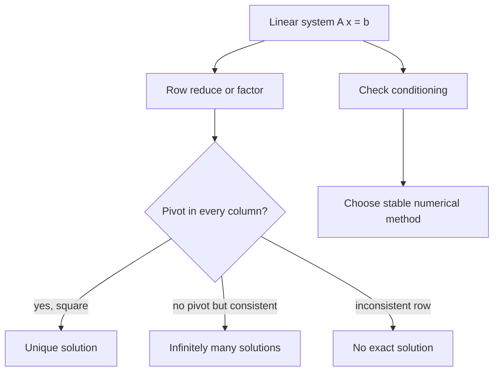

# Matrices and Linear Systems

Matrices organize linear relationships. In engineering mathematics they represent systems of algebraic equations, coordinate transformations, discretized differential equations, least-squares fits, network laws, and linearized models. A matrix is not only a table of numbers; it is a linear map whose algebra reflects geometry and computation.

Solving $A\mathbf{x}=\mathbf{b}$ is one of the core tasks in applied mathematics. Exact row reduction teaches structure, while numerical factorization teaches reliability and cost. The same ideas support eigenvalue problems, finite-difference PDE solvers, regression, optimization, and control.

## Definitions

A matrix $A\in\mathbb{R}^{m\times n}$ maps vectors in $\mathbb{R}^n$ to vectors in $\mathbb{R}^m$ by

$$
\mathbf{y}=A\mathbf{x}.
$$

A linear system is

$$
A\mathbf{x}=\mathbf{b}.
$$

The column space of $A$ is the set of all linear combinations of its columns. The nullspace is

$$
\mathcal{N}(A)=\{\mathbf{x}:A\mathbf{x}=\mathbf{0}\}.
$$

The rank of $A$ is the dimension of its column space. A square matrix is invertible when there exists $A^{-1}$ such that

$$
A^{-1}A=AA^{-1}=I.
$$

For an augmented matrix $[A\mid \mathbf{b}]$, Gaussian elimination uses elementary row operations to reach echelon form. Pivot columns identify basic variables, while nonpivot columns identify free variables.

An LU factorization writes

$$
A=LU,
$$

where $L$ is lower triangular and $U$ is upper triangular, often with a permutation matrix $P$ so that

$$
PA=LU.
$$

## Key results

For a square matrix $A\in\mathbb{R}^{n\times n}$, the following are equivalent: $A$ is invertible, $\det A\ne 0$, $\operatorname{rank}A=n$, the nullspace contains only $\mathbf{0}$, the columns form a basis of $\mathbb{R}^n$, and $A\mathbf{x}=\mathbf{b}$ has a unique solution for every $\mathbf{b}$.

The rank-nullity theorem states

$$
\operatorname{rank}(A)+\operatorname{nullity}(A)=n,
$$

where $n$ is the number of columns. This balances the number of independent output directions against the number of degrees of freedom lost to the nullspace.

Gaussian elimination is systematic. Row swaps improve pivoting, scaling is optional for exact arithmetic, and elimination below pivots produces triangular form. Back substitution then solves the system. For numerical work, pivoting is not merely cosmetic; it reduces the effect of dividing by small numbers.

The determinant measures signed volume scaling for a square linear map. It is useful for invertibility tests and theoretical formulas, but it is usually not the best numerical way to solve systems. Computing an inverse explicitly is also often unnecessary. To solve $A\mathbf{x}=\mathbf{b}$, factor $A$ and use triangular solves.

Conditioning measures sensitivity. A matrix with large condition number can turn small perturbations in data into large changes in the solution. The residual $\mathbf{r}=\mathbf{b}-A\hat{\mathbf{x}}$ may be small even when the error $\hat{\mathbf{x}}-\mathbf{x}$ is large if $A$ is ill-conditioned. This is a major theme in numerical linear algebra and engineering computation.

Least-squares problems solve inconsistent systems approximately. If $A$ has more rows than columns and measurements are noisy, one minimizes

$$
\|A\mathbf{x}-\mathbf{b}\|_2.
$$

The normal equations are

$$
A^TA\mathbf{x}=A^T\mathbf{b},
$$

but QR factorization is often more stable in numerical work.

Matrix structure should be preserved. Symmetric, sparse, banded, positive definite, and triangular matrices have specialized algorithms. Ignoring structure can waste computation and reduce accuracy. Finite-difference discretizations of ODEs and PDEs often produce sparse banded systems, so engineering solvers rely heavily on sparse matrix methods.

Consistency has a geometric interpretation. The equation $A\mathbf{x}=\mathbf{b}$ asks whether $\mathbf{b}$ lies in the column space of $A$. If it does, at least one solution exists. If it does not, no exact solution exists and least squares becomes a natural substitute. When the columns are independent, the coordinates of $\mathbf{b}$ in that column basis are unique. When the columns are dependent, different coefficient vectors can produce the same output.

Elementary row operations preserve the solution set because they replace equations by equivalent linear combinations of equations. They do not preserve the column space in an obvious visual way, but they preserve consistency and the relationships among variables. Column operations are different: they change the variables themselves unless carefully tracked. For solving systems by hand, row operations are the standard safe operations.

The inverse matrix is best understood as the linear map that undoes $A$. It exists only when $A$ is square and one-to-one onto the whole space. If $A$ is rectangular, the right replacement depends on the problem: a left inverse may exist for full-column-rank matrices, a right inverse may exist for full-row-rank matrices, and the pseudoinverse gives the least-squares or minimum-norm solution under appropriate conditions.

Norms provide a language for error. The vector norm measures the size of a vector, and a compatible matrix norm measures how much the matrix can stretch vectors. The condition number $\kappa(A)=\|A\|\|A^{-1}\|$ estimates worst-case relative sensitivity for invertible systems. A matrix can be exactly invertible and still numerically troublesome if $\kappa(A)$ is large.

Scaling can improve numerical behavior. If one equation is measured in millions and another in thousandths, pivot choices and residual norms may be dominated by units rather than mathematics. Row and column scaling, nondimensional variables, and careful unit choices can make a system easier to solve and interpret. Engineering models should not hide unit inconsistency inside a matrix.

In large systems, algorithmic cost matters. Dense Gaussian elimination for an $n\times n$ matrix costs on the order of $n^3$ operations, while triangular solves cost on the order of $n^2$. If the same matrix is used with many right-hand sides, factoring once and solving many times is efficient. Sparse direct solvers and iterative methods can reduce cost dramatically when the matrix structure permits.

## Visual



| Concept | Algebraic meaning | Computational note |
|---|---|---|
| Pivot | Leading variable in elimination | Small pivots can amplify roundoff |
| Rank | Number of independent columns | Determines consistency and degrees of freedom |
| Nullspace | Solutions of $A\mathbf{x}=0$ | Describes nonuniqueness |
| Determinant | Volume scaling for square maps | Poor tool for large numerical solves |
| Condition number | Sensitivity measure | Large values warn of unreliable solutions |

## Worked example 1: Gaussian elimination

Problem. Solve

$$
\begin{aligned}
x+2y-z&=3,\\
2x+3y+z&=7,\\
x-y+2z&=0.
\end{aligned}
$$

Method.

1. Write the augmented matrix:

$$
\left[
\begin{array}{ccc|c}
1&2&-1&3\\
2&3&1&7\\
1&-1&2&0
\end{array}
\right].
$$

2. Eliminate below the first pivot:

$$
R_2\leftarrow R_2-2R_1,\qquad R_3\leftarrow R_3-R_1.
$$

This gives

$$
\left[
\begin{array}{ccc|c}
1&2&-1&3\\
0&-1&3&1\\
0&-3&3&-3
\end{array}
\right].
$$

3. Eliminate below the second pivot:

$$
R_3\leftarrow R_3-3R_2.
$$

Then

$$
\left[
\begin{array}{ccc|c}
1&2&-1&3\\
0&-1&3&1\\
0&0&-6&-6
\end{array}
\right].
$$

4. Back substitute:

$$
-6z=-6,\qquad z=1.
$$

5. Use row 2:

$$
-y+3z=1,\qquad -y+3=1,\qquad y=2.
$$

6. Use row 1:

$$
x+2(2)-1=3,\qquad x=0.
$$

Answer.

$$
\mathbf{x}=(0,2,1)^T.
$$

Check. Substitution gives $3$, $7$, and $0$ in the three equations.

The pivot pattern shows that all three variables are basic. There are no free variables and no inconsistent row, so the solution is unique. If the last row had become $0=5$, the system would have been inconsistent. If the last row had become all zeros, one variable would have remained free.

## Worked example 2: Least-squares line fit

Problem. Fit $y=a+bt$ to the points $(0,1)$, $(1,2)$, and $(2,2)$ by least squares.

Method.

1. Build the design matrix:

$$
A=
\begin{bmatrix}
1&0\\
1&1\\
1&2
\end{bmatrix},
\qquad
\mathbf{b}=
\begin{bmatrix}
1\\2\\2
\end{bmatrix}.
$$

2. Compute

$$
A^TA=
\begin{bmatrix}
3&3\\
3&5
\end{bmatrix},
\qquad
A^T\mathbf{b}=
\begin{bmatrix}
5\\6
\end{bmatrix}.
$$

3. Solve normal equations:

$$
\begin{aligned}
3a+3b&=5,\\
3a+5b&=6.
\end{aligned}
$$

4. Subtract the first equation from the second:

$$
2b=1,\qquad b=\frac{1}{2}.
$$

5. Substitute:

$$
3a+\frac{3}{2}=5,\qquad 3a=\frac{7}{2},\qquad a=\frac{7}{6}.
$$

Answer.

$$
y=\frac{7}{6}+\frac{1}{2}t.
$$

Check. The residuals are $1/6$, $-1/3$, and $1/6$, whose sum is zero, consistent with fitting an intercept.

The residual vector is orthogonal to the columns of $A$. That is the geometric meaning of the normal equations: the error is perpendicular to every direction in the model space. The fitted line is therefore the closest line in the least-squares sense among all lines of the form $a+bt$.

## Code

```python
import numpy as np

A = np.array([[1.0, 2.0, -1.0],
              [2.0, 3.0,  1.0],
              [1.0, -1.0, 2.0]])
b = np.array([3.0, 7.0, 0.0])

x = np.linalg.solve(A, b)
residual = b - A @ x
print(x)
print(np.linalg.norm(residual))
print(np.linalg.cond(A))
```

The code solves the exact system and reports a condition number. In a real measurement problem, the condition number helps decide how much trust to place in computed digits. A residual near machine precision is good, but it is not a complete accuracy certificate for an ill-conditioned system.

## Common pitfalls

- Computing $A^{-1}$ just to solve one system when a factorization or direct solve is better.
- Confusing row space, column space, and nullspace.
- Assuming a small residual always means a small solution error.
- Ignoring pivoting in floating-point Gaussian elimination.
- Using normal equations for badly conditioned least-squares problems without considering QR.
- Forgetting that free variables mean infinitely many solutions only when the system is consistent.
- Treating determinant formulas as practical algorithms for large systems.
- Destroying sparsity by using dense operations on sparse engineering matrices.

## Connections

- [Eigenvalues and Diagonalization](/math/engineering-math/eigenvalues-and-diagonalization)
- [Numerical Methods Overview](/math/engineering-math/numerical-methods-overview)
- [Systems of ODEs and Phase Planes](/math/engineering-math/systems-of-odes-and-phase-plane)
- [Vector Differential Calculus](/math/engineering-math/vector-differential-calculus)
