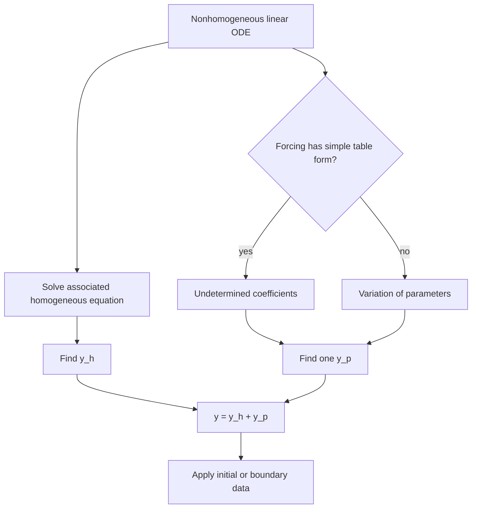

# Nonhomogeneous ODEs and Applications

Nonhomogeneous linear ODEs describe systems driven by an outside input. The homogeneous part gives the natural response, while the forcing term creates a particular response. In engineering language, the solution is usually separated into transient behavior, which depends on initial conditions and often decays, and steady or forced behavior, which follows the input.

This topic extends the constant-coefficient second-order equations by adding terms such as loads, voltages, periodic forcing, impulses, and prescribed environmental changes. The central task is to find one particular solution without losing the homogeneous family. Once that is done, initial or boundary conditions determine the constants.

## Definitions

A second-order nonhomogeneous linear ODE is

$$
y''+p(x)y'+q(x)y=r(x),\qquad r(x)\ne 0.
$$

The associated homogeneous equation is

$$
y''+p(x)y'+q(x)y=0.
$$

If $y_p$ is any particular solution of the nonhomogeneous equation and $y_h$ is the general solution of the associated homogeneous equation, then

$$
y=y_h+y_p
$$

is the general nonhomogeneous solution.

For constant coefficients,

$$
ay''+by'+cy=r(x),
$$

two common methods are undetermined coefficients and variation of parameters. Undetermined coefficients works when $r(x)$ is built from polynomials, exponentials, sines, cosines, and finite products of these. Variation of parameters is more general and uses a fundamental set of homogeneous solutions.

For a fundamental set $y_1,y_2$, variation of parameters looks for

$$
y_p=u_1y_1+u_2y_2
$$

with

$$
\begin{aligned}
u_1'&=-\frac{y_2r}{W},\\
u_2'&=\frac{y_1r}{W},
\end{aligned}
$$

when the equation is normalized as $y''+p(x)y'+q(x)y=r(x)$.

## Key results

The superposition principle is the organizing result. If $L$ is a linear differential operator, then

$$
L[y_h+y_p]=L[y_h]+L[y_p]=0+r=r.
$$

Thus every solution differs from a chosen particular solution by a homogeneous solution. This is why we never replace $y_h$ with $y_p$; both parts are needed.

For undetermined coefficients, the trial form should match the forcing and be linearly independent from the homogeneous solution. If the forcing is $e^{ax}$ times a polynomial of degree $m$, try $e^{ax}$ times a general polynomial of degree $m$. If the forcing is $\cos bx$ or $\sin bx$, try both sine and cosine terms because differentiation mixes them. If the trial overlaps with $y_h$, multiply by $x$ enough times to remove the overlap.

This overlap rule is the resonance rule in algebraic form. If the input has the same shape as a homogeneous mode, the system cannot respond with a simple copy of that mode, so an extra factor of $x$ appears. In mechanical systems, resonance means that a forcing frequency is close to a natural frequency; damping limits the growth, but the response amplitude can still be large.

Variation of parameters is more flexible because it does not require guessing a special forcing form. Its cost is integration. The method is especially useful when $r(x)$ is a function such as $\tan x$, $\ln x$, or a quotient that does not fit the undetermined-coefficients table. The formulas assume the equation has leading coefficient $1$; if the original equation is $a(x)y''+b(x)y'+c(x)y=g(x)$, first divide by $a(x)$ on an interval where $a(x)\ne 0$.

Applications typically interpret $y_h$ as transient and $y_p$ as forced. This interpretation is clearest when the homogeneous modes decay. If a homogeneous root has positive real part, the transient does not disappear, and the model predicts instability. A steady-state calculation is meaningful only after stability has been considered.

The method of undetermined coefficients is best understood as a closure property. Polynomials, exponentials, and sines or cosines form finite-dimensional spaces that remain finite-dimensional after differentiation. For example, differentiating $A\cos bx+B\sin bx$ only changes the coefficients. That is why a finite trial with unknown constants can succeed. A forcing such as $\ln x$ does not have this property under repeated differentiation in a small finite span, so variation of parameters is the safer tool.

The annihilator viewpoint gives the same rule in another language. If a differential operator $A(D)$ kills the forcing, then applying $A(D)$ to both sides creates a higher-order homogeneous equation. Solving that equation identifies the possible forms of $y_p$, while overlap with the original homogeneous solution explains the extra powers of $x$. This viewpoint is useful in control and signal processing because it connects forced ODEs with poles, zeros, and input classes.

In applications, forcing terms are often idealizations. A constant force may represent gravity near Earth's surface. A sinusoidal force may represent a rotating imbalance, an alternating voltage, or a periodic tide. A step input models a switch being closed. The mathematical method should be matched to the input: undetermined coefficients handles smooth elementary inputs, Fourier series handles periodic inputs by harmonic decomposition, and Laplace transforms handle steps and impulses cleanly.

Initial conditions interact with the forcing but do not change the forcing itself. The same system under the same input has one particular forced response, while different starting conditions add different homogeneous transients. This separation is a powerful diagnostic. If two solutions have the same forcing and different initial conditions, their difference must satisfy the homogeneous equation. If it does not, at least one solution is wrong.

Boundary-value problems require more care than initial-value problems. Applying two conditions at different points can produce a unique solution, no solution, or infinitely many solutions depending on whether the boundary conditions conflict with the homogeneous modes. Resonance in a boundary-value problem appears as a forcing that is orthogonal or not orthogonal to certain modes, a theme that returns in Sturm-Liouville theory and PDE separation of variables.

The particular solution is not unique. If $y_p$ is one particular solution and $y_h^*$ is any homogeneous solution, then $y_p+y_h^*$ is another particular solution. This is why methods may produce different-looking particular solutions while the final general solution is equivalent. To compare answers, subtract them. If the difference solves the homogeneous equation, the answers represent the same family.

## Visual



| Forcing $r(x)$ | First trial for $y_p$ | If trial overlaps |
|---|---|---|
| Constant $A$ | Constant $K$ | Try $Kx$ or higher |
| Polynomial degree $m$ | Polynomial degree $m$ | Multiply whole polynomial by $x^s$ |
| $Ae^{ax}$ | $Ke^{ax}$ | Multiply by $x^s$ |
| $A\cos bx+B\sin bx$ | $K\cos bx+M\sin bx$ | Multiply by $x^s$ |
| Product of above | Product-shaped trial | Multiply by $x^s$ |

## Worked example 1: Undetermined coefficients with resonance

Problem. Solve

$$
y''-3y'+2y=e^x.
$$

Method.

1. Solve the homogeneous equation:

$$
\lambda^2-3\lambda+2=0=(\lambda-1)(\lambda-2).
$$

So

$$
y_h=c_1e^x+c_2e^{2x}.
$$

2. The forcing is $e^x$, but $e^x$ is already a homogeneous solution. The first trial $Ae^x$ overlaps.

3. Multiply by $x$ and try

$$
y_p=Axe^x.
$$

4. Differentiate:

$$
y_p'=A(e^x+xe^x)=A(1+x)e^x,
$$

and

$$
y_p''=A(2+x)e^x.
$$

5. Substitute:

$$
\begin{aligned}
y_p''-3y_p'+2y_p
&=A(2+x)e^x-3A(1+x)e^x+2Axe^x\\
&=A[(2+x)-3-3x+2x]e^x\\
&=-Ae^x.
\end{aligned}
$$

6. Match $e^x$:

$$
-A=1,\qquad A=-1.
$$

Answer.

$$
y=c_1e^x+c_2e^{2x}-xe^x.
$$

Check. The particular term is not a homogeneous term because of the factor $x$, and direct substitution gives the forcing $e^x$.

## Worked example 2: Variation of parameters

Problem. Solve

$$
y''+y=\tan x,\qquad -\frac{\pi}{2}<x<\frac{\pi}{2}.
$$

Method.

1. The homogeneous equation has basis

$$
y_1=\cos x,\qquad y_2=\sin x.
$$

2. Compute the Wronskian:

$$
W=y_1y_2'-y_1'y_2=\cos^2 x+\sin^2 x=1.
$$

3. Use variation of parameters for the normalized equation:

$$
u_1'=-y_2r=-\sin x\tan x=-\frac{\sin^2 x}{\cos x},
$$

and

$$
u_2'=y_1r=\cos x\tan x=\sin x.
$$

4. Simplify $u_1'$:

$$
-\frac{\sin^2 x}{\cos x}=-\frac{1-\cos^2 x}{\cos x}=-\sec x+\cos x.
$$

5. Integrate:

$$
u_1=-\int \sec x\,dx+\int \cos x\,dx=-\ln|\sec x+\tan x|+\sin x.
$$

and

$$
u_2=\int \sin x\,dx=-\cos x.
$$

6. Build $y_p$:

$$
\begin{aligned}
y_p&=u_1\cos x+u_2\sin x\\
&=(-\ln|\sec x+\tan x|+\sin x)\cos x-\cos x\sin x\\
&=-\cos x\ln|\sec x+\tan x|.
\end{aligned}
$$

Answer.

$$
y=c_1\cos x+c_2\sin x-\cos x\ln|\sec x+\tan x|.
$$

Check. The interval avoids the singularities of $\tan x$ and $\sec x$.

## Code

```python
import sympy as sp

x = sp.symbols("x")
y = sp.Function("y")

ode = sp.Eq(sp.diff(y(x), x, 2) - 3 * sp.diff(y(x), x) + 2 * y(x), sp.exp(x))
print(sp.dsolve(ode))
```

The symbolic result should be read structurally, not just copied. Check that the answer contains two arbitrary constants, that the nonhomogeneous term includes the resonance factor $x$, and that substituting only the particular term gives $e^x$. For numerical work, the same equation can be rewritten as a first-order system and integrated with `solve_ivp`, but the analytic solution gives a useful benchmark.

## Common pitfalls

- Forgetting to add the homogeneous solution after finding a particular solution.
- Trying undetermined coefficients on a forcing term that does not fit the method's allowed forms.
- Missing resonance overlap and using a trial term already contained in $y_h$.
- Applying variation of parameters before normalizing the coefficient of $y''$ to $1$.
- Dropping absolute values in logarithms when integration produces terms such as $\ln\vert \sec x+\tan x\vert $.
- Calling the particular solution the steady state when the homogeneous part does not decay.
- Applying initial conditions to $y_p$ alone instead of to the complete solution $y_h+y_p$.
- Treating different particular solutions as contradictory. They may differ by a homogeneous term and still generate the same complete family.
- Forgetting to state the interval when the forcing or the variation-of-parameters integrals have singularities.

## Connections

- [Second-Order Linear ODEs](/math/engineering-math/second-order-linear-odes)
- [Higher-Order Linear ODEs](/math/engineering-math/higher-order-linear-odes)
- [Laplace Transform](/math/engineering-math/laplace-transform)
- [Fourier Series](/math/engineering-math/fourier-series)
