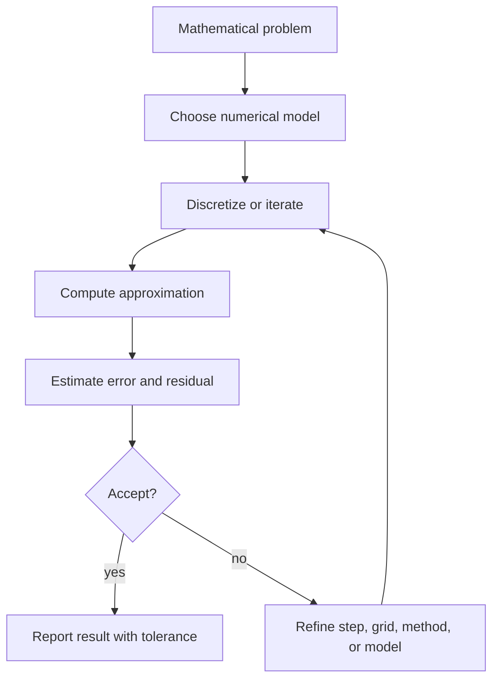

# Numerical Methods Overview

Numerical methods approximate mathematical problems when exact formulas are unavailable, inconvenient, or too expensive. In engineering mathematics they solve nonlinear equations, linear systems, eigenvalue problems, ODEs, PDEs, interpolation, integration, and least-squares problems. The goal is not just to get a number, but to know how reliable that number is.


*Figure: Runge-Kutta methods combine several slope estimates to advance an ODE solution more accurately. Image: [Wikimedia Commons](https://commons.wikimedia.org/wiki/File:Runge-Kutta_slopes.svg), HilberTraum, CC BY-SA 4.0.*

Every numerical method has assumptions, cost, and error behavior. A method that is excellent for a smooth nonstiff ODE may fail for a stiff system. A direct linear solver may be ideal for a dense moderate system but impractical for a huge sparse system. Numerical thinking is the discipline of matching the method to the problem.

## Definitions

Error is the difference between the exact value and the approximation:

$$
e=x-\hat x.
$$

Absolute error is $\vert e\vert $. Relative error is

$$
\frac{|x-\hat x|}{|x|},
$$

when $x\ne 0$.

Roundoff error comes from finite precision arithmetic. Truncation error comes from replacing an infinite or exact process by a finite approximation, such as a Taylor expansion or time step.

An iterative method produces a sequence

$$
x_0,x_1,x_2,\ldots
$$

intended to converge to a solution. The stopping criterion may use step size, residual size, or a maximum iteration count.

For ODEs,

$$
y'=f(t,y),\qquad y(t_0)=y_0,
$$

Euler's method is

$$
y_{n+1}=y_n+h f(t_n,y_n).
$$

Classical fourth-order Runge-Kutta uses four slope evaluations per step and has much higher accuracy for smooth nonstiff problems.

## Key results

Convergence means the approximation approaches the exact answer as the discretization is refined. Stability means errors are not amplified uncontrollably. Consistency means the discrete formula approximates the original equation locally. For many time-stepping methods, convergence depends on both consistency and stability.

Newton's method for solving $F(x)=0$ is

$$
x_{n+1}=x_n-\frac{F(x_n)}{F'(x_n)}.
$$

It can converge quadratically near a simple root when the initial guess is good, but it can fail or converge to an unintended root when started poorly. Safeguards such as damping, bracketing, or hybrid methods are often used in engineering software.

For linear systems, Gaussian elimination with pivoting is a standard direct method. Iterative methods such as Jacobi, Gauss-Seidel, conjugate gradient, and GMRES are useful for large sparse systems. The matrix structure and conditioning determine which method is appropriate.

Numerical integration, or quadrature, approximates

$$
\int_a^b f(x)\,dx.
$$

The trapezoidal rule is simple and effective for smooth data, while Simpson's rule achieves higher order for sufficiently smooth functions. Adaptive quadrature subdivides intervals where the integrand is difficult.

For ODEs, method order describes how error scales with step size. Euler's method has global error $O(h)$, while RK4 has global error $O(h^4)$ for smooth nonstiff problems. Higher order does not automatically mean better if the problem is stiff or if function evaluations are very expensive.

Conditioning is a property of the problem, not the algorithm. Stability is a property of the algorithm. A well-conditioned problem can be solved poorly by an unstable method, and an ill-conditioned problem may limit accuracy even with a stable method.

Verification uses independent checks: residuals, conservation laws, grid refinement, comparison with exact special cases, and dimensional consistency. A plotted curve is not a proof of correctness.

Floating-point arithmetic is finite. Numbers are stored with limited precision, so operations introduce rounding. Subtracting nearly equal numbers can lose significant digits, a phenomenon called cancellation. Algorithms should be designed to avoid unnecessary cancellation and to keep intermediate quantities within reasonable scales.

Backward error is often more meaningful than forward error. A computed solution $\hat x$ to $A x=b$ may be interpreted as the exact solution to a nearby problem $(A+\Delta A)\hat x=b+\Delta b$. If the nearby perturbation is tiny, the algorithm is backward stable. The forward error still depends on the conditioning of the original problem.

Step-size choice balances accuracy and cost. Smaller steps reduce truncation error for a stable method, but they increase the number of operations and may accumulate roundoff. Adaptive methods estimate local error and adjust step size automatically. The user still needs to set tolerances that match the physical accuracy needed, not just the desire for more digits.

Stiffness occurs when a system has rapidly decaying components that force explicit methods to use very small steps for stability, even though the solution of interest changes slowly. Chemical kinetics, heat equations after spatial discretization, and control systems can be stiff. Implicit methods cost more per step but may allow much larger stable steps.

Discretization turns continuous problems into algebraic ones. A finite-difference PDE method replaces derivatives by difference quotients on a grid. A finite-element method approximates the solution in a basis of local functions and enforces a weak form. A spectral method uses global basis functions and can be highly accurate for smooth solutions. Each discretization carries assumptions about smoothness and geometry.

Validation is different from verification. Verification asks whether the equations were solved correctly. Validation asks whether the equations model the real system well. A numerical answer can be verified to high precision and still be useless if the model parameters, boundary conditions, or simplifying assumptions are wrong.

Reproducibility requires recording method choices: tolerances, step sizes, grid resolution, solver type, initial guesses, random seeds, and software versions when relevant. Without these details, a numerical result may be difficult to audit or reproduce, even if the final number looks plausible.

## Visual



| Task | Common methods | Main risk |
|---|---|---|
| Root finding | Bisection, Newton, secant | Bad initial guess or multiple roots |
| Linear systems | LU, QR, CG, GMRES | Ill-conditioning and roundoff |
| ODE IVPs | Euler, RK4, adaptive RK, BDF | Stability and stiffness |
| Quadrature | Trapezoidal, Simpson, adaptive | Singularities and oscillation |
| PDEs | Finite difference, finite element, spectral | Mesh resolution and stability |

## Worked example 1: Newton's method

Problem. Approximate the positive root of

$$
F(x)=x^2-2=0.
$$

Method.

1. Newton's formula is

$$
x_{n+1}=x_n-\frac{x_n^2-2}{2x_n}.
$$

2. Start with $x_0=1$.

3. First iteration:

$$
x_1=1-\frac{1^2-2}{2}=\frac{3}{2}=1.5.
$$

4. Second iteration:

$$
x_2=1.5-\frac{1.5^2-2}{3}=1.5-\frac{0.25}{3}=1.4166666667.
$$

5. Third iteration:

$$
x_3=x_2-\frac{x_2^2-2}{2x_2}\approx 1.4142156863.
$$

Answer. The approximation after three iterations is about

$$
1.4142156863.
$$

Check. The true value is $\sqrt{2}\approx 1.4142135624$, so the error is about $2.1\times 10^{-6}$.

The rapid improvement happens because the initial guess is close enough to a simple root. If the starting value were $0$, Newton's formula would divide by zero. If the function had several roots, a different starting value might converge to a different root. Bracketing methods are slower but provide stronger global guarantees when a sign change is known.

## Worked example 2: One RK4 step

Problem. Use one RK4 step with $h=0.1$ for

$$
y'=y,\qquad y(0)=1.
$$

Method.

1. Define $f(t,y)=y$.

2. RK4 slopes are

$$
\begin{aligned}
k_1&=f(t_n,y_n),\\
k_2&=f(t_n+h/2,y_n+hk_1/2),\\
k_3&=f(t_n+h/2,y_n+hk_2/2),\\
k_4&=f(t_n+h,y_n+hk_3).
\end{aligned}
$$

3. At $t_0=0$, $y_0=1$:

$$
k_1=1.
$$

4. Then

$$
k_2=1+0.1(1)/2=1.05.
$$

5. Next

$$
k_3=1+0.1(1.05)/2=1.0525.
$$

6. Finally

$$
k_4=1+0.1(1.0525)=1.10525.
$$

7. Combine:

$$
y_1=1+\frac{0.1}{6}(1+2(1.05)+2(1.0525)+1.10525).
$$

8. Sum the bracket:

$$
1+2.1+2.105+1.10525=6.31025.
$$

Thus

$$
y_1=1+0.1051708333=1.1051708333.
$$

Answer.

$$
y(0.1)\approx 1.1051708333.
$$

Check. The exact value is $e^{0.1}\approx 1.1051709181$, so one RK4 step is already very accurate here.

The example is smooth and nonstiff, which is the setting where RK4 performs well. For a stiff equation such as $y'=-1000(y-\cos t)-\sin t$, the same step size logic may fail because stability, not local Taylor accuracy, controls the computation.

## Code

```python
import numpy as np

def rk4_step(f, t, y, h):
    k1 = f(t, y)
    k2 = f(t + h/2, y + h*k1/2)
    k3 = f(t + h/2, y + h*k2/2)
    k4 = f(t + h, y + h*k3)
    return y + h * (k1 + 2*k2 + 2*k3 + k4) / 6

f = lambda t, y: y
y1 = rk4_step(f, 0.0, 1.0, 0.1)
print(y1)
print(np.exp(0.1) - y1)
```

The code repeats the RK4 calculation and compares it with the exact exponential. For a serious computation, one would run a refinement study by halving $h$ and checking whether the error decreases at the expected rate.

A refinement study should keep the mathematical problem fixed. If the grid, tolerance, and model parameters all change simultaneously, it becomes unclear which change caused the result to move. Controlled refinement is a basic numerical experiment.

## Common pitfalls

- Reporting many digits without an error estimate or tolerance.
- Confusing residual size with actual solution error, especially for ill-conditioned systems.
- Using Newton's method without checking derivative size or convergence behavior.
- Applying explicit time-stepping methods to stiff problems without stability analysis.
- Refining a grid but changing the model at the same time, which obscures convergence.
- Ignoring units and scaling before solving a numerical problem.
- Trusting a plot without residual, conservation, or refinement checks.
- Comparing algorithms only by order and ignoring cost per step or robustness.
- Using default solver tolerances without checking whether they match the scale of the variables.
- Forgetting that nondimensionalization can improve conditioning and interpretability.

## Connections

- [Matrices and Linear Systems](/math/engineering-math/matrices-and-linear-systems)
- [Direction Fields and Existence](/math/engineering-math/direction-fields-and-existence)
- [Wave and Heat Equations](/math/engineering-math/wave-and-heat-equations)
- [Fourier Integrals and Transforms](/math/engineering-math/fourier-integrals-and-transforms)
