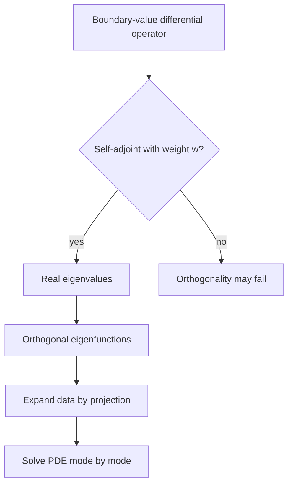

# Orthogonal Functions and Sturm-Liouville Problems

Orthogonal functions generalize perpendicular vectors to function spaces. Instead of a dot product of finite vectors, we use an integral inner product. This turns functions into modes that can be projected, expanded, and compared by energy. Fourier series are the most familiar example, but Legendre polynomials and Bessel functions fit the same pattern.

Sturm-Liouville theory explains why these mode families appear in boundary-value problems. A differential operator with suitable boundary conditions has real eigenvalues and orthogonal eigenfunctions. This is the structural reason separation of variables works for many heat, wave, and potential problems.

## Definitions

An inner product for functions on $[a,b]$ with weight $w(x)\gt 0$ is

$$
\langle f,g\rangle=\int_a^b f(x)g(x)w(x)\,dx.
$$

Functions $f$ and $g$ are orthogonal if

$$
\langle f,g\rangle=0.
$$

The norm is

$$
\|f\|=\sqrt{\langle f,f\rangle}.
$$

A Sturm-Liouville problem has the form

$$
-\frac{d}{dx}\left(p(x)y'\right)+q(x)y=\lambda w(x)y
$$

on an interval $[a,b]$, together with homogeneous boundary conditions. The functions $p,q,w$ are real, and $w$ is the weight.

An eigenfunction is a nonzero solution satisfying the boundary conditions for a particular eigenvalue $\lambda$.

If $\{\phi_n\}$ is an orthogonal family, an expansion has the form

$$
f(x)\sim \sum_{n}c_n\phi_n(x),
$$

with coefficients

$$
c_n=\frac{\langle f,\phi_n\rangle}{\langle \phi_n,\phi_n\rangle}.
$$

## Key results

Self-adjointness is the key property. Under suitable boundary conditions, the Sturm-Liouville operator

$$
L[y]=-\frac{d}{dx}(p y')+q y
$$

satisfies

$$
\langle L[f],g\rangle=\langle f,L[g]\rangle.
$$

This symmetry implies real eigenvalues and orthogonality of eigenfunctions belonging to distinct eigenvalues.

The proof of orthogonality is short. Suppose

$$
L[y_m]=\lambda_m w y_m,\qquad L[y_n]=\lambda_n w y_n.
$$

Using self-adjointness,

$$
\langle L[y_m],y_n\rangle=\langle y_m,L[y_n]\rangle.
$$

Substitute the eigenvalue equations:

$$
\lambda_m\int_a^b y_my_nw\,dx=\lambda_n\int_a^b y_my_nw\,dx.
$$

Thus

$$
(\lambda_m-\lambda_n)\int_a^b y_my_nw\,dx=0.
$$

If $\lambda_m\ne\lambda_n$, then the weighted inner product is zero.

Many classical systems fit this template. Sine functions arise from $-y''=\lambda y$ with $y(0)=y(L)=0$. Cosine functions arise from $y'(0)=y'(L)=0$. Legendre polynomials arise from a problem with $p(x)=1-x^2$ on $[-1,1]$. Bessel functions arise from radial problems with weight $r$.

Boundary conditions must be homogeneous for the eigenfunction orthogonality theory. Nonhomogeneous boundary conditions are often handled by subtracting a simple function that satisfies the boundary values, leaving a homogeneous problem for the remainder.

The eigenvalues are often ordered

$$
\lambda_1<\lambda_2<\lambda_3<\cdots,
$$

and higher eigenvalues correspond to eigenfunctions with more oscillation. In heat equations, high modes decay faster. In wave equations, each eigenvalue determines a natural frequency.

Orthogonality gives projection. The coefficient formula is the infinite-dimensional analog of projecting a vector onto an orthogonal basis vector. The denominator matters when the basis is orthogonal but not normalized. Normalizing functions can simplify formulas, but many engineering references keep conventional unnormalized modes.

The weight function is part of the geometry of the problem. It is not an optional extra inserted into coefficient formulas. In polar coordinates, the area element contains $r$, so radial modes are orthogonal with weight $r$. In a vibrating string with variable density, the density may appear as the weight. The inner product should match the physical energy or measurement being represented.

Sturm-Liouville problems also explain why eigenvalues are discrete in bounded domains. Boundary conditions restrict the possible oscillations so severely that only certain wavelengths fit. This is the same idea as standing waves on a string: the endpoints allow only modes with nodes at the correct places. In more complicated geometries, the allowed modes are not simple sines, but the selection principle is the same.

Regularity assumptions matter. The classical theory usually assumes enough smoothness of $p,p',q,w$ and suitable endpoint behavior. Singular Sturm-Liouville problems, such as those involving Bessel or Legendre equations at endpoints, require additional care. The same orthogonality ideas often survive, but the precise boundary or boundedness conditions must be stated.

Completeness is deeper than orthogonality. Orthogonality says distinct modes do not overlap in the inner product. Completeness says that enough modes exist to represent a broad class of functions. Fourier sine functions are complete in an appropriate square-integrable sense on an interval. In applications, completeness is what justifies expanding arbitrary initial data in the eigenfunctions.

Eigenfunction expansions separate modeling into two parts. The spatial problem determines modes and eigenvalues. The time-dependent equation determines how each modal coefficient evolves. For heat flow, coefficients decay exponentially at rates proportional to eigenvalues. For wave motion, coefficients oscillate at frequencies related to square roots of eigenvalues. This division is the heart of separation of variables.

Orthogonalization may be needed when an eigenspace has dimension greater than one. Eigenfunctions associated with distinct eigenvalues are automatically orthogonal, but two independent eigenfunctions for the same eigenvalue need not already be orthogonal. A Gram-Schmidt process within the eigenspace can create an orthogonal basis without changing the eigenvalue.

From a computational viewpoint, truncating an eigenfunction expansion creates a finite modal model. Low modes capture large-scale behavior, while high modes capture sharp spatial variation. For smooth data, coefficients often decay quickly. For discontinuous data, many modes may be needed, and Gibbs-like oscillations can appear. The truncation level should be chosen based on the desired accuracy and the smoothness of the data.

The boundary conditions are part of the operator. The same differential expression $-y''$ has different eigenfunctions under Dirichlet, Neumann, periodic, or mixed boundary conditions. It is therefore imprecise to say "the eigenfunctions of $-y''$" without specifying the interval and boundary conditions.

## Visual



| Problem | Eigenfunctions | Weight | Typical use |
|---|---|---|---|
| $-y''=\lambda y$, $y(0)=y(L)=0$ | $\sin(n\pi x/L)$ | $1$ | Fixed-end strings, heat rods |
| $-y''=\lambda y$, $y'(0)=y'(L)=0$ | $\cos(n\pi x/L)$ | $1$ | Insulated heat rods |
| Legendre | $P_n(x)$ | $1$ | Spherical angular modes |
| Bessel radial | $J_n(\alpha r)$ | $r$ | Circular membranes and disks |

## Worked example 1: Orthogonality of sine modes

Problem. Show that

$$
\sin\frac{m\pi x}{L}
$$

and

$$
\sin\frac{n\pi x}{L}
$$

are orthogonal on $[0,L]$ when $m\ne n$.

Method.

1. Compute the inner product:

$$
I=\int_0^L\sin\frac{m\pi x}{L}\sin\frac{n\pi x}{L}\,dx.
$$

2. Use the product-to-sum identity:

$$
\sin A\sin B=\frac{1}{2}[\cos(A-B)-\cos(A+B)].
$$

3. Then

$$
I=\frac{1}{2}\int_0^L
\left[
\cos\frac{(m-n)\pi x}{L}
-\cos\frac{(m+n)\pi x}{L}
\right]dx.
$$

4. Integrate:

$$
I=\frac{1}{2}\left[
\frac{L}{(m-n)\pi}\sin\frac{(m-n)\pi x}{L}
-\frac{L}{(m+n)\pi}\sin\frac{(m+n)\pi x}{L}
\right]_0^L.
$$

5. Since $m,n$ are integers,

$$
\sin((m-n)\pi)=0,\qquad \sin((m+n)\pi)=0.
$$

Answer.

$$
I=0,\qquad m\ne n.
$$

Check. The result matches the Sturm-Liouville orthogonality theorem for distinct eigenvalues.

This direct calculation is useful because it shows exactly where integer mode numbers enter. The endpoint sines vanish because the interval length and the frequencies fit together. If the frequency were not an integer multiple of $\pi/L$, the same cancellation would not occur, and the function would not satisfy the same fixed-end eigenvalue problem.

## Worked example 2: Projection coefficient

Problem. Expand $f(x)=x$ on $0\lt x\lt L$ in sine modes and find $b_n$.

Method.

1. Use

$$
x\sim \sum_{n=1}^{\infty}b_n\sin\frac{n\pi x}{L}.
$$

2. Projection gives

$$
b_n=\frac{\int_0^L x\sin(n\pi x/L)\,dx}{\int_0^L \sin^2(n\pi x/L)\,dx}.
$$

3. The denominator is

$$
\int_0^L \sin^2(n\pi x/L)\,dx=\frac{L}{2}.
$$

4. For the numerator, integrate by parts:

$$
u=x,\qquad dv=\sin(n\pi x/L)\,dx.
$$

Then

$$
v=-\frac{L}{n\pi}\cos\frac{n\pi x}{L}.
$$

5. Thus

$$
\int_0^L x\sin\frac{n\pi x}{L}\,dx
=\left[-\frac{Lx}{n\pi}\cos\frac{n\pi x}{L}\right]_0^L
+\frac{L}{n\pi}\int_0^L\cos\frac{n\pi x}{L}\,dx.
$$

6. The remaining sine endpoint term is zero, so

$$
\int_0^L x\sin\frac{n\pi x}{L}\,dx=-\frac{L^2}{n\pi}(-1)^n.
$$

7. Divide by $L/2$:

$$
b_n=\frac{2L(-1)^{n+1}}{n\pi}.
$$

Answer.

$$
x\sim \sum_{n=1}^{\infty}\frac{2L(-1)^{n+1}}{n\pi}\sin\frac{n\pi x}{L}.
$$

Check. Setting $L=\pi$ recovers $b_n=2(-1)^{n+1}/n$.

The denominator $L/2$ is the squared norm of the sine mode. If the mode had been normalized to unit length, the coefficient formula would look different because the basis function itself would include a factor. Both conventions are correct when used consistently.

## Code

```python
import numpy as np

def project_sine(f, L, n, samples=20001):
    x = np.linspace(0.0, L, samples)
    phi = np.sin(n * np.pi * x / L)
    numerator = np.trapz(f(x) * phi, x)
    denominator = np.trapz(phi * phi, x)
    return numerator / denominator

L = 2.0
for n in range(1, 5):
    numeric = project_sine(lambda x: x, L, n)
    exact = 2 * L * (-1)**(n + 1) / (n * np.pi)
    print(n, numeric, exact)
```

The numerical projection approximates the weighted inner products by quadrature. For nonuniform weights, the code must multiply the integrand by $w(x)$. Omitting that factor changes the projection problem.

For highly oscillatory modes, quadrature needs enough sample points to resolve the oscillations. Otherwise a coefficient may appear small or large because of numerical aliasing rather than true orthogonality. This is the continuous analog of sampling issues in discrete Fourier computations.

## Common pitfalls

- Forgetting the weight function in the inner product.
- Assuming orthogonal functions are automatically normalized.
- Applying Sturm-Liouville orthogonality to nonhomogeneous boundary conditions without transforming the problem.
- Mixing eigenfunctions from different boundary conditions in one expansion.
- Dropping the denominator $\langle \phi_n,\phi_n\rangle$ in projection coefficients.
- Assuming every orthogonal expansion converges pointwise everywhere.
- Ignoring endpoint conditions when selecting sine, cosine, Legendre, or Bessel modes.
- Treating repeated eigenvalues as if they automatically provide a single eigenfunction; multidimensional eigenspaces may need orthogonalization.
- Calling a set a basis after checking only pairwise orthogonality. Completeness is a separate issue.
- Comparing modal coefficients from different normalizations without converting the basis norms.

## Connections

- [Fourier Series](/math/engineering-math/fourier-series)
- [Special Functions: Legendre and Bessel](/math/engineering-math/special-functions-legendre-bessel)
- [PDEs by Separation of Variables](/math/engineering-math/pdes-separation-of-variables)
- [Wave and Heat Equations](/math/engineering-math/wave-and-heat-equations)
