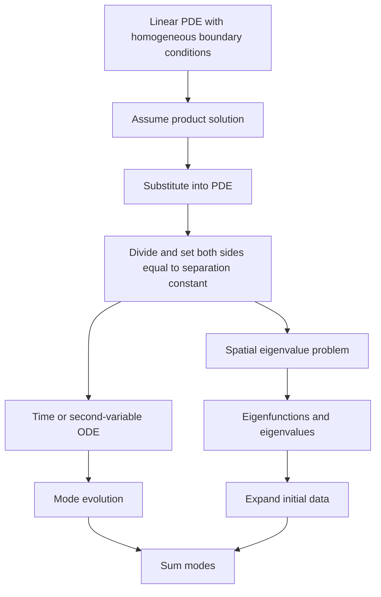

# PDEs by Separation of Variables

Separation of variables solves certain linear PDEs by looking for product solutions. A function of several variables is written as a product of one-variable factors, such as $u(x,t)=X(x)T(t)$. Substitution separates the PDE into ordinary differential equations, and boundary conditions turn the spatial ODE into an eigenvalue problem.

The method is most useful for linear homogeneous boundary conditions on simple domains. It explains why Fourier series, Legendre polynomials, and Bessel functions appear in heat, wave, and potential problems. The core idea is modal evolution: solve the spatial shapes once, then determine how each shape changes in time or another variable.

## Definitions

A partial differential equation involves derivatives with respect to more than one independent variable. Standard examples include the heat equation

$$
u_t=ku_{xx},
$$

the wave equation

$$
u_{tt}=c^2u_{xx},
$$

and Laplace's equation

$$
u_{xx}+u_{yy}=0.
$$

For a product trial

$$
u(x,t)=X(x)T(t),
$$

the heat equation gives

$$
XT'=kX''T.
$$

Dividing by $kXT$ where nonzero gives

$$
\frac{T'}{kT}=\frac{X''}{X}.
$$

The left side depends only on $t$, and the right side depends only on $x$, so both equal a separation constant, usually written $-\lambda$.

Boundary conditions are homogeneous if zero appears on the boundary, such as

$$
u(0,t)=u(L,t)=0.
$$

Initial conditions specify the starting shape or velocity, such as

$$
u(x,0)=f(x).
$$

## Key results

Separation works because a function of $x$ equals a function of $t$ for all $x,t$ only when both are constant. That constant becomes the eigenvalue parameter in the spatial problem. The boundary conditions select admissible eigenvalues and eigenfunctions.

For the heat equation on $0\lt x\lt L$ with zero endpoint temperatures,

$$
u_t=ku_{xx},\qquad u(0,t)=u(L,t)=0,
$$

the separated equations are

$$
X''+\lambda X=0,\qquad T'+k\lambda T=0.
$$

The boundary conditions force

$$
X_n(x)=\sin\frac{n\pi x}{L},\qquad \lambda_n=\left(\frac{n\pi}{L}\right)^2.
$$

The time factors are

$$
T_n(t)=e^{-k\lambda_nt}.
$$

Thus

$$
u(x,t)=\sum_{n=1}^{\infty}b_ne^{-k(n\pi/L)^2t}\sin\frac{n\pi x}{L}.
$$

The coefficients $b_n$ come from expanding the initial condition in a sine series.

Linearity permits superposition. Each separated product solves the PDE and homogeneous boundary conditions, so a sum of modes also solves them. The initial condition is then matched by an orthogonal expansion. Nonlinear PDEs usually do not allow this kind of modal superposition.

The sign of the separation constant is not arbitrary. For many boundary-value problems, only certain signs yield nontrivial solutions satisfying the boundary conditions. For fixed endpoint heat problems, positive $\lambda$ gives sine modes, $\lambda=0$ gives only the zero solution, and negative $\lambda$ gives hyperbolic functions that cannot satisfy both zero endpoint conditions nontrivially.

Nonhomogeneous boundary conditions are usually handled by subtracting a steady or simple function that satisfies the boundary data. The remainder has homogeneous boundary conditions and can be expanded in eigenfunctions. This preprocessing step is often the difference between a clean separation solution and a messy incorrect one.

The method extends to rectangles, disks, cylinders, and spheres, but the eigenfunctions change with geometry. Rectangles lead to products of sines and cosines. Disks lead to Bessel functions in the radial variable and trigonometric functions in the angular variable. Spheres lead to Legendre functions and spherical harmonics.

Separation is a constructive method, but it also reveals the role of linear operators. The spatial part of the PDE becomes an eigenvalue problem for an operator such as $-d^2/dx^2$ with boundary conditions. The time part then evolves each eigencomponent according to a scalar ODE. This is the infinite-dimensional version of diagonalizing a matrix and solving each modal coordinate independently.

The boundary conditions decide the eigenfunctions before the initial condition is used. For a heat rod with fixed endpoint temperatures, sine modes are forced by the endpoints. The initial temperature then only determines the coefficients of those sine modes. If one instead chooses modes based on the shape of the initial condition, the boundary conditions may fail for all later time.

The zero mode deserves attention. With insulated endpoints, cosine modes include a constant mode. In the heat equation this constant mode does not decay, representing conservation of average temperature. With fixed zero endpoints, there is no nonzero constant mode, and all heat modes decay. This difference has a clear physical interpretation and follows directly from the boundary conditions.

Linearity is what permits adding separated solutions. A single product solution rarely matches a general initial condition. The infinite sum is not an afterthought; it is the mechanism for fitting arbitrary data. For nonlinear PDEs, sums of solutions usually are not solutions, so separation can at best produce special solutions unless further structure is present.

In practice, the eigenfunction expansion is often truncated. The truncation error depends on the smoothness of the data and the time variable. For heat equations, high modes decay rapidly, so a modest number of modes may be enough for $t\gt 0$. For wave equations, high modes persist as oscillations, so truncating can lose important sharp features or produce visible artifacts.

Physical units help check separated equations. In the heat equation, $k$ has units of length squared per time, and $\lambda$ has units of inverse length squared, so $k\lambda t$ is dimensionless. If the exponent in a heat solution has units, a scaling error has occurred. Similar checks catch missing factors of $L$ and $\pi$.

## Visual



| PDE | Typical separated spatial modes | Time behavior |
|---|---|---|
| Heat equation | Sine or cosine eigenfunctions | Exponential decay |
| Wave equation | Sine or cosine eigenfunctions | Oscillation |
| Laplace equation | Sine/cosine plus hyperbolic factors | Boundary interpolation |
| Polar PDEs | Bessel and angular modes | Geometry-dependent |

## Worked example 1: Heat equation on a rod

Problem. Solve

$$
u_t=ku_{xx},\qquad 0<x<L,\qquad u(0,t)=u(L,t)=0,
$$

with initial condition

$$
u(x,0)=f(x).
$$

Method.

1. Try

$$
u=X(x)T(t).
$$

2. Substitute:

$$
XT'=kX''T.
$$

3. Divide:

$$
\frac{T'}{kT}=\frac{X''}{X}=-\lambda.
$$

4. Spatial equation:

$$
X''+\lambda X=0,\qquad X(0)=X(L)=0.
$$

5. Nontrivial solutions require

$$
\lambda_n=\left(\frac{n\pi}{L}\right)^2,\qquad X_n=\sin\frac{n\pi x}{L}.
$$

6. Time equation:

$$
T'+k\lambda_nT=0.
$$

Thus

$$
T_n=e^{-k\lambda_nt}.
$$

7. Superpose:

$$
u(x,t)=\sum_{n=1}^{\infty}b_ne^{-k(n\pi/L)^2t}\sin\frac{n\pi x}{L}.
$$

8. Match initial data:

$$
f(x)=\sum_{n=1}^{\infty}b_n\sin\frac{n\pi x}{L}.
$$

Thus

$$
b_n=\frac{2}{L}\int_0^Lf(x)\sin\frac{n\pi x}{L}\,dx.
$$

Answer. The solution is the sine-series heat expansion above.

Check. At $x=0$ and $x=L$, every sine term vanishes. For $t\gt 0$, higher modes decay faster because of the factor $n^2$ in the exponent.

The formula also shows smoothing. Even if $f$ has corners or jumps, the factors $e^{-k(n\pi/L)^2t}$ suppress large $n$ very strongly for any fixed positive $t$. The initial condition may be represented only in the Fourier sense at $t=0$, but the solution becomes smoother immediately afterward.

## Worked example 2: Laplace equation in a rectangle

Problem. Solve

$$
u_{xx}+u_{yy}=0,\quad 0<x<L,\quad 0<y<H,
$$

with

$$
u(0,y)=u(L,y)=u(x,0)=0,\qquad u(x,H)=f(x).
$$

Method.

1. Try $u=X(x)Y(y)$.

2. Substitute:

$$
X''Y+XY''=0.
$$

3. Divide by $XY$:

$$
\frac{X''}{X}=-\frac{Y''}{Y}=-\lambda.
$$

4. The $x$ boundary conditions give

$$
X''+\lambda X=0,\qquad X(0)=X(L)=0.
$$

Thus

$$
X_n=\sin\frac{n\pi x}{L},\qquad \lambda_n=\left(\frac{n\pi}{L}\right)^2.
$$

5. The $y$ equation is

$$
Y''-\lambda_nY=0.
$$

6. Since $u(x,0)=0$, choose

$$
Y_n(y)=\sinh\frac{n\pi y}{L}.
$$

7. Superpose:

$$
u(x,y)=\sum_{n=1}^{\infty}A_n\sinh\frac{n\pi y}{L}\sin\frac{n\pi x}{L}.
$$

8. Match $u(x,H)=f(x)$:

$$
f(x)=\sum_{n=1}^{\infty}A_n\sinh\frac{n\pi H}{L}\sin\frac{n\pi x}{L}.
$$

Thus, if $f(x)=\sum b_n\sin(n\pi x/L)$,

$$
A_n=\frac{b_n}{\sinh(n\pi H/L)}.
$$

Answer.

$$
u(x,y)=\sum_{n=1}^{\infty}b_n
\frac{\sinh(n\pi y/L)}{\sinh(n\pi H/L)}
\sin\frac{n\pi x}{L}.
$$

Check. The quotient equals $0$ at $y=0$ and $1$ at $y=H$, so the bottom and top conditions are satisfied.

This solution is a boundary interpolation formula. Each sine component of the top boundary is continued harmonically into the rectangle, with hyperbolic sine controlling how it decays away from the top. High-frequency boundary oscillations decay quickly as one moves into the interior.

## Code

```python
import numpy as np

def heat_solution(x, t, L, k, coeffs):
    total = np.zeros_like(x, dtype=float)
    for n, b_n in enumerate(coeffs, start=1):
        lam = (n * np.pi / L) ** 2
        total += b_n * np.exp(-k * lam * t) * np.sin(n * np.pi * x / L)
    return total

L = 1.0
x = np.linspace(0.0, L, 200)
coeffs = [1.0, 0.5, -0.25]
print(heat_solution(x, 0.1, L, 0.02, coeffs).max())
```

The code evaluates a truncated heat expansion. Increasing time damps the higher modes more strongly. Increasing the number of coefficients improves the representation of the initial condition, but for positive time the heat equation smooths high-frequency errors quickly.

## Common pitfalls

- Trying to separate a PDE before making boundary conditions homogeneous.
- Choosing the wrong sign for the separation constant and keeping only trivial spatial solutions.
- Forgetting to expand the initial condition in the eigenfunctions selected by the boundary conditions.
- Treating separation as valid for arbitrary nonlinear PDEs.
- Dropping higher modes because they look complicated, even when initial data requires them.
- Confusing heat equation decay with wave equation oscillation.
- Using sine modes when derivative boundary conditions require cosine modes.
- Forgetting that convergence at discontinuities follows Fourier-series midpoint rules.
- Losing the zero mode in Neumann problems, which changes conservation of average value.
- Applying initial data before deriving the eigenfunctions from the boundary conditions.
- Forgetting that product solutions are building blocks, not usually the final general solution.

## Connections

- [Fourier Series](/math/engineering-math/fourier-series)
- [Orthogonal Functions and Sturm-Liouville Problems](/math/engineering-math/orthogonal-functions-and-sturm-liouville)
- [Wave and Heat Equations](/math/engineering-math/wave-and-heat-equations)
- [Laplace Equation and Potential](/math/engineering-math/laplace-equation-and-potential)
