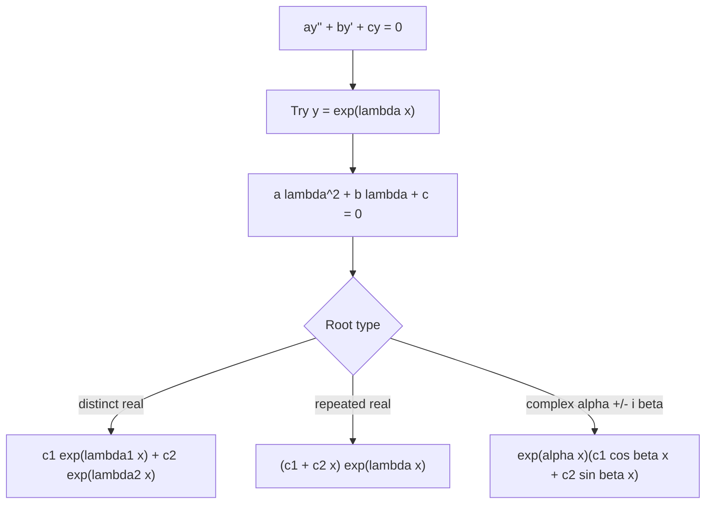

# Second-Order Linear ODEs

Second-order linear ODEs model systems with inertia or storage in two forms: displacement and velocity, charge and current, or position and momentum. The second derivative records acceleration or curvature, so these equations appear in vibrations, circuits, beams, control systems, and diffusion approximations after modal decomposition.

The main advantage of linearity is superposition. Once two independent homogeneous solutions are known, their linear combination gives the full homogeneous response. Nonhomogeneous problems then add a particular response determined by the forcing. This page focuses on the homogeneous constant-coefficient case and the language needed for later forced problems.

## Definitions

A second-order linear ODE has the form

$$
y''+p(x)y'+q(x)y=r(x).
$$

It is homogeneous when $r(x)=0$ and nonhomogeneous when $r(x)\ne 0$. An initial value problem specifies

$$
y(x_0)=y_0,\qquad y'(x_0)=v_0.
$$

For the homogeneous equation

$$
y''+p(x)y'+q(x)y=0,
$$

two solutions $y_1,y_2$ are linearly independent on an interval if neither is a constant multiple of the other. Their Wronskian is

$$
W(y_1,y_2)(x)=
\begin{vmatrix}
y_1 & y_2\\
y_1' & y_2'
\end{vmatrix}
=y_1y_2'-y_1'y_2.
$$

For constant coefficients,

$$
ay''+by'+cy=0,\qquad a\ne 0,
$$

we try $y=e^{\lambda x}$ and obtain the characteristic equation

$$
a\lambda^2+b\lambda+c=0.
$$

## Key results

If $p,q,r$ are continuous on an interval containing $x_0$, then the initial value problem has a unique solution on that interval. This is stronger than the local first-order theorem because linearity and continuity prevent branching while the coefficients remain finite.

For homogeneous equations, the solution space is two-dimensional. If $y_1,y_2$ form a fundamental set, then every homogeneous solution is

$$
y_h=c_1y_1+c_2y_2.
$$

For constant coefficients the characteristic roots determine the basis:

| Characteristic roots | Homogeneous basis | Behavior |
|---|---|---|
| Distinct real $\lambda_1,\lambda_2$ | $e^{\lambda_1x}, e^{\lambda_2x}$ | Pure exponential growth or decay |
| Repeated real $\lambda$ | $e^{\lambda x}, xe^{\lambda x}$ | Exponential with polynomial factor |
| Complex $\alpha\pm i\beta$ | $e^{\alpha x}\cos\beta x, e^{\alpha x}\sin\beta x$ | Oscillation with envelope $e^{\alpha x}$ |

The repeated-root case is the one most often mishandled. A double root produces $xe^{\lambda x}$ because a second independent solution is needed. Writing two copies of $e^{\lambda x}$ does not create a two-dimensional family.

The Wronskian detects independence. For the constant-coefficient bases above, the Wronskian is nonzero on the whole interval. Abel's identity says that for

$$
y''+p(x)y'+q(x)y=0,
$$

the Wronskian satisfies

$$
W(x)=W(x_0)e^{-\int_{x_0}^x p(t)\,dt}.
$$

Thus if the Wronskian is zero at one point, it is zero everywhere; if it is nonzero at one point, it never vanishes on the interval.

In mechanical vibration,

$$
my''+cy'+ky=0
$$

has characteristic equation $m\lambda^2+c\lambda+k=0$. The sign of the discriminant $c^2-4mk$ distinguishes overdamping, critical damping, and underdamping. The same algebra appears in RLC circuits after translating mass, damping, and stiffness into inductance, resistance, and reciprocal capacitance.

The homogeneous solution is often called the natural response of the system. It describes what the system does after the initial displacement and velocity are set but no external forcing is applied. A positive real part in a characteristic root means growth, a negative real part means decay, and a zero real part means sustained neutral oscillation in the ideal model. In physical systems, a growing homogeneous response usually signals negative damping, feedback instability, or a model being used outside its intended range.

The constants $c_1$ and $c_2$ are not decoration; they encode the two pieces of initial information required by a second-order law. In mechanics those data are position and velocity. In an RLC circuit they may correspond to charge and current. Solving for constants should always use a small two-equation linear system. Mental substitution is tempting, but it is a common source of sign errors when the derivative contains both a product-rule term and a chain-rule term.

The repeated-root solution can be justified by reduction of order. If $e^{\lambda x}$ is already known and the characteristic root is repeated, we seek $y_2=u(x)e^{\lambda x}$. Substitution reduces the problem to $u''=0$, so $u=c_1+c_2x$. The part proportional to $c_1e^{\lambda x}$ is already in the first solution, leaving $xe^{\lambda x}$ as the new independent solution. This reasoning is more reliable than memorizing the repeated-root rule as a special trick.

Complex roots are also not a separate mystery. Euler's formula gives

$$
e^{(\alpha+i\beta)x}=e^{\alpha x}(\cos\beta x+i\sin\beta x).
$$

Because the ODE has real coefficients, the real and imaginary parts are both real solutions. The parameter $\alpha$ controls the envelope and $\beta$ controls the angular frequency. If $\alpha\lt 0$, the amplitude decays; if $\alpha=0$, the model has undamped sinusoidal motion; if $\alpha\gt 0$, oscillations grow.

It is important to normalize the equation only when doing so is harmless. Dividing by $a$ in $ay''+by'+cy=0$ is fine if $a$ is a nonzero constant. For variable coefficients, dividing by a leading coefficient that vanishes at some point changes the interval on which the standard theorem applies. The interval must avoid zeros of the leading coefficient and discontinuities of the normalized coefficient functions.

The same characteristic-root method reappears in systems of first-order equations. Setting $x_1=y$ and $x_2=y'$ turns a second-order equation into a two-dimensional first-order system. The characteristic roots of the scalar equation become eigenvalues of the system matrix. This is why damping cases correspond to node, spiral, and repeated-eigenvalue behavior in the phase plane.

For checking a solution, direct substitution is the final authority, but three quick checks are efficient. First, the number of independent constants should match the order of the homogeneous equation. Second, the initial values should be verified after differentiating. Third, the qualitative behavior should match the roots: no oscillation for real roots, oscillation for nonzero imaginary parts, and decay only when the real parts are negative.

## Visual



## Worked example 1: Distinct real roots with initial data

Problem. Solve

$$
y''-y'-2y=0,\qquad y(0)=4,\qquad y'(0)=5.
$$

Method.

1. Form the characteristic equation:

$$
\lambda^2-\lambda-2=0.
$$

2. Factor:

$$
\lambda^2-\lambda-2=(\lambda-2)(\lambda+1).
$$

3. The roots are

$$
\lambda_1=2,\qquad \lambda_2=-1.
$$

4. Write the general solution:

$$
y=c_1e^{2x}+c_2e^{-x}.
$$

5. Differentiate:

$$
y'=2c_1e^{2x}-c_2e^{-x}.
$$

6. Apply $y(0)=4$:

$$
c_1+c_2=4.
$$

7. Apply $y'(0)=5$:

$$
2c_1-c_2=5.
$$

8. Solve the linear system. Add the equations:

$$
3c_1=9,\qquad c_1=3.
$$

Then

$$
c_2=1.
$$

Answer.

$$
y=3e^{2x}+e^{-x}.
$$

Check. At $x=0$, $y=3+1=4$ and $y'=6-1=5$.

The two terms also explain the future behavior. The $e^{2x}$ term grows while the $e^{-x}$ term decays, so the coefficient $3$ controls the long-term sign and growth. If the initial conditions had made $c_1=0$, the solution would have been purely decaying. This kind of modal interpretation is useful in design because it shows which initial data excite unstable or slowly decaying modes.

## Worked example 2: Underdamped vibration

Problem. Solve

$$
y''+2y'+5y=0,\qquad y(0)=1,\qquad y'(0)=0.
$$

Method.

1. The characteristic equation is

$$
\lambda^2+2\lambda+5=0.
$$

2. Use the quadratic formula:

$$
\lambda=\frac{-2\pm\sqrt{4-20}}{2}
=-1\pm 2i.
$$

3. The homogeneous solution is

$$
y=e^{-x}(c_1\cos 2x+c_2\sin 2x).
$$

4. Apply $y(0)=1$:

$$
1=c_1.
$$

5. Differentiate carefully. Let $u=c_1\cos 2x+c_2\sin 2x$. Then

$$
y'=e^{-x}(u'-u).
$$

6. Compute $u'$:

$$
u'=-2c_1\sin 2x+2c_2\cos 2x.
$$

7. At $x=0$, with $c_1=1$,

$$
0=y'(0)=2c_2-c_1=2c_2-1.
$$

Thus

$$
c_2=\frac{1}{2}.
$$

Answer.

$$
y=e^{-x}\left(\cos 2x+\frac{1}{2}\sin 2x\right).
$$

Check. The envelope $e^{-x}$ decays, so the solution is a damped oscillation. The initial derivative calculation also gives $0$, as required.

The damping classification is underdamped because the roots have nonzero imaginary parts. The angular frequency of oscillation is $2$, while the exponential decay rate is $1$. A plot should cross the axis repeatedly with shrinking amplitude. If a numerical solution instead drifts upward or stops oscillating immediately, the derivative or characteristic-root calculation should be inspected.

## Code

```python
import sympy as sp

x = sp.symbols("x", real=True)
y = sp.Function("y")

ode = sp.Eq(sp.diff(y(x), x, 2) + 2 * sp.diff(y(x), x) + 5 * y(x), 0)
solution = sp.dsolve(ode, ics={y(0): 1, sp.diff(y(x), x).subs(x, 0): 0})
print(solution)
```

## Common pitfalls

- Forgetting the factor $x$ in the second solution for a repeated characteristic root.
- Using complex exponentials as the final answer when a real-valued engineering problem expects the equivalent sine-cosine form.
- Applying initial conditions before differentiating the full solution, especially when an exponential envelope multiplies trigonometric terms.
- Confusing the discriminant of the characteristic equation with the physical damping coefficient.
- Assuming nonzero Wronskian at one point is needed at every point. For a linear homogeneous equation, one nonzero point is enough on the interval.
- Dropping the leading coefficient $a$ when forming the characteristic equation for $ay''+by'+cy=0$.
- Treating the constants $c_1,c_2$ as arbitrary after initial data have been supplied. A homogeneous general solution becomes a particular initial-value solution only after both constants are fixed.
- Forgetting that the independent variable need not be time. The same formulas apply to spatial beam or boundary-value models, but the interpretation of growth and decay changes.
- Calling a solution stable because one mode decays while another grows. Stability requires every homogeneous mode allowed by the initial data to remain bounded, and asymptotic stability requires decay.

## Connections

- [Nonhomogeneous ODEs and Applications](/math/engineering-math/nonhomogeneous-odes-and-applications)
- [Higher-Order Linear ODEs](/math/engineering-math/higher-order-linear-odes)
- [Laplace Transform](/math/engineering-math/laplace-transform)
- [Systems of ODEs and Phase Planes](/math/engineering-math/systems-of-odes-and-phase-plane)
