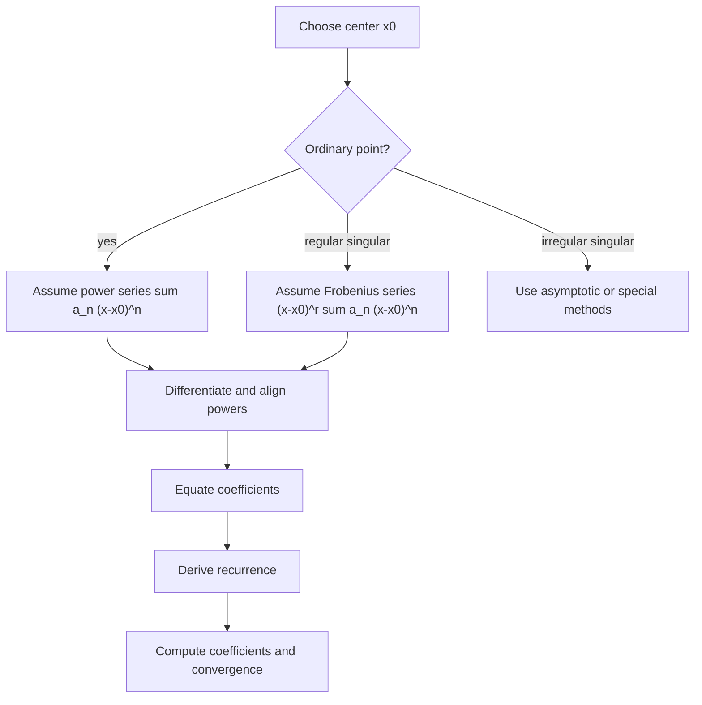

# Series Solutions of ODEs

Series methods solve differential equations near points where elementary closed forms are unavailable or inconvenient. Instead of guessing exponentials or trigonometric functions, we assume the solution has a power series and determine its coefficients recursively. This turns a differential equation into algebra on sequences.

The method is central in engineering mathematics because many special functions, including Bessel and Legendre functions, arise as series solutions of variable-coefficient ODEs. Series also give local approximations for numerical work, asymptotic analysis, and checking software results near singular points.

## Definitions

A power series centered at $x_0$ is

$$
y=\sum_{n=0}^{\infty}a_n(x-x_0)^n.
$$

It can be differentiated term by term inside its interval of convergence:

$$
\begin{aligned}
y'&=\sum_{n=1}^{\infty}n a_n(x-x_0)^{n-1},\\
y''&=\sum_{n=2}^{\infty}n(n-1)a_n(x-x_0)^{n-2}.
\end{aligned}
$$

For a second-order linear equation

$$
y''+p(x)y'+q(x)y=0,
$$

an ordinary point $x_0$ is a point where $p$ and $q$ are analytic. A singular point is a point where at least one of them is not analytic. A regular singular point allows the Frobenius method after writing the equation in standard form; roughly, $(x-x_0)p(x)$ and $(x-x_0)^2q(x)$ must be analytic.

The Frobenius method seeks

$$
y=(x-x_0)^r\sum_{n=0}^{\infty}a_n(x-x_0)^n,\qquad a_0\ne 0.
$$

The exponent $r$ is found from the indicial equation.

## Key results

At an ordinary point, a second-order linear equation has two linearly independent power-series solutions. The initial values $y(x_0)$ and $y'(x_0)$ usually become the free coefficients $a_0$ and $a_1$, while the differential equation recursively determines $a_2,a_3,\ldots$.

The basic workflow is mechanical but must be organized carefully. First write $y$, $y'$, and $y''$ as series. Second shift indices so every sum uses the same power $(x-x_0)^n$. Third combine coefficients of equal powers. Fourth set each coefficient equal to zero. This produces a recurrence relation.

The radius of convergence is influenced by the nearest singular point of the differential equation in the complex plane. Even if one is interested only in real $x$, complex singularities can limit convergence. This is one reason series solutions are naturally connected to complex analysis.

Frobenius solutions are needed at regular singular points. The indicial equation usually comes from the lowest power of $(x-x_0)$ after substitution. If the roots $r_1,r_2$ differ by a noninteger, two Frobenius series normally result. If the roots are equal or differ by an integer, the second solution may involve a logarithm. This is a structural warning, not a computational failure.

Series approximations should be checked by substitution up to the computed order. If a truncated polynomial is used, the residual should be small to the expected order, not exactly zero. The recurrence determines the infinite series; truncation creates an approximation.

Series methods also expose parity. If a recurrence connects $a_{n+2}$ to $a_n$, then even and odd coefficients decouple. One solution may contain only even powers and another only odd powers. This is common for equations symmetric about the expansion point.

The ordinary-point method can be viewed as matching infinitely many Taylor coefficients. For an analytic solution, the differential equation determines higher derivatives from lower derivatives. At the center, the initial values give $a_0=y(x_0)$ and $a_1=y'(x_0)$. Substituting the series into the equation is a systematic way to compute $y''(x_0)$, $y'''(x_0)$, and so on without repeatedly differentiating the original equation by hand.

Index management is the technical heart of the method. A sum that begins at $n=2$ can be reindexed to begin at $n=0$, but the coefficients and powers must both change. Many wrong recurrences come from changing the exponent but not the coefficient, or from combining a constant term into a summation that actually starts at $n=1$. Writing out the first few terms before compressing them into sigma notation is often the safest approach.

The choice of center matters. A series about $x_0=0$ may converge poorly at a point far away even when a series about a nearby center converges rapidly. In computation, one can use analytic continuation: evaluate a series inside its convergence disk, recenter at a new point, and continue. This idea underlies some high-accuracy ODE solvers and also explains why singularities control convergence.

Regular singular points are common in problems with cylindrical or spherical symmetry because coefficients such as $1/x$ or $1/x^2$ appear after separation of variables. Frobenius' extra exponent $r$ captures leading power-law behavior that an ordinary Taylor series would miss. The condition $a_0\ne 0$ prevents the same solution from being represented with a shifted exponent in a redundant way.

The indicial equation should be formed only from the lowest power terms after substitution. Higher powers determine the recurrence, not the leading exponent. If the indicial roots are $r_1$ and $r_2$, the larger root often gives the solution that remains better behaved near the singular point. In physical applications, boundary or finiteness conditions may reject the more singular branch.

Series are also useful for approximating special functions numerically. Tables and library functions for Bessel, Legendre, and Airy functions are built from combinations of series, asymptotic formulas, recurrence relations, and numerical integration. Understanding the series construction helps explain why different algorithms are used in different regions of the input domain.

When a recurrence contains parameters, special parameter values may cause the series to terminate. A terminating power series is a polynomial solution. Legendre polynomials arise this way: requiring bounded polynomial behavior selects certain parameter values. This is an early example of an eigenvalue condition, and it connects series methods to Sturm-Liouville theory.

## Visual



| Point type | Test in normalized equation | Usual series form |
|---|---|---|
| Ordinary | $p,q$ analytic at $x_0$ | $\sum a_n(x-x_0)^n$ |
| Regular singular | $(x-x_0)p$, $(x-x_0)^2q$ analytic | $(x-x_0)^r\sum a_n(x-x_0)^n$ |
| Irregular singular | Fails regular singular test | Problem-specific asymptotics |

## Worked example 1: Power series for Airy-type equation

Problem. Find a recurrence for

$$
y''-xy=0
$$

about $x_0=0$.

Method.

1. Assume

$$
y=\sum_{n=0}^{\infty}a_nx^n.
$$

2. Then

$$
y''=\sum_{n=2}^{\infty}n(n-1)a_nx^{n-2}.
$$

3. Reindex $y''$ using $k=n-2$:

$$
y''=\sum_{k=0}^{\infty}(k+2)(k+1)a_{k+2}x^k.
$$

4. Also

$$
xy=\sum_{n=0}^{\infty}a_nx^{n+1}=\sum_{k=1}^{\infty}a_{k-1}x^k.
$$

5. Substitute into $y''-xy=0$:

$$
2a_2+\sum_{k=1}^{\infty}\left[(k+2)(k+1)a_{k+2}-a_{k-1}\right]x^k=0.
$$

6. Equate coefficients:

$$
2a_2=0,\qquad (k+2)(k+1)a_{k+2}=a_{k-1}\quad (k\ge 1).
$$

Answer.

$$
a_2=0,\qquad a_{k+2}=\frac{a_{k-1}}{(k+2)(k+1)}\quad (k\ge 1).
$$

Check. The free coefficients are $a_0$ and $a_1$, as expected for a second-order equation.

The recurrence also separates the coefficients into three chains because it relates $a_{k+2}$ to $a_{k-1}$. Starting from $a_0$ produces coefficients $a_3,a_6,\ldots$, starting from $a_1$ produces $a_4,a_7,\ldots$, and $a_2=0$ forces the third chain $a_2,a_5,a_8,\ldots$ to vanish. This structure is easy to miss if the recurrence is used only mechanically.

## Worked example 2: Frobenius indicial equation

Problem. Find the indicial equation for

$$
x^2y''+xy'+(x^2-\nu^2)y=0
$$

at $x=0$.

Method.

1. This is Bessel's equation. Try

$$
y=x^r\sum_{n=0}^{\infty}a_nx^n,\qquad a_0\ne 0.
$$

2. The lowest-order behavior comes from the leading term $a_0x^r$.

3. Compute leading derivatives:

$$
y'\sim a_0r x^{r-1},\qquad y''\sim a_0r(r-1)x^{r-2}.
$$

4. Substitute only the lowest-power contributions:

$$
x^2y''+xy'-\nu^2y\sim a_0[r(r-1)+r-\nu^2]x^r.
$$

5. Simplify:

$$
r(r-1)+r-\nu^2=r^2-\nu^2.
$$

6. Set the coefficient to zero:

$$
a_0(r^2-\nu^2)=0.
$$

Since $a_0\ne 0$,

$$
r^2-\nu^2=0.
$$

Answer.

$$
r=\pm \nu.
$$

Check. These exponents match the known leading behaviors of Bessel functions near the origin.

If $\nu\gt 0$, the $r=-\nu$ branch is usually more singular at $x=0$ than the $r=\nu$ branch. In boundary-value problems on a disk or cylinder, finiteness at the origin often selects the less singular solution. The differential equation alone gives both formal branches; the physical or boundary condition decides which one is admissible.

## Code

```python
from fractions import Fraction

def airy_coefficients(a0, a1, terms):
    coeffs = [Fraction(0) for _ in range(terms)]
    coeffs[0] = Fraction(a0)
    coeffs[1] = Fraction(a1)
    if terms > 2:
        coeffs[2] = Fraction(0)
    for k in range(1, terms - 2):
        coeffs[k + 2] = coeffs[k - 1] / ((k + 2) * (k + 1))
    return coeffs

print(airy_coefficients(1, 0, 10))
print(airy_coefficients(0, 1, 10))
```

The function returns exact rational coefficients for the two independent series determined by $(a_0,a_1)=(1,0)$ and $(0,1)`. Exact arithmetic is useful while deriving a recurrence because it avoids hiding a wrong denominator behind decimal roundoff. For plotting, the fractions can be converted to floating-point values.

## Common pitfalls

- Forgetting to shift indices so powers match before equating coefficients.
- Treating a truncated series as an exact solution.
- Assuming $a_0$ and $a_1$ are always both free at a singular point.
- Dividing by an expression in the recurrence without checking when it may vanish.
- Ignoring the interval or radius of convergence.
- Confusing ordinary, regular singular, and irregular singular points.
- Missing logarithmic second solutions in repeated-root or integer-difference Frobenius cases.
- Assuming the nearest real singularity always controls convergence. Complex singularities can be closer to the expansion point.
- Forgetting that a recurrence may determine only every other coefficient, leaving even and odd solution families separate.
- Choosing a center at a singular point and then trying an ordinary Taylor series without first testing the point type.

## Connections

- [Special Functions: Legendre and Bessel](/math/engineering-math/special-functions-legendre-bessel)
- [Second-Order Linear ODEs](/math/engineering-math/second-order-linear-odes)
- [Complex Functions and Analyticity](/math/engineering-math/complex-functions-and-analyticity)
- [Orthogonal Functions and Sturm-Liouville Problems](/math/engineering-math/orthogonal-functions-and-sturm-liouville)
