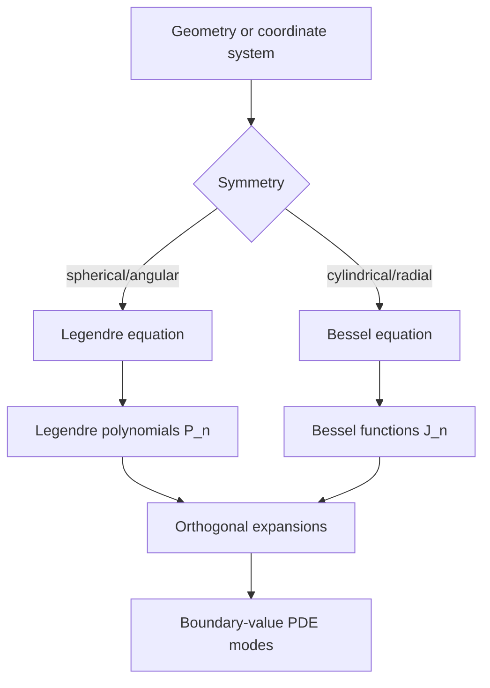

# Legendre and Bessel Functions

Legendre and Bessel functions are special functions because they solve recurring differential equations from geometry. Legendre functions appear with spherical symmetry, angular variables, and expansions on $[-1,1]$. Bessel functions appear with cylindrical symmetry, radial vibration, heat flow in disks, and wave propagation in circular domains.

The important lesson is that special functions are not arbitrary new objects. They are named solution families with well-studied series, orthogonality, recurrence relations, and zeros. In engineering mathematics they play the same role that sine and cosine play for rectangular domains: they provide modes adapted to the geometry and boundary conditions.

## Definitions

Legendre's differential equation is

$$
(1-x^2)y''-2xy'+n(n+1)y=0.
$$

For nonnegative integer $n$, the polynomial solution is the Legendre polynomial $P_n(x)$. The first few are

$$
\begin{aligned}
P_0(x)&=1,\\
P_1(x)&=x,\\
P_2(x)&=\frac{1}{2}(3x^2-1).
\end{aligned}
$$

Bessel's equation of order $\nu$ is

$$
x^2y''+xy'+(x^2-\nu^2)y=0.
$$

The standard solution that is finite at $x=0$ for $\nu\ge 0$ is the Bessel function of the first kind $J_\nu(x)$. For integer order $n$,

$$
J_n(x)=\sum_{m=0}^{\infty}\frac{(-1)^m}{m!(m+n)!}\left(\frac{x}{2}\right)^{2m+n}.
$$

Orthogonality means that different modes have zero inner product with respect to the correct weight. For Legendre polynomials,

$$
\int_{-1}^{1}P_m(x)P_n(x)\,dx=0,\qquad m\ne n.
$$

For Bessel functions in radial problems, orthogonality usually involves the weight $r$ on $0\le r\le R$.

## Key results

Legendre polynomials satisfy Rodrigues' formula:

$$
P_n(x)=\frac{1}{2^n n!}\frac{d^n}{dx^n}(x^2-1)^n.
$$

They also satisfy

$$
P_n(1)=1,\qquad P_n(-1)=(-1)^n.
$$

The parity is simple: $P_n$ is even when $n$ is even and odd when $n$ is odd. This parity helps simplify expansions of even or odd functions on $[-1,1]$.

Legendre expansion coefficients are computed by projection:

$$
f(x)\sim \sum_{n=0}^{\infty}a_nP_n(x),\qquad
a_n=\frac{2n+1}{2}\int_{-1}^{1}f(x)P_n(x)\,dx.
$$

Bessel functions arise from the Frobenius method at the regular singular point $x=0$. The indicial roots are $\pm\nu$, and the $J_\nu$ branch corresponds to the $+\nu$ behavior. When boundary conditions require finiteness at the origin, the more singular branch is often rejected.

Zeros of Bessel functions determine radial eigenvalues. If a circular membrane of radius $R$ is fixed at the boundary, radial modes satisfy $J_n(\alpha R)=0$. The allowed values of $\alpha$ are therefore zeros of $J_n$. This is the circular-domain analog of $n\pi/L$ for sine modes on an interval.

Recurrence relations make computation and analysis practical. For Bessel functions,

$$
J_{n-1}(x)+J_{n+1}(x)=\frac{2n}{x}J_n(x),
$$

and

$$
J_{n-1}(x)-J_{n+1}(x)=2J_n'(x).
$$

These formulas connect neighboring orders and derivatives. They are used in numerical libraries and in applying derivative boundary conditions.

Special functions should be treated as precise mathematical objects, not as black boxes. Their normalization, weight function, and boundary behavior matter. Two sources may use different conventions for associated Legendre functions or spherical Bessel functions, so always check the definition before using a table.

The geometry explains the weight functions. In spherical coordinates, angular integrals lead to weights such as $1$ or $\sin\theta$ after a change of variables. In polar coordinates, the area element is $r\,dr\,d\theta$, which is why radial Bessel orthogonality contains the factor $r$. Forgetting the weight changes the coefficients and destroys orthogonality.

Legendre polynomials are also eigenfunctions of a Sturm-Liouville problem:

$$
-\frac{d}{dx}\left((1-x^2)y'\right)=n(n+1)y.
$$

The endpoint coefficient $1-x^2$ vanishes at $x=\pm 1$, which is why the natural interval is $[-1,1]$. The eigenvalue parameter $n(n+1)$ becomes discrete when regularity at both endpoints is required. This is typical of separated boundary-value problems: geometry and endpoint conditions select a countable set of admissible modes.

Bessel functions play a parallel role in polar coordinates. When the Laplacian is written in polar form, separation with an angular factor $\cos n\theta$ or $\sin n\theta$ leaves a radial equation. After scaling the radial variable, that equation becomes Bessel's equation. The order $n$ comes from angular periodicity, while the allowed radial wavenumbers come from boundary conditions at $r=R$.

Zeros deserve special attention because they become eigenvalues after scaling. If $j_{n,k}$ is the $k$th positive zero of $J_n$, then $J_n(j_{n,k}r/R)$ vanishes at $r=R$. The index $n$ counts angular variation, and $k$ counts radial nodes. A mode with larger $k$ oscillates more rapidly in the radial direction. A mode with larger $n$ has more angular nodal lines.

The normalization of modes is often chosen for convenience. Legendre polynomials are usually normalized by $P_n(1)=1$, not by unit length in the inner product. Bessel radial modes are often left unnormalized until coefficients are computed. When expanding a function, the denominator of the projection coefficient must use the actual norm of the selected mode, not an assumed value of $1$.

In numerical work, recurrence relations can be stable in one direction and unstable in another. Computing high-order Bessel functions by forward recurrence may lose accuracy for some ranges of $x$ and $n$. Scientific libraries choose algorithms depending on the order and argument. This is another reason to use tested implementations for production computation while learning the series and recurrence formulas for interpretation.

Legendre and Bessel functions also encode qualitative information. The number and location of zeros determine nodal lines, which are places where a vibrating membrane or standing wave is motionless. Orthogonality means that energy or squared error can be decomposed by mode. Smooth data usually produce rapidly decaying expansion coefficients, while discontinuities or sharp boundary layers require many modes.

## Visual



| Function family | Typical domain | Weight | Common boundary role |
|---|---|---|---|
| $P_n(x)$ | $-1\le x\le 1$ | $1$ | Angular modes in spherical problems |
| $J_n(\alpha r)$ | $0\le r\le R$ | $r$ | Radial modes in disks and cylinders |
| $\cos(n\pi x/L)$ | $0\le x\le L$ | $1$ | Rectangular Neumann modes |
| $\sin(n\pi x/L)$ | $0\le x\le L$ | $1$ | Rectangular Dirichlet modes |

## Worked example 1: Legendre projection

Problem. Approximate $f(x)=x^2$ on $[-1,1]$ using Legendre polynomials.

Method.

1. Use

$$
P_0=1,\qquad P_2=\frac{1}{2}(3x^2-1).
$$

2. Solve the formula for $x^2$ in terms of $P_0$ and $P_2$:

$$
2P_2=3x^2-1.
$$

3. Rearrange:

$$
3x^2=2P_2+1.
$$

4. Since $P_0=1$,

$$
x^2=\frac{1}{3}P_0+\frac{2}{3}P_2.
$$

Answer.

$$
x^2=\frac{1}{3}P_0(x)+\frac{2}{3}P_2(x).
$$

Check. Substitute $P_2=(3x^2-1)/2$:

$$
\frac{1}{3}+\frac{2}{3}\cdot\frac{3x^2-1}{2}
=\frac{1}{3}+x^2-\frac{1}{3}=x^2.
$$

This example is exact because $x^2$ is already a polynomial of degree two. A more complicated function would have infinitely many Legendre coefficients. Orthogonality guarantees that the coefficient of $P_n$ can be found independently by projection, without solving a coupled linear system for all coefficients at once.

## Worked example 2: First terms of a Bessel function

Problem. Write the first three nonzero terms of $J_0(x)$.

Method.

1. Use the series for $n=0$:

$$
J_0(x)=\sum_{m=0}^{\infty}\frac{(-1)^m}{(m!)^2}\left(\frac{x}{2}\right)^{2m}.
$$

2. For $m=0$:

$$
\frac{(-1)^0}{(0!)^2}\left(\frac{x}{2}\right)^0=1.
$$

3. For $m=1$:

$$
\frac{-1}{(1!)^2}\left(\frac{x}{2}\right)^2=-\frac{x^2}{4}.
$$

4. For $m=2$:

$$
\frac{1}{(2!)^2}\left(\frac{x}{2}\right)^4
=\frac{1}{4}\cdot\frac{x^4}{16}
=\frac{x^4}{64}.
$$

Answer.

$$
J_0(x)=1-\frac{x^2}{4}+\frac{x^4}{64}+\cdots.
$$

Check. The derivative at $0$ is $0$, consistent with the evenness of $J_0$.

The approximation is most accurate near the origin because it was derived from a series centered there. For larger $x$, more terms are needed, and oscillatory asymptotic formulas may be more efficient. This local-versus-global issue is one reason special-function libraries combine several methods internally.

## Code

```python
import numpy as np
from scipy.special import eval_legendre, jn_zeros, jv

x = np.linspace(-1.0, 1.0, 5)
print(eval_legendre(2, x))

zeros = jn_zeros(0, 3)
print("first zeros of J0:", zeros)
print("J0 at first zero:", jv(0, zeros[0]))
```

The code evaluates $P_2$ and the first zeros of $J_0$. In a circular membrane problem with radius $R=1$, those zeros are the first radial wavenumbers for axisymmetric modes with a fixed boundary. For a different radius, the wavenumbers scale as zero divided by $R$.

For coefficient calculations, software can evaluate the functions but the mathematical normalization still has to come from the model. A radial expansion on a disk integrates with $r\,dr$, while a one-dimensional Legendre expansion integrates with $dx$. Using the wrong inner product may still produce numbers, but they will not be the expansion coefficients for the intended problem.

## Common pitfalls

- Forgetting the weight function in orthogonality integrals, especially the radial weight $r$ for Bessel modes.
- Assuming every solution of Legendre's equation is a polynomial. Polynomial behavior occurs for special integer parameters.
- Using Bessel zeros for the wrong boundary condition; derivative conditions use zeros of $J_n'$ instead of $J_n$.
- Mixing ordinary Bessel functions with spherical Bessel functions without changing definitions.
- Dropping the singular solution without checking whether the domain includes the origin.
- Expecting special functions to simplify to elementary functions in general.
- Ignoring normalization conventions when comparing tables, software, and textbooks.
- Treating zeros as interchangeable across orders. A zero of $J_0$ is generally not a zero of $J_1$.
- Forgetting that physical boundary conditions determine whether $J_n$, $J_n'$, or another combination supplies the eigenvalue equation.
- Assuming a finite polynomial expansion when the target function is not itself a polynomial of bounded degree.
- Expanding a radial function without checking behavior at the origin. Regularity at $r=0$ often removes one formal solution branch.
- Comparing modal amplitudes without accounting for the norm of each mode under the correct weighted inner product.
- Rounding roots too early in downstream eigenvalue calculations.

## Connections

- [Series Solutions of ODEs](/math/engineering-math/series-solutions)
- [Orthogonal Functions and Sturm-Liouville Problems](/math/engineering-math/orthogonal-functions-and-sturm-liouville)
- [PDEs by Separation of Variables](/math/engineering-math/pdes-separation-of-variables)
- [Wave and Heat Equations](/math/engineering-math/wave-and-heat-equations)
