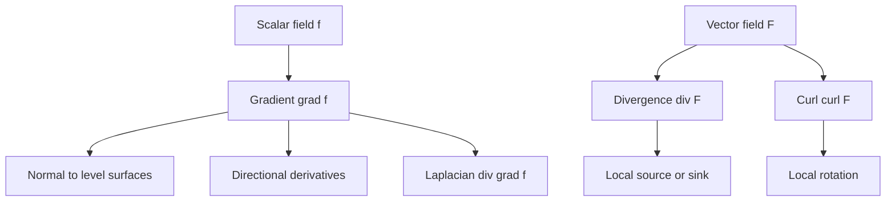

# Vector Differential Calculus

Vector differential calculus describes how scalar and vector fields change in space. Gradients point in directions of greatest increase, divergence measures local source strength, and curl measures local rotation. These operations are the local language behind fluid flow, electromagnetism, heat transfer, mechanics, and geometry.

This topic extends multivariable calculus into a compact operator notation. The same symbol $\nabla$ produces different objects depending on whether it acts on a scalar field or a vector field. Understanding the type of each expression prevents many mistakes and prepares the ground for line, surface, and volume integral theorems.

## Definitions

For a scalar field $f(x,y,z)$, the gradient is

$$
\nabla f=
\begin{bmatrix}
f_x\\ f_y\\ f_z
\end{bmatrix}.
$$

It points in the direction of steepest increase, and the directional derivative in the unit direction $\mathbf{u}$ is

$$
D_{\mathbf{u}}f=\nabla f\cdot \mathbf{u}.
$$

For a vector field

$$
\mathbf{F}=\langle P,Q,R\rangle,
$$

the divergence is

$$
\nabla\cdot \mathbf{F}=P_x+Q_y+R_z,
$$

and the curl is

$$
\nabla\times \mathbf{F}=
\begin{bmatrix}
R_y-Q_z\\
P_z-R_x\\
Q_x-P_y
\end{bmatrix}.
$$

The Laplacian of a scalar field is

$$
\nabla^2 f=\nabla\cdot\nabla f=f_{xx}+f_{yy}+f_{zz}.
$$

A level surface is $f(x,y,z)=c$. Its normal direction is $\nabla f$ when the gradient is nonzero.

## Key results

The gradient is perpendicular to level surfaces. If a curve $\mathbf{r}(t)$ lies on $f=c$, then $f(\mathbf{r}(t))=c$. Differentiating gives

$$
\nabla f(\mathbf{r}(t))\cdot \mathbf{r}'(t)=0,
$$

so the gradient is orthogonal to every tangent direction of the level surface.

Divergence measures infinitesimal flux per unit volume. Positive divergence indicates a local source, negative divergence indicates a local sink, and zero divergence indicates incompressibility in fluid-flow language. This interpretation becomes exact through the divergence theorem in vector integral calculus.

Curl measures infinitesimal circulation per unit area. If the curl is zero in a simply connected region, a vector field may be conservative. In three dimensions, a conservative field has the form

$$
\mathbf{F}=\nabla \phi,
$$

and then

$$
\nabla\times \mathbf{F}=\nabla\times\nabla\phi=\mathbf{0}.
$$

The converse requires domain assumptions. A field can have zero curl on a region with a hole and still fail to have a single-valued potential. This is a local-versus-global issue that also appears in complex analysis.

Useful identities include

$$
\nabla\cdot(\nabla\times\mathbf{F})=0
$$

and

$$
\nabla\times(\nabla f)=\mathbf{0}.
$$

These identities assume sufficient smoothness so mixed partial derivatives agree. They also show why not every vector field can be a curl and not every vector field can be a gradient.

Coordinate systems matter. The formulas above are Cartesian. Cylindrical and spherical coordinates have scale factors, so divergence, curl, and Laplacian acquire additional terms. Many engineering problems become simpler in adapted coordinates, but only if the correct coordinate formulas are used.

The Jacobian matrix generalizes the derivative of a vector-valued function. For $\mathbf{F}:\mathbb{R}^n\to\mathbb{R}^m$, the Jacobian contains all first partial derivatives. Linearization near a point uses this matrix to approximate the field, which is exactly what happens when nonlinear ODE systems are linearized around equilibria.

Vector differential operators also encode physical laws. Heat conduction uses gradients to model flux from hot to cold. Incompressible flow uses zero divergence. Irrotational flow uses zero curl. Electrostatics uses fields that are gradients of potentials, while magnetostatics involves curls. The same calculus symbols therefore carry both geometric and physical meaning.

Directional derivatives are constrained by the Cauchy-Schwarz inequality. If $\mathbf{u}$ is a unit vector, then

$$
D_{\mathbf{u}}f=\nabla f\cdot\mathbf{u}\le \|\nabla f\|.
$$

Equality occurs when $\mathbf{u}$ points in the gradient direction. This proves the steepest-increase interpretation and also shows that $-\nabla f$ is the direction of steepest decrease. Optimization algorithms such as gradient descent are built on this local fact, although practical algorithms must also choose step sizes and handle curvature.

Divergence can be understood by looking at a tiny box. The $x$-component $P$ contributes net outward flux through the two faces perpendicular to the $x$-axis, and the difference between those face fluxes is approximately $P_x$ times the volume. The $y$ and $z$ directions contribute $Q_y$ and $R_z$. Adding them gives flux per unit volume. This local box argument is the infinitesimal version of the divergence theorem.

Curl has a similar small-loop interpretation. The component of $\nabla\times\mathbf{F}$ in a chosen normal direction measures circulation per unit area around a tiny loop perpendicular to that normal. The right-hand rule fixes the sign. This is why curl is a vector in three dimensions: it records both the axis and the orientation of local rotation.

Conservative fields are path-independent. If $\mathbf{F}=\nabla\phi$, then moving from point $A$ to point $B$ changes the potential by $\phi(B)-\phi(A)$, regardless of path. In mechanics, a conservative force has work determined only by endpoints. The local curl test is a fast diagnostic, but the global domain condition decides whether a potential exists everywhere on the region.

The Laplacian combines second derivatives and measures how a value compares with nearby averages. In heat flow, $\nabla^2T$ drives diffusion. In electrostatics and gravitation, Laplace's equation $\nabla^2\phi=0$ describes source-free potential regions. Harmonic functions, which satisfy Laplace's equation, have strong maximum principles and are tightly connected to analytic functions in two dimensions.

For vector fields depending on time as well as space, spatial operators are applied with time held fixed. A velocity field $\mathbf{v}(x,y,z,t)$ can have divergence and curl at each instant. The material derivative used in fluid mechanics adds a separate idea: the rate of change following a moving particle. Keeping these derivatives distinct prevents mixing Eulerian and Lagrangian descriptions.

## Visual



| Operator | Input | Output | Local meaning |
|---|---|---|---|
| $\nabla f$ | Scalar field | Vector field | Steepest increase direction |
| $\nabla\cdot\mathbf{F}$ | Vector field | Scalar field | Source density |
| $\nabla\times\mathbf{F}$ | Vector field in 3D | Vector field | Rotation axis and strength |
| $\nabla^2 f$ | Scalar field | Scalar field | Diffusion or potential balance |

## Worked example 1: Gradient and tangent plane

Problem. Find the tangent plane to

$$
f(x,y,z)=x^2+y^2+z^2=14
$$

at $(1,2,3)$.

Method.

1. Compute the gradient:

$$
\nabla f=\langle 2x,2y,2z\rangle.
$$

2. Evaluate at the point:

$$
\nabla f(1,2,3)=\langle 2,4,6\rangle.
$$

3. This vector is normal to the level surface.

4. A plane through $(1,2,3)$ with normal $\langle 2,4,6\rangle$ is

$$
2(x-1)+4(y-2)+6(z-3)=0.
$$

5. Simplify:

$$
2x+4y+6z=28,
$$

or

$$
x+2y+3z=14.
$$

Answer.

$$
x+2y+3z=14.
$$

Check. The point satisfies $1+4+9=14$, and the normal is radial, as expected for a sphere centered at the origin.

The same method works for any smooth implicit surface $f=c$. If $\nabla f$ vanishes at the point, the tangent-plane formula may fail because the surface can have a singular point or multiple tangent directions. Thus the nonzero-gradient condition is part of the geometric statement, not a technical afterthought.

## Worked example 2: Divergence and curl

Problem. For

$$
\mathbf{F}=\langle yz,xz,xy\rangle,
$$

compute divergence and curl.

Method.

1. Identify components:

$$
P=yz,\qquad Q=xz,\qquad R=xy.
$$

2. Divergence:

$$
\nabla\cdot\mathbf{F}=P_x+Q_y+R_z.
$$

3. Compute each partial:

$$
P_x=0,\qquad Q_y=0,\qquad R_z=0.
$$

Thus

$$
\nabla\cdot\mathbf{F}=0.
$$

4. Curl:

$$
\nabla\times\mathbf{F}=
\langle R_y-Q_z,\; P_z-R_x,\; Q_x-P_y\rangle.
$$

5. Compute:

$$
R_y=x,\quad Q_z=x,
$$

$$P_z=y,\quad R_x=y,$$

$$
Q_x=z,\quad P_y=z.
$$

6. Therefore

$$
\nabla\times\mathbf{F}=\langle 0,0,0\rangle.
$$

Answer.

$$
\nabla\cdot\mathbf{F}=0,\qquad \nabla\times\mathbf{F}=\mathbf{0}.
$$

Check. The field is $\nabla(xyz)$, so its curl should be zero. Its divergence is $\nabla^2(xyz)=0$.

Because the field is both divergence-free and curl-free, it is locally a harmonic potential gradient. This does not mean every field with one of those properties has the other. Divergence and curl measure different aspects of a vector field, and both are needed to describe local behavior.

## Code

```python
import sympy as sp

x, y, z = sp.symbols("x y z")
F = sp.Matrix([y*z, x*z, x*y])

divF = sp.diff(F[0], x) + sp.diff(F[1], y) + sp.diff(F[2], z)
curlF = sp.Matrix([
    sp.diff(F[2], y) - sp.diff(F[1], z),
    sp.diff(F[0], z) - sp.diff(F[2], x),
    sp.diff(F[1], x) - sp.diff(F[0], y),
])

print(divF)
print(curlF)
```

The symbolic calculation is useful for checking signs in the curl. In hand work, write the component formula explicitly rather than relying on a remembered determinant pattern, because sign errors in the middle component are common.

## Common pitfalls

- Taking curl of a scalar field or divergence of a scalar field. Check input and output types.
- Forgetting that $\nabla f$ is normal to a level surface, not tangent to it.
- Using Cartesian formulas in cylindrical or spherical coordinates without scale factors.
- Assuming zero curl implies a potential without checking the domain.
- Reversing signs in the curl formula, especially the second component.
- Treating divergence as ordinary derivative of a vector rather than a scalar source measure.
- Ignoring units; gradient, divergence, and curl usually have different physical units.
- Forgetting smoothness assumptions behind identities involving mixed partial derivatives.
- Assuming a zero gradient means a maximum. It can also indicate a minimum, saddle, or flat region.
- Confusing the Laplacian of a scalar field with the vector Laplacian used in some advanced vector PDEs.
- Forgetting that curl direction follows the right-hand rule.

## Connections

- [Vector Integral Calculus](/math/engineering-math/vector-integral-calculus)
- [Laplace Equation and Potential](/math/engineering-math/laplace-equation-and-potential)
- [Systems of ODEs and Phase Planes](/math/engineering-math/systems-of-odes-and-phase-plane)
- [Complex Functions and Analyticity](/math/engineering-math/complex-functions-and-analyticity)
