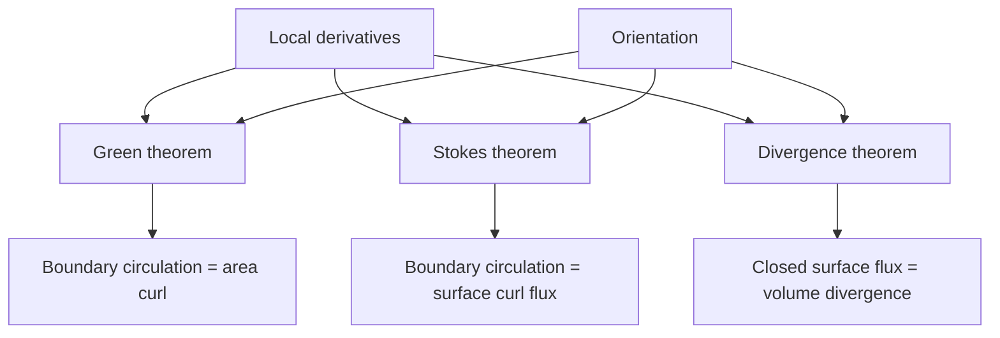

# Vector Integral Calculus

Vector integral calculus turns local vector-field information into global statements over curves, surfaces, and volumes. Line integrals measure accumulated work or circulation, surface integrals measure flux, and the major integral theorems connect these integrals to gradient, divergence, and curl.

The subject is the global partner of vector differential calculus. Green's theorem, Stokes' theorem, and the divergence theorem are not isolated formulas; they are different forms of the same idea: a total boundary effect equals the accumulation of a local derivative inside.

## Definitions

For a vector field $\mathbf{F}$ and a parametrized curve $\mathbf{r}(t)$, $a\le t\le b$, the line integral for work is

$$
\int_C \mathbf{F}\cdot d\mathbf{r}
=\int_a^b \mathbf{F}(\mathbf{r}(t))\cdot \mathbf{r}'(t)\,dt.
$$

For a scalar field $f$, the scalar line integral is

$$
\int_C f\,ds=\int_a^b f(\mathbf{r}(t))\|\mathbf{r}'(t)\|\,dt.
$$

For an oriented surface $\mathbf{r}(u,v)$, the flux integral is

$$
\iint_S \mathbf{F}\cdot \mathbf{n}\,dS
=\iint_D \mathbf{F}(\mathbf{r}(u,v))\cdot(\mathbf{r}_u\times\mathbf{r}_v)\,du\,dv.
$$

Orientation matters. Reversing a curve reverses the sign of a work integral. Reversing a surface normal reverses the sign of a flux integral.

A conservative field has the form $\mathbf{F}=\nabla\phi$. Then the fundamental theorem for line integrals says

$$
\int_C \nabla\phi\cdot d\mathbf{r}=\phi(B)-\phi(A),
$$

where $A$ and $B$ are the endpoints of $C$.

## Key results

Green's theorem in the plane states that for a positively oriented simple closed curve $C$ bounding a region $D$,

$$
\oint_C P\,dx+Q\,dy=\iint_D(Q_x-P_y)\,dA.
$$

It converts circulation around a boundary into the integral of scalar curl over the region.

Stokes' theorem generalizes this to surfaces:

$$
\oint_{\partial S}\mathbf{F}\cdot d\mathbf{r}
=\iint_S(\nabla\times\mathbf{F})\cdot\mathbf{n}\,dS.
$$

The orientation of $\partial S$ and the normal $\mathbf{n}$ must follow the right-hand rule. Changing one without changing the other changes the sign.

The divergence theorem states

$$
\iint_{\partial V}\mathbf{F}\cdot\mathbf{n}\,dS
=\iiint_V\nabla\cdot\mathbf{F}\,dV,
$$

where $\mathbf{n}$ is the outward normal. It converts outward flux through a closed surface into total source strength inside.

Path independence has several equivalent forms on a simply connected region: $\mathbf{F}$ is conservative, line integrals depend only on endpoints, every closed line integral is zero, and $\nabla\times\mathbf{F}=\mathbf{0}$ for sufficiently smooth fields. The simply connected hypothesis prevents holes from hiding circulation.

Choosing the right theorem is often the main skill. Direct integration can be easiest for simple parametrizations. Green's theorem can turn a difficult boundary integral into an area integral. Stokes' theorem can replace a complicated surface by a simpler surface with the same boundary. The divergence theorem can replace a hard closed-surface flux with a volume integral, or the reverse.

Integral theorems also encode conservation laws. If divergence is zero, total flux out of any closed surface is zero, meaning no net source inside. If curl is zero and the domain is suitable, circulation around closed loops vanishes. These statements are the mathematical form of physical conservation principles.

Parametrization is a tool, not the goal. A curve can be described by many parametrizations, and a surface can be described by many coordinate maps. Work integrals are independent of speed along the curve as long as orientation is preserved, because the factor $\mathbf{r}'(t)$ accounts for how fast the curve is traced. Scalar line integrals use $\|\mathbf{r}'(t)\|$, so reversing direction does not change them.

Flux integrals require more orientation care. The vector $\mathbf{r}_u\times\mathbf{r}_v$ supplies both area scaling and normal direction. Swapping $u$ and $v$ reverses the normal. For closed surfaces, "outward" is usually specified. For open surfaces, the problem must specify a normal direction or a compatible boundary orientation. If it does not, the answer is determined only up to sign.

Green's theorem has two common forms. The circulation form uses $Q_x-P_y$. The flux form uses a different boundary integral and relates outward flux to planar divergence. Both are special cases of higher-dimensional theorems. Remembering which boundary integral belongs to which derivative prevents mixing circulation and flux.

Stokes' theorem allows surface replacement. If two oriented surfaces share the same boundary curve, and the vector field is smooth on a region spanning between them, the surface integral of curl is the same for both surfaces. This is why a curved cap can sometimes be replaced by a flat disk. The replacement must keep the same boundary orientation, or the sign changes.

The divergence theorem can be used in reverse. Sometimes the flux through most of a closed surface is easy, and the desired open-surface flux is the missing piece. Close the surface with an auxiliary piece, compute the total flux by volume integration, subtract the auxiliary flux, and keep track of the induced normals. This strategy appears often with hemispheres, cylinders, and boxes.

Singularities must be excluded. If a field is not defined inside the region, the hypotheses of the theorem fail. A common example is an inverse-square field with a singularity at the origin. The divergence may be zero away from the origin, but the flux through a sphere enclosing the origin can be nonzero. In advanced treatments this is handled with distributions; in elementary vector calculus it is handled by checking the domain.

The theorems are also dimensional analogs of the fundamental theorem of calculus. In one dimension, an integral of a derivative over an interval equals boundary values at the endpoints. In two and three dimensions, derivatives such as curl and divergence integrate over regions and become boundary integrals. This unifying view makes the formulas easier to remember.

## Visual



| Integral | Domain | Measures | Related theorem |
|---|---|---|---|
| $\int_C \mathbf{F}\cdot d\mathbf{r}$ | Curve | Work or circulation | Fundamental theorem, Green, Stokes |
| $\int_C f\,ds$ | Curve | Accumulated scalar quantity | Arc length and mass |
| $\iint_S \mathbf{F}\cdot\mathbf{n}\,dS$ | Surface | Flux | Divergence theorem |
| $\iiint_V \nabla\cdot\mathbf{F}\,dV$ | Volume | Total source | Divergence theorem |

## Worked example 1: Work integral for a conservative field

Problem. Evaluate

$$
\int_C \langle 2x,2y\rangle\cdot d\mathbf{r}
$$

from $(1,0)$ to $(0,2)$.

Method.

1. Recognize the field:

$$
\mathbf{F}=\langle 2x,2y\rangle=\nabla(x^2+y^2).
$$

2. A potential is

$$
\phi(x,y)=x^2+y^2.
$$

3. Apply the fundamental theorem for line integrals:

$$
\int_C \nabla\phi\cdot d\mathbf{r}=\phi(0,2)-\phi(1,0).
$$

4. Compute endpoint values:

$$
\phi(0,2)=4,\qquad \phi(1,0)=1.
$$

Answer.

$$
\int_C \mathbf{F}\cdot d\mathbf{r}=3.
$$

Check. The answer does not depend on the path because the field is conservative on all of $\mathbb{R}^2$.

If the field had not been conservative, the path would have mattered and a parametrization of $C$ would be necessary. The potential method is therefore more than a shortcut; it identifies a structural property of the field. A quick curl test in the plane, together with a suitable domain, can indicate whether this endpoint method is available.

## Worked example 2: Flux through a cube by the divergence theorem

Problem. Let

$$
\mathbf{F}=\langle x,y,z\rangle.
$$

Find the outward flux through the surface of the cube $0\le x,y,z\le 1$.

Method.

1. Compute divergence:

$$
\nabla\cdot\mathbf{F}=1+1+1=3.
$$

2. The cube is a closed surface bounding volume $V$.

3. Apply the divergence theorem:

$$
\iint_{\partial V}\mathbf{F}\cdot\mathbf{n}\,dS
=\iiint_V3\,dV.
$$

4. The volume of the unit cube is $1$.

5. Therefore

$$
\iiint_V3\,dV=3.
$$

Answer.

The outward flux is

$$
3.
$$

Check. Directly, only the faces $x=1$, $y=1$, and $z=1$ contribute flux $1$ each; the faces at coordinate $0$ contribute zero.

The direct check also clarifies orientation. On the face $x=1$, the outward normal is $\langle 1,0,0\rangle$, so $\mathbf{F}\cdot\mathbf{n}=1$. On the face $x=0$, the outward normal is $\langle -1,0,0\rangle$, but the field has $x$-component $0$, so the flux contribution is zero.

## Code

```python
import sympy as sp

x, y, z = sp.symbols("x y z")
divF = sp.diff(x, x) + sp.diff(y, y) + sp.diff(z, z)
flux = sp.integrate(divF, (x, 0, 1), (y, 0, 1), (z, 0, 1))
print(divF)
print(flux)
```

The code verifies the divergence theorem computation for the cube. For more complicated surfaces, symbolic parametrization may be harder than using the theorem. The best method is the one that reduces the geometry and orientation burden.

For numerical surface integration, one should still verify orientation and mesh quality. A triangulated surface with inconsistent normal directions can produce severe cancellation or the wrong sign. The analytic theorems state what should be true; the computational representation must respect those hypotheses.

## Common pitfalls

- Forgetting orientation. Boundary direction and surface normal must be compatible.
- Applying the divergence theorem to an open surface instead of a closed surface.
- Applying Stokes' theorem without using the boundary curve of the chosen surface.
- Confusing scalar line integrals $\int f\,ds$ with work integrals $\int \mathbf{F}\cdot d\mathbf{r}$.
- Assuming zero curl implies path independence in a region with holes.
- Using inward normals when the divergence theorem requires outward normals.
- Parametrizing a surface correctly but reversing $\mathbf{r}_u\times\mathbf{r}_v$ relative to the desired orientation.
- Forgetting that Green's theorem needs positive orientation, usually counterclockwise for the outer boundary.
- Applying an integral theorem across a singularity where the field is not smooth.
- Omitting boundary pieces when closing an open surface.

## Connections

- [Vector Differential Calculus](/math/engineering-math/vector-differential-calculus)
- [Laplace Equation and Potential](/math/engineering-math/laplace-equation-and-potential)
- [Complex Integration and Residues](/math/engineering-math/complex-integration-and-residues)
- [PDEs by Separation of Variables](/math/engineering-math/pdes-separation-of-variables)
