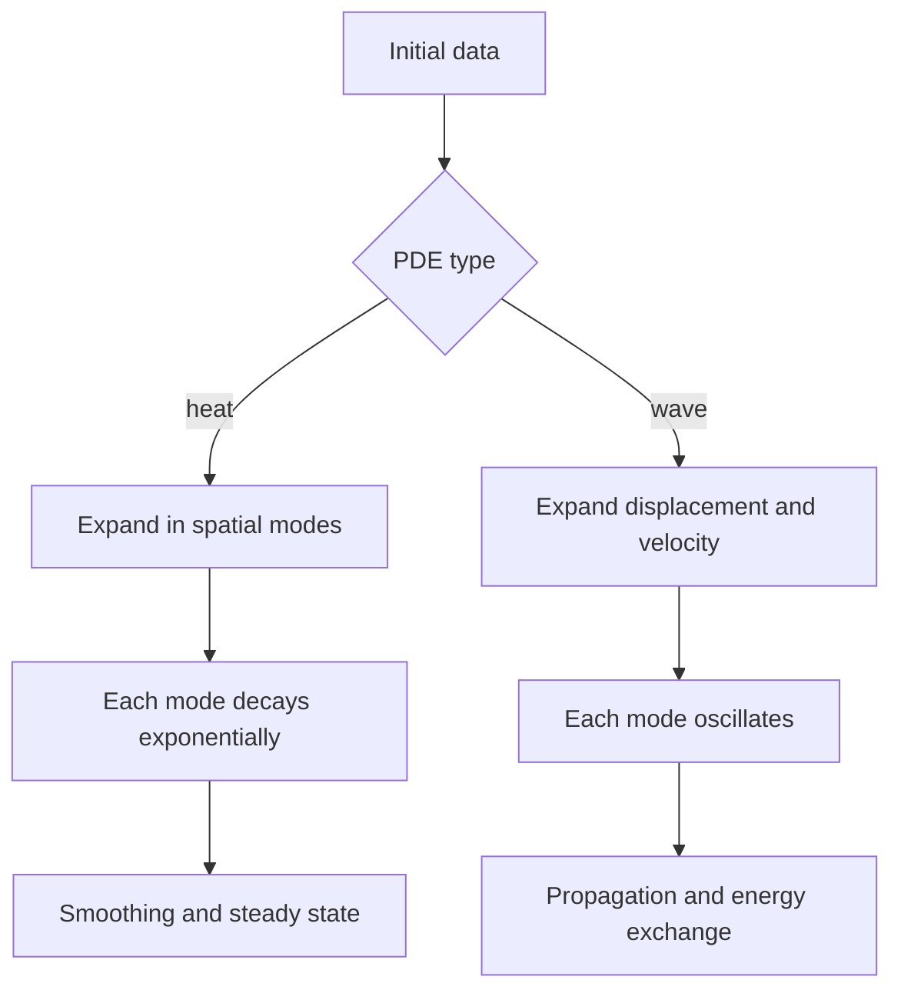

# Wave and Heat Equations

The heat equation and wave equation are the two standard time-dependent PDEs in introductory engineering mathematics. The heat equation models diffusion: temperature, concentration, or probability density smooths out over time. The wave equation models propagation: disturbances travel, reflect, and oscillate.

Both equations can be solved by separation of variables on simple bounded domains, but their time behavior is fundamentally different. Heat modes decay exponentially, while wave modes oscillate. This difference is visible in energy, smoothing, stability, and how initial data affect later behavior.

## Definitions

The one-dimensional heat equation is

$$
u_t=ku_{xx},\qquad k>0.
$$

Here $u(x,t)$ may represent temperature, and $k$ is thermal diffusivity.

The one-dimensional wave equation is

$$
u_{tt}=c^2u_{xx},\qquad c>0.
$$

Here $u(x,t)$ may represent displacement of a string, and $c$ is wave speed.

For a rod or string on $0\lt x\lt L$, common boundary conditions include Dirichlet conditions

$$
u(0,t)=u(L,t)=0,
$$

Neumann conditions

$$
u_x(0,t)=u_x(L,t)=0,
$$

and mixed conditions.

The heat equation needs one initial condition:

$$
u(x,0)=f(x).
$$

The wave equation needs two:

$$
u(x,0)=f(x),\qquad u_t(x,0)=g(x).
$$

## Key results

For the fixed-end heat equation on $0\lt x\lt L$,

$$
u_t=ku_{xx},\qquad u(0,t)=u(L,t)=0,
$$

the solution has the sine expansion

$$
u(x,t)=\sum_{n=1}^{\infty}b_ne^{-k(n\pi/L)^2t}\sin\frac{n\pi x}{L},
$$

where

$$
b_n=\frac{2}{L}\int_0^Lf(x)\sin\frac{n\pi x}{L}\,dx.
$$

Every nonzero mode decays. Higher modes decay faster, so heat flow smooths initial data rapidly.

For the fixed-end wave equation,

$$
u_{tt}=c^2u_{xx},\qquad u(0,t)=u(L,t)=0,
$$

the solution has the form

$$
u(x,t)=\sum_{n=1}^{\infty}
\left(A_n\cos\frac{cn\pi t}{L}+B_n\sin\frac{cn\pi t}{L}\right)
\sin\frac{n\pi x}{L}.
$$

The coefficients $A_n$ come from initial displacement and $B_n$ from initial velocity. Modes do not decay in the ideal undamped model; they exchange kinetic and potential energy.

D'Alembert's formula solves the wave equation on the whole line:

$$
u(x,t)=\frac{1}{2}[f(x-ct)+f(x+ct)]
+\frac{1}{2c}\int_{x-ct}^{x+ct}g(s)\,ds.
$$

It shows finite propagation speed. The value at $(x,t)$ depends only on initial data in the interval $[x-ct,x+ct]$.

The heat equation has infinite propagation speed in the classical model: a localized initial temperature affects the entire line immediately, though the effect may be extremely small far away. This reflects the idealization of diffusion and contrasts sharply with waves.

Energy behavior distinguishes the equations. For the fixed-end wave equation, an energy involving $u_t^2$ and $u_x^2$ is conserved. For the heat equation, an energy such as $\int u^2\,dx$ decreases over time under zero boundary conditions.

The heat equation is parabolic. Its solutions tend to become smoother as time increases, and boundary conditions strongly influence the long-term state. With fixed zero boundary temperature, the solution tends to zero. With insulated boundaries, the average temperature is conserved, and the solution tends to that average. With nonzero boundary temperatures, one usually subtracts the steady-state temperature profile before applying a sine or cosine expansion.

The wave equation is hyperbolic. It carries information along characteristic lines and supports reflection at boundaries. Fixed endpoints reflect waves with sign changes in displacement, while free endpoints reflect differently. The ideal equation has no damping, so oscillations persist forever unless damping, forcing, or energy loss is added to the model.

Fourier modes make both equations look like many independent scalar equations. For heat, mode $n$ satisfies

$$
a_n'(t)=-k\lambda_n a_n(t),
$$

so it decays. For waves, mode $n$ satisfies

$$
a_n''(t)+c^2\lambda_n a_n(t)=0,
$$

so it oscillates. The same spatial eigenvalue $\lambda_n$ therefore produces different time dynamics depending on the PDE.

Boundary conditions should match the physical setup. A fixed string end has displacement zero. An insulated rod end has heat flux zero, which often becomes $u_x=0$. A prescribed boundary temperature is Dirichlet, while a prescribed heat flux is Neumann. Mixed or Robin conditions model heat exchange with the environment and lead to different eigenvalue equations.

The constants $k$ and $c$ have different units and meanings. Thermal diffusivity $k$ controls the rate at which gradients smooth out. Wave speed $c$ controls the speed of propagation. If a formula puts $c^2$ in a heat exponent or $k$ in a wave frequency, the units will usually reveal the error.

On finite intervals, Fourier-series solutions must be interpreted at discontinuities using the usual convergence rules. A discontinuous initial temperature can be represented by a sine series, but at the jump the series initially converges to the midpoint value. For $t\gt 0$, the heat solution becomes smooth. A discontinuous initial displacement for the wave equation can propagate corners or discontinuities along characteristic directions in weaker solution settings.

Numerical methods also differ. Explicit finite-difference schemes for heat equations face stability restrictions involving $\Delta t/(\Delta x)^2$. Wave schemes face restrictions involving the Courant number $c\Delta t/\Delta x$. These restrictions reflect the different mathematical types of the equations, and ignoring them can produce unstable computations.

The steady state of a heat problem is found by setting $u_t=0$, which leaves an ODE such as $u_{xx}=0$ in one dimension. The wave equation has no analogous diffusive steady-state selection in the undamped homogeneous case. If a wave model appears to settle, damping or forcing has been introduced, even if only implicitly through numerical dissipation.

In applications, both equations may appear in the same system. A thermoelastic structure can conduct heat while also vibrating. The separate model equations teach the limiting behaviors: diffusion smooths gradients, while waves transport disturbances. Coupled models combine these effects and require more advanced analysis.

## Visual



| Feature | Heat equation | Wave equation |
|---|---|---|
| Time order | First order | Second order |
| Initial data | $u(x,0)$ | $u(x,0)$ and $u_t(x,0)$ |
| Modal time factor | $e^{-k\lambda t}$ | $\cos(c\sqrt{\lambda}t)$, $\sin(c\sqrt{\lambda}t)$ |
| Physical behavior | Diffusion and smoothing | Propagation and oscillation |
| Energy | Decays under fixed boundaries | Conserved in ideal fixed string |

## Worked example 1: Heat equation with one sine mode

Problem. Solve

$$
u_t=ku_{xx},\quad 0<x<L,\quad u(0,t)=u(L,t)=0,
$$

with

$$
u(x,0)=3\sin\frac{2\pi x}{L}.
$$

Method.

1. The initial condition is already a single sine mode with $n=2$.

2. For heat flow, mode $n$ evolves by

$$
e^{-k(n\pi/L)^2t}.
$$

3. Substitute $n=2$:

$$
e^{-k(2\pi/L)^2t}=e^{-4k\pi^2t/L^2}.
$$

4. Keep the same spatial mode:

$$
u(x,t)=3e^{-4k\pi^2t/L^2}\sin\frac{2\pi x}{L}.
$$

Answer.

$$
u(x,t)=3e^{-4k\pi^2t/L^2}\sin\frac{2\pi x}{L}.
$$

Check. The boundary values vanish because the sine vanishes at $0$ and $L$. The amplitude decays to zero as $t\to\infty$.

The decay rate is four times the rate of the first mode because $n=2$ and the rate is proportional to $n^2$. If the initial data contained both $n=1$ and $n=2$ modes, the second mode would disappear faster, leaving the first mode as the dominant long-time shape before it also decays.

## Worked example 2: Wave equation with initial displacement

Problem. Solve

$$
u_{tt}=c^2u_{xx},\quad u(0,t)=u(L,t)=0,
$$

with

$$
u(x,0)=2\sin\frac{3\pi x}{L},\qquad u_t(x,0)=0.
$$

Method.

1. The displacement is the $n=3$ sine mode.

2. The angular frequency is

$$
\omega_3=\frac{3c\pi}{L}.
$$

3. Since the initial velocity is zero, the sine-in-time coefficient is zero.

4. The cosine-in-time coefficient equals the initial displacement amplitude $2$.

Answer.

$$
u(x,t)=2\cos\frac{3c\pi t}{L}\sin\frac{3\pi x}{L}.
$$

Check. At $t=0$, the cosine is $1$, so the displacement is correct. Differentiating in time gives a factor $-\sin(3c\pi t/L)$, so $u_t(x,0)=0$.

The solution periodically changes sign. At a quarter period the displacement is zero while velocity is largest; at a half period the string has the opposite displacement. This is the exchange between kinetic and potential energy in modal form.

## Code

```python
import numpy as np

def heat_mode(x, t, L=1.0, k=0.1, n=2, amplitude=3.0):
    return amplitude * np.exp(-k * (n * np.pi / L)**2 * t) * np.sin(n * np.pi * x / L)

def wave_mode(x, t, L=1.0, c=1.0, n=3, amplitude=2.0):
    return amplitude * np.cos(c * n * np.pi * t / L) * np.sin(n * np.pi * x / L)

x = np.linspace(0.0, 1.0, 200)
print(heat_mode(x, 0.5).max())
print(wave_mode(x, 0.5).max())
```

The two functions use similar spatial modes but different time factors. The heat amplitude shrinks monotonically for each mode. The wave amplitude changes sign periodically but does not decay in this ideal model.

For multi-mode initial data, the heat code would sum decaying exponentials, while the wave code would sum independent oscillators. Visualizing both with the same initial spatial coefficients makes the contrast between diffusion and propagation clear.

## Common pitfalls

- Using two initial conditions for the heat equation or only one for the wave equation.
- Giving heat modes oscillatory time factors or wave modes decaying time factors without damping.
- Forgetting the square in heat decay rates $(n\pi/L)^2$.
- Missing the wave frequency factor $c n\pi/L$.
- Assuming heat and wave equations have the same propagation behavior.
- Applying fixed-end sine formulas to insulated Neumann boundary conditions.
- Dropping high wave modes as if they decay naturally.
- Forgetting that nonhomogeneous boundary conditions require preprocessing or steady-state subtraction.
- Using the same coefficient formula for initial displacement and initial velocity in the wave equation. The velocity coefficients include division by modal frequency when solving for sine-in-time amplitudes.
- Forgetting that heat equation solutions with insulated ends conserve average temperature.
- Treating finite propagation speed as a heat-equation property.
- Overrounding modal frequencies.

## Connections

- [PDEs by Separation of Variables](/math/engineering-math/pdes-separation-of-variables)
- [Fourier Series](/math/engineering-math/fourier-series)
- [Orthogonal Functions and Sturm-Liouville Problems](/math/engineering-math/orthogonal-functions-and-sturm-liouville)
- [Numerical Methods Overview](/math/engineering-math/numerical-methods-overview)
