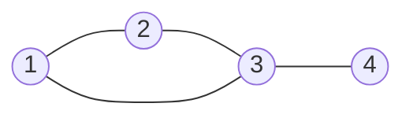

# Algebraic Graph Theory Basics

Algebraic graph theory studies graphs through matrices, eigenvalues, vector spaces, and polynomials. The main idea is to encode adjacency or incidence in a matrix and then use linear algebra to reveal structure: walks, connected components, spanning trees, expansion, regularity, and symmetry.


*Figure: The Petersen graph is a standard counterexample and test case throughout graph theory. Image: [Wikimedia Commons](https://commons.wikimedia.org/wiki/File:Petersen_graph.svg), David Benbennick, public domain.*

This viewpoint does not replace combinatorial reasoning; it complements it. A path proof may show why a graph is connected, while a Laplacian eigenvalue proves the same fact numerically. Matrix methods become especially powerful when graphs are large, regular, or generated by algebraic rules.

## Definitions

For a graph $G$ with vertices $v_1,\dots,v_n$, the **adjacency matrix** $A$ is the $n\times n$ matrix with

$$
A_{ij}=
\begin{cases}
1,& v_i v_j\in E(G),\\
0,& \text{otherwise}.
\end{cases}
$$

For a simple undirected graph, $A$ is symmetric.

The **degree matrix** $D$ is diagonal, with $D_{ii}=\deg(v_i)$. The **Laplacian matrix** is

$$
L=D-A.
$$

The **spectrum** of a matrix is its multiset of eigenvalues. The adjacency spectrum and Laplacian spectrum are graph invariants: isomorphic graphs have the same spectra. The converse is false; nonisomorphic graphs can be cospectral.

An **incidence matrix** records which vertices are incident with which edges. For oriented edges, the signed incidence matrix $B$ has one $+1$ and one $-1$ in each column, and

$$
L=BB^T.
$$

## Key results

**Walk-counting theorem.** The entry $(A^k)_{ij}$ equals the number of walks of length $k$ from $v_i$ to $v_j$.

Proof sketch: matrix multiplication sums over all possible intermediate vertices. Each product term records a valid next step exactly when the corresponding adjacencies exist.

**Laplacian component theorem.** The multiplicity of $0$ as a Laplacian eigenvalue equals the number of connected components of $G$.

In particular, a graph is connected if and only if the Laplacian has exactly one zero eigenvalue.

**Matrix-tree theorem.** If $G$ has Laplacian $L$, then the number of spanning trees $\tau(G)$ is any cofactor of $L$: delete one row and the corresponding column, then take the determinant.

**Regular graph eigenvalue fact.** If $G$ is $r$-regular, then the all-ones vector is an adjacency eigenvector with eigenvalue $r$.

**Quadratic form of the Laplacian.** For any vector $x\in\mathbb{R}^n$,

$$
x^TLx=\sum_{uv\in E(G)}(x_u-x_v)^2.
$$

This identity explains why $L$ is positive semidefinite. It also explains the component theorem: $x^TLx=0$ exactly when $x$ is constant on every connected component.

**Algebraic connectivity.** The second-smallest Laplacian eigenvalue is often denoted $\lambda_2$. It is positive exactly when the graph is connected. Larger values indicate stronger connectivity in a spectral sense: the graph is harder to separate into weakly connected pieces. This number is also called the Fiedler value.

**Trace and closed walks.** Since $(A^k)_{ii}$ counts closed walks of length $k$ starting and ending at $v_i$, the trace

$$
\operatorname{tr}(A^k)
$$

counts all closed walks of length $k$. For example, in a simple graph, each triangle contributes $6$ closed walks of length $3$: three choices of starting vertex and two directions.

**Normalized matrices.** For irregular graphs, the adjacency matrix can overemphasize high-degree vertices. The normalized Laplacian and random-walk matrix correct for degree. The random-walk matrix $D^{-1}A$ gives transition probabilities for moving from a vertex to a uniformly chosen neighbor. This connects algebraic graph theory with Markov chains and spectral clustering.

**Cospectral caution.** Spectra are powerful invariants because they are independent of vertex labels, but they are not complete invariants. Two nonisomorphic graphs can have the same adjacency spectrum or Laplacian spectrum. Therefore eigenvalues can disprove isomorphism when they differ, but matching eigenvalues do not prove isomorphism.

**When matrices help.** Matrix methods are especially effective when a question involves repeated walks, global connectivity, numbers of spanning trees, or regular patterns. They are less convenient for a single hand-drawn path or a local bridge check. Choosing between combinatorial and algebraic methods is part of the skill.

## Visual



For this graph, with vertex order $(1,2,3,4)$,

$$
A=
\begin{pmatrix}
0&1&1&0\\
1&0&1&0\\
1&1&0&1\\
0&0&1&0
\end{pmatrix},
\quad
D=
\begin{pmatrix}
2&0&0&0\\
0&2&0&0\\
0&0&3&0\\
0&0&0&1
\end{pmatrix}.
$$

| Matrix | Encodes | Common use |
|---|---|---|
| $A$ | adjacency | walk counts, spectra |
| $D$ | degrees | normalization |
| $L=D-A$ | differences across edges | connectivity, spanning trees |
| signed incidence $B$ | oriented edge endpoints | $L=BB^T$ |

## Worked example 1: Count walks with $A^2$

**Problem.** For the graph with edges $12,23,31,34$, count the number of walks of length $2$ from vertex $1$ to vertex $4$.

**Method.**

Vertex $1$ can move in one step to vertices $2$ or $3$. To arrive at vertex $4$ in exactly two steps, the intermediate vertex must be adjacent to $4$.

1. The neighbors of $1$ are $\{2,3\}$.
2. The only neighbor of $4$ is $3$.
3. The common vertices in these two sets are

$$
\{2,3\}\cap\{3\}=\{3\}.
$$

4. Therefore there is exactly one walk of length $2$ from $1$ to $4$:

$$
1-3-4.
$$

Matrix check:

$$
(A^2)_{14}=\sum_{r=1}^4 A_{1r}A_{r4}.
$$

Only $r=3$ contributes $1\cdot 1=1$, so

$$
(A^2)_{14}=1.
$$

**Checked answer.** There is exactly one length-$2$ walk from $1$ to $4$.

The same matrix can count other walks at the same time. For instance, $(A^2)_{11}$ equals the number of length-$2$ closed walks from vertex $1$. Since vertex $1$ has two neighbors, the walks $1-2-1$ and $1-3-1$ show $(A^2)_{11}=2$.

## Worked example 2: Use the matrix-tree theorem on $K_4$

**Problem.** Compute the number of spanning trees of $K_4$ using the Laplacian.

**Method.**

In $K_4$, every vertex has degree $3$, and every pair of distinct vertices is adjacent. Thus

$$
L=
\begin{pmatrix}
3&-1&-1&-1\\
-1&3&-1&-1\\
-1&-1&3&-1\\
-1&-1&-1&3
\end{pmatrix}.
$$

Delete the fourth row and fourth column:

$$
M=
\begin{pmatrix}
3&-1&-1\\
-1&3&-1\\
-1&-1&3
\end{pmatrix}.
$$

Compute the determinant:

$$
\begin{aligned}
\det(M)
&=3(3\cdot3-(-1)(-1))-(-1)((-1)\cdot3-(-1)(-1))\\
&\quad+(-1)((-1)(-1)-3(-1))\\
&=3(9-1)+1(-3-1)-1(1+3)\\
&=24-4-4\\
&=16.
\end{aligned}
$$

**Check.** Cayley's formula gives $\tau(K_4)=4^{4-2}=16$, so the matrix-tree result agrees.

The full Laplacian determinant would not work here:

$$
\det(L)=0.
$$

That zero is not a failure; it reflects the fact that the rows of $L$ sum to zero. The matrix-tree theorem deliberately removes one row and one column to get a nonsingular cofactor for connected graphs.

## Code

```python
from fractions import Fraction

def determinant(matrix):
    A = [[Fraction(x) for x in row] for row in matrix]
    n = len(A)
    det = Fraction(1)
    for i in range(n):
        pivot = next((r for r in range(i, n) if A[r][i] != 0), None)
        if pivot is None:
            return 0
        if pivot != i:
            A[i], A[pivot] = A[pivot], A[i]
            det *= -1
        det *= A[i][i]
        pivot_value = A[i][i]
        for j in range(i, n):
            A[i][j] /= pivot_value
        for r in range(i + 1, n):
            factor = A[r][i]
            for j in range(i, n):
                A[r][j] -= factor * A[i][j]
    return det

minor = [
    [3, -1, -1],
    [-1, 3, -1],
    [-1, -1, 3],
]
print(determinant(minor))
```

For larger graphs, one would normally use a numerical or symbolic linear algebra library. The fraction-based determinant above is included to keep the snippet exact and dependency-free. Exact arithmetic matters for matrix-tree computations because the final answer is an integer, and floating-point roundoff can obscure that integrality.

Before applying a matrix theorem, verify the matrix convention. Some texts put loops, multiple edges, or directed arcs into adjacency matrices differently. The theorem being used determines the convention; for instance, the simple undirected Laplacian in the matrix-tree theorem assumes degrees and adjacencies are counted consistently.

Also check dimensions early. An adjacency or Laplacian matrix for an $n$-vertex graph must be $n\times n$, while an incidence matrix has one column per edge. Dimension mismatches usually indicate that vertices and edges have been mixed.

This simple bookkeeping catches many matrix setup errors before any determinant or eigenvalue is computed.

For matrix-based problems, write the vertex order next to every matrix. Relabelling vertices permutes rows and columns, so two correct matrices for the same graph may look different. The order also controls how vector entries should be interpreted. Without it, a computed walk count, eigenvector, or cofactor cannot be matched back to the graph reliably.

## Common pitfalls

- Forgetting that adjacency matrix order depends on the chosen vertex order. The matrix changes under relabelling, though spectra do not.
- Assuming identical spectra imply isomorphism. Cospectral nonisomorphic graphs exist.
- Using the adjacency matrix instead of the Laplacian in the matrix-tree theorem.
- Taking the determinant of the full Laplacian for a connected graph. It is $0$; use a cofactor.
- Counting paths when $A^k$ counts walks. Walks may repeat vertices and edges.
- Ignoring multiple edges or loops when building matrices. Matrix conventions must match the graph class.

## Connections

- [Counting trees and Pruefer sequences](/math/graph-theory/counting-trees-and-prufer-sequences)
- [Definitions and examples](/math/graph-theory/definitions-and-examples)
- [Random graphs basics](/math/graph-theory/random-graphs-basics)
- [Matroids and graph duality](/math/graph-theory/matroids-and-graph-duality)
