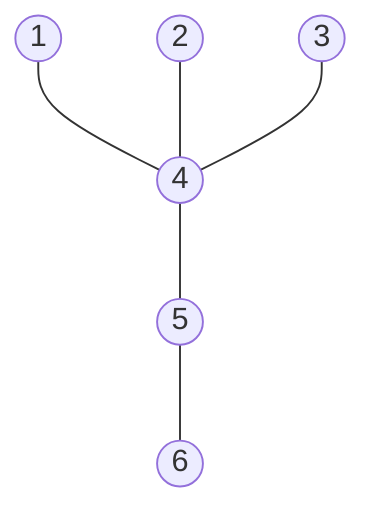

# Counting Trees and Pruefer Sequences

Tree counting asks how many different tree shapes or labelled trees are possible. The labelled problem has a remarkably clean answer: there are $n^{n-2}$ labelled trees on vertex set $\{1,\dots,n\}$. The usual proof uses Pruefer sequences, which convert a labelled tree into a sequence of labels and back again.

This is one of the best examples of a bijective proof in graph theory. Rather than deriving Cayley's formula by algebra alone, we build a reversible encoding. The encoding also reveals how degrees are distributed in a labelled tree, because the number of times a label appears in the Pruefer code is directly tied to the degree of that vertex.

## Definitions

A **labelled tree** on $[n]=\{1,2,\dots,n\}$ is a tree whose vertices are those exact labels. Two labelled trees are different if their edge sets are different, even if the unlabelled shape is the same.

The **Pruefer code** of a labelled tree with $n\ge 2$ vertices is a sequence of length $n-2$ constructed as follows:

1. Find the leaf with smallest label.
2. Record its unique neighbor.
3. Delete that leaf.
4. Repeat until only two vertices remain.

The resulting sequence lies in $[n]^{n-2}$, the set of all sequences of length $n-2$ with entries from $[n]$.

To decode a Pruefer sequence, repeatedly connect the smallest label not appearing in the current sequence to the first sequence entry, delete that first entry, and continue until two labels remain. Connect the final two labels.

## Key results

**Cayley's formula.** The number of labelled trees on $n$ vertices is

$$
n^{n-2}.
$$

Proof sketch: the Pruefer encoding maps every labelled tree on $[n]$ to a sequence in $[n]^{n-2}$. The decoding algorithm maps every such sequence back to a labelled tree. These two procedures are inverse to each other, so the number of labelled trees equals the number of sequences, namely $n^{n-2}$.

**Degree formula from Pruefer codes.** If a vertex label $i$ appears $a_i$ times in the Pruefer sequence of a tree, then

$$
\deg(i)=a_i+1.
$$

Reason: a vertex is recorded once for each incident leaf removed before the vertex itself becomes a leaf or survives to the last pair. A label that never appears has degree $1$ and is a leaf at some stage.

**Spanning tree count for complete graphs.** Since every labelled tree on $[n]$ is a spanning tree of $K_n$, Cayley's formula also says

$$
\tau(K_n)=n^{n-2},
$$

where $\tau(G)$ denotes the number of spanning trees of $G$.

**Degree sequences of labelled trees.** A sequence $(d_1,\dots,d_n)$ of positive integers is the degree sequence of a labelled tree on $[n]$ only if

$$
d_1+\cdots+d_n=2(n-1).
$$

For labelled trees this condition is also compatible with Pruefer codes in a precise counting sense: if $d_i\ge 1$ for every $i$ and the sum is $2n-2$, then label $i$ must appear $d_i-1$ times in the code. The number of labelled trees with that exact degree sequence is therefore

$$
\frac{(n-2)!}{(d_1-1)!(d_2-1)!\cdots(d_n-1)!}.
$$

This formula is often the quickest way to count labelled trees with prescribed leaves or hubs.

**Relation to the matrix-tree theorem.** Pruefer sequences count spanning trees of $K_n$ bijectively. The matrix-tree theorem counts spanning trees of any finite graph by a determinant. The two methods agree on $K_n$, but they answer different kinds of questions: Pruefer codes are explicit and constructive for complete graphs, while Laplacian cofactors handle missing edges and weighted variants.

**Unlabelled contrast.** Counting unlabelled trees is much harder because symmetries collapse many labelled trees into the same shape. For example, all stars on $n$ vertices have the same unlabelled shape, but there are $n$ different labelled stars depending on the center. Cayley's formula is therefore a labelled result; it should not be used for chemical isomer counts or rooted shape counts without additional symmetry analysis.

## Visual

Here is a labelled tree whose Pruefer code is computed in the first worked example.



| Step | Smallest leaf removed | Neighbor recorded | Remaining code prefix |
|---:|---:|---:|---|
| 1 | $1$ | $4$ | $(4)$ |
| 2 | $2$ | $4$ | $(4,4)$ |
| 3 | $3$ | $4$ | $(4,4,4)$ |
| 4 | $4$ | $5$ | $(4,4,4,5)$ |

## Worked example 1: Encode a labelled tree

**Problem.** Find the Pruefer code of the tree with edges

$$
14,\ 24,\ 34,\ 45,\ 56.
$$

**Method.**

The vertices are $\{1,2,3,4,5,6\}$, so the code has length $6-2=4$.

1. Initial leaves are $1,2,3,6$. The smallest is $1$. Its neighbor is $4$, so record $4$ and delete $1$.
2. Remaining leaves are $2,3,6$. The smallest is $2$. Its neighbor is $4$, so record $4$ and delete $2$.
3. Remaining leaves are $3,6$. The smallest is $3$. Its neighbor is $4$, so record $4$ and delete $3$.
4. The remaining graph is the path $4-5-6$. Leaves are $4$ and $6$. The smallest is $4$. Its neighbor is $5$, so record $5$ and delete $4$.
5. Only $5$ and $6$ remain, so stop.

The Pruefer code is

$$
(4,4,4,5).
$$

**Check by degrees.** In the code, label $4$ appears three times, so $\deg(4)=4$. Label $5$ appears once, so $\deg(5)=2$. Labels $1,2,3,6$ do not appear, so they have degree $1$. This matches the original tree.

The same check also verifies the total degree:

$$
4+2+1+1+1+1=10=2(6-1).
$$

This is a useful guard against encoding errors. If the multiplicities in a proposed code produce degrees whose sum is not $2n-2$, then either the code length or the vertex set has been misread.

## Worked example 2: Decode a Pruefer sequence

**Problem.** Decode the Pruefer sequence

$$
(2,5,2,4)
$$

on vertex set $\{1,2,3,4,5,6\}$.

**Method.**

Start with labels $\{1,2,3,4,5,6\}$ and sequence $(2,5,2,4)$.

1. The labels not appearing in the sequence are $\{1,3,6\}$. The smallest is $1$. Connect $1$ to the first sequence entry $2$, giving edge $12$. Delete the first $2$. New sequence: $(5,2,4)$.
2. Remaining labels are $\{2,3,4,5,6\}$. Labels not appearing in $(5,2,4)$ are $\{3,6\}$. The smallest is $3$. Connect $3$ to $5$, giving edge $35$. Delete $5$. New sequence: $(2,4)$.
3. Remaining labels are $\{2,4,5,6\}$. Labels not appearing in $(2,4)$ are $\{5,6\}$. The smallest is $5$. Connect $5$ to $2$, giving edge $25$. Delete $2$. New sequence: $(4)$.
4. Remaining labels are $\{2,4,6\}$. Labels not appearing in $(4)$ are $\{2,6\}$. The smallest is $2$. Connect $2$ to $4$, giving edge $24$. Delete $4$. New sequence: empty.
5. The two remaining labels are $4$ and $6$. Connect them, giving edge $46$.

The decoded tree has edges

$$
12,\ 35,\ 25,\ 24,\ 46.
$$

**Check.** There are $6$ vertices and $5$ edges. The construction connects a new leaf at each step and finishes with one edge, so the result is connected and acyclic.

The degree formula predicts the same shape. In $(2,5,2,4)$, label $2$ appears twice, labels $4$ and $5$ appear once, and labels $1,3,6$ appear zero times. Thus the degrees should be

$$
\deg(2)=3,\quad \deg(4)=2,\quad \deg(5)=2,\quad \deg(1)=\deg(3)=\deg(6)=1.
$$

The decoded edge list gives exactly those degrees.

## Code

```python
from collections import Counter
import heapq

def decode_pruefer(code):
    n = len(code) + 2
    degree = {i: 1 for i in range(1, n + 1)}
    for x in code:
        degree[x] += 1

    leaves = [v for v in degree if degree[v] == 1]
    heapq.heapify(leaves)
    edges = []

    for x in code:
        leaf = heapq.heappop(leaves)
        edges.append((leaf, x))
        degree[leaf] -= 1
        degree[x] -= 1
        if degree[x] == 1:
            heapq.heappush(leaves, x)

    u = heapq.heappop(leaves)
    v = heapq.heappop(leaves)
    edges.append((u, v))
    return edges

code = [2, 5, 2, 4]
print(decode_pruefer(code))
print(Counter(code))
```

The decoder uses a min-heap so that the smallest currently available leaf can be found efficiently. This matches the standard definition of the Pruefer code. If a different leaf-selection rule is used for encoding, the decoder must use the corresponding inverse rule; otherwise the sequence will decode to a different labelled tree.

For Pruefer-sequence exercises, keep a running table of current leaves, the recorded neighbor, and the remaining sequence. This prevents two common errors: deleting the wrong leaf and forgetting that a vertex can become a leaf only after all but one of its incident edges have been removed. The degree formula is an independent check after the encoding or decoding is complete.

## Common pitfalls

- Removing the largest leaf instead of the smallest leaf when using the standard Pruefer encoding. A different deterministic rule would give a different code.
- Recording the deleted leaf instead of its neighbor. The Pruefer code records neighbors.
- Stopping when three vertices remain. The code stops when two vertices remain.
- Forgetting that the code length is $n-2$, not $n-1$.
- Applying Cayley's formula to unlabelled trees. $n^{n-2}$ counts labelled trees.
- Misreading the degree formula. A label appearing $a$ times has degree $a+1$, not $a$.

## Connections

- [Trees and spanning trees](/math/graph-theory/trees-and-spanning-trees)
- [Algebraic graph theory basics](/math/graph-theory/algebraic-graph-theory-basics)
- [Random graphs basics](/math/graph-theory/random-graphs-basics)
- [Matroids and graph duality](/math/graph-theory/matroids-and-graph-duality)
