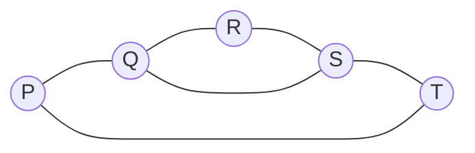

# Definitions and Examples

Graphs are a way to keep only the incidence pattern of a network: which objects are present, and which pairs are joined. A road map, a molecule, a tournament schedule, a circuit diagram, and a friendship relation may look very different in the plane, but the graph-theoretic data are the same kind of data: vertices and edges. This separation is one of the main themes in introductory graph theory. Geometry may help us draw the object, but adjacency is what the graph records.

This page fixes the vocabulary used throughout the graph theory section. The point is not to memorize names in isolation, but to recognize which features survive under redrawing, relabelling, deletion, contraction, and passage to standard families such as complete graphs, cycles, wheels, and bipartite graphs.

## Definitions

A **graph** $G$ consists of a vertex set $V(G)$ and an edge family $E(G)$ whose members join vertices. In a **simple graph**, every edge is an unordered pair of two distinct vertices, and no pair occurs more than once. Thus a simple graph has no loops and no multiple edges. In a more general graph, a **loop** has both ends at the same vertex, and **parallel edges** are two or more edges with the same pair of endpoints.

Two vertices are **adjacent** if an edge joins them. A vertex and an edge are **incident** if the vertex is an endpoint of the edge. The **degree** $\deg(v)$ of a vertex $v$ is the number of incident edge ends; a loop contributes $2$ to the degree because both ends are incident with the same vertex. A vertex of degree $0$ is **isolated**, and a vertex of degree $1$ is an **end-vertex** or **leaf**.

A **subgraph** $H$ of $G$ has $V(H) \subseteq V(G)$ and $E(H) \subseteq E(G)$, with every edge of $H$ incident only with vertices of $H$. An **induced subgraph** $G[S]$ on a vertex set $S \subseteq V(G)$ includes every edge of $G$ whose endpoints both lie in $S$. A **spanning subgraph** has all the vertices of $G$ but only some of its edges.

Two graphs $G$ and $H$ are **isomorphic** if there is a bijection $\phi:V(G)\to V(H)$ such that $uv \in E(G)$ exactly when $\phi(u)\phi(v)\in E(H)$. Isomorphism formalizes the phrase "same graph with different labels." Degree sequences, numbers of vertices and edges, and counts of triangles are isomorphism invariants, though no single one of these invariants is a complete test in general.

Standard families appear repeatedly:

| Graph | Vertices | Edges | Key feature |
|---|---:|---:|---|
| $N_n$ | $n$ | $0$ | Null graph |
| $K_n$ | $n$ | $\binom n2$ | Every pair adjacent |
| $P_n$ | $n$ | $n-1$ | One path through all vertices |
| $C_n$ | $n$ | $n$ | A cycle, $n \ge 3$ |
| $K_{r,s}$ | $r+s$ | $rs$ | Complete bipartite graph |
| $Q_k$ | $2^k$ | $k2^{k-1}$ | Vertices are binary strings |

For a simple graph $G$, the **complement** $\overline{G}$ has the same vertex set and has $uv$ as an edge exactly when $uv$ is not an edge of $G$. A graph is **regular of degree $r$**, or **$r$-regular**, if every vertex has degree $r$.

A useful convention when reading examples is to ask which category the graph belongs to before applying a formula. Complete-graph, complete-bipartite, path, cycle, wheel, cube, and null-graph formulas have different hypotheses. Most counting mistakes on early exercises come from recognizing the drawing visually but then applying the wrong family name.

## Key results

**Handshaking lemma.** For any finite graph,

$$
\sum_{v\in V(G)} \deg(v)=2|E(G)|.
$$

Proof sketch: count incident edge ends. Each ordinary edge contributes one end at each endpoint, and each loop contributes two ends at its single endpoint. Therefore summing degrees counts two ends for every edge.

**Odd-degree corollary.** Every finite graph has an even number of vertices of odd degree.

This follows because the degree sum is even. The even-degree vertices contribute an even sum, so the odd-degree vertices must also contribute an even sum. A sum of odd integers is even only when there are an even number of summands.

**Counting labelled simple graphs.** On a fixed labelled vertex set with $n$ vertices, there are

$$
2^{\binom n2}
$$

simple graphs. There are $\binom n2$ possible unordered pairs, and each pair is independently either present or absent.

**Complement degree formula.** If $G$ is a simple graph with $n$ vertices, then

$$
\deg_{\overline{G}}(v)=n-1-\deg_G(v).
$$

Each vertex has $n-1$ possible neighbors. The complement supplies exactly the missing adjacencies.

## Visual

The same abstract graph can be drawn in different ways. The diagram below records adjacency only; the layout and edge lengths are not part of the graph.



For this graph,

| Vertex | Neighbors | Degree |
|---|---|---:|
| $P$ | $Q,T$ | 2 |
| $Q$ | $P,R,S$ | 3 |
| $R$ | $Q,S$ | 2 |
| $S$ | $Q,R,T$ | 3 |
| $T$ | $P,S$ | 2 |

The degree sum is $2+3+2+3+2=12$, so the graph has $12/2=6$ edges.

## Worked example 1: Count edges and degrees in $K_{3,4}$

**Problem.** Find the number of vertices, number of edges, and degree sequence of the complete bipartite graph $K_{3,4}$.

**Method.**

1. Split the vertex set into two parts: $A$ with $3$ vertices and $B$ with $4$ vertices.
2. In $K_{3,4}$, every vertex of $A$ is adjacent to every vertex of $B$.
3. No two vertices inside the same part are adjacent.
4. Therefore each of the $3$ vertices in $A$ has degree $4$.
5. Each of the $4$ vertices in $B$ has degree $3$.

The number of vertices is

$$
3+4=7.
$$

The number of edges can be counted directly:

$$
3\cdot 4=12.
$$

The degree sequence, sorted in nondecreasing order, is

$$
(3,3,3,3,4,4,4).
$$

**Check.** The sum of degrees is

$$
4\cdot 3+3\cdot 4=12+12=24,
$$

and $2\vert E\vert =2\cdot 12=24$. This agrees with the handshaking lemma.

## Worked example 2: Compare a graph with its complement

**Problem.** Let $G$ be the graph on vertices $\{1,2,3,4,5\}$ with edges

$$
12,\ 23,\ 34,\ 45,\ 51,\ 13.
$$

Find the degree sequence of $G$, then find the degree sequence and edge set of $\overline{G}$.

**Method.**

1. Count the degree of each vertex in $G$.
   - Vertex $1$ is incident with $12,51,13$, so $\deg_G(1)=3$.
   - Vertex $2$ is incident with $12,23$, so $\deg_G(2)=2$.
   - Vertex $3$ is incident with $23,34,13$, so $\deg_G(3)=3$.
   - Vertex $4$ is incident with $34,45$, so $\deg_G(4)=2$.
   - Vertex $5$ is incident with $45,51$, so $\deg_G(5)=2$.
2. The sorted degree sequence of $G$ is $(2,2,2,3,3)$.
3. A simple graph on $5$ vertices has $\binom52=10$ possible edges.
4. Since $G$ has $6$ edges, its complement has $10-6=4$ edges.
5. List the missing pairs:

$$
14,\ 24,\ 25,\ 35.
$$

So

$$
E(\overline{G})=\{14,24,25,35\}.
$$

Using the complement degree formula with $n=5$,

$$
\deg_{\overline{G}}(v)=4-\deg_G(v).
$$

Thus the complement degrees are $1,2,1,2,2$, and the sorted degree sequence is

$$
(1,1,2,2,2).
$$

**Check.** The complement degree sum is $8$, so $\overline{G}$ has $8/2=4$ edges, matching the missing-pair count.

## Code

The following pure Python code stores a simple graph as adjacency sets and checks the handshaking lemma, complement formula, and edge count.

```python
from itertools import combinations

def make_graph(vertices, edges):
    adj = {v: set() for v in vertices}
    for u, v in edges:
        if u == v:
            raise ValueError("simple graph cannot contain a loop")
        adj[u].add(v)
        adj[v].add(u)
    return adj

def edge_count(adj):
    return sum(len(nbrs) for nbrs in adj.values()) // 2

def complement(adj):
    vertices = list(adj)
    comp_edges = []
    for u, v in combinations(vertices, 2):
        if v not in adj[u]:
            comp_edges.append((u, v))
    return make_graph(vertices, comp_edges)

G = make_graph([1, 2, 3, 4, 5], [(1, 2), (2, 3), (3, 4), (4, 5), (5, 1), (1, 3)])
Gc = complement(G)

print(sorted(len(nbrs) for nbrs in G.values()))
print(sorted(len(nbrs) for nbrs in Gc.values()))
print(edge_count(G), edge_count(Gc))
assert sum(len(nbrs) for nbrs in G.values()) == 2 * edge_count(G)
```

Before moving on, practice translating each drawing into three forms: a vertex set, an edge set, and an adjacency list. These representations force precision. The vertex and edge sets are best for definitions and counting; the adjacency list is best for computing degrees and neighborhoods; the drawing is best for intuition. If all three agree, most basic graph questions become routine.

## Common pitfalls

- Treating a drawing as part of the graph. Unless the topic is planarity or geometry, crossings and edge lengths in a drawing usually do not matter.
- Forgetting that a loop contributes $2$ to degree in a general graph.
- Confusing a subgraph with an induced subgraph. A subgraph may omit edges; an induced subgraph must include all available edges among its chosen vertices.
- Assuming equal degree sequences imply isomorphism. They are useful necessary conditions, not sufficient conditions.
- Counting edges of $K_{r,s}$ as $\binom{r+s}{2}$. Only cross-part pairs are edges, so the count is $rs$.
- Writing complement formulas for graphs with loops or multiple edges. The usual complement is a simple-graph operation.

## Connections

- [Walks, paths, and connectedness](/math/graph-theory/walks-paths-and-connectedness)
- [Trees and spanning trees](/math/graph-theory/trees-and-spanning-trees)
- [Planarity and Euler formula](/math/graph-theory/planarity-and-euler-formula)
- [Vertex and map colouring](/math/graph-theory/vertex-and-map-colouring)
