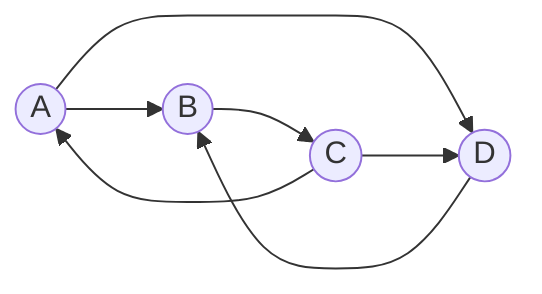

# Digraphs Tournaments and Markov Chains

Directed graphs add orientation to adjacency. A road may be one-way, a web page may link to another without receiving a link back, and a state transition may have a preferred direction. Once directions matter, connectedness splits into several notions and matrices become especially useful.

Tournaments and Markov chains are two important directed examples. A tournament orients every edge of a complete graph, modelling pairwise contests. A Markov chain assigns transition probabilities to directed edges, modelling repeated movement between states.


*Figure: Transitive tournament on eight vertices. Image: [Wikimedia Commons](https://commons.wikimedia.org/wiki/File:8-tournament-transitive.svg), Booyabazooka, public domain.*

## Definitions

A **directed graph** or **digraph** $D$ has a vertex set $V(D)$ and a set of ordered pairs called **arcs**. An arc from $u$ to $v$ is written $u\to v$.

The **outdegree** $d^+(v)$ is the number of arcs leaving $v$, and the **indegree** $d^-(v)$ is the number of arcs entering $v$. A directed walk follows arc directions. A digraph is **strongly connected** if for every ordered pair $u,v$ there is a directed path from $u$ to $v$. It is **weakly connected** if the underlying undirected graph is connected.

A **tournament** is an orientation of a complete graph: for every distinct pair $u,v$, exactly one of $u\to v$ or $v\to u$ is present.

A finite **Markov chain** has states and transition probabilities $p_{ij}$, where $p_{ij}$ is the probability of moving from state $i$ to state $j$ in one step. Its transition matrix $P$ has nonnegative entries and each row sums to $1$.

## Key results

**Directed handshaking.** In every finite digraph,

$$
\sum_{v\in V} d^+(v)=|A|=\sum_{v\in V} d^-(v),
$$

where $A$ is the arc set. Each arc contributes once to an outdegree and once to an indegree.

**Tournament Hamiltonian path theorem.** Every tournament has a directed Hamiltonian path.

Proof sketch: insert vertices one at a time into an existing directed path. Given a path $v_1\to \cdots \to v_k$, place a new vertex $x$ before the first $v_i$ such that $x\to v_i$, or at the end if no such $v_i$ exists. The tournament property guarantees the needed orientations.

**Eulerian digraph criterion.** A weakly connected finite digraph has a directed Eulerian circuit if and only if

$$
d^+(v)=d^-(v)
$$

for every vertex $v$.

**Markov evolution.** If $\pi_t$ is a row vector giving the state distribution at time $t$, then

$$
\pi_{t+1}=\pi_tP.
$$

A stationary distribution satisfies $\pi=\pi P$.

**Strong components.** Strong connectedness partitions a digraph into maximal strongly connected subgraphs called strong components. If each strong component is shrunk to one vertex, the resulting condensation digraph is acyclic. This is a major structural difference from undirected components: directed reachability can have one-way movement between components, so the component graph carries order information.

**Tournaments and scores.** The **score** of a vertex in a tournament is its outdegree. Scores summarize how many pairwise contests each player wins, but they do not determine the tournament uniquely in general. A vertex with score $n-1$ beats every other vertex and is a source; a vertex with score $0$ loses to every other vertex and is a sink. Strong tournaments have directed paths both ways between every pair of vertices and, in fact, contain directed cycles.

**Markov-chain interpretation of digraphs.** A transition matrix defines a weighted digraph: draw $i\to j$ when $p_{ij}\gt 0$. Graph structure then controls probabilistic behavior. If the transition digraph is not strongly connected, probability may flow into a closed class and never return. If it is strongly connected and aperiodic, repeated multiplication often converges to a unique stationary distribution.

**Adjacency matrices for digraphs.** The adjacency matrix of a digraph has $A_{ij}=1$ when $i\to j$. It is usually not symmetric. Powers still count directed walks: $(A^k)_{ij}$ is the number of directed walks of length $k$ from $i$ to $j$. This is the directed analogue of the walk-counting theorem for undirected graphs.

**Acyclic digraphs.** A directed acyclic graph, or DAG, has no directed cycle. DAGs admit a topological ordering of their vertices, meaning every arc points forward in the order. This is the graph-theoretic model behind prerequisites, task scheduling, and dependency resolution. Tournaments are DAGs exactly when they are transitive tournaments.

**Stationary distributions as eigenvectors.** With row-vector convention, a stationary distribution satisfies $\pi P=\pi$, so it is a left eigenvector of $P$ with eigenvalue $1$. The entries must be nonnegative and sum to $1$, which makes the eigenvector probabilistic rather than merely algebraic.

## Visual



| Concept | Undirected version | Directed version |
|---|---|---|
| Degree | $\deg(v)$ | indegree $d^-(v)$ and outdegree $d^+(v)$ |
| Connected | paths ignore direction | weak or strong connectedness |
| Euler condition | all degrees even | indegree equals outdegree |
| Matrix | symmetric adjacency for simple graph | generally nonsymmetric adjacency or transition matrix |

## Worked example 1: Find a Hamiltonian path in a tournament

**Problem.** Consider the tournament on vertices $\{A,B,C,D\}$ with arcs

$$
A\to B,\ C\to A,\ A\to D,\ B\to C,\ D\to B,\ C\to D.
$$

Find a directed Hamiltonian path.

**Method.**

1. Start with a path containing $A$: simply $A$.
2. Insert $B$. Since $A\to B$, the path is $A\to B$.
3. Insert $C$. Check against $A$: $C\to A$, so place $C$ before $A$. The path becomes

$$
C\to A\to B.
$$

4. Insert $D$. Compare $D$ with $C$: the arc is $C\to D$, so $D$ cannot go before $C$.
5. Compare $D$ with $A$: the arc is $A\to D$, so $D$ cannot go before $A$.
6. Compare $D$ with $B$: the arc is $D\to B$, so place $D$ before $B$.

The path is

$$
C\to A\to D\to B.
$$

**Check.** The arcs $C\to A$, $A\to D$, and $D\to B$ are all in the tournament, and every vertex appears exactly once.

## Worked example 2: Iterate a Markov chain

**Problem.** A weather model has states Sunny $S$ and Rainy $R$ with transition matrix

$$
P=\begin{pmatrix}
0.8 & 0.2\\
0.4 & 0.6
\end{pmatrix}.
$$

If today is certainly sunny, find the distribution after two days.

**Method.**

The initial distribution is

$$
\pi_0=(1,0).
$$

After one day:

$$
\pi_1=\pi_0P=(1,0)
\begin{pmatrix}
0.8 & 0.2\\
0.4 & 0.6
\end{pmatrix}
=(0.8,0.2).
$$

After two days:

$$
\begin{aligned}
\pi_2 &= \pi_1P\\
&=(0.8,0.2)
\begin{pmatrix}
0.8 & 0.2\\
0.4 & 0.6
\end{pmatrix}\\
&=(0.8\cdot0.8+0.2\cdot0.4,\ 0.8\cdot0.2+0.2\cdot0.6)\\
&=(0.64+0.08,\ 0.16+0.12)\\
&=(0.72,0.28).
\end{aligned}
$$

**Checked answer.** After two days the model gives probability $0.72$ of sunny and $0.28$ of rainy.

As a row-sum check, $0.72+0.28=1$. Every probability distribution produced by multiplying by a row-stochastic matrix should still sum to $1$; if it does not, either the matrix rows were not normalized or the multiplication convention was mixed up.

## Code

```python
def step(dist, P):
    n = len(dist)
    return [sum(dist[i] * P[i][j] for i in range(n)) for j in range(n)]

P = [
    [0.8, 0.2],
    [0.4, 0.6],
]

dist = [1.0, 0.0]
for day in range(1, 6):
    dist = step(dist, P)
    print(day, dist)

def indegree_outdegree(vertices, arcs):
    indeg = {v: 0 for v in vertices}
    outdeg = {v: 0 for v in vertices}
    for u, v in arcs:
        outdeg[u] += 1
        indeg[v] += 1
    return indeg, outdeg
```

For Markov chains with many states, repeated multiplication is easy to implement but not always the fastest way to find a stationary distribution. Solving the linear system $\pi P=\pi$ together with $\sum_i \pi_i=1$ is often more direct. Graph structure still matters because reducible chains may have multiple stationary distributions.

For tournament problems, separate existence from construction. The insertion proof gives an explicit Hamiltonian path, but it does not usually give a Hamiltonian cycle. Stronger hypotheses, such as strong connectivity in tournaments, are needed for cycle conclusions.

For Markov-chain calculations, keep the state order fixed from the matrix to every vector. Swapping Sunny and Rainy halfway through a computation produces numbers that may still sum to one but describe the wrong states.

For directed examples, write arrows in every path you claim. A sequence of adjacent vertices in the underlying undirected graph is not necessarily a directed path. For Markov chains, check row sums or column sums according to the convention before doing any long calculation. A valid stochastic matrix should preserve total probability after one step.

## Common pitfalls

- Treating a directed edge $u\to v$ as if it also allows travel from $v$ to $u$.
- Confusing weak connectedness with strong connectedness.
- Forgetting that tournaments have exactly one directed arc between every pair of distinct vertices.
- Using undirected Euler degree conditions on a digraph. Directed Euler circuits require indegree equal to outdegree.
- Multiplying Markov distributions on the wrong side. Row-vector notation uses $\pi_{t+1}=\pi_tP$; column-vector notation uses $x_{t+1}=P^Tx_t$ or a column-stochastic convention.
- Accepting a transition matrix whose rows do not sum to $1$.

## Connections

- [Eulerian and Hamiltonian graphs](/math/graph-theory/eulerian-and-hamiltonian-graphs)
- [Algebraic graph theory basics](/math/graph-theory/algebraic-graph-theory-basics)
- [Menger theorem and network flows](/math/graph-theory/menger-theorem-and-network-flows)
- [Random graphs basics](/math/graph-theory/random-graphs-basics)
