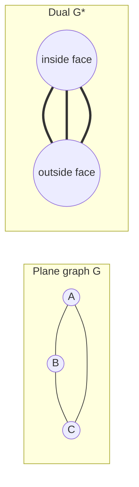

# Duality Surfaces and Infinite Graphs

Duality turns faces into vertices and cycles into cuts. For plane graphs this is a concrete geometric construction: put a new vertex in each face and draw a new edge crossing each original edge. The result often explains why statements about cycles have twin statements about cutsets.

Graphs on surfaces and infinite graphs extend the planar story. On a torus or a surface with handles, Euler's formula changes by the Euler characteristic. In infinite graphs, even basic statements about paths need local finiteness or countability assumptions. Wilson's planarity chapter uses these extensions to show which planar ideas survive, which need modification, and which fail.

## Definitions

For a connected plane graph $G$, the **geometric dual** $G^*$ is constructed by placing one vertex in each face of $G$ and drawing one dual edge $e^*$ crossing each edge $e$ of $G$. If an edge borders the same face on both sides, its dual is a loop. If two faces share several boundary edges, the dual may have parallel edges.

An **abstract dual** of a graph $G$ is a graph $G^*$ with a one-to-one correspondence between edges of $G$ and edges of $G^*$ such that cycles of $G$ correspond to cutsets of $G^*$.

The **genus** $g$ of an orientable surface is the number of handles. The sphere has genus $0$, the torus has genus $1$, and a double torus has genus $2$.

An **infinite graph** has infinitely many vertices or edges. It is **locally finite** if every vertex has finite degree. A **ray** is a one-way infinite path.

## Key results

**Dual counting relations.** If $G$ is a connected plane graph with $n$ vertices, $m$ edges, and $f$ faces, and $G^*$ is its geometric dual, then

$$
|V(G^*)|=f,\quad |E(G^*)|=m,\quad |F(G^*)|=n.
$$

For connected plane graphs, the dual of the dual is isomorphic to the original graph: $G^{**}\cong G$.

**Cycle-cut duality.** In a plane connected graph, a set of edges forms a cycle in $G$ if and only if the corresponding dual edges form a cutset in $G^*$.

**Euler formula on orientable genus $g$.** If a connected graph is embedded cellularly on an orientable surface of genus $g$, then

$$
n-m+f=2-2g.
$$

For $g=0$ this is the planar Euler formula.

**Konig's infinity lemma.** Every connected locally finite infinite graph contains a ray starting at any chosen vertex. The local finiteness condition is essential.

**Bridge-loop duality.** In a connected plane graph, a bridge has the same face on both sides. The corresponding dual edge therefore starts and ends at the same dual vertex, so it is a loop. Conversely, a loop in the original graph separates no two distinct faces along its two sides in the usual way and corresponds to a bridge in the dual. This is the simplest place to see why dual graphs naturally leave the category of simple graphs.

**Why surfaces change Euler's formula.** On a sphere, cutting along a spanning tree and then along enough dual edges leaves one simply connected region. A handle adds two independent directions around the surface, so it lowers the Euler characteristic by $2$. The formula $n-m+f=2-2g$ records this topological cost. It also explains why graphs such as $K_5$ and $K_{3,3}$, nonplanar on the sphere, can become drawable on a torus.

**Infinite graphs and compactness.** Many finite graph statements extend to infinite graphs only after adding a compactness or local finiteness hypothesis. For example, a connected graph in which each vertex has finite degree can be explored level by level from a root. If infinitely many vertices exist, some branch of this finite-branching exploration continues forever, giving a ray. Without finite branching, this argument breaks.

**Abstract duals and planarity.** The definition of abstract duality avoids drawing the graph. It asks only for an edge correspondence that turns cycles into cutsets. Whitney's duality theorem says that this algebraic-looking property characterizes planar graphs: a graph has an abstract dual exactly when it is planar. This explains why duality is not just a drawing trick but a structural property.

**Non-uniqueness warning.** A planar graph can have different plane embeddings. For highly connected planar graphs the embedding is often rigid, but in general different embeddings may produce nonisomorphic geometric duals. When a problem asks for "the" dual, check whether a particular plane drawing has been fixed.

**Locally finite versus locally countable.** Local finiteness means every vertex has finite degree. Local countability allows countably many incident edges at each vertex. Some countability conclusions still hold under local countability and connectedness, but path-existence lemmas such as Konig's are strongest and cleanest under local finiteness.

## Visual

The triangle has two faces: the inside face and the outside face. Its dual has two vertices joined by three parallel dual edges, one crossing each side of the triangle.



| Original plane graph feature | Dual feature |
|---|---|
| vertex | face |
| face | vertex |
| edge | edge crossing it |
| cycle | cutset |
| bridge | loop |
| loop | bridge |

## Worked example 1: Build the dual counts of a wheel

**Problem.** Let $G=W_5$, the wheel with four rim vertices and one center. Find the numbers of vertices, edges, and faces of $G^*$.

**Method.**

1. Count $G$. It has $n=5$ vertices.
2. It has $m=8$ edges: four rim edges and four spokes.
3. By Euler's formula,

$$
f=2-n+m=2-5+8=5.
$$

4. The dual has one vertex for each face of $G$, so

$$
|V(G^*)|=5.
$$

5. The dual has one edge for each edge of $G$, so

$$
|E(G^*)|=8.
$$

6. The faces of the dual correspond to vertices of $G$, so

$$
|F(G^*)|=5.
$$

**Check.** Euler's formula for the dual gives

$$
|V(G^*)|-|E(G^*)|+|F(G^*)|=5-8+5=2.
$$

So the counts are consistent.

## Worked example 2: Genus lower bound for $K_7$

**Problem.** Use Euler's formula on surfaces to find a lower bound for the orientable genus of $K_7$.

**Method.**

1. For $K_7$,

$$
n=7,\quad m=\binom72=21.
$$

2. In a simple triangular embedding, each face has at least three boundary edges, so

$$
3f\le 2m.
$$

Thus

$$
f\le \frac{2m}{3}=\frac{42}{3}=14.
$$

3. On a genus-$g$ orientable surface,

$$
n-m+f=2-2g.
$$

4. Substitute the largest possible $f$ to make the left side as large as possible:

$$
7-21+14=0.
$$

So

$$
2-2g\le 0.
$$

5. Therefore

$$
g\ge 1.
$$

**Checked answer.** $K_7$ cannot be embedded on the sphere, but this counting argument allows genus $1$. In fact, $K_7$ embeds on the torus.

The same inequality gives only a lower bound. To prove the exact genus of a graph, one also needs a drawing on a surface of that genus. Counting can rule surfaces out; construction proves that a surface is sufficient.

## Code

```python
import math

def dual_counts(vertices, edges, faces):
    return {"vertices": faces, "edges": edges, "faces": vertices}

def complete_graph_edges(n):
    return n * (n - 1) // 2

def genus_lower_bound_simple(n, m):
    # From m <= 3n - 6 + 6g, valid for simple graphs with n >= 3
    return max(0, math.ceil((m - 3 * n + 6) / 6))

print(dual_counts(vertices=5, edges=8, faces=5))
for n in [5, 6, 7, 8]:
    m = complete_graph_edges(n)
    print(n, genus_lower_bound_simple(n, m))
```

The genus bound in the code is a lower bound from edge counting. It is sharp for complete graphs by the Ringel-Youngs theorem, but it is not automatically sharp for arbitrary graphs. In ordinary problem solving, use it to rule out low-genus embeddings, then look for a construction on the next possible surface.

For duality exercises, always record the chosen embedding before drawing the dual. The same abstract planar graph may place faces differently, and the dual is built from faces, not just from the abstract vertex-edge list. This small bookkeeping step prevents many wrong dual graphs.

For surface exercises, separate lower and upper bounds. Euler-characteristic inequalities often prove that a sphere is impossible or that at least one handle is needed. They do not by themselves draw the graph. A matching embedding on the claimed surface is the companion certificate.

The same lower-bound versus construction split appears throughout topological graph theory.

Counting rules out; embeddings certify.

Duality problems reward careful bookkeeping. Label each original edge and write the corresponding dual edge with the same label or a starred label. Then verify one cycle-cut correspondence explicitly. For surface problems, compute $n-m+f$ after the embedding is fixed; changing the drawing or the surface changes the face count, so the arithmetic is meaningful only relative to a stated embedding.

## Common pitfalls

- Assuming the dual of a planar graph is always simple. Bridges and repeated face adjacencies create loops and parallel edges.
- Forgetting that geometric duals depend on a plane embedding. Nonisomorphic embeddings can have nonisomorphic duals.
- Applying $G^{**}\cong G$ without connectedness or the right embedding hypotheses.
- Using the planar Euler formula on a torus. The right expression is $n-m+f=2-2g$.
- Treating every infinite connected graph as countable. Local countability and connectedness give countability; without them, this may fail.
- Omitting local finiteness in statements about rays and Konig's lemma.

## Connections

- [Planarity and Euler formula](/math/graph-theory/planarity-and-euler-formula)
- [Matroids and graph duality](/math/graph-theory/matroids-and-graph-duality)
- [Menger theorem and network flows](/math/graph-theory/menger-theorem-and-network-flows)
- [Algebraic graph theory basics](/math/graph-theory/algebraic-graph-theory-basics)
