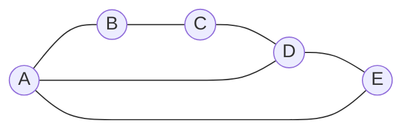

# Eulerian and Hamiltonian Graphs

Eulerian and Hamiltonian problems both ask for tours through a graph, but they count different things. Eulerian questions ask whether one can use every edge exactly once. Hamiltonian questions ask whether one can visit every vertex exactly once. The distinction is essential: Eulerian graphs have a clean degree characterization, while Hamiltonian graphs resist such a simple test.

Historically, Eulerian graph theory begins with the Konigsberg bridges problem, where the impossibility of an edge-using tour follows from vertex degrees. Hamiltonian graph theory is closer to the travelling salesperson problem: it is easy to state, rich in sufficient conditions, and computationally difficult in general.

## Definitions

An **Eulerian trail** is a trail using every edge of a graph. An **Eulerian circuit** is a closed Eulerian trail. A connected graph with an Eulerian circuit is often called **Eulerian**.

A **Hamiltonian path** is a path that visits every vertex exactly once. A **Hamiltonian cycle** is a cycle that visits every vertex exactly once before returning to the start. A graph with a Hamiltonian cycle is **Hamiltonian**.

Eulerian terminology is edge-based: vertices may repeat, but edges may not. Hamiltonian terminology is vertex-based: edges need not all be used, but vertices must appear exactly once in the path or cycle.

For directed graphs, an Eulerian directed circuit must respect edge directions, and the relevant degree counts are indegree and outdegree. This page focuses mainly on undirected graphs; directed versions are treated with digraphs.

## Key results

**Euler circuit theorem.** A finite connected graph has an Eulerian circuit if and only if every vertex has even degree.

Proof sketch: in any closed edge-using tour, each time the tour enters a vertex along one edge, it leaves along a different unused edge, so incident edges pair up. Conversely, if all degrees are even, start walking without repeating edges until stuck. You can only get stuck at the starting vertex. If unused edges remain, splice in another closed trail at a vertex already on the tour. Repeating this produces an Eulerian circuit.

**Euler trail theorem.** A finite connected graph has an Eulerian trail from $s$ to $t$ with $s\ne t$ if and only if exactly two vertices have odd degree, namely $s$ and $t$. If there are no odd vertices, the Eulerian trail can be closed.

**Dirac's theorem.** If $G$ is a simple graph on $n\ge 3$ vertices and every vertex has degree at least $n/2$, then $G$ is Hamiltonian.

**Ore's theorem.** If $G$ is a simple graph on $n\ge 3$ vertices and $\deg(u)+\deg(v)\ge n$ for every nonadjacent pair $u,v$, then $G$ is Hamiltonian.

Dirac's and Ore's theorems are sufficient conditions, not necessary conditions. A cycle $C_n$ is Hamiltonian with minimum degree $2$, so for large $n$ it does not satisfy Dirac's bound.

**Why Eulerian tests are easier.** Eulerian circuits can be checked by local parity because every edge must be consumed exactly once. At each intermediate visit to a vertex, one unused edge brings the trail in and another unused edge takes it out. This creates an unavoidable pairing of incident edge-ends. Hamiltonian cycles do not have such a local certificate: a vertex of large degree may still be skipped by a proposed cycle, and a vertex of degree $2$ may force two particular edges into every Hamiltonian cycle.

**Useful Hamiltonian obstructions.** If a graph has a cut vertex, it cannot have a Hamiltonian cycle. Removing a vertex from a Hamiltonian cycle leaves a path, which is connected; therefore removing any vertex from a Hamiltonian graph cannot split the graph into multiple components. This obstruction is often faster than trying to search for a cycle. Similarly, if a vertex has degree $1$, the graph cannot have a Hamiltonian cycle because a cycle would need to enter and leave that vertex by two distinct incident edges.

**Algorithmic contrast.** Hierholzer's algorithm finds an Eulerian circuit in linear time once the degree condition is met. Hamiltonian cycle search is fundamentally harder: the decision problem is NP-complete. This is why introductory graph theory gives complete Eulerian characterizations but only sufficient Hamiltonian theorems and special-case techniques.

## Visual

The left four vertices form a square, and the diagonal connection through $E$ changes the Eulerian degree count. The Hamiltonian cycle $A-B-C-D-E-A$ visits all vertices once, but the graph is not Eulerian because $A$ and $D$ have odd degree.



| Property | Looks at | Clean test? | Example condition |
|---|---|---|---|
| Eulerian circuit | Edges | Yes | connected and all degrees even |
| Eulerian trail | Edges | Yes | connected and exactly $0$ or $2$ odd degrees |
| Hamiltonian cycle | Vertices | No simple full test | Dirac and Ore give sufficient tests |
| Hamiltonian path | Vertices | No simple full test | brute force or special structure |

## Worked example 1: Decide whether an Eulerian trail exists

**Problem.** Let $G$ have vertices $\{A,B,C,D,E,F\}$ and edges

$$
AB,\ BC,\ CD,\ DA,\ AC,\ CE,\ EF,\ FC.
$$

Does $G$ have an Eulerian circuit, an Eulerian trail, or neither?

**Method.**

1. Compute degrees:
   - $\deg(A)=3$ from $AB,DA,AC$.
   - $\deg(B)=2$ from $AB,BC$.
   - $\deg(C)=5$ from $BC,CD,AC,CE,FC$.
   - $\deg(D)=2$ from $CD,DA$.
   - $\deg(E)=2$ from $CE,EF$.
   - $\deg(F)=2$ from $EF,FC$.
2. The odd-degree vertices are $A$ and $C$.
3. The graph is connected because every vertex is reachable from $C$.
4. A connected graph with exactly two odd-degree vertices has an Eulerian trail starting at one odd vertex and ending at the other.

One valid trail is

$$
A-B-C-D-A-C-E-F-C.
$$

Check each edge:

$$
AB,BC,CD,DA,AC,CE,EF,FC
$$

appears exactly once.

**Checked answer.** $G$ has an Eulerian trail from $A$ to $C$, but no Eulerian circuit.

## Worked example 2: Apply Dirac's theorem and compare with an exact cycle

**Problem.** Let $G$ be a simple graph on vertices $\{1,2,3,4,5,6\}$ with all edges except $14$ and $25$. Prove that $G$ is Hamiltonian.

**Method 1: Dirac.**

1. The graph has $n=6$ vertices.
2. In $K_6$, every vertex has degree $5$.
3. Removing edge $14$ reduces the degrees of $1$ and $4$ by $1$.
4. Removing edge $25$ reduces the degrees of $2$ and $5$ by $1$.
5. Thus the degrees are:

$$
\deg(1)=4,\ \deg(2)=4,\ \deg(3)=5,\ \deg(4)=4,\ \deg(5)=4,\ \deg(6)=5.
$$

The minimum degree is $4$. Since

$$
4\ge \frac{6}{2}=3,
$$

Dirac's theorem guarantees a Hamiltonian cycle.

**Method 2: exhibit one.**

The cycle

$$
1-2-4-5-3-6-1
$$

uses edges $12,24,45,53,36,61$. None of these is one of the missing edges $14$ or $25$.

**Checked answer.** $G$ is Hamiltonian. Dirac proves existence, and the displayed cycle verifies it constructively.

The displayed cycle is more informative than the theorem alone. Dirac's theorem gives a quick certificate that some Hamiltonian cycle exists, but in applications such as routing or scheduling the actual cyclic order is usually needed. A good habit is to use degree theorems to justify existence, then still write down a concrete cycle when the graph is small.

## Code

The Eulerian test is fast. The Hamiltonian test below is brute force and intended only for small graphs.

```python
from itertools import permutations

def degrees(adj):
    return {v: len(adj[v]) for v in adj}

def has_eulerian_trail(adj):
    nonisolated = [v for v in adj if adj[v]]
    if not nonisolated:
        return True
    seen = set()
    stack = [nonisolated[0]]
    while stack:
        u = stack.pop()
        if u in seen:
            continue
        seen.add(u)
        stack.extend(adj[u] - seen)
    if any(v not in seen for v in nonisolated):
        return False
    odd = [v for v, d in degrees(adj).items() if d % 2 == 1]
    return len(odd) in (0, 2)

def has_hamiltonian_cycle(adj):
    vertices = list(adj)
    start = vertices[0]
    for order in permutations([v for v in vertices if v != start]):
        cycle = (start,) + order + (start,)
        if all(cycle[i + 1] in adj[cycle[i]] for i in range(len(cycle) - 1)):
            return True, cycle
    return False, None
```

The Hamiltonian routine fixes one start vertex to avoid checking the same cycle under every rotation. It is still exponential because it tries permutations of the remaining vertices. For a graph with twenty vertices, this direct approach is already impractical; use structural theorems, dynamic programming, or specialized solvers instead.

For tour problems, first decide whether the tour is required to use edges or vertices. Then write the relevant necessary conditions before searching. Eulerian work starts with connectedness and parity. Hamiltonian work starts with degree-one vertices, cut vertices, and obvious forced edges. This triage prevents a long search for an object that a short obstruction already rules out.

## Common pitfalls

- Mixing up "use every edge" with "visit every vertex." Eulerian and Hamiltonian conditions are about different objects.
- Forgetting connectedness in Eulerian tests. A graph with all degrees even but multiple nontrivial components has no single Eulerian circuit.
- Assuming every graph with exactly two odd vertices has a circuit. It has an open Eulerian trail, not a closed one.
- Treating Dirac's theorem as necessary. Many Hamiltonian graphs fail Dirac's degree bound.
- Believing a Hamiltonian path automatically gives a Hamiltonian cycle. The final vertex must also be adjacent to the start.
- Running brute-force Hamiltonian code on large graphs. The search is factorial in the number of vertices.

## Connections

- [Walks, paths, and connectedness](/math/graph-theory/walks-paths-and-connectedness)
- [Algorithms on weighted graphs](/math/graph-theory/algorithms-on-weighted-graphs)
- [Digraphs tournaments and Markov chains](/math/graph-theory/digraphs-tournaments-and-markov-chains)
- [Random graphs basics](/math/graph-theory/random-graphs-basics)
