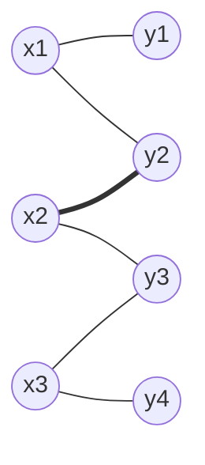

# Matchings Hall and Konig

Matchings formalize pairing without conflicts. A matching can assign students to projects, workers to jobs, tasks to machines, or vertices in one part of a bipartite graph to compatible vertices in the other part. The central obstruction is local competition: too many vertices may demand too few possible partners.

Hall's theorem gives an exact condition for perfect matching on one side of a bipartite graph. Konig's theorem then links matchings to vertex covers, showing that in bipartite graphs the largest set of disjoint edges has the same size as the smallest set of vertices touching all edges.

## Definitions

A **matching** in a graph is a set of pairwise nonadjacent edges: no two selected edges share a vertex. A vertex incident with a matching edge is **saturated**; otherwise it is **unsaturated**.

In a bipartite graph with parts $X$ and $Y$, a matching **saturates $X$** if every vertex of $X$ is matched. If $\vert X\vert =\vert Y\vert $ and both parts are saturated, the matching is **perfect**.

For $S\subseteq X$, the **neighborhood** $N(S)$ is the set of vertices in $Y$ adjacent to at least one vertex of $S$.

A **vertex cover** is a set of vertices meeting every edge. A **minimum vertex cover** has least possible size.

An **augmenting path** relative to a matching $M$ is a path whose edges alternate between not in $M$ and in $M$, starting and ending at unsaturated vertices. Flipping membership along such a path increases the matching size by $1$.

## Key results

**Hall's marriage theorem.** A bipartite graph with parts $X$ and $Y$ has a matching saturating $X$ if and only if

$$
|N(S)|\ge |S|
$$

for every subset $S\subseteq X$.

Necessity is immediate: the vertices in $S$ require distinct partners inside $N(S)$. Sufficiency is deeper and can be proved by induction or augmenting paths.

**Berge augmenting-path theorem.** A matching $M$ is maximum if and only if there is no augmenting path with respect to $M$.

**Konig's theorem.** In every bipartite graph,

$$
\text{maximum matching size}=\text{minimum vertex cover size}.
$$

This equality is special to bipartite graphs. In non-bipartite graphs, maximum matching and minimum vertex cover are related but not usually equal.

**Hall deficiency.** If Hall's condition fails, the amount of failure is measured by

$$
|S|-|N(S)|.
$$

A positive value means the vertices of $S$ are competing for too few partners. The largest such deficiency controls how far a bipartite graph is from saturating the left side. This is why Hall's theorem is more than a yes/no test: the offending subset identifies the bottleneck.

**From matching to vertex cover.** The standard constructive proof of Konig's theorem starts with a maximum matching. From unmatched vertices on the left, follow alternating paths that begin with nonmatching edges. Let $Z$ be the set of vertices reached. Then

$$
(X-Z)\cup(Y\cap Z)
$$

is a minimum vertex cover. This recipe is also how many matching algorithms certify optimality: they return both a matching and a cover of the same size.

**Perfect matchings and regular bipartite graphs.** Every $r$-regular bipartite graph with $r\ge 1$ has a perfect matching. Hall's condition proves this by counting edges from a subset $S\subseteq X$ to its neighborhood: there are $r\vert S\vert $ such incident edges, while at most $r\vert N(S)\vert $ can enter $N(S)$, so $\vert N(S)\vert \ge \vert S\vert $.

**Alternating trees.** Matching algorithms often grow an alternating tree from an unsaturated vertex. Edges not in the matching are used from left to right, and matched edges are used from right to left. If the search reaches an unsaturated vertex on the other side, the discovered path is augmenting. If it cannot, the reached and unreached vertices help form a vertex cover certificate.

**Why bipartiteness matters.** In general graphs, odd cycles create complications because alternating paths can interact with blossoms: odd cycles that hide possible augmentations. Bipartite graphs avoid blossoms, which is why Hall's theorem, Konig's theorem, and simpler augmenting-path algorithms have especially clean statements there.

**Matching size bounds.** A matching can never be larger than either part of a bipartite graph, and it can never be larger than a vertex cover. Konig's theorem says that in bipartite graphs the best possible upper bound from a vertex cover is always tight. This duality is the matching analogue of max-flow min-cut.

## Visual

The highlighted alternating route suggests an augmenting path from an unmatched left vertex to an unmatched right vertex.



| Concept | Object | Test or theorem |
|---|---|---|
| Matching | disjoint edges | no shared endpoints |
| Perfect matching in bipartite graph | saturates both parts | Hall condition on both sides when sizes match |
| Maximum matching | largest matching | no augmenting path |
| Vertex cover | vertices touching all edges | equals max matching size in bipartite graphs |

## Worked example 1: Check Hall's condition

**Problem.** Let $X=\{a,b,c\}$ and $Y=\{1,2,3\}$ with neighborhoods

$$
N(a)=\{1,2\},\quad N(b)=\{2\},\quad N(c)=\{2,3\}.
$$

Does there exist a matching saturating $X$?

**Method.**

We check Hall's condition for all subsets of $X$.

Singletons:

$$
|N(\{a\})|=2\ge 1,\quad |N(\{b\})|=1\ge 1,\quad |N(\{c\})|=2\ge 1.
$$

Pairs:

$$
N(\{a,b\})=\{1,2\},\quad |N(\{a,b\})|=2\ge 2.
$$

$$
N(\{a,c\})=\{1,2,3\},\quad |N(\{a,c\})|=3\ge 2.
$$

$$
N(\{b,c\})=\{2,3\},\quad |N(\{b,c\})|=2\ge 2.
$$

All three:

$$
N(\{a,b,c\})=\{1,2,3\},\quad |N(\{a,b,c\})|=3\ge 3.
$$

Hall's condition holds, so a matching saturating $X$ exists. One such matching is

$$
a1,\quad b2,\quad c3.
$$

**Checked answer.** Yes, the graph has a matching saturating $X$.

## Worked example 2: Use an augmenting path

**Problem.** In the bipartite graph with edges

$$
x_1y_1,\ x_1y_2,\ x_2y_2,\ x_2y_3,\ x_3y_3,\ x_3y_4,
$$

start with matching $M=\{x_2y_2,\ x_3y_3\}$. Find a larger matching.

**Method.**

1. The unmatched vertices on the left are $x_1$.
2. The unmatched vertices on the right are $y_1$ and $y_4$.
3. The edge $x_1y_1$ is not in $M$ and immediately connects two unmatched vertices.
4. Therefore $x_1-y_1$ is an augmenting path of length $1$.
5. Add this edge to the matching:

$$
M'=\{x_1y_1,\ x_2y_2,\ x_3y_3\}.
$$

This saturates all vertices in $\{x_1,x_2,x_3\}$.

**Alternative augmenting route.** If the starting matching had been $\{x_1y_2,x_2y_3\}$, then

$$
x_3-y_3-x_2-y_2-x_1-y_1
$$

would alternate unmatched, matched, unmatched, matched, unmatched. Flipping along it gives $\{x_3y_3,x_2y_2,x_1y_1\}$.

**Checked answer.** The larger matching has size $3$, which is maximum because it saturates the left part of size $3$.

The final sentence is an upper-bound certificate. No matching can contain more edges than there are vertices on the smaller side of the bipartition. Once a matching saturates all three left vertices, it has reached that bound.

## Code

This is a compact DFS-based bipartite matching implementation.

```python
def max_bipartite_matching(graph):
    match_y = {}

    def try_match(x, seen):
        for y in graph[x]:
            if y in seen:
                continue
            seen.add(y)
            if y not in match_y or try_match(match_y[y], seen):
                match_y[y] = x
                return True
        return False

    for x in graph:
        try_match(x, set())

    return {(x, y) for y, x in match_y.items()}

graph = {
    "a": {"1", "2"},
    "b": {"2"},
    "c": {"2", "3"},
}

print(max_bipartite_matching(graph))
```

The DFS routine is simple rather than asymptotically optimal. For large bipartite graphs, Hopcroft-Karp improves performance by finding many shortest augmenting paths in phases. The mathematical certificate remains the same: when no augmenting path exists, the current matching is maximum.

For small Hall checks, it is usually unnecessary to list all $2^{\vert X\vert }$ subsets if a pattern is visible. Start with the most constrained vertices, then examine unions of their neighborhoods. If a Hall violation exists, it often appears among vertices with few choices or strongly overlapping choices.

When a matching is proposed as maximum, look for a certificate. Either it saturates the smaller side, or it is paired with a vertex cover of the same size, or an augmenting-path search has failed. A large matching without one of these checks may still be improvable.

This certificate habit is the matching analogue of checking an answer with a cut in flow problems.

When a bipartite matching problem is small, draw the two parts in columns and keep matched edges visually distinct from unmatched edges. Alternating paths are much easier to see when matching edges have a different style. After augmenting, recount saturated vertices on both sides, because a successful flip changes several matched partners at once.

## Common pitfalls

- Checking Hall's condition only for single vertices. The obstruction often appears in larger subsets.
- Forgetting that a matching edge saturates two vertices but conflicts with every other edge incident to either endpoint.
- Assuming a maximal matching is maximum. A maximal matching cannot be enlarged by one disjoint edge, but it may still be smaller than a maximum matching.
- Using Konig's theorem in non-bipartite graphs.
- Confusing a vertex cover with an independent set. A vertex cover touches all edges; an independent set contains no internal edge.
- Flipping an alternating path that does not start and end at unsaturated vertices. Only augmenting paths increase matching size.

## Connections

- [Menger theorem and network flows](/math/graph-theory/menger-theorem-and-network-flows)
- [Edge colouring and chromatic polynomials](/math/graph-theory/edge-colouring-and-chromatic-polynomials)
- [Matroids and graph duality](/math/graph-theory/matroids-and-graph-duality)
- [Algorithms on weighted graphs](/math/graph-theory/algorithms-on-weighted-graphs)
